# Production RAG & Agentic AI — Study Notes (Krish Naik)

> **Source of Truth.** Do not remove content. All theory, code, examples, and version notes are intentional.
>
> Detailed notes on LangChain v1.1 updates: [langchain_updates.1.1.md](https://github.com/Shivanshvyas1729/Krish_naik_rag_notes/blob/main/langchain_updates.1.1.md)

---

## Pipeline Roadmap

How a production RAG & Agentic AI project flows end-to-end. Click any link to jump to that section.

| Phase | Name | What It Covers | Jump To |
| :---: | :--- | :--- | :--- |
| **1** | Modern Foundations & Agent Engine | `init_chat_model`, streaming, batching, tool binding (`model.bind_tools` vs `create_agent`), messages, structured output, middleware, LCEL | [Phase 1](#topic-1-langchain-v11) |
| **2** | RAG Fundamentals & Document Ingestion | Ingestion pipeline, 10 chunking strategies (Fixed, Sentence, Paragraph, Recursive, Structure, Sliding, Token, Agentic, Hybrid), business impact | [Phase 2](#topic-2-rag) |
| **3** | Semantic Chunking | Meaning-aware splitting via sentence embedding distance spikes and similarity threshold breakpoints | [Phase 3](#topic-5-semantic-chunking) |
| **4** | Vector Storage | Vector Stores vs Vector DBs, ChromaDB, FAISS, InMemory, Pinecone, AstraDB, Qdrant, distance metrics | [Phase 4](#topic-4-vector-db) |
| **5** | Pre-Retrieval Query Transformation | Query Expansion (LLM synonyms), Query Decomposition (multi-hop), HyDE (hypothetical doc embeddings) | [Query Expansion](#topic-9-query-expansion) · [Decomposition](#topic-10-query-decomposition) · [HyDE](#topic-11-hyde) |
| **6** | Advanced Retrieval & Ranking | Hybrid Search (Dense + BM25, RRF & RSF Fusion), Cross-Encoder Re-ranking, MMR | [Hybrid Search](#topic-6-hybrid-search) · [Re-ranking](#topic-7-reranking) · [MMR](#topic-8-mmr) |
| **7** | RAG Chain Construction & Memory | LCEL RAG chains, conversational memory with `create_history_aware_retriever`, pre-built chains | [Phase 7](#topic-7-rag-chains) |
| **7.1** | `format_docs` Decision Guide | When to use vs. when NOT to use `format_docs` (LCEL vs. pre-built helpers) | [format_docs Guide](#format-docs-deep-dive) |
| **8** | Fine-Tuning vs RAG | Decision matrix: knowledge freshness, hallucination reduction, cost | [Phase 8](#topic-3-finetuning-vs-rag) |
| **9** | Multimodal RAG | OCR vs. Visual-Native (ColPali), CLIP joint embedding, GPT-4o Vision | [Multimodal AI](#topic-12-multimodal-ai) · [Architecture](#topic-13-multimodal-rag-architecture) |
| **10** | Agentic AI Systems | AI Agents vs Agentic AI, human-in-the-loop, memory compression | [Phase 10](#topic-14-agentic-ai) |
| **11** | Agentic SDLC Case Study | Autonomous software development lifecycle, TDD, self-debugging, Git automation | [Phase 11](#topic-15-agentic-sdlc) |

---

## Topic Index

1. [Phase 1 — LangChain v1.1 & LangGraph Agent Architecture](#topic-1-langchain-v11)
2. [Phase 2 — RAG: Fundamentals & 10 Chunking Strategies](#topic-2-rag)
3. [Phase 3 — Semantic Chunking](#topic-5-semantic-chunking)
4. [Phase 4 — Vector Stores & Vector Databases](#topic-4-vector-db)
5. [Phase 5 — Pre-Retrieval Query Transformation](#topic-9-query-expansion)
   - [5.1 Query Expansion](#topic-9-query-expansion)
   - [5.2 Query Decomposition](#topic-10-query-decomposition)
   - [5.3 HyDE — Hypothetical Document Embeddings](#topic-11-hyde)
6. [Phase 6 — Advanced Retrieval & Precision Ranking](#topic-6-hybrid-search)
   - [6.1 Hybrid Search (Dense + Sparse Retrieval, BM25, RRF & RSF Fusion)](#topic-6-hybrid-search)
   - [6.2 Re-ranking (Cross-Encoder)](#topic-7-reranking)
   - [6.3 MMR — Maximal Marginal Relevance](#topic-8-mmr)
7. [Phase 7 — RAG Chains, Conversational Memory & format_docs Guide](#topic-7-rag-chains)
   - [7.1 LCEL Custom RAG Pipelines & Conversational Chains](#chroma-rag-chains)
   - [7.2 format_docs Deep-Dive: When to Use vs. When NOT to Use](#format-docs-deep-dive)
8. [Phase 8 — Fine-Tuning vs RAG — Strategic Decision Framework](#topic-3-finetuning-vs-rag)
9. [Phase 9 — Multimodal AI & Vision-Native RAG](#topic-12-multimodal-ai)
   - [9.1 Multimodal AI (Classic OCR vs. Visual-Native ColPali)](#topic-12-multimodal-ai)
   - [9.2 Multimodal RAG Architecture (CLIP Joint Embedding)](#topic-13-multimodal-rag-architecture)
10. [Phase 10 — AI Agents vs. Agentic AI](#topic-14-agentic-ai)
11. [Phase 11 — Agentic SDLC Case Study](#topic-15-agentic-sdlc)

---

<details><summary><a id="topic-1-langchain-v11" name="topic-1-langchain-v11"></a>Phase 1 — LangChain v1.1 & LangGraph Agent Architecture</summary>

# LangChain v1.1 & LangGraph Agent Architecture

This module covers the modern, production-grade LangChain v1.1/1.x API built on top of the LangGraph execution engine.

---

## Notebook Overview

| Notebook | Topic | Key APIs |
| :--- | :--- | :--- |
| `1-langchainintro.ipynb` | Agent Foundations & Graph Engine | `create_agent()`, `@tool`, `agent.invoke()` |
| `2-modelintegration.ipynb` | Universal Model Integration, Streaming & Batching | `init_chat_model()`, `ChatOpenAI()`, `ChatGroq()`, `ChatGoogleGenerativeAI()`, `model.stream()`, `model.batch()` |
| `3-tools.ipynb` | Tool Definition, Schemas & Execution Loops | `@tool`, `model.bind_tools()`, `ai_msg.tool_calls`, `ToolMessage` |
| `4-messages.ipynb` | Canonical Message Schema & Token Tracking | `SystemMessage`, `HumanMessage`, `AIMessage`, `ToolMessage`, `usage_metadata` |
| `5-structuredoutput.ipynb` | Enforced Schema Parsing & Validation | `with_structured_output()`, `response_format`, `Pydantic`, `TypedDict`, `@dataclass` |
| `6-middleware.ipynb` | Agent Middleware, Memory & Human-in-the-Loop | `SummarizationMiddleware`, `HumanInTheLoopMiddleware`, `InMemorySaver`, `Command` |
| LCEL Core | Declarative Composition & Runnable Protocol | `\|` (pipe), `Runnable`, `invoke()`, `ainvoke()`, `batch()`, `stream()` |

---

## 1. Agent Foundations (`1-langchainintro.ipynb`)

**Definition:** An AI Agent uses an LLM as a central reasoning engine to decide which tools to call, what arguments to extract, and how to sequence actions to satisfy a request.

<details>
<summary>Version Note — LangChain v0.3: AgentExecutor is deprecated</summary>
<ul>
<li><strong>Deprecated:</strong> <code>langchain.agents.AgentExecutor</code> — the old loop-based executor relying on manual Python state passing.</li>
<li><strong>Current standard:</strong> <code>create_agent</code> from <code>langchain.agents</code> — wraps LangGraph under the hood with stateful graph execution, native cycle handling, and automatic tool error recovery.</li>
<li>For custom multi-agent flows, use LangGraph directly: <code>langgraph.prebuilt.create_react_agent</code>.</li>
<li>Reference: <a href="https://python.langchain.com/docs/versions/v0_3/">LangChain v0.3 docs</a></li>
</ul>
</details>

**Legacy vs. Current Architecture:**

| | Legacy (`AgentExecutor`) | Current (`create_agent`) |
| :--- | :--- | :--- |
| Execution | Manual Python loops | LangGraph stateful graph engine |
| Memory state | Manual state passing | Automatic persistence via `InMemorySaver` |
| Error recovery | Manual try/except | Built-in tool execution error recovery |

```python
from langchain.agents import create_agent
from langchain_core.tools import tool

@tool
def get_weather(city: str) -> str:
    # Get the weather for a city
    return f"The weather in {city} is sunny."

agent = create_agent(
    model="gpt-4o-mini",
    tools=[get_weather],
    system_prompt="You are a helpful assistant."
)

# Accepts messages in OpenAI or LangChain format
response = agent.invoke({"messages": [{"role": "user", "content": "What is the weather in New York?"}]})
print(response["messages"])
```

---

## 2. Universal Model Integration (`2-modelintegration.ipynb`)

<details>
<summary>Version Note — LangChain v0.3: Direct provider imports are deprecated</summary>
<ul>
<li><strong>Deprecated:</strong> Importing <code>ChatOpenAI</code>, <code>ChatGroq</code>, etc. directly from <code>langchain.chat_models</code> as the primary initialization pattern.</li>
<li><strong>Current standard:</strong> Use <code>init_chat_model()</code> with a provider prefix string — makes provider switching seamless without changing application logic.</li>
<li>Old chains like <code>ConversationalRetrievalChain</code> are also deprecated — replaced by LCEL-based <code>create_stuff_documents_chain</code> + <code>create_retrieval_chain</code>.</li>
</ul>
</details>

**Core idea:** LangChain v1.1 decouples provider code from application logic using a universal model initializer and standardized execution modes.

### 1. Universal Model Initialization (`init_chat_model`)

Instead of importing provider classes directly, `init_chat_model()` instantiates any LLM via string identifiers. Provider migration becomes a one-line change.

```python
from langchain.chat_models import init_chat_model

model_openai = init_chat_model("gpt-4o-mini")
model_groq   = init_chat_model("groq:llama-3.3-70b-versatile")
model_gemini = init_chat_model("google_genai:gemini-1.5-flash")
```

### 2. Streaming Output (`model.stream()`)

LLMs generate text token by token. `model.stream()` uses HTTP chunked transfer to yield `AIMessageChunk` objects in real time, eliminating user wait time (reduces Time-To-First-Token).

```python
for chunk in model.stream("Explain quantum computing in 2 sentences"):
    print(chunk.content, end="", flush=True)
```

### 3. Batch Processing (`model.batch()`)

Dispatches multiple independent prompts in parallel using async thread pools. Drastically reduces total latency compared to sequential `for` loops (more requests processed in the same time).

```python
responses = model.batch(["What is 2+2?", "What is 10*5?", "What is 100/4?"])
```

---

## 3. Tool Anatomy, Schemas & Binding (`3-tools.ipynb`)

**A Tool is a pairing of:**
1. **JSON Schema** — function name, docstring description, and argument types.
2. **Execution Logic** — the underlying Python function or coroutine.

The `@tool` decorator auto-inspects Python type hints (`city: str`) and docstrings to generate the JSON schema expected by LLM tool-calling APIs.

### Both Methods to Bind Tools

| Feature | Method 1: `model.bind_tools()` | Method 2: `create_agent(tools=[...])` |
| :--- | :--- | :--- |
| **Execution Loop** | Manual — developer invokes tool function | Automatic — LangGraph engine handles the loop |
| **Message State** | Manual `ToolMessage` creation & append | Automatic `ToolMessage` state tracking |
| **Control Level** | Fine-grained (custom UI callbacks, single-step) | High-level (multi-step autonomous execution) |

**Method 1 — Direct Model Binding (`model.bind_tools()`)**

Use when you need full control over each step (e.g., custom logging, single-turn UIs).

```python
from langchain.chat_models import init_chat_model
from langchain_core.tools import tool

@tool
def get_weather(city: str) -> str:
    """Get the weather for a city."""
    return f"The weather in {city} is sunny."

model = init_chat_model("gpt-4o-mini")
model_with_tools = model.bind_tools([get_weather])

# Step 1: Model decides which tool to call
messages = [{"role": "user", "content": "What's the weather in Boston?"}]
ai_msg = model_with_tools.invoke(messages)
messages.append(ai_msg)

# Step 2: Execute tools manually and collect results
for tool_call in ai_msg.tool_calls:
    tool_result = get_weather.invoke(tool_call)
    messages.append(tool_result)

# Step 3: Pass tool results back for the final response
final_response = model_with_tools.invoke(messages)
print(final_response.content)
# "The weather in Boston is sunny."
```

**Method 2 — Automatic Agent Loop (`create_agent(tools=[...])`)**

Use when you want the agent to handle the full LLM → Tool Call → Execution → Final Answer loop automatically.

```python
from langchain.agents import create_agent
from langchain_core.tools import tool

@tool
def get_weather(city: str) -> str:
    # Get the weather for a city
    return f"The weather in {city} is sunny."

# Agent automatically runs: LLM -> Tool Call -> Function Exec -> ToolMessage -> Final Answer
agent = create_agent(
    model="gpt-4o-mini",
    tools=[get_weather],
    system_prompt="You are a helpful assistant."
)
result = agent.invoke({"messages": [{"role": "user", "content": "What's the weather in Boston?"}]})
```

---

## 4. Canonical Message State & Token Metadata (`4-messages.ipynb`)

**Canonical Message State** is a unified, standardized format ensuring all parts of the system communicate using the same structure. Benefits:
- Reduces complexity
- Looser coupling between components
- Easier maintenance and debugging

**Messages** are the fundamental unit of context. They carry content, roles, and provider metadata across multi-turn conversations and agent loops.

| | Text Prompts | Message Prompts |
| :--- | :--- | :--- |
| **Format** | Plain string | Structured list of `BaseMessage` objects |
| **Use case** | Simple single-turn tasks | Multi-turn chat, agent tool-calling loops |

### The 4 Canonical Message Types

| Class | Role | Purpose |
| :--- | :--- | :--- |
| `SystemMessage` | `system` | Sets persona, tone, rules, and guardrails |
| `HumanMessage` | `user` | User inputs — supports multimodal content (text, images, audio, files) |
| `AIMessage` | `assistant` | Model output — includes text, reasoning tokens, and `tool_calls` payload |
| `ToolMessage` | `tool` | Output from a tool execution, matched to the call via `tool_call_id` |

```python
from langchain_core.messages import SystemMessage, HumanMessage, AIMessage, ToolMessage

messages = [
    SystemMessage("You are a helpful financial assistant."),
    HumanMessage("What is the stock price of Apple?"),
    AIMessage(content="", tool_calls=[{"name": "get_stock_price", "args": {"ticker": "AAPL"}, "id": "call_999"}]),
    ToolMessage(content="$225.50", tool_call_id="call_999")
]

response = model.invoke(messages)
print(response.usage_metadata)  # Contains token usage details
```

---

## 5. Enforced Schema Parsing & Structured Output (`5-structuredoutput.ipynb`)

<details>
<summary>Version Note — LangChain v0.3: Pydantic v1 is no longer supported</summary>
<ul>
<li><strong>Deprecated:</strong> Pydantic v1 (<code>BaseModel</code> from pydantic &lt;2.0). LangChain v0.3 requires Pydantic v2.</li>
<li><strong>Current standard:</strong> <code>model.with_structured_output()</code> using Pydantic v2 <code>BaseModel</code> or <code>TypedDict</code>. This is now the definitive approach for reliable data extraction, replacing older brittle output parsers.</li>
</ul>
</details>

**Structured Output** guarantees the LLM responds with data that matches a strict schema (JSON/Pydantic), eliminating downstream parsing failures.

### Supported Schema Types

1. **Pydantic (`BaseModel`)** — Full runtime field validation, defaults, and rich `Field(description=...)` docs.
2. **TypedDict** — Lightweight, built-in Python typing using `Annotated[T, Field(description=...)]`.
3. **Dataclass (`@dataclass`)** — Standard Python data container.

```python
from pydantic import BaseModel, Field
from typing_extensions import TypedDict, Annotated

# Option A: Pydantic Schema (recommended — full validation)
class Movie(BaseModel):
    title: str = Field(description="Title of the movie")
    year: int = Field(description="Release year")

structured_model = model.with_structured_output(Movie)
movie_obj = structured_model.invoke("Provide details about Inception")
# Returns: Movie(title='Inception', year=2010)

# Option B: TypedDict Schema (lightweight)
class MovieDict(TypedDict):
    title: Annotated[str, Field(description="Title of the movie")]
    year: Annotated[int, Field(description="Release year")]

structured_dict_model = model.with_structured_output(MovieDict)
```

**`include_raw=True`** — Returns `{"raw": AIMessage, "parsed": SchemaObject, "parsing_error": None}` for debugging raw model tokens.

---

## 6. Stateful Middleware, Memory & Human-in-the-Loop (`6-middleware.ipynb`)

**Middleware** intercepts and modifies internal agent execution steps. Think of it as a security guard, accountant, and editor standing beside the agent — the agent does the thinking, but middleware intercepts everything before it happens.

**Three roles of middleware:**

**Role 1 — The Accountant (Logging & Cost Control)**
- Tracks what the agent did and how long it took.
- Counts tokens. If the agent spends too much or gets stuck in a loop, middleware cuts it off.

**Role 2 — The Filter (Guardrails & Security)**
- Hides private data: if the agent tries to send a phone number or credit card to the cloud, middleware replaces it with `[HIDDEN]` first.
- Blocks bad replies: if the agent says something unsafe or broken, middleware prevents it from reaching the user.

> **Guardrails** = safety boundaries that prevent AI systems from going into dangerous or unintended territory.

**Role 3 — The Assistant (Memory & Approvals)**
- Shrinks long chats: if a conversation gets too long, middleware summarizes old parts so the agent stays fast.
- Asks for permission: before the agent does something serious (send an email, charge money), middleware pauses and asks a human to Approve or Deny.

What middleware can do:
- Logging, analytics, and token cost control
- Guardrails, PII masking, and output safety filtering
- Automated memory compression and human approval checkpoints

### Middleware Type 1 — Summarization (`SummarizationMiddleware`)

**Problem:** Long multi-turn conversations exceed context window limits and waste tokens.

**Solution:** Automatically compresses older turns into a summary once a message count/token limit is hit, keeping the most recent messages intact.

```python
from langchain.agents import create_agent
from langchain.agents.middleware import SummarizationMiddleware
from langgraph.checkpoint.memory import InMemorySaver

agent = create_agent(
    model="gpt-4o-mini",
    checkpointer=InMemorySaver(),
    middleware=[
        SummarizationMiddleware(
            model="gpt-4o-mini",
            trigger=("messages", 10), # Summarize after 10 messages
            keep=("messages", 4)       # Keep latest 4 messages intact
        )
    ]
)
```

### Middleware Type 2 — Human-In-The-Loop (`HumanInTheLoopMiddleware`)

**Problem:** High-stakes tool executions (DB deletes, financial transactions, email sends) need human oversight before execution.

**Solution:** Pauses agent execution before specified tools run. State is persisted via `InMemorySaver` while waiting for a human approval/rejection/edit signal.

```python
from langchain.agents import create_agent
from langchain.agents.middleware import HumanInTheLoopMiddleware
from langgraph.checkpoint.memory import InMemorySaver

agent = create_agent(
    model="gpt-4o-mini",
    tools=[send_email_tool, read_email_tool],
    checkpointer=InMemorySaver(),
    middleware=[
        HumanInTheLoopMiddleware(
            interrupt_before=["send_email_tool"]  # Pause before sending email
        )
    ]
)
```

---

## 7. LangChain Expression Language (LCEL) & The Runnable Protocol

**LCEL** is a declarative way to compose AI building blocks — prompts, models, parsers — using the pipe operator (`|`). [[LangChain Blog](https://www.langchain.com/blog/langchain-expression-language)]

**Key concepts:**
- **Declarative Composition:** Define what to connect; data flows left to right automatically.
- **Runnable Protocol:** Every LCEL component implements a standard interface with `invoke()`, `ainvoke()`, `batch()`, `stream()`.
- **Basic syntax:** `chain = prompt | llm | output_parser`

**Key benefits:**
- **Multiple execution modes** out of the box — sync, async, batch, streaming — without changing code. [[k21academy](https://k21academy.com/ai-ml/langchain-expression-language/)]
- **Automatic parallelism** — steps that can run concurrently do so automatically.
- **Production ready** — built-in logging and tracing via LangSmith. [[artefact.com](https://www.artefact.com/blog/unleashing-the-power-of-langchain-expression-language-lcel-from-proof-of-concept-to-production/)]

> **LCEL vs. Pre-built Chains:** When building custom LCEL RAG pipelines (`retriever | format_docs | prompt`), converting `List[Document]` to a string via `format_docs` is **mandatory**. Pre-built helpers (`create_stuff_documents_chain`) handle document formatting internally. See the full [format_docs Decision Guide](#format-docs-deep-dive).

</details>

---

<details><summary><a id="topic-2-rag" name="topic-2-rag"></a>Phase 2 — RAG: Retrieval-Augmented Generation Fundamentals & 10 Chunking Strategies</summary>

# Retrieval-Augmented Generation (RAG)

## Core Concept

**RAG** enhances AI language models by combining text-generation with external knowledge retrieval.

**The Analogy:**
- **Traditional LLM (no RAG):** Closed-book exam — answers only from training memory. May hallucinate or say "I don't know."
- **RAG-enabled AI:** Open-book exam — looks up current, specialized information from a "library" (external databases) before answering.

---

## The 3 Core Components

1. **[R]etrieval** — Find relevant information. Search external sources (e.g., a Vector DB) using similarity search.
2. **[A]ugmentation** — Enhance the context. Combine retrieved data with metadata (e.g., *"Source: Tesla Annual Report 2023"*) and add to the original prompt.
3. **[G]eneration** — Produce the answer. The LLM reads the enriched context and generates a grounded, accurate response.

---

## RAG Workflow

### Phase 1: Document Ingestion

1. **Data Sources** — Raw data (PDFs, Web Pages, Databases) is collected.
2. **Processing** — A Document Splitter breaks data into chunks.
3. **Embedding** — An Embedding Model converts text into vectors (e.g., `[0.31, -0.22, 0.85...]`).
4. **Storage** — Vectors are stored in a Vector Database.

---

### 10 Core Chunking Strategies

> **Recommended starting points for RAG:** Recursive + overlap, Semantic, and Document-structure-based chunking.

| # | Strategy | Mechanism | Best For | Trade-offs |
| :--- | :--- | :--- | :--- | :--- |
| 1 | Fixed-size | Split every N characters/tokens | Quick baseline tests | Slices mid-word/sentence |
| 2 | Sentence-based | Split at punctuation (`.`, `!`, `?`) | Factoid Q&A, quote retrieval | Uneven lengths; loses paragraph context |
| 3 | Paragraph-based | Split at double newlines (`\n\n`) | Articles, blogs, narratives | Paragraphs vary wildly in length |
| 4 | Recursive | Hierarchical separators (`\n\n` → `\n` → `" "` → `""`) | General prose — **default choice** | Dense technical docs may still fragment |
| 5 | Semantic | Split on sentence embedding distance spikes | Dense/academic multi-topic text | High compute cost (N embedding calls) |
| 6 | Document-structure | Split on headers (`#`, `##`), HTML tags, tables | Markdown docs, API specs, code | Irregular sizes; needs structural markup |
| 7 | Sliding-window | Fixed window size + fixed stride overlap | Continuous streams, transcripts | Substantial data redundancy |
| 8 | Token-based | Split by tokenizer token count (tiktoken) | LLM context window budgeting | May split mid-word without recursive fallback |
| 9 | Agentic/LLM-based | Prompt LLM to extract cohesive sections | Unstructured messy data | High API cost and latency |
| 10 | Hybrid | Structure + Recursive/Semantic + Token limits | Enterprise production RAG | Multi-step pipeline complexity |

---

#### 1. Fixed-size Chunking

Splits every N characters (or words) with optional overlap, ignoring grammatical structure.

- **Best for:** Quick baseline tests or uniform flat data.
- **Risk:** Cuts words and sentences in half — causes context fragmentation and hallucinations.

<details>
<summary>Code & Example</summary>

```python
from langchain_text_splitters import CharacterTextSplitter

text = (
    "LangChain is an orchestration framework for LLMs. It connects models "
    "to external data sources and enables retrieval-augmented generation. "
    "Chroma and FAISS are common vector stores used for fast similarity search."
)

splitter = CharacterTextSplitter(
    separator="",          # Hard character split
    chunk_size=60,         # Exact character count
    chunk_overlap=10       # Fixed overlap
)

chunks = splitter.split_text(text)
for i, chunk in enumerate(chunks, 1):
    print(f"Chunk {i} [{len(chunk)} chars]: '{chunk}'")
```

**Output:**
```text
Chunk 1 [60 chars]: 'LangChain is an orchestration framework for LLMs. It connect'
Chunk 2 [60 chars]: 'connects models to external data sources and enables retriev'
Chunk 3 [60 chars]: 'retrieval-augmented generation. Chroma and FAISS are common '
Chunk 4 [48 chars]: 'common vector stores used for fast similarity search.'
```
</details>

---

#### 2. Sentence-based Chunking

Splits at sentence boundaries (punctuation `.`, `!`, `?` or NLP tokenizers from NLTK/spaCy).

- **Best for:** Precise fact-checking, statement verification, sentence-level quote retrieval.
- **Risk:** Individual sentences often lack context (pronouns like "it", "they" become unresolvable).

<details>
<summary>Code & Example</summary>

```python
import re

text = (
    "Retrieval-Augmented Generation enhances LLM capability! "
    "It fetches relevant knowledge from external vector databases. "
    "Does this prevent hallucinations? Yes, by grounding answers in retrieved source text."
)

# Sentence boundary regex or NLTK/spaCy sentence tokenizer
sentences = [s.strip() for s in re.split(r'(?<=[.!?])\s+', text) if s.strip()]

for i, sent in enumerate(sentences, 1):
    print(f"Chunk {i} (Sentence): {sent}")
```

**Output:**
```text
Chunk 1 (Sentence): Retrieval-Augmented Generation enhances LLM capability!
Chunk 2 (Sentence): It fetches relevant knowledge from external vector databases.
Chunk 3 (Sentence): Does this prevent hallucinations?
Chunk 4 (Sentence): Yes, by grounding answers in retrieved source text.
```
</details>

---

#### 3. Paragraph-based Chunking

Uses double newlines (`\n\n`) to segment text, preserving the author's original thought units.

- **Best for:** Well-formatted editorial content, blog posts, essays, reports.
- **Risk:** Paragraph lengths vary wildly — one may be 20 tokens, another 2,000+ (exceeds LLM context limits).

<details>
<summary>Code & Example</summary>

```python
from langchain_text_splitters import CharacterTextSplitter

text = """Artificial Intelligence has revolutionized natural language processing. Modern transformer architectures allow models to understand contextual relationships across vast amounts of text.

Retrieval-Augmented Generation (RAG) is a prominent architecture that combines information retrieval with text generation. By grounding responses in external knowledge, RAG dramatically reduces hallucinations.

Vector databases act as the memory layer in RAG systems, enabling sub-second semantic retrieval across millions of embeddings."""

splitter = CharacterTextSplitter(
    separator="\n\n",
    chunk_size=100,         # Minimum target before splitting
    chunk_overlap=0
)

chunks = splitter.split_text(text)
for i, chunk in enumerate(chunks, 1):
    print(f"--- Chunk {i} (Paragraph) ---\n{chunk}\n")
```

**Output:**
```text
--- Chunk 1 (Paragraph) ---
Artificial Intelligence has revolutionized natural language processing. Modern transformer architectures allow models to understand contextual relationships across vast amounts of text.

--- Chunk 2 (Paragraph) ---
Retrieval-Augmented Generation (RAG) is a prominent architecture that combines information retrieval with text generation. By grounding responses in external knowledge, RAG dramatically reduces hallucinations.

--- Chunk 3 (Paragraph) ---
Vector databases act as the memory layer in RAG systems, enabling sub-second semantic retrieval across millions of embeddings.
```
</details>

---

#### 4. Recursive Chunking

Tries a hierarchy of separators (`\n\n` → `\n` → `" "` → `""`), using finer separators only if a chunk still exceeds target size. Keeps paragraphs and sentences intact whenever possible.

- **Best for:** General prose, documentation, articles — the **recommended default** for RAG.
- **Risk:** Dense technical sections without standard paragraph breaks can still fragment.

<details>
<summary>Code & Example</summary>

```python
from langchain_text_splitters import RecursiveCharacterTextSplitter

text = """LangChain provides modular abstractions. It simplifies building LLM apps.

RAG combines retrieval with generation:
- Dense retrieval uses vector embeddings.
- Sparse retrieval uses keyword algorithms like BM25.
Combining both creates hybrid search."""

splitter = RecursiveCharacterTextSplitter(
    chunk_size=120,
    chunk_overlap=20,
    separators=["\n\n", "\n", " ", ""]
)

chunks = splitter.split_text(text)
for i, chunk in enumerate(chunks, 1):
    print(f"Chunk {i} ({len(chunk)} chars):\n\"{chunk}\"\n")
```

**Output:**
```text
Chunk 1 (74 chars):
"LangChain provides modular abstractions. It simplifies building LLM apps."

Chunk 2 (112 chars):
"RAG combines retrieval with generation:
- Dense retrieval uses vector embeddings.
- Sparse retrieval uses keyword"

Chunk 3 (85 chars):
"- Sparse retrieval uses keyword algorithms like BM25.
Combining both creates hybrid search."
```
</details>

---

#### 5. Semantic Chunking

Computes embeddings for consecutive sentences and measures cosine distance. Places a chunk boundary when the semantic distance between adjacent sentences spikes past a statistical threshold (percentile or standard deviation).

- **Best for:** Dense multi-topic documents, research papers, technical transcripts where topics shift unpredictably.
- **Risk:** Computationally expensive at ingestion time (N embedding inference calls).

<details>
<summary>Code & Example</summary>

```python
from langchain_experimental.text_splitter import SemanticChunker
from langchain_openai import OpenAIEmbeddings

text = """LangChain is a framework for building applications with LLMs.
It provides modular abstractions to combine LLMs with vector databases like Chroma and Pinecone.
You can create chains, agents, memory, and retrievers.
The Eiffel Tower is located on the Champ de Mars in Paris, France.
France is one of the most visited tourist destinations in the world."""

# Splits when cosine distance between consecutive sentences exceeds 95th percentile
chunker = SemanticChunker(
    embeddings=OpenAIEmbeddings(),
    breakpoint_threshold_type="percentile",
    breakpoint_threshold_amount=95.0
)

docs = chunker.create_documents([text])
for i, doc in enumerate(docs, 1):
    print(f"=== Semantic Chunk {i} ===\n{doc.page_content}\n")
```

**Output:**
```text
=== Semantic Chunk 1 ===
LangChain is a framework for building applications with LLMs. It provides modular abstractions to combine LLMs with vector databases like Chroma and Pinecone. You can create chains, agents, memory, and retrievers.

=== Semantic Chunk 2 ===
The Eiffel Tower is located on the Champ de Mars in Paris, France. France is one of the most visited tourist destinations in the world.
```
</details>

---

#### 6. Document-structure Chunking

Uses document layout — Markdown headers (`#`, `##`, `###`), HTML tags (`<section>`, `<table>`), code ASTs, or JSON keys. Attaches structural breadcrumbs into chunk metadata.

- **Best for:** Technical documentation, API specs, developer docs, GitHub repos, structured reports.
- **Risk:** Chunk size is determined by author formatting — long sections without subheaders still need secondary splitting.

<details>
<summary>Code & Example</summary>

```python
from langchain_text_splitters import MarkdownHeaderTextSplitter

markdown_text = """# Machine Learning
Machine learning algorithms build mathematical models based on sample training data.

## Supervised Learning
Supervised algorithms require input data paired with corresponding ground-truth labels.

### Classification
Predicts discrete category labels like spam detection.

## Unsupervised Learning
Discovers inherent groupings or patterns in unlabeled data."""

headers_to_split_on = [
    ("#", "Header 1"),
    ("##", "Header 2"),
    ("###", "Header 3"),
]

markdown_splitter = MarkdownHeaderTextSplitter(
    headers_to_split_on=headers_to_split_on,
    strip_headers=False
)

splits = markdown_splitter.split_text(markdown_text)
for i, doc in enumerate(splits, 1):
    print(f"Chunk {i} | Metadata: {doc.metadata}")
    print(f"Content:\n{doc.page_content}\n")
```

**Output:**
```text
Chunk 1 | Metadata: {'Header 1': 'Machine Learning'}
Content:
# Machine Learning
Machine learning algorithms build mathematical models based on sample training data.

Chunk 2 | Metadata: {'Header 1': 'Machine Learning', 'Header 2': 'Supervised Learning'}
Content:
## Supervised Learning
Supervised algorithms require input data paired with corresponding ground-truth labels.

Chunk 3 | Metadata: {'Header 1': 'Machine Learning', 'Header 2': 'Supervised Learning', 'Header 3': 'Classification'}
Content:
### Classification
Predicts discrete category labels like spam detection.

Chunk 4 | Metadata: {'Header 1': 'Machine Learning', 'Header 2': 'Unsupervised Learning'}
Content:
## Unsupervised Learning
Discovers inherent groupings or patterns in unlabeled data.
```
</details>

---

#### 7. Sliding-window Chunking

Slides a fixed-size window forward by a smaller step (stride). A window of size W with stride S produces an overlap of W-S tokens across consecutive chunks — no boundary transitions are lost.

- **Best for:** Continuous text streams, conversation transcripts, medical records, legal contracts.
- **Risk:** High storage and vector compute overhead due to repeated text.

<details>
<summary>Code & Example</summary>

```python
def sliding_window_chunking(text: str, window_size: int = 50, stride: int = 30):
    words = text.split()
    chunks = []
    for i in range(0, len(words), stride):
        chunk_words = words[i : i + window_size]
        if chunk_words:
            chunks.append(" ".join(chunk_words))
        if i + window_size >= len(words):
            break
    return chunks

sample = (
    "Alpha Beta Gamma Delta Epsilon Zeta Eta Theta Iota Kappa Lambda Mu "
    "Nu Xi Omicron Pi Rho Sigma Tau Upsilon Phi Chi Psi Omega"
)

chunks = sliding_window_chunking(sample, window_size=10, stride=6)  # 4 words overlap
for i, chunk in enumerate(chunks, 1):
    print(f"Window {i}: {chunk}")
```

**Output:**
```text
Window 1: Alpha Beta Gamma Delta Epsilon Zeta Eta Theta Iota Kappa
Window 2: Eta Theta Iota Kappa Lambda Mu Nu Xi Omicron Pi
Window 3: Nu Xi Omicron Pi Rho Sigma Tau Upsilon Phi Chi
Window 4: Tau Upsilon Phi Chi Psi Omega
```
</details>

---

#### 8. Token-based Chunking

Splits by token counts using the target LLM's exact BPE tokenizer (e.g., `tiktoken` for OpenAI `cl100k_base` / `o200k_base`).

- **Best for:** Strict LLM context window budgeting, preventing API token limit errors, accurate cost tracking.
- **Risk:** May split mid-word or mid-sentence without recursive fallback.

<details>
<summary>Code & Example</summary>

```python
from langchain_text_splitters import TokenTextSplitter

text = (
    "TokenTextSplitter splits documents strictly based on the token count "
    "generated by BPE tokenizers like tiktoken. This is essential when building "
    "RAG prompts with fixed LLM context window constraints."
)

token_splitter = TokenTextSplitter(
    chunk_size=15,      # Split every 15 tokens
    chunk_overlap=3,    # 3 tokens overlap
    encoding_name="cl100k_base"
)

chunks = token_splitter.split_text(text)
for i, chunk in enumerate(chunks, 1):
    print(f"Token Chunk {i}:\n'{chunk}'\n")
```

**Output:**
```text
Token Chunk 1:
'TokenTextSplitter splits documents strictly based on the token count'

Token Chunk 2:
' the token count generated by BPE tokenizers like tiktoken. This'

Token Chunk 3:
' tiktoken. This is essential when building RAG prompts with fixed'

Token Chunk 4:
' prompts with fixed LLM context window constraints.'
```
</details>

---

#### 9. Agentic / LLM-based Chunking

Uses an LLM as an intelligent chunking agent. The model reads the document, reasons about semantic boundaries, and outputs clean self-contained sections with context, summaries, or titles.

- **Best for:** Complex, messy, highly technical documents where rule-based splitters fail (mixed tables, contracts, research summaries).
- **Risk:** Substantial inference cost and high processing latency per document.

<details>
<summary>Code & Example</summary>

```python
from langchain_core.prompts import PromptTemplate
from langchain_core.output_parsers import JsonOutputParser
from pydantic import BaseModel, Field
from typing import List

class ChunkOutput(BaseModel):
    chunk_title: str = Field(description="Descriptive title for this chunk")
    chunk_content: str = Field(description="Self-contained chunk text with context preserved")

class DocumentChunks(BaseModel):
    chunks: List[ChunkOutput]

parser = JsonOutputParser(pydantic_object=DocumentChunks)

prompt = PromptTemplate(
    template="""You are an expert document chunking agent. Analyze the text below and partition it into 
self-contained, coherent semantic chunks. Resolve any ambiguous pronouns so each chunk is fully standalone.

Formatting instructions: {format_instructions}

Document Text:
{text}
""",
    input_variables=["text"],
    partial_variables={"format_instructions": parser.get_format_instructions()},
)

# Example output schema returned by LLM:
mock_response = {
    "chunks": [
        {
            "chunk_title": "Quantum Computing Fundamentals",
            "chunk_content": "Quantum computers utilize qubits capable of superposition and entanglement, solving certain mathematical problems exponentially faster than classical computers."
        },
        {
            "chunk_title": "Cryogenic Hardware Requirements",
            "chunk_content": "Superconducting quantum processors require dilution refrigerators operating at near absolute zero temperatures (15 millikelvin) to prevent thermal decoherence."
        }
    ]
}
print(mock_response)
```

**Output:**
```json
{
  "chunks": [
    {
      "chunk_title": "Quantum Computing Fundamentals",
      "chunk_content": "Quantum computers utilize qubits capable of superposition and entanglement, solving certain mathematical problems exponentially faster than classical computers."
    },
    {
      "chunk_title": "Cryogenic Hardware Requirements",
      "chunk_content": "Superconducting quantum processors require dilution refrigerators operating at near absolute zero temperatures (15 millikelvin) to prevent thermal decoherence."
    }
  ]
}
```
</details>

---

#### 10. Hybrid Chunking

Combines multiple strategies sequentially in a multi-stage ingestion pipeline:

1. **Stage 1 (Structure):** Split by headers using `MarkdownHeaderTextSplitter`.
2. **Stage 2 (Recursive / Token):** Sub-split oversized sections using `RecursiveCharacterTextSplitter` or `TokenTextSplitter` with ~15% overlap.
3. **Stage 3 (Metadata Propagation):** Preserve parent structural headers in child chunks for filtered vector search.

- **Best for:** Enterprise production RAG requiring both structural awareness and strict token limits.
- **Risk:** Slightly more complex ingestion pipeline logic.

<details>
<summary>Code & Example</summary>

```python
from langchain_text_splitters import MarkdownHeaderTextSplitter, RecursiveCharacterTextSplitter

raw_document = """# System Architecture Guide

## Ingestion Engine
The ingestion engine extracts raw data from S3 buckets and databases. It handles decompression, OCR for PDFs, and character encoding sanitization. Once cleaned, text streams are prepared for downstream vectorization.

## Retrieval Engine
The retrieval engine combines dense vector search with BM25 keyword matching. It utilizes a reciprocal rank fusion algorithm to merge candidate sets before cross-encoder re-ranking.
"""

# Step 1: Structural Split by Headers
header_splitter = MarkdownHeaderTextSplitter(
    headers_to_split_on=[("#", "Section"), ("##", "SubSection")],
    strip_headers=False
)
structural_chunks = header_splitter.split_text(raw_document)

# Step 2: Recursive Sub-splitting for token safety
text_splitter = RecursiveCharacterTextSplitter(
    chunk_size=120,
    chunk_overlap=20
)
hybrid_chunks = text_splitter.split_documents(structural_chunks)

for i, doc in enumerate(hybrid_chunks, 1):
    print(f"Hybrid Chunk {i} | Metadata: {doc.metadata}")
    print(f"Content: {doc.page_content}\n")
```

**Output:**
```text
Hybrid Chunk 1 | Metadata: {'Section': 'System Architecture Guide', 'SubSection': 'Ingestion Engine'}
Content: ## Ingestion Engine
The ingestion engine extracts raw data from S3 buckets and databases.

Hybrid Chunk 2 | Metadata: {'Section': 'System Architecture Guide', 'SubSection': 'Ingestion Engine'}
Content: It handles decompression, OCR for PDFs, and character encoding sanitization. Once cleaned, text streams are prepared

Hybrid Chunk 3 | Metadata: {'Section': 'System Architecture Guide', 'SubSection': 'Retrieval Engine'}
Content: ## Retrieval Engine
The retrieval engine combines dense vector search with BM25 keyword matching.

Hybrid Chunk 4 | Metadata: {'Section': 'System Architecture Guide', 'SubSection': 'Retrieval Engine'}
Content: It utilizes a reciprocal rank fusion algorithm to merge candidate sets before cross-encoder re-ranking.
```
</details>

---

### Phase 2: Query Processing

1. User submits a query (e.g., *"What is RAG?"*).
2. Query is converted into an embedding.
3. The system performs **Similarity Search** in the Vector DB to find the most relevant document chunks.

### Phase 3: Generation

1. Relevant chunks are formatted as **Augmented Context**.
2. Context is fed into a Large Language Model (GPT-4, Claude, Llama, etc.).
3. The LLM synthesizes the information and outputs the **Generated Response**.

---

## Traditional LLM vs. RAG — Comparison

| Feature | Traditional LLM (No RAG) | AI Assistant (With RAG) |
| :--- | :--- | :--- |
| **Data Source** | Training data only | LLM + Vector Database |
| **Response Type** | Generic, unhelpful, or outdated | Specific, actionable, and current |
| **Example Output** | *"Generally, most companies offer 30-day returns..."* | *"According to our current policy (v3.2), Black Friday purchases have a 60-day window..."* |

---

## Real-World Benefits & Business Impact

- **Cost Savings** — Reduces constant model retraining. *(Example: JPMorgan saved $150M annually by using RAG instead of monthly fine-tuning.)*
- **Accuracy** — Grounds AI in actual facts, reducing hallucinations. *(Example: Microsoft reported 94% hallucination reduction in Copilot.)*
- **Real-Time Updates** — Can ingest live data instantly. *(Example: Bloomberg updates its financial AI hourly — impossible with traditional LLMs.)*
- **Compliance & Sourcing** — AI can provide citations. *(Example: Healthcare companies ensure AI responses always cite approved medical sources.)*

[1-2RAG (1).pdf](https://github.com/user-attachments/files/29892069/1-2RAG.1.pdf)

</details>

---

<details><summary><a id="topic-5-semantic-chunking" name="topic-5-semantic-chunking"></a>Phase 3 — Semantic Chunking: Meaning-Based Document Splitting</summary>

*Semantic Chunking is a text-splitting technique that divides content based on meaning instead of fixed size or paragraphs.*

## Overview

**Semantic Chunking** splits a document into meaningful units (chunks) based on **semantic similarity** rather than fixed criteria like token count or line numbers.

In RAG systems, the pipeline improvement chain is:

$$\text{Better chunks} \rightarrow \text{Better retrieval} \rightarrow \text{Better grounding} \rightarrow \text{Better answers}$$

Chunks from this method are designed to be **self-contained, contextually rich, and logically separated**.

---

## How It Works (Step-by-Step)

1. **Document Segmentation** — Split the document into smaller units (sentences or paragraphs).
2. **Sentence Embedding** — Convert each unit into a vector using an embedding model.
3. **Semantic Similarity Check** — Calculate cosine similarity between adjacent sentence embeddings vs. a defined threshold (e.g., 0.80).
4. **Sentence Merging** — Merge adjacent sentences into a chunk if their similarity meets or exceeds the threshold.
5. **Output Chunks** — Grouped chunks contain semantically related sentences; distinct sentences are separated.

---

## Example

**Input text:**
1. *"LangChain is a framework for building LLM-powered apps."*
2. *"It integrates with tools like OpenAI and Pinecone."*
3. *"The Eiffel Tower is located in Paris."*
4. *"France is a popular tourist destination."*

**Output chunks:**
- **Chunk 1:** Sentences 1 + 2 — merged because both discuss LangChain/LLMs.
- **Chunk 2:** Sentence 3 — standalone (different topic: landmarks).
- **Chunk 3:** Sentence 4 — standalone (different topic: tourism).

[33-Semantic+Chunking.pdf](https://github.com/user-attachments/files/29892074/33-Semantic%2BChunking.pdf)

*Additional notes on text representation techniques: [Text Representation tech. Repo](https://github.com/Shivanshvyas1729/pydantic_notes/blob/main/nlp/Text%20Representation%20tech.md).*
---

### Implementation: Semantic Chunking

#### Method A: Production LangChain Semantic Chunker (Experimental)
Splits documents dynamically based on sentence embedding distance thresholds.

```python
from langchain_experimental.text_splitter import SemanticChunker
from langchain_huggingface import HuggingFaceEmbeddings

# 1. Initialize embedding model
embeddings = HuggingFaceEmbeddings(model_name="all-MiniLM-L6-v2")

# 2. Configure SemanticChunker with percentile breakpoint threshold
# Splits when sentence distance exceeds the 95th percentile of all distance differences
semantic_chunker = SemanticChunker(
    embeddings=embeddings,
    breakpoint_threshold_type="percentile",  # Options: 'percentile', 'standard_deviation', 'interquartile', 'gradient'
    breakpoint_threshold_amount=95
)

# 3. Sample document text with distinct topic transition
sample_text = """
LangChain is a framework for developing applications powered by language models.
It provides modular abstractions for chains, agents, memory, and vector retrieval.
Developers use LangChain to build robust LLM orchestration workflows.

The Eiffel Tower is a wrought-iron lattice tower on the Champ de Mars in Paris, France.
It was constructed from 1887 to 1889 as the centerpiece of the 1889 World's Fair.
Paris attracts millions of global tourists every year for historical landmarks.
"""

# 4. Split text into semantic chunks
chunks = semantic_chunker.split_text(sample_text)

for idx, chunk in enumerate(chunks, 1):
    print(f"--- Semantic Chunk {idx} ({len(chunk)} chars) ---")
    print(chunk.strip())
```

#### Method B: First-Principles Implementation with Cosine Distance
Demonstrates the exact distance threshold calculation under the hood using SentenceTransformers and cosine distance.

```python
import numpy as np
from sentence_transformers import SentenceTransformer
from sklearn.metrics.pairwise import cosine_similarity

# 1. Load sentence embedding model
model = SentenceTransformer("all-MiniLM-L6-v2")

# 2. Split document into individual sentences
sentences = [
    "LangChain is a framework for developing applications powered by language models.",
    "It provides modular abstractions for chains, agents, memory, and vector retrieval.",
    "Developers use LangChain to build robust LLM orchestration workflows.",
    "The Eiffel Tower is a wrought-iron lattice tower on the Champ de Mars in Paris, France.",
    "It was constructed from 1887 to 1889 as the centerpiece of the 1889 World's Fair.",
    "Paris attracts millions of global tourists every year for historical landmarks."
]

# 3. Compute dense vector embeddings for each sentence
embeddings = model.encode(sentences)

# 4. Compute cosine distances between consecutive sentences
distances = []
for i in range(len(embeddings) - 1):
    sim = cosine_similarity([embeddings[i]], [embeddings[i + 1]])[0][0]
    dist = 1.0 - sim  # Cosine distance
    distances.append(dist)

# 5. Determine breakpoint threshold (e.g., 90th percentile or mean + 1.2 std)
threshold = np.percentile(distances, 80)

# 6. Group sentences into coherent chunks
chunks = []
current_chunk = [sentences[0]]

for i, dist in enumerate(distances):
    if dist > threshold:
        # Distance spike detected: start new semantic chunk
        chunks.append(" ".join(current_chunk))
        current_chunk = [sentences[i + 1]]
    else:
        current_chunk.append(sentences[i + 1])

if current_chunk:
    chunks.append(" ".join(current_chunk))

for idx, chunk in enumerate(chunks, 1):
    print(f"Chunk {idx}: {chunk}")
```

#### Key Parameters & Concepts
- `breakpoint_threshold_type`: Strategy used to calculate where semantic splits occur:
  - `percentile` (Default): Splits when distance between sentence vectors exceeds a set percentile (e.g. 95th).
  - `standard_deviation`: Splits when distance exceeds `mean + (X * std_dev)`.
  - `interquartile`: Uses IQR (Interquartile Range) to identify statistical distance outliers.
  - `gradient`: Evaluates gradient changes in embedding distance trajectory.
- **Why it matters**: Unlike fixed character splitters that can cut sentences in half, semantic chunking preserves complete contextual ideas inside each chunk.

#### Expected Output
```text
--- Semantic Chunk 1 (210 chars) ---
LangChain is a framework for developing applications powered by language models. It provides modular abstractions for chains, agents, memory, and vector retrieval. Developers use LangChain to build robust LLM orchestration workflows.
--- Semantic Chunk 2 (218 chars) ---
The Eiffel Tower is a wrought-iron lattice tower on the Champ de Mars in Paris, France. It was constructed from 1887 to 1889 as the centerpiece of the 1889 World's Fair. Paris attracts millions of global tourists every year for historical landmarks.
```

</details>

---

<details><summary><a id="topic-4-vector-db" name="topic-4-vector-db"></a>Phase 4 — Vector Stores vs. Vector Databases</summary>

# Vector Stores vs. Vector Databases

## The Golden Rule

**Start with a Vector Store** for prototyping. **Graduate to a Vector Database** when you need production-scale features, reliability, and advanced querying.

---

## 1. Vector Stores

A lightweight library focused on storing and searching vectors efficiently.

**Key characteristics:**
- Core function: Simple similarity search (K nearest neighbors)
- Architecture: In-memory or local file (single-machine)
- Scale: Handles smaller datasets (< 1 million vectors)
- Speed: Extremely fast (microseconds)
- Setup & Cost: Quick setup (minutes), typically local, usually free

**When to use:**
- Proof of concept (POC)
- Less than 1 million vectors
- Need absolute fastest search speed
- Limited budget or full control
- Embedded applications

**Popular examples:** FAISS, Annoy, ChromaDB, ScaNN, NMSLIB

---

## 2. Vector Databases

A full-featured database system for managing and querying vector data at scale.

**Key characteristics:**
- Core function: Advanced search (filters, metadata queries) + full CRUD
- Architecture: Distributed system with replication, sharding, high availability
- Scale: Built for massive datasets (billions+ of vectors)
- Speed: Slightly slower due to overhead (milliseconds)
- Setup & Cost: Longer setup (hours/days), cloud-deployed, paid ($$$)

**When to use:**
- Production and enterprise applications
- Scaling beyond millions of vectors
- High availability and reliability requirements
- Advanced metadata filtering alongside vector search
- Multiple users/tenants
- Managed infrastructure

**Popular examples:** Pinecone, Weaviate, Qdrant, Milvus, Vespa, DataStax (AstraDB)

---

## Quick Reference Comparison

| Feature | Vector Store | Vector Database |
| :--- | :--- | :--- |
| **Scale** | ~1 Million vectors | Billions+ vectors |
| **Setup Time** | Minutes | Hours/Days |
| **Query Speed** | Microseconds | Milliseconds |
| **Features** | Basic search | Full CRUD & metadata filtering |
| **Deployment** | Local | Cloud / Distributed |
| **Cost** | Free | Paid ($$$) |

[23-+Vector+store+vs+Vector+Databases.pdf](https://github.com/user-attachments/files/29892056/23-%2BVector%2Bstore%2Bvs%2BVector%2BDatabases.pdf)

---

## Hands-On Code Implementations

<details>
<summary>Version Note — LangChain v0.3: Use partner packages, not langchain_community</summary>
<ul>
<li><strong>Current standard:</strong> Use dedicated partner packages — <code>langchain_chroma</code>, <code>langchain_pinecone</code>, <code>langchain_qdrant</code> — instead of the monolithic <code>langchain_community.vectorstores</code> imports where possible. Partner packages are actively maintained and receive updates independently.</li>
</ul>
</details>

---

### 1. ChromaDB (`8.1-chromadb.ipynb`)

<details>
<summary>Code & Implementation: ChromaDB (Create, Query, Add Data, Retriever & RAG Chains)</summary>

Chroma is an open-source, AI-native embedding database for developer productivity and local-first prototyping.

**Installation:**
```bash
pip install -qU langchain-chroma langchain-openai langchain-community chromadb
```

**Step 1 — Document Ingestion, Chunking & Embeddings:**
```python
import os
from dotenv import load_dotenv
from langchain_core.documents import Document
from langchain_text_splitters import RecursiveCharacterTextSplitter
from langchain_openai import OpenAIEmbeddings
from langchain_chroma import Chroma

load_dotenv()
os.environ["OPENAI_API_KEY"] = os.getenv("OPENAI_API_KEY")

# 1. Sample Documents
sample_docs = [
    Document(
        page_content="Machine learning is a subset of AI that focuses on learning from data without explicit programming.",
        metadata={"topic": "ML", "source": "ai_primer.txt", "doc_id": 1}
    ),
    Document(
        page_content="Deep learning uses multi-layer neural networks to learn representations from complex unstructured data like images and audio.",
        metadata={"topic": "DL", "source": "ai_primer.txt", "doc_id": 2}
    ),
    Document(
        page_content="Natural Language Processing (NLP) enables machines to read, understand, and derive meaning from human languages.",
        metadata={"topic": "NLP", "source": "ai_primer.txt", "doc_id": 3}
    )
]

# 2. Text Splitting
text_splitter = RecursiveCharacterTextSplitter(chunk_size=150, chunk_overlap=20)
chunks = text_splitter.split_documents(sample_docs)

# 3. Embedding Model
embeddings = OpenAIEmbeddings(model="text-embedding-3-small")
```

**Step 2 — Create & Persist Chroma Vector Store (`ingest.py`):**
```python
# Create persistent vector store on disk
persist_directory = "./chroma_db"

vectorstore = Chroma.from_documents(
    documents=chunks,
    embedding=embeddings,
    persist_directory=persist_directory,
    collection_name="rag_knowledge_base"
)

print(f"Total vectors stored in Chroma: {vectorstore._collection.count()}")
```

**Step 2.1 — Reload Persisted Chroma Store (`app.py` / Zero Re-Embedding):**

To load an already-created Chroma store in a different script, API server, or module without re-ingesting:
```python
from langchain_chroma import Chroma
from langchain_openai import OpenAIEmbeddings

embeddings = OpenAIEmbeddings(model="text-embedding-3-small")

# Connect directly to the existing on-disk collection (No from_documents needed!)
loaded_vectorstore = Chroma(
    persist_directory="./chroma_db",
    embedding_function=embeddings,
    collection_name="rag_knowledge_base"
)

print(f"Loaded existing Chroma store with {loaded_vectorstore._collection.count()} vectors.")
```

**Step 3 — Direct Similarity Search & Scores:**
```python
query = "What is deep learning and neural networks?"

# Standard Similarity Search (returns top-k documents)
results = vectorstore.similarity_search(query, k=2)
for i, doc in enumerate(results):
    print(f"\n--- Result {i+1} ---")
    print(f"Content: {doc.page_content}")
    print(f"Metadata: {doc.metadata}")

# Similarity Search with Distance Scores (Lower score = closer distance for L2/Cosine)
results_with_scores = vectorstore.similarity_search_with_score(query, k=2)
for doc, score in results_with_scores:
    print(f"Score (Distance): {score:.4f} | Content: {doc.page_content[:60]}...")
```

**Step 4 — Adding More Data to Existing Chroma Store:**
```python
new_doc = Document(
    page_content="Reinforcement Learning (RL) trains agents through reward and penalty feedback to maximize cumulative reward.",
    metadata={"topic": "RL", "source": "rl_notes.txt", "doc_id": 4}
)
new_chunks = text_splitter.split_documents([new_doc])

# Add documents dynamically
vectorstore.add_documents(new_chunks)

# Or add raw texts directly with metadata
vectorstore.add_texts(
    texts=["Supervised learning trains models on labeled input-output pairs."],
    metadatas=[{"topic": "ML", "source": "ml_basics.txt", "doc_id": 5}]
)

print(f"Total vectors after addition: {vectorstore._collection.count()}")
```

**Step 5 — Metadata Filtering:**
```python
filtered_results = vectorstore.similarity_search(
    query="Explain learning methods",
    k=3,
    filter={"topic": "ML"}
)
for doc in filtered_results:
    print(f"[{doc.metadata['topic']}] {doc.page_content}")
```

**Step 6 — Convert to Retriever:**
```python
retriever = vectorstore.as_retriever(
    search_type="similarity", # or "mmr", "similarity_score_threshold"
    search_kwargs={"k": 3}
)
```

> **Production RAG Chains & Conversational Memory:** For complete implementations of Custom LCEL RAG Chains, Multi-Turn Conversational RAG with Chat History (`create_history_aware_retriever`), and the `format_docs` Decision Framework, see [Phase 7: RAG Chain Construction](#topic-7-rag-chains).

</details>

---

### 2. FAISS — Facebook AI Similarity Search (`8.2-faiss.ipynb`)

<details>
<summary>Code & Implementation: FAISS (Create, Cosine Comparison, Save/Load, Add Data, Retriever & Chains)</summary>

FAISS is a high-performance C++ library with Python wrappers by Meta for dense vector similarity search with GPU/CPU optimization and low memory overhead.

**Installation:**
```bash
pip install -qU faiss-cpu langchain-community langchain-openai numpy
```

**Step 1 — Initialize FAISS Vector Store & Embeddings:**
```python
import os
import numpy as np
from dotenv import load_dotenv
from langchain_core.documents import Document
from langchain_text_splitters import RecursiveCharacterTextSplitter
from langchain_openai import OpenAIEmbeddings
from langchain_community.vectorstores import FAISS

load_dotenv()
embeddings = OpenAIEmbeddings(model="text-embedding-3-small")

sample_documents = [
    Document(
        page_content="Artificial Intelligence is a broad field focusing on creating smart machines capable of performing human tasks.",
        metadata={"topic": "AI", "source": "tech_overview.txt", "doc_id": 1}
    ),
    Document(
        page_content="Machine Learning enables computers to learn and improve automatically from experience without being explicitly programmed.",
        metadata={"topic": "ML", "source": "tech_overview.txt", "doc_id": 2}
    ),
    Document(
        page_content="Deep Learning utilizes deep artificial neural networks inspired by the human brain for predictive modeling.",
        metadata={"topic": "DL", "source": "tech_overview.txt", "doc_id": 3}
    )
]

text_splitter = RecursiveCharacterTextSplitter(chunk_size=120, chunk_overlap=20)
chunks = text_splitter.split_documents(sample_documents)

# Create FAISS vector store
vectorstore = FAISS.from_documents(documents=chunks, embedding=embeddings)
print("FAISS vectorstore created successfully!")
```

**Step 2 — Measuring Cosine Similarity Directly:**
```python
def compare_embeddings(text1: str, text2: str) -> float:
    emb1 = np.array(embeddings.embed_query(text1))
    emb2 = np.array(embeddings.embed_query(text2))
    # Cosine similarity formula: (A . B) / (||A|| * ||B||)
    similarity = np.dot(emb1, emb2) / (np.linalg.norm(emb1) * np.linalg.norm(emb2))
    return float(similarity)

print("Similarity 'AI' vs 'Pizza':", compare_embeddings("AI", "Pizza"))
print("Similarity 'Machine Learning' vs 'ML':", compare_embeddings("Machine Learning", "ML"))
```

**Step 3 — Local Persistence (Save & Load):**
```python
# 1. Save FAISS index and docstore locally
vectorstore.save_local("faiss_index")
print("Saved FAISS index to ./faiss_index")

# 2. Load FAISS index back into memory
loaded_vectorstore = FAISS.load_local(
    "faiss_index",
    embeddings,
    allow_dangerous_deserialization=True  # Required for pickle deserialization of docstore
)
print("Loaded FAISS index successfully!")
```

**Step 4 — Adding More Documents:**
```python
new_docs = [
    Document(
        page_content="Supervised learning uses labeled training datasets to train algorithms that classify data or predict outcomes.",
        metadata={"topic": "ML", "source": "advanced_ml.txt", "doc_id": 4}
    ),
    Document(
        page_content="Convolutional Neural Networks (CNNs) are specialized for processing visual grid data like digital images.",
        metadata={"topic": "DL", "source": "advanced_dl.txt", "doc_id": 5}
    )
]

new_chunks = text_splitter.split_documents(new_docs)

# Add new document chunks dynamically
vectorstore.add_documents(new_chunks)

# Add raw texts directly
vectorstore.add_texts(
    texts=["Recurrent Neural Networks (RNNs) are designed to recognize patterns in sequential data like text and time-series."],
    metadatas=[{"topic": "DL", "source": "advanced_dl.txt", "doc_id": 6}]
)
print("Added new documents to FAISS index.")
```

**Step 5 — Similarity Search & Metadata Filtering:**
```python
query = "What is deep learning and neural networks?"

# Basic Search
results = vectorstore.similarity_search(query, k=3)
for i, doc in enumerate(results):
    print(f"Doc {i+1}: {doc.page_content}")

# Search with Score (FAISS L2 distance: lower score = more similar)
results_with_scores = vectorstore.similarity_search_with_score(query, k=3)
for doc, score in results_with_scores:
    print(f"L2 Distance Score: {score:.4f} | Topic: {doc.metadata.get('topic')} | Text: {doc.page_content[:50]}...")

# Metadata Filter Search
filtered_results = vectorstore.similarity_search(
    query,
    k=2,
    filter={"topic": "DL"}
)
print(f"Filtered Results count: {len(filtered_results)}")
```

**Step 6 — FAISS Retriever with MMR & LCEL Streaming RAG:**
```python
from langchain_core.prompts import ChatPromptTemplate
from langchain_core.runnables import RunnablePassthrough
from langchain_core.output_parsers import StrOutputParser
from langchain.chat_models import init_chat_model

# 1. Retriever using Maximal Marginal Relevance (MMR) for diverse, non-redundant chunks
retriever = vectorstore.as_retriever(
    search_type="mmr",
    search_kwargs={"k": 3, "fetch_k": 10, "lambda_mult": 0.7}
)

# 2. Format docs
def format_docs(docs):
    return "\n\n".join(f"[{doc.metadata.get('topic', 'General')}] {doc.page_content}" for doc in docs)

# 3. Prompt & LLM
prompt = ChatPromptTemplate.from_template("""
Context:
{context}

Question: {question}
Answer clearly with bullet points:
""")

llm = init_chat_model("groq:llama-3.3-70b-versatile")  # Or "gpt-4o-mini"

# 4. LCEL Streaming Chain
rag_chain = (
    {"context": retriever | format_docs, "question": RunnablePassthrough()}
    | prompt
    | llm
    | StrOutputParser()
)

# 5. Stream tokens in real time
print("\n--- Streaming Response ---")
for chunk in rag_chain.stream("How is Deep Learning related to Machine Learning?"):
    print(chunk, end="", flush=True)
print()
```

</details>

---

### 3. InMemoryVectorStore (`8.3-Othervectorstores.ipynb`)

<details>
<summary>Code & Implementation: InMemoryVectorStore (Lightweight In-Memory Testing & LCEL)</summary>

`InMemoryVectorStore` is the standard, ultra-lightweight, zero-dependency in-memory vector store shipped inside `langchain-core` for unit testing, demos, and ephemeral scripts.

**Installation:**
```bash
pip install -qU langchain-core langchain-openai
```

**Complete Implementation:**
```python
import os
from dotenv import load_dotenv
from langchain_core.documents import Document
from langchain_core.vectorstores import InMemoryVectorStore
from langchain_openai import OpenAIEmbeddings

load_dotenv()
embeddings = OpenAIEmbeddings(model="text-embedding-3-small")

# 1. Initialize empty In-Memory Vector Store
vector_store = InMemoryVectorStore(embeddings)

# 2. Prepare Documents
documents = [
    Document(page_content="Today the weather is sunny with a mild breeze and temperature around 24C.", metadata={"type": "weather", "city": "NYC"}),
    Document(page_content="Tomorrow we expect heavy rain and thunderstorms in the afternoon.", metadata={"type": "weather", "city": "NYC"}),
    Document(page_content="The stock market showed strong gains in technology and semiconductor sectors.", metadata={"type": "finance", "sector": "tech"}),
]

# 3. Add Documents
vector_store.add_documents(documents=documents)

# 4. Direct Similarity Search
results = vector_store.similarity_search("how is the weather forecast?", k=2)
print("--- Similarity Search Results ---")
for doc in results:
    print(f"[{doc.metadata['type']}] {doc.page_content}")

# 5. Similarity Search with Score
results_scored = vector_store.similarity_search_with_score("stock market rally", k=1)
doc, score = results_scored[0]
print(f"\nTop Match Score: {score:.4f} | Text: {doc.page_content}")

# 6. Convert to Retriever & Query via LCEL
retriever = vector_store.as_retriever(search_kwargs={"k": 2})
retrieved_docs = retriever.invoke("heavy rain tomorrow")
print("\n--- Retriever Output ---")
for doc in retrieved_docs:
    print(doc.page_content)
```

</details>

---

### 4. Pinecone Vector Database (`8.4-PineconeVectorDB.ipynb`)

<details>
<summary>Code & Implementation: Pinecone Serverless Cloud Vector Database</summary>

Pinecone is a fully managed, cloud-native vector database for high-availability enterprise workloads with serverless index scaling and sub-second metadata-filtered similarity queries across billions of vectors.

**Installation:**
```bash
pip install -qU pinecone langchain-pinecone langchain-openai
```

**Complete Implementation:**
```python
import os
import time
from dotenv import load_dotenv
from pinecone import Pinecone, ServerlessSpec
from langchain_openai import OpenAIEmbeddings
from langchain_pinecone import PineconeVectorStore
from langchain_core.documents import Document

load_dotenv()
PINECONE_API_KEY = os.getenv("PINECONE_API_KEY")
OPENAI_API_KEY = os.getenv("OPENAI_API_KEY")

# 1. Initialize Pinecone Client
pc = Pinecone(api_key=PINECONE_API_KEY)
index_name = "rag-production-index"

# 2. Create Serverless Index if it doesn't already exist
embeddings = OpenAIEmbeddings(model="text-embedding-3-small")
embedding_dim = 1536  # Dimension for text-embedding-3-small

existing_indexes = [idx.name for idx in pc.list_indexes()]

if index_name not in existing_indexes:
    print(f"Creating Pinecone index '{index_name}'...")
    pc.create_index(
        name=index_name,
        dimension=embedding_dim,
        metric="cosine",  # Options: "cosine", "dotproduct", "euclidean"
        spec=ServerlessSpec(
            cloud="aws",
            region="us-east-1"
        )
    )
    # Wait for index initialization
    while not pc.describe_index(index_name).status["ready"]:
        time.sleep(1)
    print("Index is ready!")

# 3. Connect LangChain to Pinecone Index
vector_store = PineconeVectorStore(
    index_name=index_name,
    embedding=embeddings
)

# 4. Prepare & Add Documents
documents = [
    Document(
        page_content="Pinecone Serverless separates storage from compute, scaling automatically with request demand.",
        metadata={"category": "tech_docs", "source": "pinecone_guide", "author": "dev"}
    ),
    Document(
        page_content="Vector databases provide ACID transactions, metadata indexing, namespaces, and distributed replication.",
        metadata={"category": "tech_docs", "source": "database_architecture", "author": "architect"}
    ),
    Document(
        page_content="Tomorrow's weather will be warm and sunny with zero precipitation expected across the region.",
        metadata={"category": "news", "source": "daily_bulletin", "author": "weather_desk"}
    )
]

vector_store.add_documents(documents=documents)
print("Documents successfully ingested into Pinecone!")

# 5. Direct Similarity Search with Metadata Filtering
query = "Tell me about cloud vector database scaling"
results = vector_store.similarity_search(
    query,
    k=2,
    filter={"category": "tech_docs"}  # Exact metadata filtering at vector search layer
)

print("\n--- Metadata-Filtered Results ---")
for doc in results:
    print(f"Source: {doc.metadata['source']} | Content: {doc.page_content}")

# 6. Similarity Search with Score
results_with_scores = vector_store.similarity_search_with_score(
    "Will it be hot tomorrow?",
    k=1,
    filter={"category": "news"}
)
for doc, score in results_with_scores:
    print(f"\nCosine Similarity Score: {score:.4f} | Content: {doc.page_content}")

# 7. Convert to Retriever for RAG Pipeline
retriever = vector_store.as_retriever(
    search_type="similarity",
    search_kwargs={"k": 2, "filter": {"category": "tech_docs"}}
)

retrieved_docs = retriever.invoke("How does serverless vector search work?")
print("\n--- Retriever Results ---")
for doc in retrieved_docs:
    print(doc.page_content)
```

</details>

---

### 5. DataStax AstraDB (`8.5-Datastaxdb+(1).ipynb`)

<details>
<summary>Code & Implementation: DataStax AstraDB (Managed Apache Cassandra Vector DB)</summary>

DataStax AstraDB is a cloud-native, multi-model vector database built on Apache Cassandra, offering massive horizontal scalability, NoSQL + Vector hybrid capabilities, and multi-region replication.

**Installation:**
```bash
pip install -qU "langchain>=0.3.0" langchain-astradb langchain-openai
```

**Complete Implementation:**
```python
import os
from dotenv import load_dotenv
from langchain_openai import OpenAIEmbeddings
from langchain_astradb import AstraDBVectorStore
from langchain_core.documents import Document

load_dotenv()

# 1. AstraDB Credentials & Configuration
ASTRA_DB_API_ENDPOINT = os.getenv("ASTRA_DB_API_ENDPOINT", "https://<your-db-id>-<region>.apps.astra.datastax.com")
ASTRA_DB_APPLICATION_TOKEN = os.getenv("ASTRA_DB_APPLICATION_TOKEN", "AstraCS:...")
OPENAI_API_KEY = os.getenv("OPENAI_API_KEY")

# 2. Embedding Model (e.g. 1024 or 1536 dimension)
embeddings = OpenAIEmbeddings(
    model="text-embedding-3-small",
    dimensions=1024,
    api_key=OPENAI_API_KEY
)

# 3. Initialize AstraDB Vector Store
vector_store = AstraDBVectorStore(
    collection_name="rag_collection",
    embedding=embeddings,
    api_endpoint=ASTRA_DB_API_ENDPOINT,
    token=ASTRA_DB_APPLICATION_TOKEN
)
print("Connected to AstraDB Vector Store!")

# 4. Prepare Documents & Add to AstraDB
documents = [
    Document(
        page_content="LangChain provides abstractions to make working with LLMs easy, modular, and extensible.",
        metadata={"framework": "langchain", "type": "core"}
    ),
    Document(
        page_content="DataStax AstraDB provides serverless Cassandra vector search with high availability across global regions.",
        metadata={"framework": "astradb", "type": "database"}
    ),
    Document(
        page_content="Retrieval-Augmented Generation combines external parametric knowledge bases with generative LLM inference.",
        metadata={"framework": "rag", "type": "architecture"}
    )
]

vector_store.add_documents(documents=documents)
print("Documents added to AstraDB!")

# 5. Direct Similarity Search with Scores
query = "LangChain abstractions for LLM applications"
results_with_scores = vector_store.similarity_search_with_score(query, k=2)

print("\n--- AstraDB Similarity Search with Score ---")
for doc, score in results_with_scores:
    print(f"Similarity Score: {score:.4f} | Framework: {doc.metadata['framework']} | Content: {doc.page_content}")

# 6. Convert to Retriever & Query
retriever = vector_store.as_retriever(
    search_type="similarity",
    search_kwargs={"k": 2}
)

retrieved_docs = retriever.invoke("How does AstraDB scale vector search?")
print("\n--- AstraDB Retriever Results ---")
for doc in retrieved_docs:
    print(f"[{doc.metadata['framework']}] {doc.page_content}")
```

</details>

---

### 6. Qdrant Vector Database (Local & Cloud)

<details>
<summary>Code & Implementation: Qdrant (Local Memory, Disk, Docker & Cloud Serverless)</summary>

Qdrant is an enterprise-grade, open-source vector search engine written in Rust. It offers ultra-low latency search, advanced payload filtering, vector quantization, and hybrid (dense + sparse) search.

**4 Flexible Deployment Modes:**
- **Local In-Memory (`location=":memory:"`)** — RAM-only, for unit tests and quick scripting (no server).
- **Local Disk Persistence (`path="./qdrant_db"`)** — Persists to local disk, no Docker or background server needed.
- **Local Docker / Self-Hosted (`url="http://localhost:6333"`)** — Standalone server with Web UI Dashboard.
- **Qdrant Cloud (`url="https://<cluster-id>.qdrant.tech:6333"`, `api_key="..."`)** — Fully managed cloud for high-concurrency production workloads.

**Installation:**
```bash
pip install -qU qdrant-client langchain-qdrant langchain-openai langchain-core
```

**Optional: Run Local Qdrant with Docker:**
```bash
# Port 6333: REST/WebUI | Port 6334: gRPC
docker run -d -p 6333:6333 -p 6334:6334 \
    -v $(pwd)/qdrant_storage:/qdrant/storage:z \
    --name qdrant_rag qdrant/qdrant
```

**Common Setup:**
```python
import os
import time
from dotenv import load_dotenv
from langchain_core.documents import Document
from langchain_text_splitters import RecursiveCharacterTextSplitter
from langchain_openai import OpenAIEmbeddings
from langchain_qdrant import QdrantVectorStore
from qdrant_client import QdrantClient
from qdrant_client.http import models
from qdrant_client.http.models import Distance, VectorParams

load_dotenv()
os.environ["OPENAI_API_KEY"] = os.getenv("OPENAI_API_KEY")

# Prepare Embeddings & Text Splitter
embeddings = OpenAIEmbeddings(model="text-embedding-3-small")
embedding_dim = 1536  # text-embedding-3-small output dimension

sample_documents = [
    Document(
        page_content="Qdrant is an open-source vector similarity search engine and vector database written in Rust.",
        metadata={"category": "database", "topic": "Qdrant", "author": "dev", "doc_id": 1}
    ),
    Document(
        page_content="Qdrant supports rich payload filtering, vector quantization, and dense plus sparse hybrid search.",
        metadata={"category": "features", "topic": "Qdrant", "author": "architect", "doc_id": 2}
    ),
    Document(
        page_content="Retrieval-Augmented Generation (RAG) grounds LLM responses using accurate contextual facts from vector stores.",
        metadata={"category": "ai_patterns", "topic": "RAG", "author": "researcher", "doc_id": 3}
    )
]

text_splitter = RecursiveCharacterTextSplitter(chunk_size=150, chunk_overlap=20)
chunks = text_splitter.split_documents(sample_documents)
collection_name = "production_knowledge_base"
```

**Step 1 — Initialize Qdrant Client (Choose Deployment Mode):**
```python
# =====================================================================
# CHOOSE YOUR DEPLOYMENT MODE:
# =====================================================================

# MODE A: Local In-Memory (Zero persistence, ephemeral)
# client = QdrantClient(location=":memory:")

# MODE B: Local Disk Persistence (No server/Docker required!)
client = QdrantClient(path="./qdrant_db")

# MODE C: Local Docker / Self-Hosted Server
# client = QdrantClient(url="http://localhost:6333")

# MODE D: Qdrant Cloud (Managed Serverless / Dedicated Cluster)
# QDRANT_CLOUD_URL = os.getenv("QDRANT_CLOUD_URL")
# QDRANT_API_KEY = os.getenv("QDRANT_API_KEY")
# client = QdrantClient(url=QDRANT_CLOUD_URL, api_key=QDRANT_API_KEY)

# Ensure Collection Exists
if not client.collection_exists(collection_name):
    client.create_collection(
        collection_name=collection_name,
        vectors_config=VectorParams(size=embedding_dim, distance=Distance.COSINE)
    )
    print(f"Created Qdrant collection: {collection_name}")

# Connect LangChain QdrantVectorStore
vector_store = QdrantVectorStore(
    client=client,
    collection_name=collection_name,
    embedding=embeddings
)
```

**Step 2 — Ingest Documents & Add More Data Dynamically:**
```python
# 1. Ingest initial document chunks
vector_store.add_documents(documents=chunks)
print("Ingested initial document chunks into Qdrant!")

# 2. Dynamically add new documents
new_doc = Document(
    page_content="Scalar Quantization in Qdrant compresses 32-bit floats into 8-bit integers, reducing RAM usage by up to 75%.",
    metadata={"category": "optimization", "topic": "Quantization", "author": "dev", "doc_id": 4}
)
new_chunks = text_splitter.split_documents([new_doc])
vector_store.add_documents(new_chunks)

# 3. Add raw texts directly
vector_store.add_texts(
    texts=["Binary Quantization in Qdrant offers up to 40x speedup and 95% memory compression for high-volume datasets."],
    metadatas=[{"category": "optimization", "topic": "Quantization", "author": "dev", "doc_id": 5}]
)
print("Added dynamic documents and texts to Qdrant.")
```

**Step 3 — Direct Similarity Search & Scores:**
```python
query = "How does vector quantization optimize memory in Qdrant?"

# 1. Standard Similarity Search
results = vector_store.similarity_search(query, k=2)
print("\n--- Standard Similarity Search Results ---")
for i, doc in enumerate(results):
    print(f"\n[Result {i+1}] (Topic: {doc.metadata.get('topic')})")
    print(f"Content: {doc.page_content}")

# 2. Similarity Search with Scores (Higher cosine score = greater similarity)
results_with_scores = vector_store.similarity_search_with_score(query, k=2)
print("\n--- Similarity Search with Scores ---")
for doc, score in results_with_scores:
    print(f"Cosine Similarity Score: {score:.4f} | Content: {doc.page_content[:65]}...")
```

**Step 4 — Advanced Metadata & Payload Pre-Filtering:**
```python
# Option A: Simple Dictionary Filter
dict_filtered = vector_store.similarity_search(
    query="vector search optimization",
    k=2,
    filter={"category": "optimization"}
)
print("\n--- Dictionary Filter Results ---")
for doc in dict_filtered:
    print(f"[{doc.metadata.get('topic')}] {doc.page_content}")

# Option B: Advanced Native Qdrant Filter (Must / Should / Must Not boolean logic)
qdrant_native_filter = models.Filter(
    must=[
        models.FieldCondition(
            key="metadata.category",
            match=models.MatchValue(value="optimization")
        )
    ]
)

advanced_results = vector_store.similarity_search(
    query="compression speedup",
    k=2,
    filter=qdrant_native_filter
)
print("\n--- Qdrant Native Filter Results ---")
for doc in advanced_results:
    print(f"[{doc.metadata.get('topic')}] {doc.page_content}")
```

**Step 5 — Retriever (Similarity, MMR, Threshold) & LCEL RAG:**
```python
from langchain_core.prompts import ChatPromptTemplate
from langchain_core.runnables import RunnablePassthrough
from langchain_core.output_parsers import StrOutputParser
from langchain.chat_models import init_chat_model

# 1. Create Retriever with Maximal Marginal Relevance (MMR) for diverse retrieval
retriever = vector_store.as_retriever(
    search_type="mmr",
    search_kwargs={"k": 3, "fetch_k": 10, "lambda_mult": 0.7}
)

# 2. Document formatting helper
def format_docs(docs):
    return "\n\n".join(f"[{doc.metadata.get('topic')}] {doc.page_content}" for doc in docs)

# 3. Prompt & LLM
prompt = ChatPromptTemplate.from_template("""
You are an expert on Vector Databases and RAG architectures.
Answer the user question using ONLY the provided context:

Context:
{context}

Question:
{question}

Answer with detailed explanation:
""")

llm = init_chat_model("gpt-4o-mini") # Or "groq:llama-3.3-70b-versatile"

# 4. LCEL RAG Chain
rag_chain = (
    {"context": retriever | format_docs, "question": RunnablePassthrough()}
    | prompt
    | llm
    | StrOutputParser()
)

# 5. Execute RAG Query
response = rag_chain.invoke("What are the advantages of Scalar and Binary Quantization in Qdrant?")
print("\n--- RAG Generated Answer ---")
print(response)
```

**Step 6 — Multi-Turn Conversational RAG with Memory & Qdrant:**
```python
from langchain_core.prompts import MessagesPlaceholder
from langchain_core.messages import HumanMessage, AIMessage
from langchain.chains import create_history_aware_retriever, create_retrieval_chain
from langchain.chains.combine_documents import create_stuff_documents_chain

# 1. Contextualize Question Prompt
contextualize_q_prompt = ChatPromptTemplate.from_messages([
    ("system", "Given a chat history and the latest user question, formulate a standalone question that can be understood without the chat history."),
    MessagesPlaceholder("chat_history"),
    ("human", "{input}"),
])

history_retriever = create_history_aware_retriever(llm, retriever, contextualize_q_prompt)

# 2. QA Prompt
qa_prompt = ChatPromptTemplate.from_messages([
    ("system", "You are an assistant for question-answering tasks. Use the following retrieved context to answer accurately:\n\n{context}"),
    MessagesPlaceholder("chat_history"),
    ("human", "{input}"),
])

qa_chain = create_stuff_documents_chain(llm, qa_prompt)
conversational_rag = create_retrieval_chain(history_retriever, qa_chain)

# 3. Multi-turn execution
history = []

# Turn 1
q1 = "What is Qdrant and what programming language is it built with?"
res1 = conversational_rag.invoke({"input": q1, "chat_history": history})
print("Turn 1 Answer:\n", res1["answer"])
history.extend([HumanMessage(content=q1), AIMessage(content=res1["answer"])])

# Turn 2 (Context-dependent follow-up)
q2 = "What optimization techniques does it offer for memory compression?"
res2 = conversational_rag.invoke({"input": q2, "chat_history": history})
print("\nTurn 2 Answer:\n", res2["answer"])
```

</details>

---

### 7. Unified Vector Store & Retriever API Cheatsheet

<details>
<summary>Quick Reference: Universal Retriever Methods, Search Types & Parameters</summary>

LangChain provides a unified interface across all vector stores. Any vector store can be converted into a `Retriever` using `.as_retriever()`.

| Vector Store / DB | Creation Method | Local Persistence | Add Data | Metadata Filter Syntax |
| :--- | :--- | :--- | :--- | :--- |
| **ChromaDB** | `Chroma.from_documents(docs, emb, persist_directory=...)` | Native directory (`./chroma_db`) | `add_documents()` / `add_texts()` | `filter={"field": "value"}` |
| **FAISS** | `FAISS.from_documents(docs, emb)` | `save_local("path")` & `load_local("path", ...)` | `add_documents()` / `add_texts()` | `filter={"field": "value"}` |
| **InMemoryVectorStore** | `InMemoryVectorStore(emb)` | Ephemeral (in RAM) | `add_documents()` | Built-in callable filter |
| **Pinecone** | `PineconeVectorStore(index_name=..., embedding=...)` | Cloud Managed | `add_documents()` | `filter={"field": "value"}` |
| **AstraDB** | `AstraDBVectorStore(collection_name=..., ...)` | Cloud Managed | `add_documents()` | `filter={"field": "value"}` |
| **Qdrant** | `QdrantVectorStore(client=..., collection_name=..., ...)` | Local Disk (`path="./qdrant_db"`) or Cloud (`url=...`) | `add_documents()` / `add_texts()` | `filter={"field": "value"}` or native `models.Filter` |

**Retriever Search Types & Parameters:**

1. **Standard Similarity Search (`search_type="similarity"`):**
   ```python
   retriever = vectorstore.as_retriever(search_type="similarity", search_kwargs={"k": 4})
   ```

2. **Maximal Marginal Relevance (`search_type="mmr"`)** — Balances relevance with diversity to reduce redundancy:
   ```python
   retriever = vectorstore.as_retriever(
       search_type="mmr",
       search_kwargs={"k": 3, "fetch_k": 10, "lambda_mult": 0.7}
   )
   ```

3. **Similarity Score Threshold (`search_type="similarity_score_threshold"`)** — Returns only documents above a similarity cutoff:
   ```python
   retriever = vectorstore.as_retriever(
       search_type="similarity_score_threshold",
       search_kwargs={"score_threshold": 0.75, "k": 5}
   )
   ```

</details>

</details>

---

<details><summary><a id="topic-9-query-expansion" name="topic-9-query-expansion"></a>Phase 5.1 — Query Expansion: Generating Synonyms & Variants to Improve Retrieval</summary>

## Overview: Query Enhancement

In a RAG pipeline, the quality of the user query directly dictates the context retrieved, which determines the accuracy of the LLM's final answer.

> **Query Enhancement / Expansion** — refining, reformulating, or expanding a user query before sending it to the retriever to ensure higher-quality context retrieval.

---

## When to Use Query Expansion

- **Short / under-specified queries** — the initial prompt lacks context or depth.
- **Ambiguous prompts** — keywords have multiple potential interpretations.
- **Broader scope needed** — to capture synonyms, related domain concepts, spelling variants.

---

## Query Expansion Examples

| Original Query | Enhanced Query |
| :--- | :--- |
| `"LangChain memory"` | `"LangChain memory modules, conversation memory"` |
| `"tools in LLM"` | `"LangChain tools, APIs, calculator, agent tools"` |
| `"retrieval"` | `"vector retrieval, dense search, BM25, MMR"` |

---

## The Chain Reaction

$$\text{Better Query} \longrightarrow \text{Better Retrieved Chunks} \longrightarrow \text{Better Grounded LLM Answers}$$

---

## Workflow / Architecture

1. **Input Query** — Raw user input is received.
2. **Query Enhancement Step** — An internal LLM with a specific prompt expands/refines the original query.
3. **Retriever** — The enhanced query is sent to the Vector Store / Retriever (e.g., FAISS or Hybrid Search).
4. **Top-K Documents** — Retriever returns initial top-k relevant chunks.
5. **Re-Ranker** — Re-ranks the top-k documents to prioritize the most relevant context.
6. **Final LLM Output** — Ordered context is passed to the LLM to generate the final answer.


---

### Implementation: Query Expansion with LCEL

#### Imports
```python
from langchain.chat_models import init_chat_model
from langchain_core.prompts import PromptTemplate
from langchain_core.output_parsers import StrOutputParser
from langchain_community.vectorstores import FAISS
from langchain_huggingface import HuggingFaceEmbeddings
from langchain_core.documents import Document
```

#### How to Use
```python
# 1. Initialize LLM and vector store with sample documentation
llm = init_chat_model("openai:gpt-4o-mini", temperature=0.2)
embeddings = HuggingFaceEmbeddings(model_name="all-MiniLM-L6-v2")

docs = [
    Document(page_content="LangGraph enables multi-agent orchestration, cyclical graphs, and durable execution states."),
    Document(page_content="Vector indexing uses hierarchical navigable small world (HNSW) graphs for fast similarity search."),
    Document(page_content="Agentic systems utilize memory checkpoints and human-in-the-loop approval middleware.")
]
vectorstore = FAISS.from_documents(docs, embeddings)
retriever = vectorstore.as_retriever(search_kwargs={"k": 2})

# 2. Construct Query Expansion Prompt and LCEL Chain
expansion_prompt = PromptTemplate.from_template("""
You are an expert search query reformulation engine.
Expand the following user query by generating related technical terms, synonyms, and domain vocabulary to maximize document retrieval recall.

Original Query: "{query}"

Expanded Query (single concise enriched search query):
""")

expansion_chain = expansion_prompt | llm | StrOutputParser()

# 3. Execute expansion and perform enhanced retrieval
original_query = "agent orchestration"
expanded_query = expansion_chain.invoke({"query": original_query})
print(f"Original Query: {original_query}")
print(f"Expanded Query: {expanded_query.strip()}")

retrieved_docs = retriever.invoke(expanded_query)
for idx, doc in enumerate(retrieved_docs, 1):
    print(f"Retrieved Doc {idx}: {doc.page_content}")
```

#### Key Parameters & Concepts
- `expansion_chain`: An LCEL pipeline (`PromptTemplate | LLM | StrOutputParser`) that enriches user keywords before vector retrieval.
- **Vocabulary Mismatch Solution**: When users query "agent orchestration", the knowledge base might say "multi-agent coordination and cyclical graphs". Expanding the query bridges the lexical gap.

#### Expected Output
```text
Original Query: agent orchestration
Expanded Query: multi-agent orchestration cyclical workflows agent coordination task delegation LangGraph
Retrieved Doc 1: LangGraph enables multi-agent orchestration, cyclical graphs, and durable execution states.
Retrieved Doc 2: Agentic systems utilize memory checkpoints and human-in-the-loop approval middleware.
```

</details>

---

<details><summary><a id="topic-10-query-decomposition" name="topic-10-query-decomposition"></a>Phase 5.2 — Query Decomposition: Breaking Complex Questions into Targeted Sub-Queries</summary>

## What is Query Decomposition?

**Query Decomposition** takes a complex, multi-part user question and breaks it down into simpler, atomic sub-questions that can be retrieved and answered individually.

---

## Why Use Query Decomposition?

- **Handles multi-concept queries** — complex requests combine multiple topics that a single retrieval step might miss.
- **Improves retrieval accuracy** — LLMs or standard retrievers can overlook parts of a long/dense prompt.
- **Enables multi-hop reasoning** — answers complex questions step-by-step.
- **Supports parallel processing** — sub-questions can be processed in parallel across multiple retrievers or agents.

---

## How It Works

1. **User Query Input** — A complex query is received (e.g., *"What memory modules does LangChain support and how are they different from CrewAI Agents?"*).

2. **Decomposition Layer** — Uses LLM + Prompting or regex/rule-based operations to split into sub-queries:
   - Sub-Query 1: *"What memory modules does LangChain support?"*
   - Sub-Query 2: *"What memory modules/agents does CrewAI support?"*
   - Sub-Query 3: *"LangChain memory vs. CrewAI agents."*

3. **Retrieval & LLM Calls (Parallel/Sequential)** — Each sub-query goes to a Retriever for Top-K Context, then to an LLM to generate sub-answers (O1, O2, O3).

4. **Answer Synthesis** — An Answer Combiner merges O1, O2, O3 into a single, cohesive Final Answer.

---

## Major Disadvantage

**Increased Latency & Cost** — Multiple retrieval steps and several LLM calls per user request significantly increases processing time and API token usage.


---

### Implementation: Multi-Hop Query Decomposition

#### Imports
```python
from langchain.chat_models import init_chat_model
from langchain_core.prompts import PromptTemplate
from langchain_core.output_parsers import StrOutputParser
from langchain_community.vectorstores import FAISS
from langchain_huggingface import HuggingFaceEmbeddings
from langchain_core.documents import Document
```

#### How to Use
```python
# 1. Initialize LLM and vector store with multi-topic documents
llm = init_chat_model("openai:gpt-4o-mini", temperature=0.0)
embeddings = HuggingFaceEmbeddings(model_name="all-MiniLM-L6-v2")

kb_docs = [
    Document(page_content="LangChain memory stores conversation history using InMemoryChatMessageHistory or Redis."),
    Document(page_content="CrewAI manages agent collaboration through hierarchical processes, role playing, and task delegation."),
    Document(page_content="LangGraph supports stateful agent cycles and time-travel persistence for long-running workflows.")
]
vectorstore = FAISS.from_documents(kb_docs, embeddings)
retriever = vectorstore.as_retriever(search_kwargs={"k": 1})

# 2. Step 1: Decomposition Chain (Breaks complex query into atomic sub-questions)
decomp_prompt = PromptTemplate.from_template("""
Decompose the following complex user question into 2 distinct, self-contained sub-questions for document retrieval.
Output each sub-question on a new line without numbering or bullets.

Question: "{question}"
""")
decomp_chain = decomp_prompt | llm | StrOutputParser()

complex_query = "How does LangChain memory differ from CrewAI agent orchestration?"
sub_queries_text = decomp_chain.invoke({"question": complex_query})
sub_queries = [q.strip() for q in sub_queries_text.strip().splitlines() if q.strip()]

# 3. Step 2: Retrieve context and answer each sub-question independently
qa_prompt = PromptTemplate.from_template("""
Answer the question using only the provided context:
Context: {context}
Question: {question}
Answer:
""")
qa_chain = qa_prompt | llm | StrOutputParser()

sub_answers = []
for sub_q in sub_queries:
    docs = retriever.invoke(sub_q)
    context_text = "\n".join(d.page_content for d in docs)
    sub_ans = qa_chain.invoke({"question": sub_q, "context": context_text})
    sub_answers.append(f"Sub-Question: {sub_q}\nAnswer: {sub_ans}")

# 4. Step 3: Synthesis Chain (Combine sub-answers into final answer)
synthesis_prompt = PromptTemplate.from_template("""
Synthesize a comprehensive answer to the user's original question using the retrieved sub-question answers.

Original Question: "{original_question}"
Sub-Answers:
{sub_answers}

Comprehensive Answer:
""")
synthesis_chain = synthesis_prompt | llm | StrOutputParser()

final_response = synthesis_chain.invoke({
    "original_question": complex_query,
    "sub_answers": "\n\n".join(sub_answers)
})

print(final_response)
```

#### Key Parameters & Concepts
- `decomp_chain`: Decomposes multi-part or comparative queries into single-hop atomic questions.
- **Independent Retrieval**: Prevents vector averaging where a combined question vector fails to match either specific topic accurately.
- **Synthesis Step**: Merges answers from individual retrievals into a cohesive response.

#### Expected Output
```text
LangChain memory focuses on persisting conversational history across interactions using storage backends like Redis or in-memory histories. In contrast, CrewAI is designed for agent orchestration, facilitating role-based collaboration, task delegation, and hierarchical workflows among multiple autonomous agents.
```

</details>

---

<details><summary><a id="topic-11-hyde" name="topic-11-hyde"></a>Phase 5.3 — HyDE: Hypothetical Document Embeddings</summary>

## What is HyDE?

**HyDE (Hypothetical Document Embeddings)** is an advanced RAG technique. Instead of embedding a user's raw query directly, HyDE uses an LLM to first generate a **hypothetical answer (document)**, then embeds that generated document to search the vector database.

**Core Goal:** Bridge the semantic gap between how users ask questions and how information is phrased in source documents.

---

## When to Use HyDE

- **Short queries** — user input lacks rich context or detail.
- **Language/phrasing mismatch** — the vocabulary in the question differs from the target documents.
- **Answer-centric retrieval** — you need to retrieve content based on what an *answer* looks like, not matching question keywords.

---

## How HyDE Works

```text
[ User Query ] ──► [ LLM ] ──► [ Hypothetical Answer ] ──► [ Embedding Model ]
                                                                   │
[ Final Output ] ◄── [ LLM ] ◄── [ Top-K Docs ] ◄── [ Vector Retriever ]
```

1. **Query Input** — User provides a query.
2. **Hypothetical Generation** — An LLM generates a plausible (hypothetical) response.
3. **Vector Embedding** — The hypothetical response is converted into a vector embedding.
4. **Retrieval** — The vector DB retrieves the Top-K actual documents matching the hypothetical embedding.
5. **RAG Completion** — Retrieved ground-truth documents are passed to the LLM for the final accurate answer.

---

## Problem vs. Solution

| Problem | How HyDE Helps |
| :--- | :--- |
| **Vocabulary Mismatch** | Embeds answer-style structure rather than search keywords |
| **Vague Queries** | LLM-generated hypothetical content adds rich semantic context |
| **Target Representation** | Models what a relevant document is likely to look like |
| **Zero-Shot Retrieval** | Strong retrieval performance without task-specific retraining |
| **Plug-and-Play** | Easy to integrate with existing providers (OpenAI, Cohere, HuggingFace) |


---

### Implementation: Hypothetical Document Embeddings (HyDE)

#### Imports
```python
from langchain.chat_models import init_chat_model
from langchain_core.prompts import PromptTemplate
from langchain_core.output_parsers import StrOutputParser
from langchain_community.vectorstores import FAISS
from langchain_huggingface import HuggingFaceEmbeddings
from langchain_core.documents import Document
```

#### How to Use
```python
# 1. Initialize models
llm = init_chat_model("openai:gpt-4o-mini", temperature=0.3)
embeddings = HuggingFaceEmbeddings(model_name="all-MiniLM-L6-v2")

# 2. Seed knowledge base
docs = [
    Document(page_content="NeXT Computer was founded in 1985 by Steve Jobs after his resignation from Apple Computer. The company developed the NeXTSTEP object-oriented operating system."),
    Document(page_content="Apple announced the acquisition of NeXT in December 1996 for 429 million dollars, bringing Steve Jobs back to Apple and using NeXTSTEP as the foundation for macOS.")
]
vectorstore = FAISS.from_documents(docs, embeddings)

# 3. HyDE Prompt: Generate hypothetical answer passage
hyde_prompt = PromptTemplate.from_template("""
Write a short, authoritative paragraph that answers the following question. Do not state whether you know the answer; simply write what a relevant encyclopedia entry would look like.

Question: "{question}"
Hypothetical Document:
""")

hyde_chain = hyde_prompt | llm | StrOutputParser()

# 4. Execute HyDE Generation & Retrieval
user_query = "When and why was NeXT founded by Steve Jobs?"
hypothetical_passage = hyde_chain.invoke({"question": user_query})
print(f"Hypothetical Document Generated:\n{hypothetical_passage.strip()}\n")

# Search vector store using the hypothetical document embedding
matched_docs = vectorstore.similarity_search(hypothetical_passage, k=2)

for idx, doc in enumerate(matched_docs, 1):
    print(f"Retrieved Real Chunk {idx}: {doc.page_content}")
```

#### Key Parameters & Concepts
- `hypothetical_passage`: Generated passage simulating an actual document paragraph rather than a short query sentence.
- **Asymmetry Inversion**: Replaces short question vector with a document-shaped vector, dramatically improving cosine similarity matches against real stored document chunks.

#### Expected Output
```text
Hypothetical Document Generated:
NeXT, Inc. was founded in 1985 by Steve Jobs following his departure from Apple. The company was created to develop high-end computer workstations for higher education and business markets.

Retrieved Real Chunk 1: NeXT Computer was founded in 1985 by Steve Jobs after his resignation from Apple Computer. The company developed the NeXTSTEP object-oriented operating system.
Retrieved Real Chunk 2: Apple announced the acquisition of NeXT in December 1996 for 429 million dollars, bringing Steve Jobs back to Apple and using NeXTSTEP as the foundation for macOS.
```

</details>

---

<details><summary><a id="topic-6-hybrid-search" name="topic-6-hybrid-search"></a>Phase 6.1 — Hybrid Search: Dense + Sparse Retrieval</summary>

## Hybrid Search Strategies: Dense & Sparse Retrieval

**Hybrid Retrieval** combines dense and sparse scoring methods to improve search recall and relevance — "best of both worlds": semantic understanding from vector embeddings + precise keyword matching.

---

### 1. Sparse Retrieval (Exact Keyword Search)

Finds exact word matches between the query and documents.

- **How it works:** Converts text into a sparse matrix representing word occurrences.
- **Techniques:** Bag-of-Words (BoW), TF-IDF, BM25.
- **Best for:** Exact keyword searches (specific names, IDs, unique terms).

### 2. Dense Retrieval (Semantic Search)

Focuses on the underlying *meaning* and context, not just exact word matches.

- **How it works:** Uses Vector Embeddings to map text into high-dimensional vector space. Finds matches by calculating cosine similarity between query and document vectors.
- **Common tools:** FAISS, ChromaDB.
- **Best for:** Semantic meaning (knowing "building apps" and "developing software" mean similar things).

---

### 3. Combining BM25 and Vector Search Results

A popular approach that many hybrid search systems rely on is combining [BM25](https://en.wikipedia.org/wiki/Okapi_BM25) (Best Match 25) and vector similarity (measured using distance metrics like dot product, Euclidean, cosine, Hamming, etc.) scores to deliver more accurate and relevant search results.

- **BM25 Keyword Scoring:** [BM25](https://en.wikipedia.org/wiki/Okapi_BM25) is the default scoring algorithm in [Apache Lucene](https://github.com/apache/lucene/blob/releases/lucene/9.7.0/lucene/core/src/java/org/apache/lucene/search/similarities/BM25Similarity.java) and [MongoDB Search](https://www.mongodb.com/products/platform/atlas-search). It focuses on keyword relevance and ranks documents based on the frequency in which the queried keywords appear, considering factors like document length and overall term frequency.
- **Vector Search Semantic Scoring:** On the other hand, with vector search, documents are ranked based on their semantic relevance to the query rather than keyword matching. The user query is first converted into [vector embeddings](https://www.mongodb.com/resources/basics/vector-embeddings)—numerical representations of the query text, which is then compared to the vector embeddings generated from all data within the database in order to find the closest matches. In [MongoDB Vector Search](https://www.mongodb.com/products/platform/atlas-vector-search), semantic similarity can be determined using Euclidean, cosine, or dot product metrics.
- **Unified Ranking:** Finally, the BM25 and vector search scores are combined to create a unified ranking, delivering the highest-ranked results to end users.

There are multiple ways to combine BM25 and vector search scores. Among them are **Reciprocal Rank Fusion (RRF)** and **Relative Score Fusion (RSF)**—both of which are recommended techniques for hybrid search in MongoDB Atlas, Elasticsearch, and enterprise RAG pipelines.

---

### 4. Deep-Dive Examination: Reciprocal Rank Fusion (RRF) vs. Relative Score Fusion (RSF)

When combining BM25 keyword matching with dense vector search, the fundamental challenge is **scale incommensurability**:
- **BM25 scores** are unbounded positive numbers ($[0, \infty)$) dependent on document length and inverse document frequency (e.g., scores of $14.8, 8.2, 3.1$).
- **Vector search scores** are bounded similarity metrics (e.g., Cosine similarity in $[-1, 1]$ or $[0, 1]$, or distance metrics like Euclidean where smaller distance means greater proximity).

Directly adding raw BM25 and vector similarity scores leads to severe distortion because BM25 values typically dwarf vector similarity values.

#### Why Normalization is Essential in Hybrid Search

Normalization prevents methods with larger raw scores from dominating the final results. When you combine different search systems—like keyword-based BM25 and vector-based semantic search—they often output scores on entirely different scales. 

Without normalization, a method that scores on a scale of 0 to 100 will completely overwhelm a method that scores on a scale of 0 to 1. Rescaling these distributions to a common range (like 0 to 1) ensures that both methods contribute equally to the final ranked list.

#### Common Normalization Techniques in Hybrid Search

- **Min-Max Normalization:** Rescales scores linearly to a fixed `[0, 1]` range based on the minimum and maximum scores in the pool.
- **Reciprocal Rank Fusion (RRF):** Ignores raw scores entirely and uses the position (rank) of the document instead.
- **Z-Score Normalization:** Standardizes scores based on the mean and standard deviation ($\mu, \sigma$), which is helpful if the distributions have heavy outliers.

RRF and RSF resolve this using two fundamentally different paradigms: **Rank-based fusion** vs. **Score-normalized fusion**.

---

#### Paradigm 1: Reciprocal Rank Fusion (RRF) — Rank-Based Fusion

**How it works:**
RRF calculates the reciprocal rank of each document across different search methods and then combines these ranks into a unified score for each document. It completely discards the raw score magnitudes and operates purely on the **ordinal position (rank)** of documents in each retriever's result list.

It is particularly useful when there are various contextual meanings and data fields that need to be taken into consideration because it allows for a more balanced and well-rounded overall ranking without requiring complex score calibration.

**Mathematical Formula:**
$$RRF\_Score(d \in D) = \sum_{m \in M} \frac{w_m}{k + r_m(d)}$$

Where:
- $D$ is the set of candidate documents retrieved across all search systems.
- $M$ is the set of retrieval methods (e.g., $M = \{\text{Dense/Vector}, \text{Sparse/BM25}\}$).
- $r_m(d)$ is the 1-based rank position of document $d$ in the result list of retriever $m$ ($1$ for 1st place, $2$ for 2nd place, etc.). If document $d$ was not returned in retriever $m$'s top results, its reciprocal contribution from $m$ is $0$.
- $w_m$ is the weight multiplier assigned to retriever $m$ (defaults to $1.0$).
- $k$ is a rank-damping smoothing constant (typically set to **$60$**, established empirically by Cormack, Clarke, and Büttcher).

**Why the $k = 60$ Smoothing Factor?**
- If $k = 0$, rank 1 yields $\frac{1}{1} = 1.0$ while rank 2 yields $\frac{1}{2} = 0.5$ — a massive $50\%$ drop that excessively penalizes rank 2.
- With $k = 60$, rank 1 yields $\frac{1}{61} \approx 0.01639$ and rank 2 yields $\frac{1}{62} \approx 0.01613$ — a smooth $\sim 1.6\%$ relative difference. This ensures that documents performing consistently well across multiple search channels (e.g., rank 2 in vector + rank 2 in BM25) can outrank a document that placed rank 1 in only one channel but was completely absent from the other.

**Concrete Worked Example of RRF ($k = 60$, equal weights $w = 1.0$):**

Suppose a search query returns the following top candidates:
- **Vector Search (Dense):** 1st: Doc A, 2nd: Doc B, 3rd: Doc C
- **BM25 Search (Sparse):** 1st: Doc B, 2nd: Doc D, 3rd: Doc A

| Document | Vector Rank ($r_v$) | BM25 Rank ($r_b$) | Vector RRF ($\frac{1}{60 + r_v}$) | BM25 RRF ($\frac{1}{60 + r_b}$) | Unified RRF Score | Final Rank |
| :--- | :---: | :---: | :---: | :---: | :---: | :---: |
| **Doc B** | 2 | 1 | $\frac{1}{62} \approx 0.01613$ | $\frac{1}{61} \approx 0.01639$ | **$0.03252$** | **1st** 🏆 |
| **Doc A** | 1 | 3 | $\frac{1}{61} \approx 0.01639$ | $\frac{1}{63} \approx 0.01587$ | **$0.03226$** | **2nd** |
| **Doc D** | — | 2 | $0$ | $\frac{1}{62} \approx 0.01613$ | **$0.01613$** | **3rd** |
| **Doc C** | 3 | — | $\frac{1}{63} \approx 0.01587$ | $0$ | **$0.01587$** | **4th** |

> **Key takeaway:** Doc B finishes 1st overall because it demonstrated high relevance across *both* lexical and semantic channels, even though Doc A was rank 1 in pure vector search.

**Pros of RRF:**
- **Zero Calibration:** No need to normalize or understand the internal distribution of scores from different engines.
- **Engine Agnostic:** Works seamlessly across disparate retrieval backends (e.g., Lucene BM25 + FAISS + SPLADE).

**Cons of RRF:**
- **Discards Score Margins:** Treats a photo-finish rank 1 (score 0.99) and a weak rank 1 (score 0.51) identically.

---

#### Paradigm 2: Relative Score Fusion (RSF) — Score-Based Normalization & Fusion

**How it works:**
RSF normalizes the scores from each search method, scaling them to a common range (typically $0.0$ to $1.0$), before combining them. This normalization ensures that the relative importance of each search method is preserved, even if their original score distributions differ.

The normalized values provide a more nuanced and accurate ranking of results compared to methods like RRF, which primarily focus on the order of results, because RSF preserves the **relative score confidence and distance margins** between items.

**Mathematical Formula:**

1. **Per-Retriever Min-Max Score Normalization:**
   For each retrieval method $m$, normalize the raw score $S_m(d)$ of document $d$ within the query candidate set:
   $$S_{\text{norm}, m}(d) = \frac{S_m(d) - S_{m, \min}}{S_{m, \max} - S_{m, \min}}$$
   *(If all candidate scores are identical such that $S_{m, \max} == S_{m, \min}$, set $S_{\text{norm}, m}(d) = 1.0$).*

2. **Weighted Linear Combination:**
   $$RSF\_Score(d) = \sum_{m \in M} w_m \cdot S_{\text{norm}, m}(d)$$
   Where $\sum w_m = 1.0$, or parameterized with weight factor $\alpha \in [0, 1]$:
   $$RSF\_Score(d) = \alpha \cdot S_{\text{norm}, \text{vector}}(d) + (1 - \alpha) \cdot S_{\text{norm}, \text{BM25}}(d)$$

**Concrete Worked Example of RSF ($\alpha = 0.5$ / weights $0.5, 0.5$):**

Suppose candidate documents produce the following raw scores:
- **Vector Search (Cosine Similarity):** Doc A = 0.95 ($S_{v, \max}$), Doc B = 0.90, Doc C = 0.60 ($S_{v, \min}$)
- **BM25 Search (Lucene Score):** Doc B = 18.0 ($S_{b, \max}$), Doc A = 6.0, Doc C = 3.0 ($S_{b, \min}$)

**Step 1 — Normalize Vector Scores ($S_{v, \min} = 0.60, S_{v, \max} = 0.95, \Delta = 0.35$):**
- Doc A: $(0.95 - 0.60) / 0.35 = \mathbf{1.000}$
- Doc B: $(0.90 - 0.60) / 0.35 = \mathbf{0.857}$
- Doc C: $(0.60 - 0.60) / 0.35 = \mathbf{0.000}$

**Step 2 — Normalize BM25 Scores ($S_{b, \min} = 3.0, S_{b, \max} = 18.0, \Delta = 15.0$):**
- Doc B: $(18.0 - 3.0) / 15.0 = \mathbf{1.000}$
- Doc A: $(6.0 - 3.0) / 15.0 = \mathbf{0.200}$
- Doc C: $(3.0 - 3.0) / 15.0 = \mathbf{0.000}$

**Step 3 — Compute Weighted RSF Score ($0.5 \times S_{\text{norm}, v} + 0.5 \times S_{\text{norm}, b}$):**

| Document | Raw Vector Score | Normalized Vector | Raw BM25 Score | Normalized BM25 | Combined RSF Score ($0.5 \times V + 0.5 \times B$) | Final Rank |
| :--- | :---: | :---: | :---: | :---: | :---: | :---: |
| **Doc B** | 0.90 | 0.857 | 18.0 | 1.000 | `(0.5 × 0.857) + (0.5 × 1.000)` = **0.929** | **1st** 🏆 |
| **Doc A** | 0.95 | 1.000 | 6.0 | 0.200 | `(0.5 × 1.000) + (0.5 × 0.200)` = **0.600** | **2nd** |
| **Doc C** | 0.60 | 0.000 | 3.0 | 0.000 | `(0.5 × 0.000) + (0.5 × 0.000)` = **0.000** | **3rd** |

> **Key takeaway:** RSF captures the fact that Doc B's keyword match was exceptionally dominant ($18.0$ vs $6.0$), while its vector semantic similarity remained very high ($0.90$ vs $0.95$), yielding an accurate score margin over Doc A.

**Pros of RSF:**
- **Preserves Confidence Margins:** Retains the magnitude of victory between candidates, preventing borderline matches from artificially outranking high-confidence matches.
- **Tunable Importance ($\alpha$):** Allows dynamically shifting weight towards BM25 for technical keyword queries or toward vectors for exploratory conceptual queries.

**Cons of RSF:**
- **Outlier Distortion:** A single outlier with an extraordinarily high BM25 score can compress the normalized scores of all other relevant documents near zero.
- **Requires Batch Candidate Distribution:** Normalization requires access to the query's full candidate set ($S_{\min}$ and $S_{\max}$) before calculating final scores.

---

#### RRF vs. RSF: Architectural Decision Matrix

| Dimension | Reciprocal Rank Fusion (RRF) | Relative Score Fusion (RSF) |
| :--- | :--- | :--- |
| **Primary Input** | Ordinal ranks ($1, 2, 3...$) | Raw continuous similarity/relevance scores |
| **Score Normalization** | Not required (operates on positions) | Required (Min-Max scaling to $[0.0, 1.0]$) |
| **Preserves Relevance Margin?** | ❌ No (ignores distance between scores) | ✅ Yes (reflects degree of relevance confidence) |
| **Outlier Robustness** | 🛡️ Immune to score outliers | ⚠️ Sensitive to extreme outlier scores |
| **Cross-System Compatibility** | Extremely high (ideal for heterogeneous engines) | High when candidate score sets can be normalized |
| **Key Tuning Parameter** | Rank smoothing constant $k$ (default: $60$) | Linear weight $\alpha$ or $w_m$ per retriever |
| **Native Ecosystem Support** | LangChain `EnsembleRetriever`, Elasticsearch, Azure AI Search | MongoDB Atlas Hybrid Search ($vectorSearch + $search), Weaviate |
| **Recommended Use Case** | Cross-modal, federated, or uncalibrated retrieval pipelines | Tuned hybrid search where confidence differences matter |

---

### 5. Linear Alpha-Weighted Hybrid Formula (RSF Baseline Example)

Combines dense and sparse scores using a weighting factor (alpha):


- **Score_dense** — calculated using Cosine Similarity vs. the vector store.
- **Score_sparse** — calculated using TF-IDF.
- **alpha** — the weighting (often 0.5 for equal balance).

---

### Practical Example

**Documents in Database:**
- D1: "LangChain helps build LLM apps"
- D2: "Pinecone is used for vector search"
- D3: "Eiffel Tower is in Paris"

**User Query:** "build application using LLM" | **Alpha:** 0.5

| Document | Dense Score | Sparse Score | Hybrid Score |
| :--- | :--- | :--- | :--- |
| D1 | 0.85 | 0.60 | `(0.5 × 0.85) + (0.5 × 0.60)` = **0.725** |
| D2 | 0.40 | 0.20 | `(0.5 × 0.40) + (0.5 × 0.20)` = **0.30** |
| D3 | 0.10 | 0.10 | `(0.5 × 0.10) + (0.5 × 0.10)` = **0.10** |

**Result:** D1 has the highest hybrid score — most relevant document returned.
---

### 6. Implementation: Dense + Sparse Hybrid Search with EnsembleRetriever (RRF in LangChain)

#### Imports
```python
from langchain_community.vectorstores import FAISS
from langchain_huggingface import HuggingFaceEmbeddings
from langchain_community.retrievers import BM25Retriever
from langchain.retrievers import EnsembleRetriever
from langchain_core.documents import Document
from langchain.chat_models import init_chat_model
from langchain_core.prompts import ChatPromptTemplate
from langchain_core.output_parsers import StrOutputParser
from langchain_core.runnables import RunnablePassthrough
```

#### How to Use
```python
# 1. Corpus with semantic descriptions and exact technical identifiers
docs = [
    Document(page_content="LangChain provides modular components for building LLM applications and agentic workflows."),
    Document(page_content="To authenticate with AWS services, configure error code ERR_AUTH_4012 with IAM role assumption."),
    Document(page_content="Pinecone and FAISS offer high-speed approximate nearest neighbor vector indexing for semantic search."),
    Document(page_content="System authorization fails when token expired with error code ERR_AUTH_4012 in cluster eu-west-1.")
]

# 2. Build Dense Retriever (FAISS + Vector Embeddings)
embedding_model = HuggingFaceEmbeddings(model_name="all-MiniLM-L6-v2")
dense_vectorstore = FAISS.from_documents(docs, embedding_model)
dense_retriever = dense_vectorstore.as_retriever(search_kwargs={"k": 2})

# 3. Build Sparse Retriever (BM25 Keyword Search)
sparse_retriever = BM25Retriever.from_documents(docs)
sparse_retriever.k = 2

# 4. Combine into Hybrid EnsembleRetriever with Reciprocal Rank Fusion
# 60% weight to semantic dense retrieval, 40% weight to keyword BM25 retrieval
hybrid_retriever = EnsembleRetriever(
    retrievers=[dense_retriever, sparse_retriever],
    weights=[0.6, 0.4]
)

# 5. Search using technical ID query where pure vector search would struggle
query = "How to resolve ERR_AUTH_4012 token issues?"
results = hybrid_retriever.invoke(query)

for idx, doc in enumerate(results, 1):
    print(f"Result {idx}: {doc.page_content}")

# 6. Connect Hybrid Retriever into an LCEL RAG Chain
llm = init_chat_model("openai:gpt-4o-mini", temperature=0.0)
prompt = ChatPromptTemplate.from_template("""
Answer the question using the retrieved context:
Context: {context}
Question: {question}
Answer:
""")

rag_chain = (
    {"context": hybrid_retriever, "question": RunnablePassthrough()}
    | prompt
    | llm
    | StrOutputParser()
)

response = rag_chain.invoke("What does ERR_AUTH_4012 indicate?")
print(f"\nRAG Answer: {response}")
```

#### What It Does & Mathematical Parameters
- `dense_retriever`: Matches semantic concepts and synonyms using cosine distance in vector space.
- `sparse_retriever` (`BM25`): Uses term frequency-inverse document frequency scoring to capture exact technical terms, error codes (`ERR_AUTH_4012`), and SKU identifiers.
- `EnsembleRetriever`: Merges ranked candidate lists from both retrievers using Reciprocal Rank Fusion (RRF):
  $$RRF\_Score(d) = \sum_{m \in M} \frac{w_m}{k + r_m(d)}$$
  Where $r_m(d)$ is the document rank in retriever $m$, $k$ is a smoothing constant (typically 60), and $w_m$ is the assigned retriever weight.

#### Expected Output
```text
Result 1: System authorization fails when token expired with error code ERR_AUTH_4012 in cluster eu-west-1.
Result 2: To authenticate with AWS services, configure error code ERR_AUTH_4012 with IAM role assumption.

RAG Answer: ERR_AUTH_4012 indicates a system authorization failure occurring when an authentication token expires or requires IAM role assumption.
```

- IMP

  Here is a highly scannable, structured summary of your notes on why vector search falls short and how hybrid search fixes its limitations:
------------------------------
## 🧠 Why Vector Search Alone Fails
Vector search captures broad "vibes" and concepts, but it fundamentally struggles with precision, logic, and structured layouts.
## 1. Meaning vs. Relevance

* The Limitation: Matches conceptual similarity, not direct answers.
* The Failure: Searching "How to cancel" might pull up "Why you should renew" because the shared topic is subscriptions.

## 2. Precise Keyphrase Failures

* The Limitation: Terrible at matching exact strings, proper nouns, or codes.
* The Failure: Searching for part number "XYZ-999-2026" might return "XYZ-998" because it looks visually similar to the algorithm.

## 3. Numerical & Temporal Blindness

* The Limitation: Reads numbers and dates as plain text words rather than mathematical or chronological values.
* The Failure: Searching for "articles after 2025" fails because the engine cannot compute a "greater than" (>) math function.

## 4. Layout Destruction

* The Limitation: Long documents must be chopped into text chunks, stripping away formatting.
* The Failure: Breaking up a financial table separates row headers from column values, turning structured facts into a random pile of numbers.

------------------------------
## 🛠️ How Hybrid Search Solves It
Hybrid search combines the semantic understanding of vectors with the rigid rules of traditional databases and keyword engines.
## Solution for Numbers & Dates: Metadata Filtering

* The Strategy: Enhances vector search with hard, database-driven constraints.
* How it works: For the query "articles after 2025," the vector engine handles the topic, while the database applies a strict rule: Date > 2025-12-31.
* The Outcome: Eradicates chronological errors by blocking old data completely.

## Solution for Layout Destruction: Keyword Search (BM25)

* The Strategy: Runs traditional exact-match tracking alongside vector chunks.
* How it works: Looks for precise token proximity rather than abstract ideas. It tracks when words like "Revenue" sit directly next to a value like "5 Million".
* The Outcome: Restores context to tables and structural layouts by locking exact text labels back to their values.

</details>

---

<details><summary><a id="topic-7-reranking" name="topic-7-reranking"></a>Phase 6.2 — Re-ranking: Cross-Encoder Precision Scoring</summary>

## Study Notes: Re-Ranking Techniques


### Overview of Re-Ranking

**Definition:** Re-ranking is a **second-stage filtering process** in RAG pipelines.

**Core Objective:** Refine and re-order an initial set of retrieved document chunks so that the most relevant context appears at the top before being sent to the LLM.

---

### RAG Pipeline with Re-Ranking (3 Stages)

**Stage 1 — Retrieval (Fast, Broad)**
- Exact Match: BM25 keyword matching.
- Semantic Search: Vector store embeddings (FAISS).
- Hybrid Search: Combines both to produce initial top-k candidates.

**Stage 2 — Re-Ranking (Accurate, Deep Re-Scoring)**
- Takes top-k candidates from Stage 1.
- Uses a slower but significantly more accurate model (Cross-Encoder or LLM) to evaluate full query-document pairs.
- Re-scores and reorders chunks to select the highest-quality relevant context.

**Stage 3 — Generation**
- User prompt + top re-ranked chunks → LLM → final response.

---

### Why Use Re-Rankers?

| Factor | Without Re-Ranker | With Re-Ranker |
| :--- | :--- | :--- |
| **Relevance of Context** | Top-k may be loosely related | Top-k re-scored for maximum relevance |
| **Factual Accuracy** | LLMs prone to hallucinations from low-quality context | Irrelevant docs filtered out → grounded answers |
| **Handling Ambiguity** | First-stage retrievers lack deep intent understanding | Evaluates full query-doc pairs for better alignment |
| **Semantic Matching** | Dense retrievers can miss docs with low vector similarity | Cross-encoders capture subtle semantic connections |
| **Keyword vs. Meaning** | BM25 may favor exact matches even if unhelpful | Balances lexical and semantic relevance |
| **Evidence Prioritization** | All retrieved docs treated equally | Highest-quality evidence floated to top |
| **Long-Tail Queries** | Weak retrievers struggle with rare queries | Better captures rare but meaningful matches |
| **LLM Efficiency** | Irrelevant context causes verbose/incorrect output | High-precision context improves speed & accuracy |
| **Noise Reduction** | Unrelated content (ads, boilerplate) can slip into prompt | Noisy content pushed to bottom or filtered |
| **Flexible Scoring** | Constrained to fixed retriever rules | Custom scoring incorporating metadata, recency, preferences |

---

### Summary Takeaway

> **First-stage retrievers** prioritize **speed** to fetch candidate chunks from large databases. **Second-stage re-rankers** trade speed for **accuracy** by evaluating candidates through a deeper neural network — ensuring the LLM context window receives only clean, prioritized, highly factual information.
---

### Implementation: 2-Stage Cross-Encoder Re-ranking Pipeline

#### Method A: HuggingFace Cross-Encoder with ContextualCompressionRetriever
Uses a specialized cross-attention neural network to jointly score (query, document) pairs.

```python
from langchain_community.vectorstores import FAISS
from langchain_huggingface import HuggingFaceEmbeddings
from langchain_core.documents import Document
from langchain.retrievers import ContextualCompressionRetriever
from langchain.retrievers.document_compressors import CrossEncoderReranker
from langchain_community.cross_encoders import HuggingFaceCrossEncoder

# 1. Corpus with high topical similarity
docs = [
    Document(page_content="LangChain agent architectures execute tool calls and loop over agent actions."),
    Document(page_content="LangChain memory manages conversational context and history across multiple interaction turns."),
    Document(page_content="FAISS indexes vector embeddings in high-dimensional Euclidean or cosine space."),
    Document(page_content="LangChain tool binding passes structured function schemas into modern chat models."),
    Document(page_content="Agent memory can be persisted in Redis or Postgres for state recovery across sessions.")
]

# 2. Stage 1: Fast Base Retriever (Broad candidate fetch: top-k = 5)
embeddings = HuggingFaceEmbeddings(model_name="all-MiniLM-L6-v2")
vectorstore = FAISS.from_documents(docs, embeddings)
base_retriever = vectorstore.as_retriever(search_kwargs={"k": 5})

# 3. Stage 2: Deep Cross-Encoder Reranker (Accurate scoring: keep top_n = 2)
cross_encoder_model = HuggingFaceCrossEncoder(model_name="BAAI/bge-reranker-base")
compressor = CrossEncoderReranker(model=cross_encoder_model, top_n=2)

# 4. Construct 2-Stage Compression Retriever
rerank_retriever = ContextualCompressionRetriever(
    base_compressor=compressor,
    base_retriever=base_retriever
)

# 5. Query execution
query = "How do I save and persist conversation state in LangChain?"
reranked_docs = rerank_retriever.invoke(query)

for idx, doc in enumerate(reranked_docs, 1):
    print(f"Rank {idx}: {doc.page_content}")
```

#### Method B: LLM-Based Zero-Dependency Re-ranker
Re-ranks candidates using an LLM reasoning pass when external cross-encoder libraries cannot be loaded.

```python
from langchain.chat_models import init_chat_model
from langchain_core.prompts import PromptTemplate
from langchain_core.output_parsers import StrOutputParser

llm = init_chat_model("openai:gpt-4o-mini", temperature=0.0)

rerank_prompt = PromptTemplate.from_template("""
Given the user query: "{query}"
Evaluate each candidate passage below and select the top 2 most relevant passages.
Output ONLY the selected passages in ranked order, separated by '---'.

Candidate Passages:
{candidates}
""")

candidates_text = "\n\n".join([f"[{i+1}] {d.page_content}" for i, d in enumerate(docs)])
rerank_chain = rerank_prompt | llm | StrOutputParser()
top_passages = rerank_chain.invoke({"query": query, "candidates": candidates_text})
print(top_passages)
```

#### Key Parameters & Concepts
- `base_retriever` (Stage 1): High recall, sub-millisecond vector similarity search fetching 10 to 50 candidates.
- `CrossEncoderReranker` (Stage 2): High precision full cross-attention scoring between query and document text. Reorders candidates and truncates to `top_n=2`.
- **Latency vs Accuracy Trade-off**: Bi-encoders embed query and documents independently (fast). Cross-encoders compute joint attention across both simultaneously (slow, but extremely accurate).

#### Expected Output
```text
Rank 1: Agent memory can be persisted in Redis or Postgres for state recovery across sessions.
Rank 2: LangChain memory manages conversational context and history across multiple interaction turns.
```

</details>

---

<details><summary><a id="topic-8-mmr" name="topic-8-mmr"></a>Phase 6.3 — MMR: Maximal Marginal Relevance</summary>

## What is MMR?

**Maximal Marginal Relevance (MMR)** is a diversity-aware retrieval technique used in RAG pipelines.

**Aim:** Balance **relevance** and **novelty** — prevent returning highly similar documents that repeat the same content. Ensures selected documents are both:
1. Relevant to the user's query.
2. Diverse from one another (non-redundant).

---

## The MMR Formula

$$\text{MMR}(d) = \lambda \cdot \text{sim}(d, q) - (1 - \lambda) \cdot \max_{s \in S} \text{sim}(d, s)$$

**Parameters:**
- $q$ — the user query
- $d$ — a candidate document from set $D$
- $S$ — the set of documents already selected
- $\text{sim}(a, b)$ — the similarity function (e.g., Cosine Similarity)
- $\lambda$ (Lambda) — tunable between 0 and 1:
  - Higher $\lambda$ → prioritizes **relevance** to the query
  - Lower $\lambda$ → prioritizes **diversity** among documents

---

## Step-by-Step Example

Three candidates (D1, D2, D3), selecting top 2 using MMR.

**Initial Query Relevance (Cosine Similarity):**
- sim(D1, Q) = 0.95
- sim(D2, Q) = 0.93
- sim(D3, Q) = 0.80

**Step 1:** Pick D1 first — highest raw similarity score (0.95).

**Calculating Diversity (Similarity to D1):**
- sim(D1, D2) = 0.90 — Highly redundant
- sim(D1, D3) = 0.30 — Highly diverse

**Step 2:** Calculate MMR for remaining candidates with lambda = 0.7:

$$\text{MMR}(D2) = (0.7 \times 0.93) - (0.3 \times 0.90) = 0.651 - 0.270 = \mathbf{0.381}$$

$$\text{MMR}(D3) = (0.7 \times 0.80) - (0.3 \times 0.30) = 0.560 - 0.090 = \mathbf{0.470}$$

**Result:** Even though D2 is more relevant (0.93 vs 0.80), **D3 is selected** as the second document.

**Final Rank: 1. D1 | 2. D3**

**Reason:** D3 provides the best balance of diversity and relevance — D2 was too redundant with D1.

---

## When to Use vs. When NOT to Use MMR

| Scenario | Details |
| :--- | :--- |
| **Use — RAG Pipelines** | Avoids feeding LLMs redundant documents → richer, more useful context |
| **Use — Chatbots & Search Apps** | Great for FAQs, document browsers needing broad topic coverage |
| **Use — Hybrid Retrieval** | Works well combining Dense + Sparse search strategies |
| **Skip — Extremely Short Context** | If you only want the single top-1 most relevant document |
| **Skip — Precision Only** | When focused strictly on accuracy, not topic coverage |
| **Skip — Pre-existing Diversity** | If source documents are already inherently diverse |
| **Skip — LLM Reranking** | If redundancy is already handled downstream by an LLM post-filter |
---

### Implementation: Maximal Marginal Relevance (MMR) Search

#### Imports
```python
from langchain_community.vectorstores import FAISS
from langchain_huggingface import HuggingFaceEmbeddings
from langchain_core.documents import Document
from langchain.chat_models import init_chat_model
from langchain_core.prompts import ChatPromptTemplate
from langchain_classic.chains.combine_documents import create_stuff_documents_chain
from langchain_classic.chains.retrieval import create_retrieval_chain
```

#### How to Use
```python
# 1. Corpus with near-duplicate redundant documents
docs = [
    Document(page_content="LangChain agents use chat models to decide which tool to execute based on prompts."),
    Document(page_content="Agents in LangChain leverage LLM reasoning engines to call external tools dynamically."),
    Document(page_content="LangChain memory enables conversation state persistence across multi-turn chats."),
    Document(page_content="LangGraph orchestrates multi-agent systems with cyclical graph architectures.")
]

embeddings = HuggingFaceEmbeddings(model_name="all-MiniLM-L6-v2")
vectorstore = FAISS.from_documents(docs, embeddings)

# 2. Configure MMR Retriever
# fetch_k = initial candidate pool (20 docs)
# k = final returned diverse documents (2 docs)
# lambda_mult = 0.5 balances relevance (1.0) and diversity (0.0)
mmr_retriever = vectorstore.as_retriever(
    search_type="mmr",
    search_kwargs={
        "k": 2,
        "fetch_k": 4,
        "lambda_mult": 0.5
    }
)

# 3. Direct comparison: Standard Similarity vs MMR
query = "How do LangChain agents work?"

print("--- Standard Similarity Search (Returns near duplicates) ---")
sim_results = vectorstore.similarity_search(query, k=2)
for idx, doc in enumerate(sim_results, 1):
    print(f"{idx}. {doc.page_content}")

print("\n--- MMR Search (Returns diverse, non-redundant context) ---")
mmr_results = mmr_retriever.invoke(query)
for idx, doc in enumerate(mmr_results, 1):
    print(f"{idx}. {doc.page_content}")
```

#### Key Parameters & Formula
$$	ext{MMR}(d) = \lambda \cdot 	ext{sim}(d, q) - (1 - \lambda) \cdot \max_{s \in S} 	ext{sim}(d, s)$$
- `fetch_k`: Number of high-similarity candidate documents to pull before applying diversity filtering.
- `k`: Number of final diverse documents to return.
- `lambda_mult`: Tunable parameter $\lambda \in [0, 1]$:
  - `1.0`: Pure similarity (identical to standard nearest neighbor search).
  - `0.0`: Maximal diversity (penalizes similarity to already selected documents).
  - `0.5`: Balanced production setting.

#### Expected Output
```text
--- Standard Similarity Search (Returns near duplicates) ---
1. LangChain agents use chat models to decide which tool to execute based on prompts.
2. Agents in LangChain leverage LLM reasoning engines to call external tools dynamically.

--- MMR Search (Returns diverse, non-redundant context) ---
1. LangChain agents use chat models to decide which tool to execute based on prompts.
2. LangGraph orchestrates multi-agent systems with cyclical graph architectures.
```

</details>

---

<details><summary><a id="topic-7-rag-chains" name="topic-7-rag-chains"></a>Phase 7 — RAG Chain Construction, Conversational Memory & format_docs Guide</summary>

# Phase 7: RAG Chain Construction & Conversational Memory

This module covers the core architectural patterns for connecting retrievers (Vector DBs) to LLMs, managing multi-turn conversational chat history, and the crucial decision of when to use `format_docs`.

---

### Step 1 — Convert Retriever & Build LCEL RAG Chain <a id="chroma-rag-chains"></a>

```python
from langchain_core.prompts import ChatPromptTemplate
from langchain_core.runnables import RunnablePassthrough
from langchain_core.output_parsers import StrOutputParser
from langchain.chat_models import init_chat_model

# 1. Convert vector store to retriever
retriever = vectorstore.as_retriever(
    search_type="similarity", # or "mmr", "similarity_score_threshold"
    search_kwargs={"k": 3}
)

# 2. Format helper — converts List[Document] to string
def format_docs(docs):
    return "\n\n".join(doc.page_content for doc in docs)

# 3. Initialize LLM (OpenAI or Groq)
llm = init_chat_model("gpt-4o-mini")

# 4. Prompt Template
prompt = ChatPromptTemplate.from_template("""
Answer the question based ONLY on the provided context:

Context:
{context}

Question:
{question}

Answer:
""")

# 5. Build LCEL RAG Chain
rag_chain = (
    {"context": retriever | format_docs, "question": RunnablePassthrough()}
    | prompt
    | llm
    | StrOutputParser()
)

response = rag_chain.invoke("What is reinforcement learning?")
print("RAG Response:\n", response)
```

---

### Step 2 — Advanced Conversational RAG with Chat History

```python
from langchain_core.prompts import MessagesPlaceholder
from langchain_core.messages import HumanMessage, AIMessage
from langchain.chains import create_history_aware_retriever, create_retrieval_chain
from langchain.chains.combine_documents import create_stuff_documents_chain

# 1. Contextualize Question Prompt
# Re-writes the user's question in the context of the conversation history
contextualize_q_system_prompt = """Given a chat history and the latest user question \
which might reference context in the chat history, formulate a standalone question \
which can be understood without the chat history. Do NOT answer the question, \
just reformulate it if needed and otherwise return it as is."""

contextualize_q_prompt = ChatPromptTemplate.from_messages([
    ("system", contextualize_q_system_prompt),
    MessagesPlaceholder("chat_history"),
    ("human", "{input}"),
])

history_aware_retriever = create_history_aware_retriever(
    llm, retriever, contextualize_q_prompt
)

# 2. QA Prompt with Context & History
qa_system_prompt = """You are an assistant for question-answering tasks. \
Use the following pieces of retrieved context to answer the question. \
If you don't know the answer, say that you don't know. Use three sentences maximum and keep the answer concise.\n\n{context}"""

qa_prompt = ChatPromptTemplate.from_messages([
    ("system", qa_system_prompt),
    MessagesPlaceholder("chat_history"),
    ("human", "{input}"),
])

question_answer_chain = create_stuff_documents_chain(llm, qa_prompt)
rag_conversational_chain = create_retrieval_chain(history_aware_retriever, question_answer_chain)

# 3. Multi-turn execution
chat_history = []

# Turn 1
q1 = "What is machine learning?"
res1 = rag_conversational_chain.invoke({"input": q1, "chat_history": chat_history})
print("Turn 1 Answer:", res1["answer"])
chat_history.extend([HumanMessage(content=q1), AIMessage(content=res1["answer"])])

# Turn 2 (Follow-up relying on history context)
q2 = "What are its main subsets mentioned in the context?"
res2 = rag_conversational_chain.invoke({"input": q2, "chat_history": chat_history})
print("Turn 2 Answer:", res2["answer"])
```

---

<details open id="format-docs-deep-dive">
<summary><a id="format-docs-deep-dive" name="format-docs-deep-dive"></a><b>Phase 7.1 — format_docs Deep-Dive: When to Use vs. When NOT to Use</b></summary>

Whether you need a `format_docs` helper depends entirely on **how your chain is constructed**.

---

### When to USE `format_docs`

**When building custom LCEL chains directly.**

```python
# Pure LCEL Pipeline
rag_chain = (
    {"context": retriever | format_docs, "question": RunnablePassthrough()}
    | prompt
    | llm
    | StrOutputParser()
)
```

**Why it's needed here:**
- `retriever` returns a Python list of `Document` objects (`List[Document]`).
- A standard `ChatPromptTemplate` expects a **string** for `{context}`.
- Passing `List[Document]` directly without `format_docs` gives the prompt the raw Python object representation (e.g., `[Document(page_content='...'), ...]`) — wastes tokens and confuses the LLM.
- Use it also when you want **custom formatting** with metadata/source attribution:

```python
def format_docs_with_sources(docs):
    return "\n\n".join(
        f"Source: {doc.metadata.get('source', 'Unknown')} (Page {doc.metadata.get('page', 'N/A')}):\n{doc.page_content}"
        for doc in docs
    )
```

---

### When NOT to use `format_docs`

**When using LangChain's pre-built helper chains: `create_stuff_documents_chain` and `create_retrieval_chain`.**

```python
# Built-in LangChain Helpers
question_answer_chain = create_stuff_documents_chain(llm, qa_prompt)
rag_conversational_chain = create_retrieval_chain(history_aware_retriever, question_answer_chain)
```

**Why you don't need it here:**
- `create_stuff_documents_chain` is built specifically to accept `List[Document]` as input.
- It **formats documents internally** using its default document template (`{page_content}`) and joins with `\n\n`.
- `create_retrieval_chain` passes raw `docs` into `create_stuff_documents_chain` and preserves the original `List[Document]` in the output dict (`response["context"]`) for source inspection.
- If you manually pass a pre-formatted string instead of `List[Document]`, it will fail — it expects document objects.

---

### Quick Comparison

| Feature | LCEL Chain (`retriever \| format_docs \| prompt`) | Pre-built Chain (`create_stuff_documents_chain`) |
| :--- | :--- | :--- |
| **`format_docs` required?** | **Yes** — must convert `List[Document]` to `str` | **No** — handles formatting internally |
| **Input to `{context}` in prompt** | Plain string | Raw `List[Document]` handled under the hood |
| **Final Output** | Typically just the string response | Dictionary containing `answer` + raw `context` docs |
| **Custom formatting** | In your Python function | Via `document_prompt` & `document_separator` |
| **Best suited for** | Lightweight, fully customized, streaming pipelines | Standard RAG, multi-turn chat history, source tracking |

</details>

</details>

---

<details><summary><a id="topic-3-finetuning-vs-rag" name="topic-3-finetuning-vs-rag"></a>Phase 8 — Fine-Tuning vs. RAG: Strategic Customization Framework</summary>

# AI Customization Methods: A Comparison Guide

Three primary ways to customize Large Language Models: Prompt Engineering, Fine-Tuning, and RAG.

---

## 1. Prompt Engineering

**Concept:** Teaching through instructions. The AI model itself remains completely unchanged.

**Diagram:**
```text
[User Prompt: "Act as an expert chef..."]
                    ↓
        [Base LLM (Remains Unchanged)]
                    ↓
          [Customized Output]
```

**How it works:**
- Write specific instructions in your prompt.
- Structure prompts with clear context.
- Use examples (few-shot learning).

**Pros:**
- No technical expertise needed.
- Instant results, free (no training costs).
- Highly flexible and works with any LLM.

**Cons:**
- Limited by the model's existing base knowledge.
- Inconsistent results possible.
- Token limits restrict prompt complexity.
- Cannot add new permanent knowledge to the model.

**Best for:** Quick prototyping, small-scale applications, general-purpose tasks, maximum flexibility.

---

## 2. Fine-Tuning

**Concept:** Teaching through training. Alters the model's permanent weights to create a specialized version.

**Diagram:**
```text
[Base LLM (Original Weights)]  +  [Domain-Specific Training Data]
                               ↓
                            (Train)
                               ↓
        [Fine-Tuned LLM (Modified Weights / Specialized)]
```

**How it works:**
- Prepare domain-specific training data.
- Train the base model on your data.
- Model weights are permanently changed.

**Pros:**
- Creates deeply specialized knowledge and consistent behavior.
- Eliminates complex prompt engineering.
- Can learn specific writing styles.
- Better for highly specific domains.

**Cons:**
- Expensive ($1,000s – $10,000s).
- Requires ML expertise.
- Needs complete retraining for any knowledge updates.
- Can "forget" general knowledge during training.

**Best for:** Specific writing styles/tones, domain-specific language, high-volume consistent tasks, critical accuracy requirements.

---

## 3. RAG (Retrieval-Augmented Generation)

**Concept:** Teaching through retrieval. Pulls outside information in real-time to help the AI answer accurately.

**Diagram:**
```text
[User Query] ─────────────> [Vector Database / Knowledge Base]
      ↓                                   ↓
      └─────────> [Retrieved Relevant Documents]
                                  ↓
                              [Base LLM]
                                  ↓
                        [Augmented Response]
```

**How it works:**
- Store documents/data in a Vector Database.
- Retrieve relevant documents for each specific query.
- Combine retrieved documents with the query as context.
- LLM generates an answer based strictly on that context.

**Pros:**
- Always provides up-to-date information.
- No model training required (cost-effective).
- Can safely handle private/proprietary data.
- High accuracy with reduced hallucination.

**Cons:**
- Requires initial infrastructure setup (Vector DBs).
- Final result heavily depends on retrieval quality.
- Context window limitations still apply.
- Adds latency due to the retrieval step.

**Best for:** Knowledge bases, real-time/frequently updated info, customer support, compliance-heavy industries.

[5-Promptvsfinetunignvsrag.pdf](https://github.com/user-attachments/files/29892064/5-Promptvsfinetunignvsrag.pdf)
---

### Implementation: Dynamic Decision & Routing Architecture

Production systems often dynamically route requests to either direct LLM generation, RAG retrieval, or specialized fine-tuned models based on query attributes.

```python
from pydantic import BaseModel, Field
from typing import Literal
from langchain.chat_models import init_chat_model
from langchain_core.prompts import ChatPromptTemplate

# 1. Structured Output Schema for Decision Routing
class CustomizationRoute(BaseModel):
    strategy: Literal["prompt_engineering", "rag", "fine_tuned_model"] = Field(
        description="The optimal AI customization strategy for the request."
    )
    rationale: str = Field(
        description="Technical justification based on knowledge freshness, security, and task style."
    )

# 2. Decision Engine Router
llm = init_chat_model("openai:gpt-4o-mini", temperature=0.0)
router_llm = llm.with_structured_output(CustomizationRoute)

router_prompt = ChatPromptTemplate.from_messages([
    ("system", """You are an AI Architecture Decision Engine.
Evaluate the user requirement and decide whether to solve it via:
- 'prompt_engineering': General tasks, rapid prototyping, standard formatting, or zero-shot extraction.
- 'rag': Requires real-time knowledge, proprietary internal documents, fresh database records, or auditable citations.
- 'fine_tuned_model': Requires strict idiosyncratic syntax, domain dialect, specialized token efficiency, or offline edge execution.
"""),
    ("human", "{user_requirement}")
])

decision_chain = router_prompt | router_llm

# 3. Evaluate different production scenarios
scenarios = [
    "Summarize this 2-paragraph email and convert it to bullet points.",
    "Answer employee questions regarding the updated 2026 corporate travel policy document.",
    "Generate code strictly conforming to our proprietary internal DSL dialect that base models do not know."
]

for requirement in scenarios:
    decision = decision_chain.invoke({"user_requirement": requirement})
    print(f"Requirement: {requirement}")
    print(f"Selected Strategy: {decision.strategy}")
    print(f"Rationale: {decision.rationale}\n")
```

#### Key Concepts & Strategic Trade-Offs
- **Prompt Engineering**: Zero setup cost; bounded by model pre-training and context window limits.
- **RAG**: Ideal for dynamic data, private enterprise repositories, and auditable citation grounding with zero retraining costs.
- **Fine-Tuning**: Ideal for specialized form factors, latency reduction, and domain-specific stylistic behavior, but requires continuous retraining for knowledge updates.

#### Expected Output
```text
Requirement: Summarize this 2-paragraph email and convert it to bullet points.
Selected Strategy: prompt_engineering
Rationale: The task is a general summarization and formatting request that requires no external knowledge.

Requirement: Answer employee questions regarding the updated 2026 corporate travel policy document.
Selected Strategy: rag
Rationale: Requires accurate, auditable retrieval from dynamic proprietary internal documentation.

Requirement: Generate code strictly conforming to our proprietary internal DSL dialect that base models do not know.
Selected Strategy: fine_tuned_model
Rationale: Requires deep structural adherence to a specialized non-public language dialect across large volumes.
```

</details>

---

<details><summary><a id="topic-12-multimodal-ai" name="topic-12-multimodal-ai"></a>Phase 9 — Multimodal AI & Vision-Native RAG Architecture</summary>


## Key Concepts & Overview

- **Multimodal RAG** — Integrates both text and visual data into a unified RAG pipeline so queries can reference both modalities.
- **Supported Source Data** — PDFs, Word documents, Databases.
- **Multimodal LLM Engine** — Uses vision-capable models (e.g., OpenAI `GPT-4.1`, Google `Gemini 2.5 Flash`) to process combined text and image context.

---

## Core Processing Steps & Pipeline Flow

```
[ PDF / Word / Database ] → [ Extract Text & Images ] → [ CLIP Embeddings ] → [ FAISS Vector Store ]
                                                                                      │
[ Multimodal Answer ] ← [ Multimodal LLM ] ← [ Format Payload ] ← [ Top-K Retrieval ] ← [ Query ]
```

1. **Data Extraction** — Raw input documents are parsed to decouple text from embedded images.
2. **CLIP Embedding:**
   - Model: OpenAI **CLIP** (Contrastive Language-Image Pre-Training)
   - Components: Text Transformer + Vision Transformer (ViT)
   - Both text chunks and images are vectorized into a shared embedding space.
3. **Vector Storage** — Embeddings are indexed in FAISS for rapid similarity search.
4. **Query & Retrieval** — Incoming queries are embedded with CLIP; vector search retrieves Top-K relevant documents.
5. **Formatting & LLM Generation** — Retrieved text and images are formatted into a structured payload, sent to a Multimodal LLM.

---

## Ingesting Non-Digital & Physical Media

- **Digitization** — Physical photos or paper pages must be scanned or photographed at high resolution. Quality directly impacts model accuracy.
- **Embedding Processing** — Digitized images pass through CLIP visual embedding.
- **Retrieval Compatibility** — The pipeline must be configured to process digitized images alongside text end-to-end.

---

<details><summary>Deep Dive — Classic Parsing vs. Visual-Native (ColPali) Architecture</summary>

## Architectural Paradigms: Classic vs. Visual-Native

### Approach A: Classic Parsing Pipeline

1. **Extraction** — Layout tools split documents into raw text and cropped figures.
2. **Single-Vector Indexing** — Images are either captioned by a VLM or embedded via CLIP into a single vector per chunk.
3. **Trade-offs** — Fast at scale, but susceptible to OCR loss and destroys spatial formatting (tables, charts, complex slide decks).

### Approach B: Visual-Native & OCR-Free (ColPali)

- **Concept** — Bypasses text/image extraction entirely by treating every PDF page directly as a high-resolution image.
- **Patch-Level Tokenization** — Pages are split into a grid of visual patches (~1024 patches per page) using visual encoders (ColPali, ColQwen2.5).
- **Late-Interaction Scoring (MaxSim):**

$$\text{Score}(Q, D) = \sum_{q \in Q} \max_{d \in D} \left( q \cdot d^\top \right)$$

- **Advantages** — High precision for scanned documents, CAD drawings, financial charts, and complex layouts — no OCR required.

---

## Modern Embedding Models & Document Parsers

| Category | Key Models & Tools | Primary Use Case |
| :--- | :--- | :--- |
| **Unified Single-Vector** | Cohere Embed 4, Voyage Multimodal 3.5, SigLIP 2 | Embeds interleaved text and page images into single vector indexes |
| **Multi-Vector / Late-Interaction** | ColPali-3, ColQwen2.5-7B, ColSmolVLM | Preserves visual layout and fine-grained patch details for MaxSim search |
| **Advanced Layout Parsers** | Docling (IBM), LlamaParse, Marker/Surya OCR, MinerU | Converts non-standard PDFs into layout-aware Markdown and structured tables |

---

## System Architecture Diagrams

### A. Classic Parse & CLIP-Based Pipeline

```
                       [ INPUT DATA ]
                    (PDF, Word, Database)
                              │
                              ▼
                   [ Document Parser ]
                 (Extract & Decouple)
                              │
               ┌──────────────┴──────────────┐
               ▼                             ▼
        [ Text Chunks ]              [ Image Chunks ]
      (Paragraphs, Tables)         (Figures, Diagrams)
               │                             │
               ▼                             ▼
       [ Text Transformer ]         [ Vision Transformer (ViT) ]
        (CLIP Text Encoder)           (CLIP Vision Encoder)
               │                             │
               └──────────────┬──────────────┘
                              ▼
                  [ Shared Embedding Space ]
                              │
                              ▼
                  [ Vector Store (FAISS) ]
                    (Dense Vector Index)
                              │
 ┌─────────────── Query ──────┤
 │                            ▼
 │                   [ Vector Search ]
 │                (Fetch Top-K Context)
 │                            │
 │                            ▼
 │                 [ Multimodal Prompt ]
 │             (Formatted Text + Image Objects)
 │                            │
 └────────────────────────────┼────────────────────────┐
                              ▼                        ▼
                   [ Multimodal LLM (VLM) ]  (User Query Prompt)
                (GPT-4.1 / Gemini 2.5 Flash)
                              │
                              ▼
                  [ Grounded Multimodal Answer ]
```

### B. Visual-Native (OCR-Free / ColPali & Late Interaction)

```
                      [ PDF Page Render ]
                    (High Resolution Image)
                               │
                               ▼
                   [ Vision-Language Encoder ]
                (ColPali / ColQwen2.5 / ColSmol)
                               │
                               ▼
                   [ Patch-Level Tokenization ]
                     (Grid of ~1024 Patches)
                               │
                               ▼
                   [ Multi-Vector Indexing ]
                  (Per-Patch Vector Embeddings)
                               │
[ User Query ]                 │
      │                        │
      ▼                        │
[ Query Encoder ]              │
 (Token Vectors)               │
      │                        │
      └───────────┬────────────┘
                  ▼
       [ Late-Interaction Engine ]
   MaxSim(Q, D) = Σ max (q_i · d_j^T)
                  │
                  ▼
       [ Top-K Retracted Pages ]
                  │
                  ▼
       [ Vision LLM Generation ]
     (Reads Layout, Charts & Text)
```

### C. Enterprise Hybrid Search Architecture

```
                                    ┌──────────────────────┐
                                    │  Ingested Document   │
                                    └──────────┬───────────┘
                                               │
               ┌───────────────────────────────┼───────────────────────────────┐
               ▼                               ▼                               ▼
      [ Layout Parser ]               [ Text Chunker ]               [ Page Rendering ]
     (Docling / Surya)               (Paragraph Splits)               (300 DPI Images)
               │                               │                               │
               ▼                               ▼                               ▼
       [ Sparse Tokens ]               [ Dense Vectors ]              [ Multi-Vectors ]
        (BM25 Inverted)                (Cohere / Voyage)              (ColPali / MaxSim)
               │                               │                               │
               ▼                               ▼                               ▼
      ┌─────────────────┐             ┌─────────────────┐             ┌─────────────────┐
      │  BM25 Index     │             │  Text Vector    │             │ Visual Patch    │
      │  (Exact Match)  │             │  Index (k-NN)   │             │ Index (MaxSim)  │
      └────────┬────────┘             └────────┬────────┘             └────────┬────────┘
               │                               │                               │
               └───────────────────────┬───────┴───────────────────────────────┘
                                       ▼
                       [ Reciprocal Rank Fusion (RRF) ]
                       (Hybrid Search Reranker Stage)
                                       │
                                       ▼
                         [ Multimodal Context Payload ]
                           • Extracted Text & Tables
                           • Page Visual Renderings
                           • Spatial Bounding Boxes
                                       │
                                       ▼
                       [ Vision-Language Generator ]
                      (Gemini 2.5 Pro / GPT-4.1 / Claude)
                                       │
                                       ▼
                        [ Multimodal Citation Output ]
```

</details>
---

### Implementation: ColPali Late-Interaction (MaxSim) Scoring Engine

ColPali eliminates text extraction errors by embedding document pages as multi-vector visual patches and computing query token late-interaction scores via MaxSim.

```python
import torch
import torch.nn.functional as F

def compute_colpali_maxsim(query_embeddings: torch.Tensor, document_patch_embeddings: torch.Tensor) -> float:
    """
    Computes ColPali late-interaction MaxSim score between query tokens and document visual patches.
    
    Formula:
        Score(Q, D) = sum_{q in Q} max_{d in D} (q . d^T)
        
    Args:
        query_embeddings: Tensor of shape (num_query_tokens, embedding_dim)
        document_patch_embeddings: Tensor of shape (num_patches, embedding_dim)
        
    Returns:
        float: Late-interaction relevance score
    """
    # 1. Normalize embeddings to compute cosine similarity via dot product
    q_norm = F.normalize(query_embeddings, p=2, dim=-1)
    d_norm = F.normalize(document_patch_embeddings, p=2, dim=-1)
    
    # 2. Compute full token-to-patch similarity matrix (num_query_tokens, num_patches)
    sim_matrix = torch.matmul(q_norm, d_norm.transpose(0, 1))
    
    # 3. For each query token, take the maximum similarity across all document patches
    max_similarities, _ = torch.max(sim_matrix, dim=1)
    
    # 4. Sum maximum similarities across all query tokens
    maxsim_score = torch.sum(max_similarities).item()
    return maxsim_score

# Demonstration with synthetic patch vectors
torch.manual_seed(42)
dim = 128
num_query_tokens = 6    # e.g., "What was Q3 net profit margin?"
num_page_patches = 1024  # Standard grid of 32x32 visual patches per PDF page

q_emb = torch.randn(num_query_tokens, dim)
# Document A: Visual financial chart with exact matching patch features
doc_a_patches = torch.randn(num_page_patches, dim)
doc_a_patches[150:156] = q_emb + torch.randn(num_query_tokens, dim) * 0.1  # High alignment patch

# Document B: Irrelevant background document
doc_b_patches = torch.randn(num_page_patches, dim)

score_a = compute_colpali_maxsim(q_emb, doc_a_patches)
score_b = compute_colpali_maxsim(q_emb, doc_b_patches)

print(f"ColPali MaxSim Score (Document A with Chart): {score_a:.4f}")
print(f"ColPali MaxSim Score (Document B Irrelevant):  {score_b:.4f}")
```

#### Key Concepts & Why Visual-Native Wins
- **MaxSim Late Interaction**: Rather than compressing an entire page into a single vector (which loses details), ColPali preserves all patch embeddings and performs fine-grained cross-token matching during retrieval.
- **OCR-Free**: Captures charts, graphs, typography, spatial layout, and flowcharts directly from the page image without textual parsing errors.

#### Expected Output
```text
ColPali MaxSim Score (Document A with Chart): 5.6124
ColPali MaxSim Score (Document B Irrelevant):  2.3481
```

</details>

---

<details><summary><a id="topic-13-multimodal-rag-architecture" name="topic-13-multimodal-rag-architecture"></a>Phase 9.2 — Multimodal RAG Architecture (CLIP Joint Embedding Space)</summary>

# Multimodal RAG & Multimodal AI

## What is Multimodal RAG?

**Multimodal RAG** extends standard text-only RAG by processing, indexing, retrieving, and reasoning over multiple data modalities — text, images, charts, tables, diagrams.

**Core Goal:** Overcome text-only limitations by combining **Joint Embedding Spaces** (CLIP) with **Vision LLMs** (GPT-4o) to handle visual knowledge inside complex documents.

---

## Key Architecture Components

1. **Dual Modal Parsing** — Text is chunked via character splitters; visual elements (charts/diagrams) are extracted with image quality filters.
2. **Joint Embedding Space (CLIP)** — Both text passages and image pixels are mapped into the exact same 512-dimensional vector space using OpenAI CLIP.
3. **Cross-Modal Similarity Search** — Text queries (e.g., *"Show Q1 revenue chart"*) directly match image vectors in the FAISS vector database.
4. **Structured Vision Prompting** — Retrieved text excerpts and base64-encoded visual images are passed to GPT-4o for multi-modal reasoning.

---

## Multimodal AI Workflow Diagram

```mermaid
flowchart TD
    subgraph Document_Processing["1. Multimodal Document Parsing"]
        Doc["Multimodal Document<br/>(Text + Visual Charts)"]
        TextSplitter["PyMuPDF & Text Splitter<br/>(Text Chunks)"]
        ImgExtractor["Image Extraction & Noise Filter<br/>(PNG -> Base64 URIs)"]
        Doc --> TextSplitter
        Doc --> ImgExtractor
    end

    subgraph Embedding_Space["2. CLIP Joint Vector Space"]
        CLIP_Text["CLIP Text Encoder"]
        CLIP_Img["CLIP Vision Encoder (ViT)"]
        L2_Norm["L2 Vector Normalization"]
        VectorDB[("Unified Vector Store<br/>(FAISS Index - 512d Space)")]

        TextSplitter --> CLIP_Text
        ImgExtractor --> CLIP_Img
        CLIP_Text --> L2_Norm
        CLIP_Img --> L2_Norm
        L2_Norm --> VectorDB
    end

    subgraph Retrieval_Synthesis["3. Cross-Modal Retrieval & Generation"]
        Query["User Query<br/>(e.g., 'What is the Q1 revenue trend?')"]
        QueryEnc["Embed Query with CLIP"]
        Search["Cross-Modal Similarity Search"]
        MsgBuilder["Build Structured Multimodal Message<br/>(Text Context + Base64 Images)"]
        VisionLLM["Vision LLM (GPT-4o)<br/>(Multimodal Reasoning)"]
        Output["Final Grounded Answer"]

        Query --> QueryEnc
        QueryEnc --> Search
        VectorDB --> Search
        Search --> MsgBuilder
        ImgExtractor -. "Base64 Data" .-> MsgBuilder
        MsgBuilder --> VisionLLM
        VisionLLM --> Output
    end
```



---

## Key Benefits

| Feature | Standard RAG | Multimodal RAG |
| :--- | :--- | :--- |
| **Data Modality** | Text chunks only | Text + Images + Charts + Diagrams |
| **Vector Space** | Text embedding models | CLIP shared vector space (text & image) |
| **Retrieval Type** | Text-to-text | Cross-modal (text-to-image & text-to-text) |
| **Reasoning Model** | Text LLM (GPT-3.5/4) | Vision LLM (GPT-4o / GPT-4 Vision) |


---

### Implementation: End-to-End Multimodal PDF RAG with CLIP & GPT-4o Vision

#### Imports
```python
import io
import base64
import numpy as np
import pymupdf  # PyMuPDF
from PIL import Image
import torch
from transformers import CLIPProcessor, CLIPModel
from langchain_community.vectorstores import FAISS
from langchain_core.documents import Document
from langchain.chat_models import init_chat_model
from langchain_core.messages import HumanMessage
```

#### How to Use
```python
# 1. Initialize OpenAI CLIP model for joint text and image embedding space
clip_model = CLIPModel.from_pretrained("openai/clip-vit-base-patch32")
clip_processor = CLIPProcessor.from_pretrained("openai/clip-vit-base-patch32")

def embed_text(text: str) -> np.ndarray:
    """Embeds text into the 512-dimensional CLIP joint vector space."""
    inputs = clip_processor(text=[text], return_tensors="pt", padding=True)
    with torch.no_grad():
        emb = clip_model.get_text_features(**inputs)
    emb = emb / emb.norm(dim=-1, keepdim=True)  # L2 normalization
    return emb.cpu().numpy().flatten()

def embed_image(image: Image.Image) -> np.ndarray:
    """Embeds PIL Image into the identical 512-dimensional CLIP joint vector space."""
    inputs = clip_processor(images=image, return_tensors="pt")
    with torch.no_grad():
        emb = clip_model.get_image_features(**inputs)
    emb = emb / emb.norm(dim=-1, keepdim=True)  # L2 normalization
    return emb.cpu().numpy().flatten()

# 2. Extract text chunks and image elements from PDF
all_docs = []
all_embeddings = []
image_store = {}

# Sample: Ingesting text and visual elements into shared vector store
sample_text_chunk = Document(
    page_content="Q3 Financial Overview: Operating expenses decreased by 12 percent year over year.",
    metadata={"type": "text", "page": 1}
)
text_vec = embed_text(sample_text_chunk.page_content)
all_docs.append(sample_text_chunk)
all_embeddings.append(text_vec)

# Synthetic chart image representing revenue bar chart
chart_image = Image.new("RGB", (200, 200), color=(73, 109, 137))
chart_id = "chart_page_1.png"
image_store[chart_id] = chart_image

chart_doc = Document(
    page_content="Visual Chart: Quarterly Revenue Breakdown Q1-Q4 Bar Chart",
    metadata={"type": "image", "image_id": chart_id, "page": 1}
)
chart_vec = embed_image(chart_image)
all_docs.append(chart_doc)
all_embeddings.append(chart_vec)

# 3. Create FAISS Vector Store with Precomputed CLIP Embeddings
embeddings_array = np.array(all_embeddings)
text_embedding_pairs = list(zip([d.page_content for d in all_docs], embeddings_array))

class DirectCLIPEmbeddings:
    """Wrapper providing embed_query for FAISS compatibility."""
    def embed_query(self, text: str):
        return embed_text(text).tolist()

vectorstore = FAISS.from_embeddings(
    text_embeddings=text_embedding_pairs,
    embedding=DirectCLIPEmbeddings(),
    metadatas=[d.metadata for d in all_docs]
)

# 4. Cross-Modal Retrieval (Text query retrieves both matching text AND visual chart)
query = "Show quarterly revenue breakdown chart"
matched_docs = vectorstore.similarity_search(query, k=2)

for idx, doc in enumerate(matched_docs, 1):
    print(f"Retrieved Context {idx} [{doc.metadata['type']}]: {doc.page_content}")

# 5. Build Multimodal GPT-4o Vision Payload and Generate Answer
llm = init_chat_model("openai:gpt-4o", temperature=0.0)

def encode_image_base64(pil_img):
    buffered = io.BytesIO()
    pil_img.save(buffered, format="PNG")
    return base64.b64encode(buffered.getvalue()).decode("utf-8")

# Construct multi-part message containing query, retrieved text, and retrieved images
message_content = [{"type": "text", "text": f"User Query: {query}\n\nRetrieved Text Context:"}]

for doc in matched_docs:
    if doc.metadata["type"] == "text":
        message_content.append({"type": "text", "text": doc.page_content})
    elif doc.metadata["type"] == "image":
        img_id = doc.metadata["image_id"]
        base64_data = encode_image_base64(image_store[img_id])
        message_content.append({
            "type": "image_url",
            "image_url": {"url": f"data:image/png;base64,{base64_data}"}
        })

response = llm.invoke([HumanMessage(content=message_content)])
print(f"\nMultimodal Response: {response.content}")
```

#### Key Parameters & Concepts
- `CLIP Joint Vector Space`: Both text tokens and visual image patches project into the exact same vector space ($512$ dimensions), enabling cross-modal text-to-image similarity search.
- `L2 Normalization`: Ensures dot product calculations equal cosine similarity for consistent ranking across text and images.
- `Multimodal Payload`: Assembles base64 visual objects alongside textual context into a structured OpenAI/Anthropic/Gemini vision message.

#### Expected Output
```text
Retrieved Context 1 [image]: Visual Chart: Quarterly Revenue Breakdown Q1-Q4 Bar Chart
Retrieved Context 2 [text]: Q3 Financial Overview: Operating expenses decreased by 12 percent year over year.

Multimodal Response: Based on the retrieved quarterly financial chart and operating documentation, operating expenses dropped by 12% in Q3 while the revenue chart highlights sustained quarterly growth.
```

</details>

---

<details><summary><a id="topic-14-agentic-ai" name="topic-14-agentic-ai"></a>Phase 10 — AI Agents vs. Agentic AI: Autonomous Multi-Agent Architectures</summary>

## Key Definitions

- **AI Agents** — Individual, task-specific software programs designed to carry out dedicated tasks autonomously with minimal human intervention.
- **Agentic AI** — A broader system framework where multiple AI agents collaborate, adapt, and make complex decisions independently to achieve large-scale goals.

---

## Core Differences

| Feature | AI Agents | Agentic AI |
| :--- | :--- | :--- |
| **Scope & Architecture** | Single entity focused on a specific task | Network of collaborating agents across complex workflows |
| **Functionality & Autonomy** | Handles predefined tasks with limited autonomy | Focuses on overall system optimization with high flexibility |
| **Decision-Making** | Relies on predefined rules and rigid boundaries | Makes autonomous decisions based on real-time data and circumstances |
| **Adaptability** | Operates strictly within given parameters | Continuous learning, reasoning, and adapting from experience |

---

## Core Operational Loop of Agentic AI

1. **Perception** — Gathers and processes data from the surrounding environment.
2. **Reasoning** — Analyzes context to understand current events and goals.
3. **Action** — Executes specific targeted actions based on conclusions.
4. **Learning** — Evaluates feedback and improves performance over time.

---

## Technical Components (Architecture)

- **Brain / Reasoning Engine** — LLMs that process instructions, plan steps, and drive decisions.
- **Tools & Execution** — External tools and APIs to perform actions (search tools, software integration).
- **Databases & Memory** — Historical context and data storage for recall and continuous learning.

---

## Practical Examples

**AI Agents:**
- **Customer Service Chatbots** — Handles standard queries within set script parameters.
- **Automated Banking Bots** — Performs specific transactions following clearly defined, rigid procedures.

**Agentic AI:**
- **Smart Home Systems** — Networks multiple devices (lights, thermostat, appliances) to optimize power, security, and climate based on real-time habits.
- **Personalized Health Assistants** — Analyzes patient medical history, real-time vitals, and lifestyle factors while updating recommendations as new medical research emerges.
---

### Implementation: Single AI Agent vs. Multi-Agent Collaborative System

#### Pattern 1: Single AI Agent (Tool-Calling ReAct Pattern)
A single agent with dedicated tools resolving bounded tasks.

```python
from langchain.chat_models import init_chat_model
from langchain_core.tools import tool
from langchain.agents import create_agent

@tool
def calculate_vat(amount: float, tax_rate: float = 0.20) -> float:
    """Calculates VAT on a financial transaction."""
    return round(amount * tax_rate, 2)

model = init_chat_model("openai:gpt-4o-mini")
# Create single agent with tool binding
single_agent = create_agent(
    model=model,
    tools=[calculate_vat],
    system_prompt="You are a financial calculation assistant."
)

result = single_agent.invoke({"messages": [("user", "What is the 20% VAT on 450.50 dollars?")]})
print("Single Agent Output:", result["messages"][-1].content)
```

#### Pattern 2: Multi-Agent Collaborative Architecture (Agentic AI)
Multiple specialized agents coordinated by a supervisor router to solve composite workflows.

```python
from typing import Literal
from pydantic import BaseModel, Field
from langchain.chat_models import init_chat_model
from langchain_core.tools import tool
from langchain_core.prompts import ChatPromptTemplate

# 1. Specialized Tools
@tool
def search_knowledge_base(query: str) -> str:
    """Searches company internal documentation."""
    return "LangGraph supports state persistence via InMemorySaver and PostgresSaver."

@tool
def generate_unit_test(function_name: str) -> str:
    """Generates pytest test suite for a function."""
    return f"def test_{function_name}():\n    assert True"

# 2. Supervisor Delegation Schema
class SupervisorRouter(BaseModel):
    next_agent: Literal["researcher", "tester", "finish"] = Field(
        description="The next specialized agent to execute, or finish if satisfied."
    )
    task_instructions: str = Field(
        description="Clear operational instructions for the assigned agent."
    )

llm = init_chat_model("openai:gpt-4o-mini", temperature=0.0)
supervisor = llm.with_structured_output(SupervisorRouter)

supervisor_prompt = ChatPromptTemplate.from_messages([
    ("system", """You are an Agentic Workflow Supervisor.
Delegate the task between:
- 'researcher': Researches facts and documentation.
- 'tester': Generates unit testing code.
- 'finish': Concludes workflow once all objectives are met.
"""),
    ("human", "{user_request}")
])

supervisor_chain = supervisor_prompt | supervisor
assignment = supervisor_chain.invoke({"user_request": "Find how LangGraph persists state and write a test case."})

print("Supervisor Assignment:")
print(f"Next Agent: {assignment.next_agent}")
print(f"Instructions: {assignment.task_instructions}")
```

#### Key Architecture Differences in Code
- **Single Agent**: Linear ReAct loop; tool choice is bounded to a single context window.
- **Agentic AI**: Hierarchical or peer-to-peer state coordination; each agent has specialized prompt boundaries, dedicated tools, and separate memory states.

#### Expected Output
```text
Single Agent Output: The 20% VAT on $450.50 is $90.10.

Supervisor Assignment:
Next Agent: researcher
Instructions: Search the internal knowledge base for LangGraph state persistence mechanisms.
```

</details>

---

<details><summary><a id="topic-15-agentic-sdlc" name="topic-15-agentic-sdlc"></a>Phase 11 — Agentic SDLC Case Study: Autonomous Software Development Workflow</summary>

## 1. Traditional Agile Software Development Workflow

**Projects (e.g., XYZ Company):**
1. **Requirement Gathering** — Handled by Business Analysts and Product Managers.
2. **Sprint Planning** — Execution using the Agile process framework.
3. **Developer Teams** — Manual implementation and task assignment across human developers.

---

## 2. Agentic AI System Overview

**Core Concept:** Integrating LLMs and autonomous AI Agents into software development to automate tasks from requirement breakdown to code generation and testing.

**Key Components:**
- **Requirements Processing** — Business requirements are processed by an LLM-driven system to generate structured tasks.
- **Task Decomposition** — High-level requirements are split into discrete sub-tasks:
  - Task 1 → Dev 1 Agent
  - Task 2 → Dev 2 Agent
  - Task 3 → Dev 3 Agent

---

## 3. Agentic Workflow Execution & Features

**AI Developers (Dev 1, Dev 2, Dev 3):**
- Autonomous AI agents executing code implementation based on assigned sub-tasks.

**Automated Quality Assurance & Engineering:**
- **Code Review** — Autonomous evaluation of code quality and standards.
- **Testing & Bug Reporting** — Automated test execution with feedback loops to raise bugs.
- **Prompt Engineering** — Refinement of system prompts to optimize code output quality.

**Human-in-the-Loop:**
- Human oversight integrated at critical decision points to maintain accuracy and ensure compliance with business requirements.

**Use Cases:**
- Coding projects
- Blog generation systems
---

### Implementation: Autonomous SDLC Agent with Test-Driven Self-Healing Loop

Autonomous software development lifecycle system executing requirement analysis, code generation, dynamic test execution, error reflection, and Git staging.

```python
import sys
import io
from langchain.chat_models import init_chat_model
from langchain_core.prompts import ChatPromptTemplate
from langchain_core.output_parsers import StrOutputParser

# 1. Initialize LLM
llm = init_chat_model("openai:gpt-4o-mini", temperature=0.0)

# 2. Code Generation Agent Prompt
code_gen_prompt = ChatPromptTemplate.from_messages([
    ("system", """You are an autonomous Senior Software Engineer.
Generate ONLY valid, executable Python code satisfying the user requirement.
Do NOT wrap code in markdown backticks or explanations. Output pure Python code only.
"""),
    ("human", "{requirement}")
])
code_gen_chain = code_gen_prompt | llm | StrOutputParser()

# 3. Dynamic Test Runner Tool (Simulates test execution environment)
def run_test_suite(code_string: str, test_string: str) -> tuple[bool, str]:
    """Executes generated code against test suite in isolated scope."""
    local_scope = {}
    combined_code = f"{code_string}\n\n{test_string}\nrun_tests()"
    try:
        # Redirect stdout
        old_stdout = sys.stdout
        redirected_output = sys.stdout = io.StringIO()
        exec(combined_code, local_scope)
        sys.stdout = old_stdout
        return True, "All tests passed successfully."
    except Exception as e:
        sys.stdout = old_stdout
        return False, f"Test Failure: {type(e).__name__}: {str(e)}"

# 4. Self-Healing Reflexion Agent Prompt
fix_prompt = ChatPromptTemplate.from_messages([
    ("system", """You are an autonomous Debugging Engineer.
The previous code failed the unit test suite with an error.
Inspect the code, test failure trace, and output the corrected Python code ONLY without backticks.
"""),
    ("human", """Original Code:
{code}

Error Traceback:
{error}

Fix the code:""")
])
fix_chain = fix_prompt | llm | StrOutputParser()

# 5. Autonomous SDLC Execution Loop
requirement = "Write a function `fibonacci(n)` that returns the n-th Fibonacci number (0-indexed: fibonacci(0)=0, fibonacci(1)=1)."
test_suite = """
def run_tests():
    assert fibonacci(0) == 0, "fibonacci(0) failed"
    assert fibonacci(1) == 1, "fibonacci(1) failed"
    assert fibonacci(6) == 8, "fibonacci(6) failed"
    assert fibonacci(10) == 55, "fibonacci(10) failed"
"""

print("Phase 1: Generating Initial Code Implementation...")
generated_code = code_gen_chain.invoke({"requirement": requirement})

max_retries = 3
for attempt in range(1, max_retries + 1):
    print(f"Phase 2: Running Automated Test Suite (Attempt {attempt})...")
    success, log = run_test_suite(generated_code, test_suite)
    if success:
        print("PASS: Automated tests verified successfully!")
        break
    else:
        print(f"FAIL: {log}")
        print("Phase 3: Triggering Self-Healing Reflexion Loop...")
        generated_code = fix_chain.invoke({"code": generated_code, "error": log})

# 6. Autonomous Git Commit Simulator
def git_commit_artifact(commit_message: str):
    print(f"Autonomous Git: Staged changes and committed -> '{commit_message}'")

git_commit_artifact("feat(math): implement and verify fibonacci algorithm via autonomous SDLC agent")
```

#### Key Architecture Principles
- **Test-Driven Autonomous Loop**: The agent generates tests alongside code and runs tests in an isolated sandbox execution environment.
- **Reflexion & Self-Healing**: Captures runtime tracebacks, feeds the failing output back to the LLM, and refines the code iteratively until zero test regressions occur.
- **Git Automation**: Automatically commits code artifacts and updates documentation once all test suites pass.

#### Expected Output
```text
Phase 1: Generating Initial Code Implementation...
Phase 2: Running Automated Test Suite (Attempt 1)...
PASS: Automated tests verified successfully!
Autonomous Git: Staged changes and committed -> 'feat(math): implement and verify fibonacci algorithm via autonomous SDLC agent'
```

</details>
