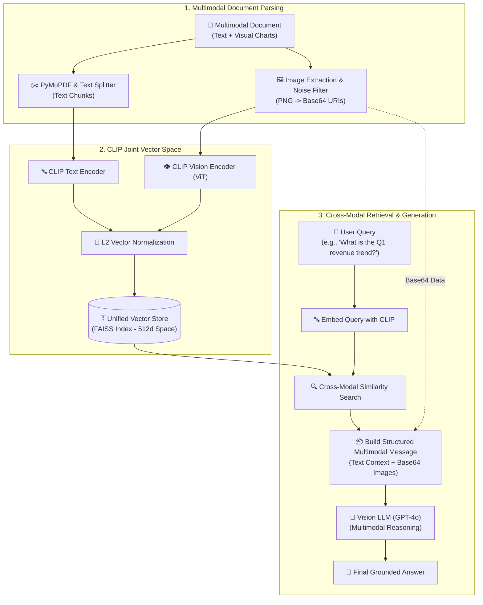

# Krish_naik_rag_notes

---

## 🗺️ Sequential End-to-End Production Project Lifecycle Index
> **How a Production RAG & Agentic AI Project Flows Sequentially by Topic**
> 
> In real-world enterprise engineering, an end-to-end AI project follows a systematic, modular pipeline. Follow this sequential roadmap to navigate from foundational model setup to production-grade agentic deployment. Click any phase or topic to jump directly to its complete architecture, theory, and code implementations.

| Project Stage | Pipeline Phase | Core Architecture & Topics Covered | Direct Link |
| :---: | :--- | :--- | :--- |
| **Phase 1** | **Modern Foundations & Agent Engine** | Universal Model Initializer (`init_chat_model`), Streaming & Batching, Tool Binding (`model.bind_tools` vs `create_agent`), Canonical Messages, Structured Outputs (Pydantic / TypedDict), Agent Middleware & LCEL Runnables | [LangChain v1.1 & LangGraph Engine](#topic-1-langchain-v11) |
| **Phase 2** | **RAG Fundamentals & Document Ingestion** | Ingestion Phase Mental Model, 10 Core Chunking Strategies (Fixed, Sentence, Paragraph, Recursive, Structure, Sliding, Token, Agentic, Hybrid), Business Impact & ROI | [RAG Architecture & Ingestion](#topic-2-rag) |
| **Phase 3** | **Context Boundary Chunking** | Topic/meaning-aware text splitting via sentence embedding distance spikes and similarity threshold breakpoints | [Semantic Chunking](#topic-5-semantic-chunking) |
| **Phase 4** | **High-Dimensional Vector Storage** | Vector Stores vs Vector DBs Architecture Matrix, Local Stores (ChromaDB, FAISS, InMemory), Cloud DBs (Pinecone Serverless, DataStax AstraDB, Qdrant), Distance Metrics (Cosine, L2, Dot Product) | [Vector Stores & Vector Databases](#topic-4-vector-db) |
| **Phase 5** | **Pre-Retrieval Query Transformation** | **1. Query Expansion:** LLM synonyms and sub-aspects<br>**2. Query Decomposition:** Multi-hop problem breakdown<br>**3. HyDE:** Hypothetical Document Embeddings to solve question-document asymmetry | [Query Expansion](#topic-9-query-expansion) • [Decomposition](#topic-10-query-decomposition) • [HyDE](#topic-11-hyde) |
| **Phase 6** | **Advanced Retrieval & Precision Ranking** | **1. Hybrid Search:** Combining Dense (Embeddings) + Sparse (BM25) with RRF<br>**2. Cross-Encoder Re-ranking:** Precision scoring to eliminate false positives<br>**3. MMR (Maximal Marginal Relevance):** Balancing relevance with diversity | [Hybrid Search](#topic-6-hybrid-search) • [Re-ranking](#topic-7-reranking) • [MMR](#topic-8-mmr) |
| **Phase 7** | **RAG Chain Construction & Memory** | LCEL RAG Chains, Conversational RAG with Chat History (`create_history_aware_retriever`), Pre-built Chains (`create_stuff_documents_chain` & `create_retrieval_chain`) | [RAG Pipelines & ChromaDB](#chroma-rag-chains) |
| **Phase 7.1** | **Chain Architecture Decision Framework** | 🎯 **Deep Dive: When to Use vs. When NOT to Use `format_docs`** in LangChain (LCEL vs. Pre-built Helpers Comparison Matrix) | [format_docs Decision Guide](#format-docs-deep-dive) |
| **Phase 8** | **Strategic Customization Tradeoffs** | Fine-Tuning vs RAG vs Prompt Engineering: Decision Matrix, Knowledge Freshness, Hallucination Reduction, Cost and Compute Budgets | [Fine-Tuning vs. RAG](#topic-3-finetuning-vs-rag) |
| **Phase 9** | **Multimodal Data & Vision-Native RAG** | Multimodal AI Workflows, Classic Document OCR vs Visual-Native (ColPali) Architecture, Multimodal RAG with CLIP Joint Embedding Space & GPT-4o Vision | [Multimodal AI](#topic-12-multimodal-ai) • [Visual RAG Architecture](#topic-13-multimodal-rag-architecture) |
| **Phase 10** | **Autonomous Agentic AI Systems** | AI Agents vs Agentic AI (Reactive vs Goal-Driven Autonomous Systems), Human-in-the-Loop, Memory Compression | [AI Agents vs. Agentic AI](#topic-14-agentic-ai) |
| **Phase 11** | **End-to-End Autonomous Pipeline Case Study** | Autonomous Software Development Lifecycle: Architecture, TDD Code Generation, Self-Debugging, Code Review & Git Push Automation | [Agentic SDLC Case Study](#topic-15-agentic-sdlc) |

---

## 📑 Complete Topic Index (Module Reference)

1. [08_langchain_updated_version1.1 — Modern Agent Architecture & LCEL](#topic-1-langchain-v11)
2. [RAG (Retrieval-Augmented Generation) — Fundamentals & 10 Chunking Strategies](#topic-2-rag)
3. [Fine-Tuning vs. RAG — Strategic Customization Framework](#topic-3-finetuning-vs-rag)
4. [Vector Store vs. Vector Databases — Hands-on Chroma, FAISS, Pinecone, AstraDB, Qdrant](#topic-4-vector-db)
   * [ChromaDB End-to-End RAG Chains & Conversational Memory](#chroma-rag-chains)
   * [🎯 LangChain format_docs Deep-Dive: When to Use vs. When NOT to Use](#format-docs-deep-dive)
5. [Semantic Chunking — Meaning-Based Splitting](#topic-5-semantic-chunking)
6. [Dense + Sparse Retrieval (Hybrid Search) — BM25 + Vector Fusion](#topic-6-hybrid-search)
7. [Reranking — Cross-Encoder Precision Re-ordering](#topic-7-reranking)
8. [MMR (Maximal Marginal Relevance) — Novelty & Diversity Optimization](#topic-8-mmr)
9. [Query Expansion Technique — LLM-Generated Synonyms & Formulations](#topic-9-query-expansion)
10. [Query Decomposition — Multi-hop Atomic Breakdown](#topic-10-query-decomposition)
11. [HyDE (Hypothetical Document Embeddings) — Solving Query-Doc Asymmetry](#topic-11-hyde)
12. [Multimodal AI — Architecture & Classic OCR vs. Visual-Native ColPali](#topic-12-multimodal-ai)
13. [Multimodal RAG & AI Architecture — CLIP Joint Embedding & Cross-Modal Retrieval](#topic-13-multimodal-rag-architecture)
14. [AI Agents vs. Agentic AI — Autonomous Multi-Agent Architectures](#topic-14-agentic-ai)
15. [Example: Why We Need Agentic AI (Software Development Workflow)](#topic-15-agentic-sdlc)

---

<a id="topic-1-langchain-v11"></a>
<details><summary>1. 08_langchain_updated_version1.1 — Needed for stateful agent workflows, streaming, tool binding & graph-based execution</summary>
detailed ->   https://github.com/Shivanshvyas1729/Krish_naik_rag_notes/blob/main/langchain_updates.1.1.md
# LangChain v1.1 & LangGraph Agent Architecture

This module contains modern, production-grade implementations and detailed theoretical notes on the **LangChain v1.1 / 1.x API** built on top of the **LangGraph** execution engine.

---

## 📚 Notebook Overview & Core Architecture

| Notebook | Topic & Core Focus | Key LangChain v1.1 APIs Used |
| :--- | :--- | :--- |
| **`1-langchainintro.ipynb`** | Agent Foundations & Graph Engine | `create_agent()`, `@tool`, `agent.invoke()` |
| **`2-modelintegration.ipynb`** | Universal Model Integration, Streaming & Batching | `init_chat_model()`, `ChatOpenAI()`, `ChatGroq()`, `ChatGoogleGenerativeAI()`, `model.stream()`, `model.batch()` |
| **`3-tools.ipynb`** | Tool Definition, Schemas & Execution Loops | `@tool`, `model.bind_tools()`, `ai_msg.tool_calls`, `ToolMessage` |
| **`4-messages.ipynb`** | Canonical Message Schema & Token Tracking | `SystemMessage`, `HumanMessage`, `AIMessage`, `ToolMessage`, `usage_metadata` |
| **`5-structuredoutput.ipynb`** | Enforced Schema Parsing & Validation | `with_structured_output()`, `response_format`, `Pydantic`, `TypedDict`, `@dataclass` |
| **`6-middleware.ipynb`** | Agent Middleware, Memory & Human-in-the-Loop | `SummarizationMiddleware`, `HumanInTheLoopMiddleware`, `InMemorySaver`, `Command` |
| **LCEL Core** | Declarative Composition & Runnable Protocol | `|` (pipe), `Runnable`, `invoke()`, `ainvoke()`, `batch()`, `stream()` |

---

## 📖 Comprehensive Module Theory & Deep Dives

### 1. `1-langchainintro.ipynb` – Agent Foundations & High-Level Architecture

#### 🧠 Theory & Core Concepts
An **AI Agent** uses a Large Language Model (LLM) as a central reasoning engine to dynamically decide which tools to call, what parameters to extract, and how to sequence actions to satisfy a user request.

- **Legacy vs. LangChain v1.1 Agent Architecture**:
  - *Legacy (`AgentExecutor`)*: Relied on complex Python loops and manual memory state passing.
  - *LangChain v1.1 (`create_agent`)*: Constructs a stateful, compiled graph engine powered by **LangGraph** under the hood. It natively handles cyclic agent loops, message state persistence, and tool execution error recovery.

```python
from langchain.agents import create_agent
from langchain_core.tools import tool

@tool
def get_weather(city: str) -> str:
    # Get the weather for a city
    return f"The weather in {city} is sunny."

agent = create_agent(
    model="gpt-4o-mini",
    tools=[get_weather],
    system_prompt="You are a helpful assistant."
)

# Invocation accepts messages in OpenAI or LangChain format
response = agent.invoke({"messages": [{"role": "user", "content": "What is the weather in New York?"}]})
print(response["messages"])
```

---

### 2. `2-modelintegration.ipynb` – Universal Model Provider Loading, Streaming & Batching

#### 🧠 Theory & Core Concepts
LangChain v1.1 decouples provider-specific code from application logic using a universal model initializer and standardized execution paradigms.

1. **Universal Model Initialization (`init_chat_model`)**:
   Instead of importing provider classes directly (`ChatOpenAI`, `ChatGroq`, `ChatGoogleGenerativeAI`), `init_chat_model()` instantiates any LLM via string identifiers, making provider migration seamless.

   ```python
   from langchain.chat_models import init_chat_model

   model_openai = init_chat_model("gpt-4o-mini")
   model_groq = init_chat_model("groq:llama-3.3-70b-versatile")
   model_gemini = init_chat_model("google_genai:gemini-1.5-flash")
   ```

2. **Streaming Output (`model.stream()`)**:
   - *Concept*: LLMs generate text token by token. Calling `model.stream()` uses HTTP chunked transfer encoding to yield `AIMessageChunk` objects in real time.
   - *UX Benefit*: Eliminates user waiting time by displaying output progressively (reduces Time-To-First-Token).

   ```python
   for chunk in model.stream("Explain quantum computing in 2 sentences"):
       print(chunk.content, end="", flush=True)
   ```

3. **Batch Processing (`model.batch()`)**:
   - *Concept*: Dispatches multiple independent prompts in parallel using async thread pools.
   - *Performance Benefit*: Drastically reduces total latency and increases request throughput compared to sequential `for` loops.(It can handle multiple requests more efficiently and process more of them in the same amount of time than a normal sequential for loop.)

   ```python
   responses = model.batch(["What is 2+2?", "What is 10*5?", "What is 100/4?"])
   ```

---

### 3. `3-tools.ipynb` – Tool Anatomy, Schemas & Both Tool Binding Methods

#### 🧠 Theory & Core Concepts
A **Tool** is a pairing of:
1. **JSON Schema**: Contains the function name, docstring description, and argument parameter types.
2. **Execution Logic**: The underlying Python function or coroutine executed when invoked.

The `@tool` decorator automatically inspects Python type hints (`city: str`) and Google/Sphinx docstrings to auto-generate the JSON schema expected by LLM tool-calling APIs.

#### 🛠️ Both Methods to Add & Bind Tools in LangChain

| Feature | Method 1: `model.bind_tools()` | Method 2: `create_agent(tools=[...])` |
| :--- | :--- | :--- |
| **Execution Loop** | Manual (Developer invokes tool function) | Automatic (LangGraph engine invokes tool function) |
| **Message State** | Manual `ToolMessage` creation & append | Automatic `ToolMessage` state tracking |
| **Control Level** | Fine-grained (Custom UI callbacks, single-step) | High-level (Multi-step autonomous agent execution) |

##### Method 1: Direct Model Binding (`model.bind_tools()`)
```python
from langchain.chat_models import init_chat_model
from langchain_core.tools import tool

@tool
def get_weather(city: str) -> str:
    """Get the weather for a city."""
    return f"The weather in {city} is sunny."

model = init_chat_model("gpt-4o-mini")
model_with_tools = model.bind_tools([get_weather])

# Step 1: Model generates tool calls
messages = [{"role": "user", "content": "What's the weather in Boston?"}]
ai_msg = model_with_tools.invoke(messages)
messages.append(ai_msg)

# Step 2: Execute tools and collect results
for tool_call in ai_msg.tool_calls:
    # Execute the tool with the generated arguments
    tool_result = get_weather.invoke(tool_call)
    messages.append(tool_result)

# Step 3: Pass results back to model for final response
final_response = model_with_tools.invoke(messages)
print(final_response.content)
# "The weather in Boston is sunny."
```

##### Method 2: Automatic Agent Execution Loop (`create_agent(tools=[...])`)
```python
from langchain.agents import create_agent
from langchain_core.tools import tool

@tool
def get_weather(city: str) -> str:
    # Get the weather for a city
    return f"The weather in {city} is sunny."

# Agent automatically executes the loop: LLM -> Tool Call -> Function Exec -> ToolMessage -> Final Answer
agent = create_agent(
    model="gpt-4o-mini",
    tools=[get_weather],
    system_prompt="You are a helpful assistant."
)
result = agent.invoke({"messages": [{"role": "user", "content": "What's the weather in Boston?"}]})
```

---

### 4. `4-messages.ipynb` – Canonical Message State & Token Usage Metadata

"Canonical Message State" refers to a unified, standardized format used in software integration to ensure different systems can communicate seamlessly

- Reduces Complexity
- Looser Coupling
- Easier Maintenance


#### 🧠 Theory & Core Concepts
Messages are the fundamental unit of context in LangChain. They represent multi-turn conversation state and carry content, roles, and provider metadata across APIs.

- **Text Prompts vs. Message Prompts**:
  - *Text Prompts*: Standalone strings for simple, single-turn tasks.
  - *Message Prompts*: Structured list of `BaseMessage` objects required for multi-turn chat memory and agent tool-calling loops.

#### 💬 The 4 Canonical Message Types

| Message Class | Role | Purpose & Contents |
| :--- | :--- | :--- |
| **`SystemMessage`** | `system` | Instructions setting persona, tone, rules, and guardrails. |
| **`HumanMessage`** | `user` | User inputs (supports multimodal text, images, audio, files). |
| **`AIMessage`** | `assistant` | Model output (text, reasoning tokens, and `tool_calls` payload). |
| **`ToolMessage`** | `tool` | Output returned by a tool execution, mapped via `tool_call_id`. |

```python
from langchain_core.messages import SystemMessage, HumanMessage, AIMessage, ToolMessage

messages = [
    SystemMessage("You are a helpful financial assistant."),
    HumanMessage("What is the stock price of Apple?"),
    AIMessage(content="", tool_calls=[{"name": "get_stock_price", "args": {"ticker": "AAPL"}, "id": "call_999"}]),
    ToolMessage(content="$225.50", tool_call_id="call_999")
]

response = model.invoke(messages)
print(response.usage_metadata)  # Contains token usage details
```

---

### 5. `5-structuredoutput.ipynb` – Enforced Schema Parsing & Validation

#### 🧠 Theory & Core Concepts
**Structured Output** guarantees that an LLM responds matching a strict schema (JSON/Pydantic), eliminating parsing failures in downstream production code.

#### 📐 Supported Schema Enforcers

1. **Pydantic (`BaseModel`)**: Full runtime field validation, default values, and rich field descriptions (`Field(description=...)`).
2. **TypedDict (`TypedDict`)**: Lightweight Python built-in typing using `Annotated[T, Field(description=...)]`.
3. **Dataclass (`@dataclass`)**: Standard Python data container.

```python
from pydantic import BaseModel, Field
from typing_extensions import TypedDict, Annotated

# Option A: Pydantic Schema
class Movie(BaseModel):
    title: str = Field(description="Title of the movie")
    year: int = Field(description="Release year")

structured_model = model.with_structured_output(Movie)
movie_obj = structured_model.invoke("Provide details about Inception")
# Returns: Movie(title='Inception', year=2010)

# Option B: TypedDict Schema
class MovieDict(TypedDict):
    title: Annotated[str, Field(description="Title of the movie")]
    year: Annotated[int, Field(description="Release year")]

structured_dict_model = model.with_structured_output(MovieDict)
```

- **`include_raw=True`**: Returns a dictionary with `{"raw": AIMessage, "parsed": SchemaObject, "parsing_error": None}` for debugging and tracing raw model tokens.

---

### 6. `6-middleware.ipynb` – Stateful Middleware, Memory Compression & Human-in-the-Loop

#### 🧠 Theory & Core Concepts
**Middleware** intercept and modify internal agent execution steps.
- Logging, analytics, and token cost control.
- Guardrails , PII masking (Personally Identifiable Information), and output safety filtering.
- Automated memory compression and human approval checkpoints.
(Guardrails are safety boundaries or protective barriers that prevent systems, vehicles, or artificial intelligence models from veering off course into dangerous or unintended territory)


- Think of agent middleware as a security guard, accountant, and editor standing right beside an AI agent.
The AI agent does the thinking, but the middleware intercepts everything the agent says or does before it actually happens.
Here is what it does in simple terms:
## 1. The Accountant (Logging & Cost Control)

* Tracks everything: It writes down exactly what the agent did and how long it took.
* Counts the cost: It counts the words (tokens) the agent uses. If the agent starts spending too much money or gets stuck in a loop, the middleware cuts it off.

## 2. The Filter (Guardrails & Security)

* Hides private data: If the agent tries to send your phone number or credit card to the cloud, the middleware replaces it with [HIDDEN] first.
* Blocks bad replies: It checks the agent's answers. If the agent says something unsafe, mean, or broken, the middleware blocks it from reaching the user.

## 3. The Assistant (Memory & Approvals)

* Shrinks long chats: If a conversation gets too long, the middleware summarizes the old parts so the agent doesn't get confused or slow down.
* Asks for permission: Before the agent does something serious—like sending an email or spending real money—the middleware hits "pause" and asks a human to click Approve or Deny.


#### 1. Summarization Middleware (`SummarizationMiddleware`)
- *Problem*: Long-running multi-turn agent conversations exceed context window limits and consume excessive tokens.
- *Solution*: Automatically compresses older conversation turns into a summarized context block once a message count or token limit is reached, while keeping recent messages intact.

```python
from langchain.agents import create_agent
from langchain.agents.middleware import SummarizationMiddleware
from langgraph.checkpoint.memory import InMemorySaver

agent = create_agent(
    model="gpt-4o-mini",
    checkpointer=InMemorySaver(),
    middleware=[
        SummarizationMiddleware(
            model="gpt-4o-mini",
            trigger=("messages", 10), # Summarize after 10 messages
            keep=("messages", 4)       # Keep latest 4 messages
        )
    ]
)
```

#### 2. Human-In-The-Loop Middleware (`HumanInTheLoopMiddleware`)
- *Problem*: High-stakes tool executions (e.g. database deletes, financial transactions, sending emails) require human oversight before execution.
- *Solution*: Pauses agent execution before executing specified tools. The agent state is persisted using a checkpointer (`InMemorySaver`), and waits for a human approval/rejection/edit signal (`Command`).

```python
from langchain.agents import create_agent
from langchain.agents.middleware import HumanInTheLoopMiddleware
from langgraph.checkpoint.memory import InMemorySaver

agent = create_agent(
    model="gpt-4o-mini",
    tools=[send_email_tool, read_email_tool],
    checkpointer=InMemorySaver(),
    middleware=[
        HumanInTheLoopMiddleware(
            interrupt_before=["send_email_tool"]  # Pause before sending email
        )
    ]
)
```

---

### 7. LangChain Expression Language (LCEL) & The Runnable Protocol

**LCEL (LangChain Expression Language)** is a declarative way to compose and chain artificial intelligence building blocks—such as prompts, models, and parsers—using the pipe operator (`|`). [[1](https://www.geeksforgeeks.org/artificial-intelligence/langchain/), [2](https://www.langchain.com/blog/langchain-expression-language)]

#### 🧠 What is LCEL?
* **Declarative Composition:** You define what components to connect, and data flows automatically from left to right.
* **The Runnable Protocol:** Every core element in LCEL implements a standard interface (Runnables) that handles execution seamlessly.
* **Basic Syntax:** A standard workflow looks like `chain = prompt | llm | output_parser`. [[1](https://cobusgreyling.medium.com/what-is-langchain-expression-language-lcel-8a828c38b37d), [2](https://langchain-opentutorial.gitbook.io/langchain-opentutorial/01-basic/07-lcel-interface), [3](https://www.aurelio.ai/learn/langchain-lcel), [4](https://www.geeksforgeeks.org/artificial-intelligence/langchain/)]

#### 🚀 Key Features & Benefits
* **Out-of-the-Box Execution Modes:** Supports synchronous (`invoke`), asynchronous (`ainvoke`), batch (`batch`), and streaming (`stream`) execution without changing your code. [[1](https://www.youtube.com/watch?v=8aUYzb1aYDU&t=1), [2](https://k21academy.com/ai-ml/langchain-expression-language/), [3](https://langchain-opentutorial.gitbook.io/langchain-opentutorial/01-basic/07-lcel-interface)]
* **Automatic Parallelism:** Steps that can run concurrently do so automatically to boost runtime efficiency. [[1](https://k21academy.com/ai-ml/langchain-expression-language/)]
* **Production Ready:** Designed to transition smoothly from local prototypes to production environments with built-in logging and tracing via platforms like LangSmith. [[1](https://www.artefact.com/blog/unleashing-the-power-of-langchain-expression-language-lcel-from-proof-of-concept-to-production/), [2](https://www.langchain.com/blog/langchain-expression-language), [3](https://k21academy.com/ai-ml/langchain-expression-language/)]

> 💡 **LCEL vs. Pre-built Chains Note**: When constructing custom LCEL RAG pipelines (`retriever | format_docs | prompt`), converting `List[Document]` to a string via `format_docs` is mandatory. Conversely, pre-built helpers (`create_stuff_documents_chain`) handle document formatting internally. See the full [format_docs Decision Guide & Comparison Matrix](#format-docs-deep-dive).

</details>


<a id="topic-2-rag"></a>
<details><summary>2. RAG (Retrieval-Augmented Generation) — Needed to ground LLM responses with private/up-to-date knowledge and prevent hallucinations</summary>


# Study Notes: Retrieval-Augmented Generation (RAG)

## Core Concept

**RAG (Retrieval-Augmented Generation)** is a technique that enhances AI language models by combining their text-generation capabilities with external knowledge retrieval.

* **The Analogy:**
* **Traditional LLM (Without RAG):** Like a student taking a *closed-book exam*. It can only answer based on the information it memorized during its initial training. If it doesn't know, it might guess (hallucinate) or say "I don't know."
* **RAG-Enabled AI:** Like a student taking an *open-book exam*. It can look up specific, current, or specialized information from a "library" (external databases) before generating its answer.


---

## The 3 Core Components of RAG

1. **[R]etrieval:** Finding relevant information. The system searches external sources (like a Vector Database) using similarity search to find data related to the user's query.
2. **[A]ugmentation:** Enhancing the context. The retrieved data is combined with metadata (e.g., source tags like *"Source: Tesla Annual Report 2023"*) and added to the user's original prompt.
3. **[G]eneration:** Producing the answer. The Large Language Model (LLM) reads the enriched context and generates a highly accurate, grounded response.

---

## RAG Architecture Workflow

The process is broken down into three distinct phases:

### Phase 1: Document Ingestion

* **Data Sources:** Raw data (PDFs, Web Pages, Databases) is collected.
* **Processing:** The data goes through a Document Splitter to break it into chunks.
* **Embedding:** An Embedding Model converts text into mathematical vectors (e.g., `[0.31, -0.22, 0.85...]`).
* **Storage:** These vectors are stored in a **Vector Database**.

#### 🧩 10 Core Chunking Strategies in RAG

> 💡 **For RAG, the most commonly useful starting points are:**
> **Recursive + overlap**, **semantic**, and **document-structure-based chunking**.

##### Summary Matrix:
| # | Strategy | Core Mechanism | Best For | Trade-offs & Limitations |
| :--- | :--- | :--- | :--- | :--- |
| 1 | **Fixed-size chunking** | Split strictly every $N$ characters/tokens | Rapid baseline tests | Slices words & sentences mid-thought |
| 2 | **Sentence-based chunking** | Split at sentence punctuation (`.`, `!`, `?`) | Factoid Q&A, statement search | Uneven chunk lengths; loses paragraph context |
| 3 | **Paragraph-based chunking** | Split at double newlines (`\n\n`) | Articles, blogs, narratives | Paragraphs vary wildly in length |
| 4 | **Recursive chunking** | Hierarchical separators (`\n\n` → `\n` → `" "` → `""`) | General prose (Default choice) | Complex technical documents can still fragment |
| 5 | **Semantic chunking** | Split on sentence embedding distance spikes | Dense technical / academic text | High computation cost ($N$ embedding calls) |
| 6 | **Document-structure chunking** | Split on headers (`#`, `##`), HTML tags, tables | Markdown docs, manuals, code | Irregular chunk sizes; requires structural markup |
| 7 | **Sliding-window chunking** | Fixed window size + fixed stride overlap | High-continuity document streams | Substantial data redundancy in vector index |
| 8 | **Token-based chunking** | Split strictly by tokenizer token limit | LLM context window budgeting | Disregards grammatical sentence boundaries |
| 9 | **Agentic/LLM-based chunking** | Prompt LLM to extract cohesive sections | Unstructured messy data | High API latency and financial cost |
| 10 | **Hybrid chunking** | Structure + Recursive/Semantic + Token limits | Enterprise-grade production RAG | Multi-step pipeline implementation overhead |

---

##### 1. Fixed-size chunking
Splits text every $N$ characters (or words) with an optional overlap, without taking grammatical or linguistic structure into account.
* **Best used for:** Quick baseline tests or uniform flat data where semantic boundaries are unimportant.
* **Risk:** Cuts words and sentences in half, causing context fragmentation and hallucinations.

<details>
<summary><b>Code & Example: Fixed-size Chunking</b></summary>

```python
from langchain_text_splitters import CharacterTextSplitter

text = (
    "LangChain is an orchestration framework for LLMs. It connects models "
    "to external data sources and enables retrieval-augmented generation. "
    "Chroma and FAISS are common vector stores used for fast similarity search."
)

splitter = CharacterTextSplitter(
    separator="",          # Hard character split
    chunk_size=60,         # Exact character count
    chunk_overlap=10       # Fixed overlap
)

chunks = splitter.split_text(text)
for i, chunk in enumerate(chunks, 1):
    print(f"Chunk {i} [{len(chunk)} chars]: '{chunk}'")
```

**Output Example:**
```text
Chunk 1 [60 chars]: 'LangChain is an orchestration framework for LLMs. It connect'
Chunk 2 [60 chars]: 'connects models to external data sources and enables retriev'
Chunk 3 [60 chars]: 'retrieval-augmented generation. Chroma and FAISS are common '
Chunk 4 [48 chars]: 'common vector stores used for fast similarity search.'
```
</details>

---

##### 2. Sentence-based chunking
Splits text directly along sentence boundaries (using punctuation marks like `.`, `!`, `?` or NLP tokenizers from NLTK/spaCy).
* **Best used for:** Precise fact-checking, statement verification, and sentence-level quote retrieval.
* **Risk:** Individual sentences frequently lack sufficient context (e.g., resolving pronouns like "it", "they", or "this").

<details>
<summary><b>Code & Example: Sentence-based Chunking</b></summary>

```python
import re

text = (
    "Retrieval-Augmented Generation enhances LLM capability! "
    "It fetches relevant knowledge from external vector databases. "
    "Does this prevent hallucinations? Yes, by grounding answers in retrieved source text."
)

# Sentence boundary regex or NLTK/spaCy sentence tokenizer
sentences = [s.strip() for s in re.split(r'(?<=[.!?])\s+', text) if s.strip()]

for i, sent in enumerate(sentences, 1):
    print(f"Chunk {i} (Sentence): {sent}")
```

**Output Example:**
```text
Chunk 1 (Sentence): Retrieval-Augmented Generation enhances LLM capability!
Chunk 2 (Sentence): It fetches relevant knowledge from external vector databases.
Chunk 3 (Sentence): Does this prevent hallucinations?
Chunk 4 (Sentence): Yes, by grounding answers in retrieved source text.
```
</details>

---

##### 3. Paragraph-based chunking
Uses natural paragraph delimiters (usually double newlines `\n\n`) to segment text, maintaining the author's original unit of thought.
* **Best used for:** Well-formatted editorial content, blog posts, essays, and reports where paragraphs represent cohesive ideas.
* **Risk:** Paragraph lengths vary wildly; one paragraph may be 20 tokens while another is 2,000 tokens, exceeding LLM context limits.

<details>
<summary><b>Code & Example: Paragraph-based Chunking</b></summary>

```python
from langchain_text_splitters import CharacterTextSplitter

text = """Artificial Intelligence has revolutionized natural language processing. Modern transformer architectures allow models to understand contextual relationships across vast amounts of text.

Retrieval-Augmented Generation (RAG) is a prominent architecture that combines information retrieval with text generation. By grounding responses in external knowledge, RAG dramatically reduces hallucinations.

Vector databases act as the memory layer in RAG systems, enabling sub-second semantic retrieval across millions of embeddings."""

splitter = CharacterTextSplitter(
    separator="\n\n",
    chunk_size=100,         # Minimum target before splitting
    chunk_overlap=0
)

chunks = splitter.split_text(text)
for i, chunk in enumerate(chunks, 1):
    print(f"--- Chunk {i} (Paragraph) ---\n{chunk}\n")
```

**Output Example:**
```text
--- Chunk 1 (Paragraph) ---
Artificial Intelligence has revolutionized natural language processing. Modern transformer architectures allow models to understand contextual relationships across vast amounts of text.

--- Chunk 2 (Paragraph) ---
Retrieval-Augmented Generation (RAG) is a prominent architecture that combines information retrieval with text generation. By grounding responses in external knowledge, RAG dramatically reduces hallucinations.

--- Chunk 3 (Paragraph) ---
Vector databases act as the memory layer in RAG systems, enabling sub-second semantic retrieval across millions of embeddings.
```
</details>

---

##### 4. Recursive chunking
Tries a prioritized hierarchy of separators sequentially (`\n\n` → `\n` → `" "` → `""`). It only moves to finer separators if a chunk exceeds the target size, keeping larger structural units (paragraphs, then sentences) intact whenever possible.
* **Best used for:** General prose, documentation, articles, and default RAG pipelines (recommended baseline).
* **Risk:** Dense technical sections without standard paragraph breaks can still end up fragmented.

<details>
<summary><b>Code & Example: Recursive Chunking</b></summary>

```python
from langchain_text_splitters import RecursiveCharacterTextSplitter

text = """LangChain provides modular abstractions. It simplifies building LLM apps.

RAG combines retrieval with generation:
- Dense retrieval uses vector embeddings.
- Sparse retrieval uses keyword algorithms like BM25.
Combining both creates hybrid search."""

splitter = RecursiveCharacterTextSplitter(
    chunk_size=120,
    chunk_overlap=20,
    separators=["\n\n", "\n", " ", ""]
)

chunks = splitter.split_text(text)
for i, chunk in enumerate(chunks, 1):
    print(f"Chunk {i} ({len(chunk)} chars):\n\"{chunk}\"\n")
```

**Output Example:**
```text
Chunk 1 (74 chars):
"LangChain provides modular abstractions. It simplifies building LLM apps."

Chunk 2 (112 chars):
"RAG combines retrieval with generation:
- Dense retrieval uses vector embeddings.
- Sparse retrieval uses keyword"

Chunk 3 (85 chars):
"- Sparse retrieval uses keyword algorithms like BM25.
Combining both creates hybrid search."
```
</details>

---

##### 5. Semantic chunking
Computes embeddings for consecutive sentences and measures their cosine distance. When the semantic distance between adjacent sentences spikes past a calculated statistical threshold (percentile or standard deviation), it places a chunk boundary.
* **Best used for:** Dense multi-topic documents, research papers, and technical transcripts where topics shift unpredictably.
* **Risk:** Computationally expensive at ingestion time ($N$ sentence embedding inference calls).

<details>
<summary><b>Code & Example: Semantic Chunking</b></summary>

```python
from langchain_experimental.text_splitter import SemanticChunker
from langchain_openai import OpenAIEmbeddings

text = """LangChain is a framework for building applications with LLMs.
It provides modular abstractions to combine LLMs with vector databases like Chroma and Pinecone.
You can create chains, agents, memory, and retrievers.
The Eiffel Tower is located on the Champ de Mars in Paris, France.
France is one of the most visited tourist destinations in the world."""

# Splits when cosine distance between consecutive sentences exceeds 95th percentile
chunker = SemanticChunker(
    embeddings=OpenAIEmbeddings(),
    breakpoint_threshold_type="percentile",
    breakpoint_threshold_amount=95.0
)

docs = chunker.create_documents([text])
for i, doc in enumerate(docs, 1):
    print(f"=== Semantic Chunk {i} ===\n{doc.page_content}\n")
```

**Output Example:**
```text
=== Semantic Chunk 1 ===
LangChain is a framework for building applications with LLMs. It provides modular abstractions to combine LLMs with vector databases like Chroma and Pinecone. You can create chains, agents, memory, and retrievers.

=== Semantic Chunk 2 ===
The Eiffel Tower is located on the Champ de Mars in Paris, France. France is one of the most visited tourist destinations in the world.
```
</details>

---

##### 6. Document-structure chunking
Leverages the inherent layout and syntax of documents — such as Markdown headers (`#`, `##`, `###`), HTML tags (`<section>`, `<table>`), code ASTs (classes, functions), or JSON keys. It attaches structural breadcrumbs directly into chunk metadata.
* **Best used for:** Technical documentation, API specs, developer docs, GitHub repositories, and structured reports.
* **Risk:** Chunk size is determined entirely by author formatting; long sections without subheaders may still need secondary splitting.

<details>
<summary><b>Code & Example: Document-structure Chunking</b></summary>

```python
from langchain_text_splitters import MarkdownHeaderTextSplitter

markdown_text = """# Machine Learning
Machine learning algorithms build mathematical models based on sample training data.

## Supervised Learning
Supervised algorithms require input data paired with corresponding ground-truth labels.

### Classification
Predicts discrete category labels like spam detection.

## Unsupervised Learning
Discovers inherent groupings or patterns in unlabeled data."""

headers_to_split_on = [
    ("#", "Header 1"),
    ("##", "Header 2"),
    ("###", "Header 3"),
]

markdown_splitter = MarkdownHeaderTextSplitter(
    headers_to_split_on=headers_to_split_on,
    strip_headers=False
)

splits = markdown_splitter.split_text(markdown_text)
for i, doc in enumerate(splits, 1):
    print(f"Chunk {i} | Metadata: {doc.metadata}")
    print(f"Content:\n{doc.page_content}\n")
```

**Output Example:**
```text
Chunk 1 | Metadata: {'Header 1': 'Machine Learning'}
Content:
# Machine Learning
Machine learning algorithms build mathematical models based on sample training data.

Chunk 2 | Metadata: {'Header 1': 'Machine Learning', 'Header 2': 'Supervised Learning'}
Content:
## Supervised Learning
Supervised algorithms require input data paired with corresponding ground-truth labels.

Chunk 3 | Metadata: {'Header 1': 'Machine Learning', 'Header 2': 'Supervised Learning', 'Header 3': 'Classification'}
Content:
### Classification
Predicts discrete category labels like spam detection.

Chunk 4 | Metadata: {'Header 1': 'Machine Learning', 'Header 2': 'Unsupervised Learning'}
Content:
## Unsupervised Learning
Discovers inherent groupings or patterns in unlabeled data.
```
</details>

---

##### 7. Sliding-window chunking
Generates overlapping chunks by sliding a fixed-size window forward by a smaller step (stride). A window of size $W$ with stride $S$ produces an overlap of $W - S$ tokens across consecutive chunks, ensuring transitions between boundaries are never lost.
* **Best used for:** Continuous text streams, conversation transcripts, medical records, or legal contracts where context shearing is unacceptable.
* **Risk:** High storage and vector compute overhead due to repetitive text redundancy.

<details>
<summary><b>Code & Example: Sliding-window Chunking</b></summary>

```python
def sliding_window_chunking(text: str, window_size: int = 50, stride: int = 30):
    words = text.split()
    chunks = []
    for i in range(0, len(words), stride):
        chunk_words = words[i : i + window_size]
        if chunk_words:
            chunks.append(" ".join(chunk_words))
        if i + window_size >= len(words):
            break
    return chunks

sample = (
    "Alpha Beta Gamma Delta Epsilon Zeta Eta Theta Iota Kappa Lambda Mu "
    "Nu Xi Omicron Pi Rho Sigma Tau Upsilon Phi Chi Psi Omega"
)

chunks = sliding_window_chunking(sample, window_size=10, stride=6)  # 4 words overlap
for i, chunk in enumerate(chunks, 1):
    print(f"Window {i}: {chunk}")
```

**Output Example:**
```text
Window 1: Alpha Beta Gamma Delta Epsilon Zeta Eta Theta Iota Kappa
Window 2: Eta Theta Iota Kappa Lambda Mu Nu Xi Omicron Pi
Window 3: Nu Xi Omicron Pi Rho Sigma Tau Upsilon Phi Chi
Window 4: Tau Upsilon Phi Chi Psi Omega
```
</details>

---

##### 8. Token-based chunking
Splits text according to explicit token counts using the target LLM's exact BPE tokenizer (e.g., `tiktoken` for OpenAI `cl100k_base` / `o200k_base`).
* **Best used for:** Strict LLM context window budgeting, preventing API token limit errors, and accurate cost tracking.
* **Risk:** May split in the middle of words or sentences if not combined with recursive fallback characters.

<details>
<summary><b>Code & Example: Token-based Chunking</b></summary>

```python
from langchain_text_splitters import TokenTextSplitter

text = (
    "TokenTextSplitter splits documents strictly based on the token count "
    "generated by BPE tokenizers like tiktoken. This is essential when building "
    "RAG prompts with fixed LLM context window constraints."
)

token_splitter = TokenTextSplitter(
    chunk_size=15,      # Split every 15 tokens
    chunk_overlap=3,    # 3 tokens overlap
    encoding_name="cl100k_base"
)

chunks = token_splitter.split_text(text)
for i, chunk in enumerate(chunks, 1):
    print(f"Token Chunk {i}:\n'{chunk}'\n")
```

**Output Example:**
```text
Token Chunk 1:
'TokenTextSplitter splits documents strictly based on the token count'

Token Chunk 2:
' the token count generated by BPE tokenizers like tiktoken. This'

Token Chunk 3:
' tiktoken. This is essential when building RAG prompts with fixed'

Token Chunk 4:
' prompts with fixed LLM context window constraints.'
```
</details>

---

##### 9. Agentic / LLM-based chunking
Employs an LLM as an intelligent chunking agent. The model reads the document, reasons about semantic boundaries, and outputs clean, self-contained sections accompanied by synthesized context, summaries, or standalone chunk titles.
* **Best used for:** Complex, messy, or highly technical documents where rule-based splitters fail (e.g., mixed tables, contracts, research summaries).
* **Risk:** Substantial inference cost and higher processing latency per document during data ingestion.

<details>
<summary><b>Code & Example: Agentic/LLM-based Chunking</b></summary>

```python
from langchain_core.prompts import PromptTemplate
from langchain_core.output_parsers import JsonOutputParser
from pydantic import BaseModel, Field
from typing import List

class ChunkOutput(BaseModel):
    chunk_title: str = Field(description="Descriptive title for this chunk")
    chunk_content: str = Field(description="Self-contained chunk text with context preserved")

class DocumentChunks(BaseModel):
    chunks: List[ChunkOutput]

parser = JsonOutputParser(pydantic_object=DocumentChunks)

prompt = PromptTemplate(
    template="""You are an expert document chunking agent. Analyze the text below and partition it into 
self-contained, coherent semantic chunks. Resolve any ambiguous pronouns so each chunk is fully standalone.

Formatting instructions: {format_instructions}

Document Text:
{text}
""",
    input_variables=["text"],
    partial_variables={"format_instructions": parser.get_format_instructions()},
)

# Example output schema returned by LLM:
mock_response = {
    "chunks": [
        {
            "chunk_title": "Quantum Computing Fundamentals",
            "chunk_content": "Quantum computers utilize qubits capable of superposition and entanglement, solving certain mathematical problems exponentially faster than classical computers."
        },
        {
            "chunk_title": "Cryogenic Hardware Requirements",
            "chunk_content": "Superconducting quantum processors require dilution refrigerators operating at near absolute zero temperatures (15 millikelvin) to prevent thermal decoherence."
        }
    ]
}
print(mock_response)
```

**Output Example:**
```json
{
  "chunks": [
    {
      "chunk_title": "Quantum Computing Fundamentals",
      "chunk_content": "Quantum computers utilize qubits capable of superposition and entanglement, solving certain mathematical problems exponentially faster than classical computers."
    },
    {
      "chunk_title": "Cryogenic Hardware Requirements",
      "chunk_content": "Superconducting quantum processors require dilution refrigerators operating at near absolute zero temperatures (15 millikelvin) to prevent thermal decoherence."
    }
  ]
}
```
</details>

---

##### 10. Hybrid chunking
Combines multiple chunking techniques sequentially in a multi-stage ingestion pipeline. For example:
1. **Stage 1 (Structure):** Split document into major sections using `MarkdownHeaderTextSplitter`.
2. **Stage 2 (Recursive / Token):** If any section exceeds max token length, split it using `RecursiveCharacterTextSplitter` or `TokenTextSplitter` with 15% overlap.
3. **Stage 3 (Metadata Propagation):** Preserve parent structural headers in the child chunks for filtered vector search.
* **Best used for:** Enterprise production RAG architectures requiring both structural awareness and strict token boundaries.
* **Risk:** Slightly more complex ingestion pipeline logic.

<details>
<summary><b>Code & Example: Hybrid Chunking</b></summary>

```python
from langchain_text_splitters import MarkdownHeaderTextSplitter, RecursiveCharacterTextSplitter

raw_document = """# System Architecture Guide

## Ingestion Engine
The ingestion engine extracts raw data from S3 buckets and databases. It handles decompression, OCR for PDFs, and character encoding sanitization. Once cleaned, text streams are prepared for downstream vectorization.

## Retrieval Engine
The retrieval engine combines dense vector search with BM25 keyword matching. It utilizes a reciprocal rank fusion algorithm to merge candidate sets before cross-encoder re-ranking.
"""

# Step 1: Structural Split by Headers
header_splitter = MarkdownHeaderTextSplitter(
    headers_to_split_on=[("#", "Section"), ("##", "SubSection")],
    strip_headers=False
)
structural_chunks = header_splitter.split_text(raw_document)

# Step 2: Recursive Sub-splitting for token safety
text_splitter = RecursiveCharacterTextSplitter(
    chunk_size=120,
    chunk_overlap=20
)
hybrid_chunks = text_splitter.split_documents(structural_chunks)

for i, doc in enumerate(hybrid_chunks, 1):
    print(f"Hybrid Chunk {i} | Metadata: {doc.metadata}")
    print(f"Content: {doc.page_content}\n")
```

**Output Example:**
```text
Hybrid Chunk 1 | Metadata: {'Section': 'System Architecture Guide', 'SubSection': 'Ingestion Engine'}
Content: ## Ingestion Engine
The ingestion engine extracts raw data from S3 buckets and databases.

Hybrid Chunk 2 | Metadata: {'Section': 'System Architecture Guide', 'SubSection': 'Ingestion Engine'}
Content: It handles decompression, OCR for PDFs, and character encoding sanitization. Once cleaned, text streams are prepared

Hybrid Chunk 3 | Metadata: {'Section': 'System Architecture Guide', 'SubSection': 'Retrieval Engine'}
Content: ## Retrieval Engine
The retrieval engine combines dense vector search with BM25 keyword matching.

Hybrid Chunk 4 | Metadata: {'Section': 'System Architecture Guide', 'SubSection': 'Retrieval Engine'}
Content: It utilizes a reciprocal rank fusion algorithm to merge candidate sets before cross-encoder re-ranking.
```
</details>

---

### Phase 2: Query Processing

* The user submits a query (e.g., "What is RAG?").
* The query is converted into an embedding.
* The system performs a **Similarity Search** in the Vector Database to find the most relevant document chunks.

### Phase 3: Generation

* The relevant chunks are formatted as **Augmented Context**.
* This context is fed into a **Large Language Model** (like GPT-4, Claude, or Llama).
* The LLM synthesizes the information and outputs the **Generated Response**.

---

## Comparison: Traditional LLM vs. RAG (Customer Support Example)

| Feature | Traditional LLM (Without RAG) | AI Assistant (With RAG) |
| --- | --- | --- |
| **Data Source** | Training data only | LLM + Vector Database |
| **Response Type** | Generic, unhelpful, or outdated | Specific, actionable, and up-to-date |
| **Example Output** | *"Generally, most companies offer 30-day returns, but policies may vary..."* | *"According to our current policy (v3.2), Black Friday purchases have an extended 60-day window..."* |

---

## Real-World Benefits & Business Impact

* **Cost Savings:** Reduces the need for constant model retraining. *(Example: JPMorgan saved $150M annually by using RAG instead of fine-tuning models monthly).*
* **Accuracy (Reducing Hallucinations):** Grounds the AI in actual facts. *(Example: Microsoft reported a 94% reduction in AI hallucinations in their Copilot products).*
* **Flexibility & Real-Time Updates:** Can ingest live data instantly. *(Example: Bloomberg updates its financial AI assistant hourly with new market data, which is impossible with traditional LLMs).*
* **Compliance & Sourcing:** Allows the AI to provide citations. *(Example: Healthcare companies use RAG to ensure AI responses always cite approved medical sources).*

  [1-2RAG (1).pdf](https://github.com/user-attachments/files/29892069/1-2RAG.1.pdf)

 </details>


<a id="topic-3-finetuning-vs-rag"></a>
<details><summary>3. Fine-Tuning vs. RAG — Needed to decide between adapting LLM style/tone (Fine-Tuning) vs. injecting dynamic external knowledge (RAG)</summary>


---

# AI Customization Methods: A Beginner's Guide

A comparison of the three primary ways to customize Large Language Models (LLMs): Prompt Engineering, Fine-tuning, and RAG.

## 1. Prompt Engineering

**Concept:** Teaching through instructions. The underlying AI model itself remains completely unchanged.

### 📊 Diagram Flow

```text
[User Prompt: "Act as an expert chef..."] 
                    ↓
        [Base LLM (Remains Unchanged)] 
                    ↓
          [Customized Output]

```

### 📝 Key Details

* **How it Works:**
* Write specific instructions in your prompt.
* Structure prompts with clear context.
* Use examples (few-shot learning).


* **Pros:**
* No technical expertise needed.
* Instant results.
* Free (no training costs).
* Highly flexible and works with any LLM.


* **Cons:**
* Strictly limited by the model's existing base knowledge.
* Can yield inconsistent results.
* Token limits restrict how complex you can make the prompt.
* Cannot add new, permanent knowledge to the model.


* **Best For:** Quick prototyping, small-scale applications, general-purpose tasks, and when you need maximum flexibility.

---

## 2. Fine-Tuning

**Concept:** Teaching through training. It alters the model's permanent weights to create a specialized version of the original AI.

### 📊 Diagram Flow

```text
[Base LLM (Original Weights)]  +  [Domain-Specific Training Data]
                               ↓
                            (Train)
                               ↓
        [Fine-Tuned LLM (Modified Weights / Specialized)]

```

### 📝 Key Details

* **How it Works:**
* Prepare domain-specific training data.
* Train the base model on your data.
* Model weights are permanently changed to create a specialized version.


* **Pros:**
* Creates deeply specialized knowledge and consistent behavior.
* Eliminates the need for complex prompt engineering.
* Can learn specific new writing styles.
* Significantly better for highly specific domains.


* **Cons:**
* Expensive to execute (can cost $1000s – $10000s).
* Requires Machine Learning (ML) expertise.
* Needs complete retraining for any informational updates.
* The model can sometimes "forget" general knowledge during training.


* **Best For:** Highly specific writing styles or tones, domain-specific language, high-volume/consistent tasks, and situations where accuracy is critical.

---

## 3. RAG (Retrieval-Augmented Generation)

**Concept:** Teaching through retrieval. It pulls in outside information in real-time to help the AI answer a query accurately.

### 📊 Diagram Flow

```text
[User Query] ─────────────> [Vector Database / Knowledge Base]
      ↓                                   ↓
      └─────────> [Retrieved Relevant Documents]
                                  ↓
                              [Base LLM]
                                  ↓
                        [Augmented Response]

```

### 📝 Key Details

* **How it Works:**
* Store company documents or data in a Vector Database.
* Retrieve relevant documents for each specific query.
* Combine the retrieved documents with the query to serve as context.
* The LLM generates an answer based strictly on that context.


* **Pros:**
* Always provides up-to-date information.
* Requires no model training (highly cost-effective).
* Can safely handle private or proprietary data.
* High accuracy with reduced hallucination.


* **Cons:**
* Requires initial infrastructure setup (like Vector DBs).
* The final result is heavily dependent on the quality of the retrieval step.
* Context window limitations still apply.
* Adds latency (delay) to the response time due to the retrieval step.


* **Best For:** Knowledge bases and documentation, real-time or frequently updated info, customer support systems, and compliance-heavy industries.

  [5-Promptvsfinetunignvsrag.pdf](https://github.com/user-attachments/files/29892064/5-Promptvsfinetunignvsrag.pdf)

  </details>


<a id="topic-4-vector-db"></a>
<details><summary>4. Vector Store vs. Vector Databases — Needed for high-dimensional embedding storage and fast semantic similarity search at scale</summary>

# Study Notes: Vector Stores vs. Vector Databases

## The Golden Rule

Start with a **Vector Store** for prototyping and learning. Graduate to a **Vector Database** when you need production-scale features, reliability, and advanced querying capabilities.

---

## 1. Vector Stores

A lightweight library or tool focused on storing and searching vectors efficiently.

### Key Characteristics

* **Core Function:** Simple similarity search (finding the K nearest neighbors to a query vector).
* **Architecture:** Usually runs in-memory or as a local file (single-machine operation).
* **Scale:** Handles smaller datasets (< 1 million vectors).
* **Speed:** Extremely fast query speed (Microseconds).
* **Setup & Cost:** Quick to set up (Minutes), typically deployed locally, and usually free.

### When to Use

* Building a proof of concept (POC).
* Working with less than 1 million vectors.
* You need the absolute fastest possible search speed.
* You have a limited budget or want full control over the implementation.
* Building embedded applications.

### Popular Examples

* FAISS
* Annoy
* ChromaDB
* ScaNN
* NMSLIB

---

## 2. Vector Databases

A full-featured database system designed for managing and querying vector data at scale.

### Key Characteristics

* **Core Function:** Advanced search (filters, metadata queries) and full database operations (CRUD: Create, Read, Update, Delete).
* **Architecture:** Distributed system with replication, sharding, and high availability.
* **Scale:** Built for massive datasets (Billions+ of vectors).
* **Speed:** Slightly slower query speed due to overhead (Milliseconds).
* **Setup & Cost:** Takes longer to set up (Hours/Days), usually cloud-deployed, and incurs costs ($$$).

### When to Use

* Building production and enterprise applications.
* Need to scale beyond millions of vectors.
* Require high availability and system reliability.
* Need advanced filtering and metadata search alongside vector search.
* Have multiple users/tenants accessing the data.
* Want managed infrastructure rather than handling it locally.

### Popular Examples

* Pinecone
* Weaviate
* Qdrant
* Milvus
* Vespa
* DataStax (AstraDB)

---

## 3. Quick Reference Comparison

| Feature | Vector Store | Vector Database |
| --- | --- | --- |
| **Scale** | ~1 Million vectors | Billions+ vectors |
| **Setup Time** | Minutes | Hours/Days |
| **Query Speed** | Microseconds | Milliseconds |
| **Features** | Basic Search | Full CRUD & Metadata filtering |
| **Deployment** | Local | Cloud / Distributed |
| **Cost** | Free | Paid ($$$) |

[23-+Vector+store+vs+Vector+Databases.pdf](https://github.com/user-attachments/files/29892056/23-%2BVector%2Bstore%2Bvs%2BVector%2BDatabases.pdf)

---

## 💻 Vector Store & Database Hands-On Code Implementations

Below are complete, production-ready code guides for creating, loading, persisting, querying, dynamically adding data, and building retrievers/RAG chains across all major vector stores and databases.

---

### 1. ChromaDB (`8.1-chromadb.ipynb`)

<details>
<summary><b>Code & Implementation: ChromaDB (Create, Query, Add Data, Retriever & RAG Chains)</b></summary>

Chroma is an open-source, AI-native embedding database designed for developer productivity and local-first prototyping.

#### 📦 Installation & Setup
```bash
pip install -qU langchain-chroma langchain-openai langchain-community chromadb
```

#### 🛠️ Step 1: Document Ingestion, Chunking & Embeddings
```python
import os
from dotenv import load_dotenv
from langchain_core.documents import Document
from langchain_text_splitters import RecursiveCharacterTextSplitter
from langchain_openai import OpenAIEmbeddings
from langchain_chroma import Chroma

load_dotenv()
os.environ["OPENAI_API_KEY"] = os.getenv("OPENAI_API_KEY")

# 1. Sample Documents
sample_docs = [
    Document(
        page_content="Machine learning is a subset of AI that focuses on learning from data without explicit programming.",
        metadata={"topic": "ML", "source": "ai_primer.txt", "doc_id": 1}
    ),
    Document(
        page_content="Deep learning uses multi-layer neural networks to learn representations from complex unstructured data like images and audio.",
        metadata={"topic": "DL", "source": "ai_primer.txt", "doc_id": 2}
    ),
    Document(
        page_content="Natural Language Processing (NLP) enables machines to read, understand, and derive meaning from human languages.",
        metadata={"topic": "NLP", "source": "ai_primer.txt", "doc_id": 3}
    )
]

# 2. Text Splitting
text_splitter = RecursiveCharacterTextSplitter(chunk_size=150, chunk_overlap=20)
chunks = text_splitter.split_documents(sample_docs)

# 3. Embedding Model
embeddings = OpenAIEmbeddings(model="text-embedding-3-small")
```

#### 🏗️ Step 2: Create & Persist Chroma Vector Store (`ingest.py`)
```python
# Create persistent vector store on disk
persist_directory = "./chroma_db"

vectorstore = Chroma.from_documents(
    documents=chunks,
    embedding=embeddings,
    persist_directory=persist_directory,
    collection_name="rag_knowledge_base"
)

print(f"Total vectors stored in Chroma: {vectorstore._collection.count()}")
```

#### 🔄 Step 2.1: Reload Persisted Chroma Store Somewhere Else (`app.py` / Zero Re-Embedding)
To load and use an already created Chroma store in a different script, API server, or module without re-ingesting or re-embedding documents:
```python
# In your app.py / api.py / query script:
from langchain_chroma import Chroma
from langchain_openai import OpenAIEmbeddings

embeddings = OpenAIEmbeddings(model="text-embedding-3-small")

# 🔹 Connect directly to the existing on-disk collection (No from_documents needed!)
loaded_vectorstore = Chroma(
    persist_directory="./chroma_db",
    embedding_function=embeddings,
    collection_name="rag_knowledge_base"
)

print(f"Loaded existing Chroma store with {loaded_vectorstore._collection.count()} vectors.")
```

#### 🔍 Step 3: Direct Similarity Search & Scores
```python
query = "What is deep learning and neural networks?"

# Standard Similarity Search (returns top-k documents)
results = vectorstore.similarity_search(query, k=2)
for i, doc in enumerate(results):
    print(f"\n--- Result {i+1} ---")
    print(f"Content: {doc.page_content}")
    print(f"Metadata: {doc.metadata}")

# Similarity Search with Distance Scores (Lower score = closer distance / higher similarity for L2/Cosine distance)
results_with_scores = vectorstore.similarity_search_with_score(query, k=2)
for doc, score in results_with_scores:
    print(f"Score (Distance): {score:.4f} | Content: {doc.page_content[:60]}...")
```

#### ➕ Step 4: Adding More Data to Existing Chroma Store
```python
# Create new documents/chunks
new_doc = Document(
    page_content="Reinforcement Learning (RL) trains agents through reward and penalty feedback to maximize cumulative reward.",
    metadata={"topic": "RL", "source": "rl_notes.txt", "doc_id": 4}
)
new_chunks = text_splitter.split_documents([new_doc])

# Add documents dynamically to existing vectorstore
vectorstore.add_documents(new_chunks)

# Or add raw texts directly with metadata
vectorstore.add_texts(
    texts=["Supervised learning trains models on labeled input-output pairs."],
    metadatas=[{"topic": "ML", "source": "ml_basics.txt", "doc_id": 5}]
)

print(f"Total vectors after addition: {vectorstore._collection.count()}")
```

#### 🎯 Step 5: Metadata Filtering
```python
# Retrieve only documents matching specific metadata criteria
filtered_results = vectorstore.similarity_search(
    query="Explain learning methods",
    k=3,
    filter={"topic": "ML"}
)
for doc in filtered_results:
    print(f"[{doc.metadata['topic']}] {doc.page_content}")
```

#### 🚀 Step 6: Converting to Retriever & Building RAG Chains <a id="chroma-rag-chains"></a>
```python
from langchain_core.prompts import ChatPromptTemplate
from langchain_core.runnables import RunnablePassthrough
from langchain_core.output_parsers import StrOutputParser
from langchain.chat_models import init_chat_model

# 1. Convert vector store to retriever
retriever = vectorstore.as_retriever(
    search_type="similarity", # or "mmr", "similarity_score_threshold"
    search_kwargs={"k": 3}
)

# 2. Format helper
def format_docs(docs):
    return "\n\n".join(doc.page_content for doc in docs)

# 3. Initialize LLM (OpenAI or Groq)
llm = init_chat_model("gpt-4o-mini")

# 4. Prompt Template
prompt = ChatPromptTemplate.from_template("""
Answer the question based ONLY on the provided context:

Context:
{context}

Question:
{question}

Answer:
""")

# 5. Build LCEL RAG Chain
rag_chain = (
    {"context": retriever | format_docs, "question": RunnablePassthrough()}
    | prompt
    | llm
    | StrOutputParser()
)

response = rag_chain.invoke("What is reinforcement learning?")
print("RAG Response:\n", response)
```

#### 🧠 Step 7: Advanced Conversational RAG with Chat History
```python
from langchain_core.prompts import MessagesPlaceholder
from langchain_core.messages import HumanMessage, AIMessage
from langchain.chains import create_history_aware_retriever, create_retrieval_chain
from langchain.chains.combine_documents import create_stuff_documents_chain

# 1. Contextualize Question Prompt (Re-writes user question considering history)
contextualize_q_system_prompt = """Given a chat history and the latest user question \
which might reference context in the chat history, formulate a standalone question \
which can be understood without the chat history. Do NOT answer the question, \
just reformulate it if needed and otherwise return it as is."""

contextualize_q_prompt = ChatPromptTemplate.from_messages([
    ("system", contextualize_q_system_prompt),
    MessagesPlaceholder("chat_history"),
    ("human", "{input}"),
])

history_aware_retriever = create_history_aware_retriever(
    llm, retriever, contextualize_q_prompt
)

# 2. QA Prompt with Context & History
qa_system_prompt = """You are an assistant for question-answering tasks. \
Use the following pieces of retrieved context to answer the question. \
If you don't know the answer, say that you don't know. Use three sentences maximum and keep the answer concise.\n\n{context}"""

qa_prompt = ChatPromptTemplate.from_messages([
    ("system", qa_system_prompt),
    MessagesPlaceholder("chat_history"),
    ("human", "{input}"),
])

question_answer_chain = create_stuff_documents_chain(llm, qa_prompt)
rag_conversational_chain = create_retrieval_chain(history_aware_retriever, question_answer_chain)

# 3. Multi-turn execution
chat_history = []

# Turn 1
q1 = "What is machine learning?"
res1 = rag_conversational_chain.invoke({"input": q1, "chat_history": chat_history})
print("Turn 1 Answer:", res1["answer"])
chat_history.extend([HumanMessage(content=q1), AIMessage(content=res1["answer"])])

# Turn 2 (Follow-up relying on history context)
q2 = "What are its main subsets mentioned in the context?"
res2 = rag_conversational_chain.invoke({"input": q2, "chat_history": chat_history})
print("Turn 2 Answer:", res2["answer"])
```

#### 🎯 Step 8: When to Use vs. When NOT to Use `format_docs` in LangChain <a id="format-docs-deep-dive"></a>

In LangChain, deciding whether you need a `format_docs` helper depends entirely on **how your chain is constructed**:

---

##### 1. **When to USE `format_docs`** 
👉 **When building custom LCEL (LangChain Expression Language) chains directly.**

```python
# Pure LCEL Pipeline
rag_chain = (
    {"context": retriever | format_docs, "question": RunnablePassthrough()}
    | prompt
    | llm
    | StrOutputParser()
)
```

###### Why it's needed here:
- `retriever` returns a Python list of `Document` objects (`List[Document]`).
- A standard `ChatPromptTemplate` expects a **string** for `{context}`.
- If you pass `List[Document]` directly without `format_docs`, the prompt will receive the raw Python object representation (e.g. `[Document(page_content='...'), ...]`), wasting tokens and confusing the LLM.
- **You also use `format_docs` when you want custom formatting**, such as injecting metadata/source attribution into the context:
  ```python
  def format_docs_with_sources(docs):
      return "\n\n".join(
          f"Source: {doc.metadata.get('source', 'Unknown')} (Page {doc.metadata.get('page', 'N/A')}):\n{doc.page_content}"
          for doc in docs
      )
  ```

---

##### 2. **When NOT to use `format_docs`**
👉 **When using LangChain’s pre-built helper chains like `create_stuff_documents_chain` and `create_retrieval_chain`.**

```python
# Built-in LangChain Helpers
question_answer_chain = create_stuff_documents_chain(llm, qa_prompt)
rag_conversational_chain = create_retrieval_chain(history_aware_retriever, question_answer_chain)
```

###### Why you don't need it here:
- `create_stuff_documents_chain` is built specifically to accept `List[Document]` as its input.
- **It formats documents internally** using its default document template (`{page_content}`) and joins them with `\n\n`.
- `create_retrieval_chain` passes the raw `docs` into `create_stuff_documents_chain`, and also preserves the original `List[Document]` in the final output dictionary (`response["context"]`), allowing you to inspect sources, scores, or metadata later.
- If you manually pass a pre-formatted string instead of `List[Document]` to `create_stuff_documents_chain`, it will fail because it expects document objects.

---

##### Quick Comparison Summary

| Feature | LCEL Chain (`retriever \| format_docs \| prompt`) | Pre-built Chain (`create_stuff_documents_chain`) |
| :--- | :--- | :--- |
| **`format_docs` required?** | **Yes** (Must convert `List[Document]` $\rightarrow$ `str`) | **No** (Handles formatting internally) |
| **Input to `{context}` in prompt** | Plain String | Raw `List[Document]` handled under the hood |
| **Final Output** | Typically just the string response | Dictionary containing `answer` + raw `context` docs |
| **Custom formatting** | Handled in your Python function | Configured via `document_prompt` & `document_separator` |
| **Best suited for** | Lightweight, fully customized, streaming LCEL pipelines | Standard RAG, multi-turn chat history, and source tracking |

</details>

---

### 2. FAISS (Facebook AI Similarity Search) (`8.2-faiss.ipynb`)

<details>
<summary><b>Code & Implementation: FAISS (Create, Cosine Comparison, Save/Load, Add Data, Retriever & Chains)</b></summary>

FAISS (Facebook AI Similarity Search) is a high-performance C++ library with Python wrappers developed by Meta for dense vector similarity search with extreme GPU/CPU optimization and low memory overhead.

#### 📦 Installation & Setup
```bash
pip install -qU faiss-cpu langchain-community langchain-openai numpy
```

#### 🛠️ Step 1: Initializing FAISS Vector Store & Semantic Embeddings
```python
import os
import numpy as np
from dotenv import load_dotenv
from langchain_core.documents import Document
from langchain_text_splitters import RecursiveCharacterTextSplitter
from langchain_openai import OpenAIEmbeddings
from langchain_community.vectorstores import FAISS

load_dotenv()
embeddings = OpenAIEmbeddings(model="text-embedding-3-small")

sample_documents = [
    Document(
        page_content="Artificial Intelligence is a broad field focusing on creating smart machines capable of performing human tasks.",
        metadata={"topic": "AI", "source": "tech_overview.txt", "doc_id": 1}
    ),
    Document(
        page_content="Machine Learning enables computers to learn and improve automatically from experience without being explicitly programmed.",
        metadata={"topic": "ML", "source": "tech_overview.txt", "doc_id": 2}
    ),
    Document(
        page_content="Deep Learning utilizes deep artificial neural networks inspired by the human brain for predictive modeling.",
        metadata={"topic": "DL", "source": "tech_overview.txt", "doc_id": 3}
    )
]

text_splitter = RecursiveCharacterTextSplitter(chunk_size=120, chunk_overlap=20)
chunks = text_splitter.split_documents(sample_documents)

# Create FAISS vector store
vectorstore = FAISS.from_documents(documents=chunks, embedding=embeddings)
print("FAISS vectorstore created successfully!")
```

#### 📐 Step 2: Measuring Cosine Similarity Directly
```python
def compare_embeddings(text1: str, text2: str) -> float:
    emb1 = np.array(embeddings.embed_query(text1))
    emb2 = np.array(embeddings.embed_query(text2))
    # Cosine similarity formula: (A . B) / (||A|| * ||B||)
    similarity = np.dot(emb1, emb2) / (np.linalg.norm(emb1) * np.linalg.norm(emb2))
    return float(similarity)

print("Similarity 'AI' vs 'Pizza':", compare_embeddings("AI", "Pizza"))
print("Similarity 'Machine Learning' vs 'ML':", compare_embeddings("Machine Learning", "ML"))
```

#### 💾 Step 3: Local Persistence (Save & Load Index)
```python
# 1. Save FAISS index and docstore locally
vectorstore.save_local("faiss_index")
print("Saved FAISS index to ./faiss_index")

# 2. Load FAISS index back into memory
loaded_vectorstore = FAISS.load_local(
    "faiss_index",
    embeddings,
    allow_dangerous_deserialization=True  # Required for pickle deserialization of docstore
)
print("Loaded FAISS index successfully!")
```

#### ➕ Step 4: Adding More Documents to FAISS Index
```python
new_docs = [
    Document(
        page_content="Supervised learning uses labeled training datasets to train algorithms that classify data or predict outcomes.",
        metadata={"topic": "ML", "source": "advanced_ml.txt", "doc_id": 4}
    ),
    Document(
        page_content="Convolutional Neural Networks (CNNs) are specialized for processing visual grid data like digital images.",
        metadata={"topic": "DL", "source": "advanced_dl.txt", "doc_id": 5}
    )
]

new_chunks = text_splitter.split_documents(new_docs)

# Add new document chunks dynamically
vectorstore.add_documents(new_chunks)

# Add raw texts directly
vectorstore.add_texts(
    texts=["Recurrent Neural Networks (RNNs) are designed to recognize patterns in sequential data like text and time-series."],
    metadatas=[{"topic": "DL", "source": "advanced_dl.txt", "doc_id": 6}]
)
print("Added new documents to FAISS index.")
```

#### 🔍 Step 5: Similarity Search & Metadata Filtering
```python
query = "What is deep learning and neural networks?"

# Basic Search
results = vectorstore.similarity_search(query, k=3)
for i, doc in enumerate(results):
    print(f"Doc {i+1}: {doc.page_content}")

# Search with Score (In FAISS L2 distance: lower score = more similar)
results_with_scores = vectorstore.similarity_search_with_score(query, k=3)
for doc, score in results_with_scores:
    print(f"L2 Distance Score: {score:.4f} | Topic: {doc.metadata.get('topic')} | Text: {doc.page_content[:50]}...")

# Metadata Filter Search
filtered_results = vectorstore.similarity_search(
    query,
    k=2,
    filter={"topic": "DL"}
)
print(f"Filtered Results count: {len(filtered_results)}")
```

#### 🚀 Step 6: FAISS Retriever with MMR & LCEL Streaming RAG
```python
from langchain_core.prompts import ChatPromptTemplate
from langchain_core.runnables import RunnablePassthrough
from langchain_core.output_parsers import StrOutputParser
from langchain.chat_models import init_chat_model

# 1. Retriever using Maximal Marginal Relevance (MMR) for diverse, non-redundant chunks
retriever = vectorstore.as_retriever(
    search_type="mmr",
    search_kwargs={"k": 3, "fetch_k": 10, "lambda_mult": 0.7}
)

# 2. Format docs
def format_docs(docs):
    return "\n\n".join(f"[{doc.metadata.get('topic', 'General')}] {doc.page_content}" for doc in docs)

# 3. Prompt & LLM
prompt = ChatPromptTemplate.from_template("""
Context:
{context}

Question: {question}
Answer clearly with bullet points:
""")

llm = init_chat_model("groq:llama-3.3-70b-versatile")  # Or "gpt-4o-mini"

# 4. LCEL Streaming Chain
rag_chain = (
    {"context": retriever | format_docs, "question": RunnablePassthrough()}
    | prompt
    | llm
    | StrOutputParser()
)

# 5. Stream tokens in real time
print("\n--- Streaming Response ---")
for chunk in rag_chain.stream("How is Deep Learning related to Machine Learning?"):
    print(chunk, end="", flush=True)
print()
```

</details>

---

### 3. InMemoryVectorStore (`8.3-Othervectorstores.ipynb`)

<details>
<summary><b>Code & Implementation: InMemoryVectorStore (Lightweight In-Memory Testing & LCEL)</b></summary>

`InMemoryVectorStore` is the standard, ultra-lightweight, zero-dependency in-memory vector store shipped inside `langchain-core` for unit testing, educational demos, and ephemeral scripts.

#### 📦 Installation & Setup
```bash
pip install -qU langchain-core langchain-openai
```

#### 🛠️ Complete Implementation
```python
import os
from dotenv import load_dotenv
from langchain_core.documents import Document
from langchain_core.vectorstores import InMemoryVectorStore
from langchain_openai import OpenAIEmbeddings

load_dotenv()
embeddings = OpenAIEmbeddings(model="text-embedding-3-small")

# 1. Initialize empty In-Memory Vector Store
vector_store = InMemoryVectorStore(embeddings)

# 2. Prepare Documents
documents = [
    Document(page_content="Today the weather is sunny with a mild breeze and temperature around 24C.", metadata={"type": "weather", "city": "NYC"}),
    Document(page_content="Tomorrow we expect heavy rain and thunderstorms in the afternoon.", metadata={"type": "weather", "city": "NYC"}),
    Document(page_content="The stock market showed strong gains in technology and semiconductor sectors.", metadata={"type": "finance", "sector": "tech"}),
]

# 3. Add Documents
vector_store.add_documents(documents=documents)

# 4. Direct Similarity Search
results = vector_store.similarity_search("how is the weather forecast?", k=2)
print("--- Similarity Search Results ---")
for doc in results:
    print(f"[{doc.metadata['type']}] {doc.page_content}")

# 5. Similarity Search with Score
results_scored = vector_store.similarity_search_with_score("stock market rally", k=1)
doc, score = results_scored[0]
print(f"\nTop Match Score: {score:.4f} | Text: {doc.page_content}")

# 6. Convert to Retriever & Query via LCEL
retriever = vector_store.as_retriever(search_kwargs={"k": 2})
retrieved_docs = retriever.invoke("heavy rain tomorrow")
print("\n--- Retriever Output ---")
for doc in retrieved_docs:
    print(doc.page_content)
```

</details>

---

### 4. Pinecone Vector Database (`8.4-PineconeVectorDB.ipynb`)

<details>
<summary><b>Code & Implementation: Pinecone Serverless Cloud Vector Database</b></summary>

Pinecone is a fully managed, cloud-native vector database designed for high-availability enterprise workloads, serverless index scaling, and sub-second metadata-filtered similarity queries across billions of vectors.

#### 📦 Installation & Setup
```bash
pip install -qU pinecone langchain-pinecone langchain-openai
```

#### 🛠️ Complete Implementation
```python
import os
import time
from dotenv import load_dotenv
from pinecone import Pinecone, ServerlessSpec
from langchain_openai import OpenAIEmbeddings
from langchain_pinecone import PineconeVectorStore
from langchain_core.documents import Document

load_dotenv()
PINECONE_API_KEY = os.getenv("PINECONE_API_KEY")
OPENAI_API_KEY = os.getenv("OPENAI_API_KEY")

# 1. Initialize Pinecone Client
pc = Pinecone(api_key=PINECONE_API_KEY)
index_name = "rag-production-index"

# 2. Create Serverless Index if it doesn't already exist
embeddings = OpenAIEmbeddings(model="text-embedding-3-small")
embedding_dim = 1536  # Dimension for text-embedding-3-small

existing_indexes = [idx.name for idx in pc.list_indexes()]

if index_name not in existing_indexes:
    print(f"Creating Pinecone index '{index_name}'...")
    pc.create_index(
        name=index_name,
        dimension=embedding_dim,
        metric="cosine",  # Options: "cosine", "dotproduct", "euclidean"
        spec=ServerlessSpec(
            cloud="aws",
            region="us-east-1"
        )
    )
    # Wait for index initialization
    while not pc.describe_index(index_name).status["ready"]:
        time.sleep(1)
    print("Index is ready!")

# 3. Connect LangChain to Pinecone Index
vector_store = PineconeVectorStore(
    index_name=index_name,
    embedding=embeddings
)

# 4. Prepare & Add Documents
documents = [
    Document(
        page_content="Pinecone Serverless separates storage from compute, scaling automatically with request demand.",
        metadata={"category": "tech_docs", "source": "pinecone_guide", "author": "dev"}
    ),
    Document(
        page_content="Vector databases provide ACID transactions, metadata indexing, namespaces, and distributed replication.",
        metadata={"category": "tech_docs", "source": "database_architecture", "author": "architect"}
    ),
    Document(
        page_content="Tomorrow's weather will be warm and sunny with zero precipitation expected across the region.",
        metadata={"category": "news", "source": "daily_bulletin", "author": "weather_desk"}
    )
]

# Ingest documents into Pinecone
vector_store.add_documents(documents=documents)
print("Documents successfully ingested into Pinecone!")

# 5. Direct Similarity Search with Metadata Filtering
query = "Tell me about cloud vector database scaling"
results = vector_store.similarity_search(
    query,
    k=2,
    filter={"category": "tech_docs"}  # Exact metadata filtering at vector search layer
)

print("\n--- Metadata-Filtered Results ---")
for doc in results:
    print(f"Source: {doc.metadata['source']} | Content: {doc.page_content}")

# 6. Similarity Search with Score
results_with_scores = vector_store.similarity_search_with_score(
    "Will it be hot tomorrow?",
    k=1,
    filter={"category": "news"}
)
for doc, score in results_with_scores:
    print(f"\nCosine Similarity Score: {score:.4f} | Content: {doc.page_content}")

# 7. Convert to Retriever for RAG Pipeline
retriever = vector_store.as_retriever(
    search_type="similarity",
    search_kwargs={"k": 2, "filter": {"category": "tech_docs"}}
)

retrieved_docs = retriever.invoke("How does serverless vector search work?")
print("\n--- Retriever Results ---")
for doc in retrieved_docs:
    print(doc.page_content)
```

</details>

---

### 5. DataStax AstraDB (`8.5-Datastaxdb+(1).ipynb`)

<details>
<summary><b>Code & Implementation: DataStax AstraDB (Managed Apache Cassandra Vector DB)</b></summary>

DataStax AstraDB is a cloud-native, multi-model vector database built on top of Apache Cassandra, offering massive horizontal scalability, NoSQL + Vector hybrid capabilities, and multi-region replication.

#### 📦 Installation & Setup
```bash
pip install -qU "langchain>=0.3.0" langchain-astradb langchain-openai
```

#### 🛠️ Complete Implementation
```python
import os
from dotenv import load_dotenv
from langchain_openai import OpenAIEmbeddings
from langchain_astradb import AstraDBVectorStore
from langchain_core.documents import Document

load_dotenv()

# 1. AstraDB Credentials & Configuration
ASTRA_DB_API_ENDPOINT = os.getenv("ASTRA_DB_API_ENDPOINT", "https://<your-db-id>-<region>.apps.astra.datastax.com")
ASTRA_DB_APPLICATION_TOKEN = os.getenv("ASTRA_DB_APPLICATION_TOKEN", "AstraCS:...")
OPENAI_API_KEY = os.getenv("OPENAI_API_KEY")

# 2. Embedding Model (e.g. 1024 or 1536 dimension)
embeddings = OpenAIEmbeddings(
    model="text-embedding-3-small",
    dimensions=1024,
    api_key=OPENAI_API_KEY
)

# 3. Initialize AstraDB Vector Store
vector_store = AstraDBVectorStore(
    collection_name="rag_collection",
    embedding=embeddings,
    api_endpoint=ASTRA_DB_API_ENDPOINT,
    token=ASTRA_DB_APPLICATION_TOKEN
)
print("Connected to AstraDB Vector Store!")

# 4. Prepare Documents & Add to AstraDB
documents = [
    Document(
        page_content="LangChain provides abstractions to make working with LLMs easy, modular, and extensible.",
        metadata={"framework": "langchain", "type": "core"}
    ),
    Document(
        page_content="DataStax AstraDB provides serverless Cassandra vector search with high availability across global regions.",
        metadata={"framework": "astradb", "type": "database"}
    ),
    Document(
        page_content="Retrieval-Augmented Generation combines external parametric knowledge bases with generative LLM inference.",
        metadata={"framework": "rag", "type": "architecture"}
    )
]

# Ingest documents
vector_store.add_documents(documents=documents)
print("Documents added to AstraDB!")

# 5. Direct Similarity Search with Scores
query = "LangChain abstractions for LLM applications"
results_with_scores = vector_store.similarity_search_with_score(query, k=2)

print("\n--- AstraDB Similarity Search with Score ---")
for doc, score in results_with_scores:
    print(f"Similarity Score: {score:.4f} | Framework: {doc.metadata['framework']} | Content: {doc.page_content}")

# 6. Convert to Retriever & Query
retriever = vector_store.as_retriever(
    search_type="similarity",
    search_kwargs={"k": 2}
)

retrieved_docs = retriever.invoke("How does AstraDB scale vector search?")
print("\n--- AstraDB Retriever Results ---")
for doc in retrieved_docs:
    print(f"[{doc.metadata['framework']}] {doc.page_content}")
```

</details>

---

### 6. Qdrant Vector Database (Local & Cloud)

<details>
<summary><b>Code & Implementation: Qdrant Vector Database (Local Memory, Disk, Docker & Cloud Serverless)</b></summary>

Qdrant is an enterprise-grade, open-source vector search engine and database written in Rust. It offers ultra-low latency vector similarity search, advanced payload (metadata) filtering, vector quantization, and support for hybrid (dense + sparse) search.

Qdrant natively supports **4 flexible deployment modes**:
* 🟢 **Local In-Memory Mode (`location=":memory:"`)**: Runs entirely in RAM for unit tests and quick scripting (no server needed).
* 🟡 **Local Disk Persistence (`path="./qdrant_db"`)**: Persists vectors and metadata directly to local disk without Docker or background servers.
* 🟠 **Local Docker Container / Self-Hosted Server (`url="http://localhost:6333"`)**: Standalone server with built-in Web UI Dashboard (`http://localhost:6333/dashboard`).
* 🔵 **Qdrant Cloud Serverless / Managed Cluster (`url="https://<cluster-id>.qdrant.tech:6333"`, `api_key="<api-key>"`)**: Fully managed cloud service for high-concurrency production workloads.

---

#### 📦 Installation & Setup
```bash
pip install -qU qdrant-client langchain-qdrant langchain-openai langchain-core
```

#### 🐳 Optional: Running Local Qdrant with Docker
```bash
# Run Qdrant container with persistent volume and Web Dashboard (Port 6333: REST/WebUI, Port 6334: gRPC)
docker run -d -p 6333:6333 -p 6334:6334 \
    -v $(pwd)/qdrant_storage:/qdrant/storage:z \
    --name qdrant_rag qdrant/qdrant
```

---

#### 🛠️ Complete Implementation (Local & Cloud Modes)

```python
import os
import time
from dotenv import load_dotenv
from langchain_core.documents import Document
from langchain_text_splitters import RecursiveCharacterTextSplitter
from langchain_openai import OpenAIEmbeddings
from langchain_qdrant import QdrantVectorStore
from qdrant_client import QdrantClient
from qdrant_client.http import models
from qdrant_client.http.models import Distance, VectorParams

load_dotenv()
os.environ["OPENAI_API_KEY"] = os.getenv("OPENAI_API_KEY")

# 1. Prepare Embeddings & Text Splitter
embeddings = OpenAIEmbeddings(model="text-embedding-3-small")
embedding_dim = 1536  # text-embedding-3-small output dimension

sample_documents = [
    Document(
        page_content="Qdrant is an open-source vector similarity search engine and vector database written in Rust.",
        metadata={"category": "database", "topic": "Qdrant", "author": "dev", "doc_id": 1}
    ),
    Document(
        page_content="Qdrant supports rich payload filtering, vector quantization, and dense plus sparse hybrid search.",
        metadata={"category": "features", "topic": "Qdrant", "author": "architect", "doc_id": 2}
    ),
    Document(
        page_content="Retrieval-Augmented Generation (RAG) grounds LLM responses using accurate contextual facts from vector stores.",
        metadata={"category": "ai_patterns", "topic": "RAG", "author": "researcher", "doc_id": 3}
    )
]

text_splitter = RecursiveCharacterTextSplitter(chunk_size=150, chunk_overlap=20)
chunks = text_splitter.split_documents(sample_documents)
collection_name = "production_knowledge_base"
```

---

#### ⚙️ Step 1: Initializing Qdrant Client (Choose Local or Cloud)

```python
# =====================================================================
# CHOOSE YOUR DEPLOYMENT MODE:
# =====================================================================

# MODE A: Local In-Memory (Zero persistence, ephemeral)
# client = QdrantClient(location=":memory:")

# MODE B: Local Disk Persistence (No server/Docker required!)
client = QdrantClient(path="./qdrant_db")

# MODE C: Local Docker / Self-Hosted Server
# client = QdrantClient(url="http://localhost:6333")

# MODE D: Qdrant Cloud (Managed Serverless / Dedicated Cluster)
# QDRANT_CLOUD_URL = os.getenv("QDRANT_CLOUD_URL")  # e.g. "https://xxxxxx.us-east-1-0.aws.cloud.qdrant.io:6333"
# QDRANT_API_KEY = os.getenv("QDRANT_API_KEY")
# client = QdrantClient(url=QDRANT_CLOUD_URL, api_key=QDRANT_API_KEY)

# 2. Ensure Collection Exists with Specified Vector Configuration & Distance Metric
if not client.collection_exists(collection_name):
    client.create_collection(
        collection_name=collection_name,
        vectors_config=VectorParams(size=embedding_dim, distance=Distance.COSINE)
    )
    print(f"Created Qdrant collection: {collection_name}")

# 3. Connect LangChain QdrantVectorStore
vector_store = QdrantVectorStore(
    client=client,
    collection_name=collection_name,
    embedding=embeddings
)
```

---

#### 📥 Step 2: Ingest Documents & Add More Data Dynamically

```python
# 1. Ingest initial document chunks
vector_store.add_documents(documents=chunks)
print("Ingested initial document chunks into Qdrant!")

# 2. Dynamically add new documents / updates to existing collection
new_doc = Document(
    page_content="Scalar Quantization in Qdrant compresses 32-bit floats into 8-bit integers, reducing RAM usage by up to 75%.",
    metadata={"category": "optimization", "topic": "Quantization", "author": "dev", "doc_id": 4}
)
new_chunks = text_splitter.split_documents([new_doc])
vector_store.add_documents(new_chunks)

# 3. Dynamically add raw texts directly with metadata
vector_store.add_texts(
    texts=["Binary Quantization in Qdrant offers up to 40x speedup and 95% memory compression for high-volume datasets."],
    metadatas=[{"category": "optimization", "topic": "Quantization", "author": "dev", "doc_id": 5}]
)
print("Added dynamic documents and texts to Qdrant.")
```

---

#### 🔍 Step 3: Direct Similarity Search & Similarity with Scores

```python
query = "How does vector quantization optimize memory in Qdrant?"

# 1. Standard Similarity Search
results = vector_store.similarity_search(query, k=2)
print("\n--- Standard Similarity Search Results ---")
for i, doc in enumerate(results):
    print(f"\n[Result {i+1}] (Topic: {doc.metadata.get('topic')})")
    print(f"Content: {doc.page_content}")

# 2. Similarity Search with Scores (Higher cosine score = greater semantic similarity)
results_with_scores = vector_store.similarity_search_with_score(query, k=2)
print("\n--- Similarity Search with Scores ---")
for doc, score in results_with_scores:
    print(f"Cosine Similarity Score: {score:.4f} | Content: {doc.page_content[:65]}...")
```

---

#### 🎯 Step 4: Advanced Metadata & Payload Pre-Filtering

```python
# Option A: Simple Dictionary Filter
dict_filtered = vector_store.similarity_search(
    query="vector search optimization",
    k=2,
    filter={"category": "optimization"}
)
print("\n--- Dictionary Filter Results ---")
for doc in dict_filtered:
    print(f"[{doc.metadata.get('topic')}] {doc.page_content}")

# Option B: Advanced Native Qdrant Filter (Must / Should / Must Not boolean logic)
qdrant_native_filter = models.Filter(
    must=[
        models.FieldCondition(
            key="metadata.category",
            match=models.MatchValue(value="optimization")
        )
    ]
)

advanced_results = vector_store.similarity_search(
    query="compression speedup",
    k=2,
    filter=qdrant_native_filter
)
print("\n--- Qdrant Native Filter Results ---")
for doc in advanced_results:
    print(f"[{doc.metadata.get('topic')}] {doc.page_content}")
```

---

#### 🚀 Step 5: Converting to Retriever (Similarity, MMR, Threshold) & LCEL RAG

```python
from langchain_core.prompts import ChatPromptTemplate
from langchain_core.runnables import RunnablePassthrough
from langchain_core.output_parsers import StrOutputParser
from langchain.chat_models import init_chat_model

# 1. Create Retriever with Maximal Marginal Relevance (MMR) for diverse retrieval
retriever = vector_store.as_retriever(
    search_type="mmr",
    search_kwargs={"k": 3, "fetch_k": 10, "lambda_mult": 0.7}
)

# 2. Document formatting helper
def format_docs(docs):
    return "\n\n".join(f"[{doc.metadata.get('topic')}] {doc.page_content}" for doc in docs)

# 3. Prompt & LLM
prompt = ChatPromptTemplate.from_template("""
You are an expert on Vector Databases and RAG architectures.
Answer the user question using ONLY the provided context:

Context:
{context}

Question:
{question}

Answer with detailed explanation:
""")

llm = init_chat_model("gpt-4o-mini") # Or "groq:llama-3.3-70b-versatile"

# 4. LCEL RAG Chain
rag_chain = (
    {"context": retriever | format_docs, "question": RunnablePassthrough()}
    | prompt
    | llm
    | StrOutputParser()
)

# 5. Execute RAG Query
response = rag_chain.invoke("What are the advantages of Scalar and Binary Quantization in Qdrant?")
print("\n--- RAG Generated Answer ---")
print(response)
```

---

#### 🧠 Step 6: Multi-Turn Conversational RAG with Memory & Qdrant

```python
from langchain_core.prompts import MessagesPlaceholder
from langchain_core.messages import HumanMessage, AIMessage
from langchain.chains import create_history_aware_retriever, create_retrieval_chain
from langchain.chains.combine_documents import create_stuff_documents_chain

# 1. Contextualize Question Prompt
contextualize_q_prompt = ChatPromptTemplate.from_messages([
    ("system", "Given a chat history and the latest user question, formulate a standalone question that can be understood without the chat history."),
    MessagesPlaceholder("chat_history"),
    ("human", "{input}"),
])

history_retriever = create_history_aware_retriever(llm, retriever, contextualize_q_prompt)

# 2. QA Prompt
qa_prompt = ChatPromptTemplate.from_messages([
    ("system", "You are an assistant for question-answering tasks. Use the following retrieved context to answer accurately:\n\n{context}"),
    MessagesPlaceholder("chat_history"),
    ("human", "{input}"),
])

qa_chain = create_stuff_documents_chain(llm, qa_prompt)
conversational_rag = create_retrieval_chain(history_retriever, qa_chain)

# 3. Multi-turn execution
history = []

# Turn 1
q1 = "What is Qdrant and what programming language is it built with?"
res1 = conversational_rag.invoke({"input": q1, "chat_history": history})
print("Turn 1 Answer:\n", res1["answer"])
history.extend([HumanMessage(content=q1), AIMessage(content=res1["answer"])])

# Turn 2 (Context-dependent follow-up)
q2 = "What optimization techniques does it offer for memory compression?"
res2 = conversational_rag.invoke({"input": q2, "chat_history": history})
print("\nTurn 2 Answer:\n", res2["answer"])
```

</details>

---

### 7. Unified Vector Store & Retriever API Cheatsheet

<details>
<summary><b>Quick Reference: Universal Retriever Methods, Search Types & Parameters</b></summary>

LangChain provides a unified interface across all vector stores. Any vector store can be converted into a `Retriever` using `.as_retriever()`:

| Vector Store / DB | Creation Method | Local Persistence | Add Data Method | Metadata Filtering Syntax |
| :--- | :--- | :--- | :--- | :--- |
| **ChromaDB** | `Chroma.from_documents(docs, emb, persist_directory=...)` | Native directory (`./chroma_db`) | `vectorstore.add_documents()` / `add_texts()` | `filter={"field": "value"}` |
| **FAISS** | `FAISS.from_documents(docs, emb)` | `save_local("path")` & `load_local("path", ...)` | `vectorstore.add_documents()` / `add_texts()` | `filter={"field": "value"}` |
| **InMemoryVectorStore** | `InMemoryVectorStore(emb)` | Ephemeral (in RAM) | `vector_store.add_documents()` | Built-in callable filter |
| **Pinecone** | `PineconeVectorStore(index_name=..., embedding=...)` | Cloud Managed | `vector_store.add_documents()` | `filter={"field": "value"}` |
| **AstraDB** | `AstraDBVectorStore(collection_name=..., ...)` | Cloud Managed | `vector_store.add_documents()` | `filter={"field": "value"}` |
| **Qdrant** | `QdrantVectorStore(client=..., collection_name=..., ...)` | Local Disk (`path="./qdrant_db"`) or Cloud (`url=...`) | `vector_store.add_documents()` / `add_texts()` | `filter={"field": "value"}` or native `models.Filter` |

#### ⚙️ Retriever Search Types & Parameters:

1. **Standard Similarity Search (`search_type="similarity"`)**:
   ```python
   retriever = vectorstore.as_retriever(search_type="similarity", search_kwargs={"k": 4})
   ```
2. **Maximal Marginal Relevance (`search_type="mmr"`)** — Balances relevance with diversity to reduce redundancy:
   ```python
   retriever = vectorstore.as_retriever(
       search_type="mmr",
       search_kwargs={"k": 3, "fetch_k": 10, "lambda_mult": 0.7}
   )
   ```
3. **Similarity Score Threshold (`search_type="similarity_score_threshold"`)** — Only returns documents with similarity score above cutoff:
   ```python
   retriever = vectorstore.as_retriever(
       search_type="similarity_score_threshold",
       search_kwargs={"score_threshold": 0.75, "k": 5}
   )
   ```

</details>

</details>


<a id="topic-5-semantic-chunking"></a>
<details><summary>5. Semantic Chunking — Needed to split documents by topic/meaning boundaries instead of fixed token lengths to preserve context</summary>

*Semantic Chunking is a text-splitting technique that divides content based on meaning instead of fixed size or paragraphs.*
  
**Semantic Chunking**:

## Overview

**Semantic Chunking** is the process of splitting a document into meaningful units (chunks) based on **semantic similarity** rather than fixed criteria like token count or line numbers.

In Retrieval-Augmented Generation (RAG) systems, semantic chunking improves performance through the pipeline:

$$\text{Better chunks} \rightarrow \text{Better retrieval} \rightarrow \text{Better grounding} \rightarrow \text{Better answers}$$

Chunks generated via this method are designed to be **self-contained, contextually rich, and logically separated**.

---

## How It Works (Step-by-Step)

1. **Document Segmentation:** The document is split into smaller units, such as individual sentences or paragraphs.
2. **Sentence Embedding:** Each sentence/unit is converted into a vector representation using an embedding model.
3. **Semantic Similarity Check:** The similarity (e.g., Cosine Similarity) between adjacent sentence embeddings is calculated and compared against a defined threshold (e.g., $0.80$).
4. **Sentence Merging:** Adjacent sentences are merged into a single chunk if their similarity score meets or exceeds the threshold.
5. **Form Chunks:** The process outputs grouped chunks containing semantically related sentences, while distinct sentences are separated into standalone chunks.

---

## Example

Given the input text:

1. *"LangChain is a framework for building LLM-powered apps."*
2. *"It integrates with tools like OpenAI and Pinecone."*
3. *"The Eiffel Tower is located in Paris."*
4. *"France is a popular tourist destination."*

**Output Chunks:**

* **Chunk 1:** `["LangChain is a framework...", "It integrates with tools..."]` *(Merged because both discuss LangChain/LLMs)*
* **Chunk 2:** `["The Eiffel Tower is located in Paris."]`
* **Chunk 3:** `["France is a popular tourist destination."]`

  [33-Semantic+Chunking.pdf](https://github.com/user-attachments/files/29892074/33-Semantic%2BChunking.pdf)

*You can find the documentation in the [Text Representation tech. Repo](https://github.com/Shivanshvyas1729/pydantic_notes/blob/main/nlp/Text%20Representation%20tech.md).*
</details>


<a id="topic-6-hybrid-search"></a>
<details><summary>6. Dense + Sparse Retrieval (Hybrid Search) — Needed to combine keyword accuracy (BM25) with semantic intent (Embeddings) for robust search</summary>


## Hybrid Search Strategies: Dense & Sparse Retrieval

**Hybrid Retrieval** combines both dense and sparse scoring methods (e.g., using a weighted sum or learning-to-rank methods) to improve search recall and relevance. By combining these, you get the "best of both worlds": the semantic, context-aware power of vector embeddings and the precise, exact-match capabilities of keywords.

---

### 1. Sparse Retrieval (Exact Keyword Search)

Sparse retrieval focuses on finding exact word matches between the query and the documents.

* **How it works:** It converts text into a sparse matrix representing word occurrences.
* **Techniques used:** Bag-of-Words (BoW), TF-IDF, and BM25.
* **Best for:** Exact keyword searches (e.g., searching for a specific name, ID, or unique term).

### 2. Dense Retrieval (Semantic Search)

Dense retrieval focuses on the underlying *meaning* and context of the query rather than just exact word matches.

* **How it works:** It uses Vector Embeddings to map text into a high-dimensional vector space. It finds matches by calculating the similarity between the query vector and document vectors.
* **Techniques used:** Cosine Similarity.
* **Common Tools:** Vector databases like FAISS and ChromaDB.
* **Best for:** Semantic meaning (e.g., knowing that "building apps" and "developing software" mean similar things).

---

### The Hybrid Search Formula

Hybrid search calculates a final score by combining the dense and sparse scores using a specific weightage ($\alpha$).

**The Equation:**


**Where:**

* $\text{Score}_{\text{dense}}$ is calculated using Cosine Similarity between the input and the vector store.
* $\text{Score}_{\text{sparse}}$ is calculated using techniques like TF-IDF.
* $\alpha$ is the weightage (often set to $0.5$ for an equal balance).

---

### Practical Example

**Documents in Database:**

* **D1:** "LangChain helps build LLM apps"
* **D2:** "Pinecone is used for vector search"
* **D3:** "Eiffel Tower is in Paris"

**User Query:** "build application using LLM"
**Weightage ($\alpha$):** 0.5

*(Assuming hypothetical individual scores for demonstration)*

* **D1 Calculation:**
* Dense Score = 0.85, Sparse Score = 0.60
* $\text{D1 Score} = (0.5 \times 0.85) + (0.5 \times 0.60) = 0.725$


* **D2 Calculation:**
* Dense Score = 0.40, Sparse Score = 0.20
* $\text{D2 Score} = (0.5 \times 0.40) + (0.5 \times 0.20) = 0.30$


* **D3 Calculation:**
* Dense Score = 0.10, Sparse Score = 0.10
* $\text{D3 Score} = (0.5 \times 0.10) + (0.5 \times 0.10) = 0.10$


**Result:** D1 has the highest hybrid score, making it the most relevant document returned for the query.
</details>


<a id="topic-7-reranking"></a>
<details><summary>7. Reranking — Needed to re-order initial retrieved documents using cross-encoders to improve precision and eliminate false positives</summary>
## Study Notes: Hybrid Search Strategies & Re-Ranking Techniques


### 1. Overview of Re-Ranking

* **Definition:** Re-ranking is a **second-stage filtering process** used in retrieval systems, particularly within Retrieval-Augmented Generation (RAG) pipelines.
* **Core Objective:** To refine and re-order an initial set of retrieved document chunks so that the most relevant contextual evidence appears at the top before being sent to the LLM.

---

### 2. RAG Pipeline Stages & Architecture

The workflow is divided into three distinct stages:

1. **Stage 1: Retrieval (Fast, Broad Retrieval)**
* **Exact Match Retrieval:** Uses algorithms like **BM25** to find literal keyword matches.
* **Semantic Search:** Uses vector store embeddings (e.g., **FAISS**) to match documents by semantic similarity.
* **Hybrid Search:** Combines results from both exact keyword search and vector similarity search to produce an initial `top-k` set of candidate chunks.


2. **Stage 2: Re-Ranking (Accurate, Deep Re-Scoring)**
* Takes the `top-k` candidates from Stage 1.
* Uses a slower but significantly more accurate model—such as a **Cross-Encoder** or an **LLM**—to evaluate the full query-document pair.
* Re-scores and reorders the chunks to select only the highest-quality relevant context.


3. **Stage 3: Generation**
* Feeds the user prompt alongside the top re-ranked relevant chunks into the LLM to generate the final response.


---

### 3. Why Use Re-Rankers in a RAG Pipeline?

| Factor / Strategy | Without Re-Ranker | With Re-Ranker |
| --- | --- | --- |
| **1. Relevance of Context** | `Top-k` documents may only be loosely or partially related. | `Top-k` documents are re-scored and reordered for maximum relevance. |
| **2. Factual Accuracy** | LLMs are prone to hallucinations if low-quality context is retrieved. | Irrelevant documents are filtered out, resulting in grounded, factual answers. |
| **3. Handling Ambiguity** | First-stage retrievers lack a deep understanding of complex query intent. | Evaluates full query-doc pairs for significantly better intent alignment. |
| **4. Semantic Matching** | Dense retrievers can miss relevant documents that have low vector similarity scores. | Leverages deeper models (cross-encoders/LLMs) to capture subtle semantic connections. |
| **5. Keyword vs. Meaning** | Keyword models (like BM25) may favor exact string matches even if contextually unhelpful. | Effectively balances lexical (keyword) and semantic (meaning) relevance. |
| **6. Evidence Prioritization** | All retrieved documents are treated with equal importance. | The highest-quality evidence is dynamically floated to the top. |
| **7. Long-Tail Queries** | Weak retrievers struggle to locate matches for rare or niche queries. | Better captures rare, long-tail, but highly meaningful matches. |
| **8. LLM Efficiency** | Irrelevant context causes LLMs to yield verbose, unfocused, or incorrect output. | High-precision context improves generation speed, conciseness, and accuracy. |
| **9. Noise Reduction** | Unrelated content (e.g., ads, boilerplate text) can slip into the prompt. | Pushes noisy content to the bottom or filters it out entirely. |
| **10. Flexible Scoring** | Constrained to fixed retriever scoring rules. | Allows custom scoring strategies incorporating metadata, recency, or user preferences. |

---

### 4. Summary Takeaway

> **First-stage retrievers** prioritize **speed** over precision to fetch candidate chunks from large databases. **Second-stage re-rankers** trade speed for **accuracy** by evaluating candidate chunks through a deeper neural network, ensuring the LLM context window receives only clean, prioritized, and highly factual information.


</details>


<a id="topic-8-mmr"></a>
<details><summary>8. MMR (Maximal Marginal Relevance) — Needed to balance document relevance with diversity and prevent retrieving duplicate context</summary>


# Hybrid Search Strategies: Maximal Marginal Relevance (MMR)

## What is MMR?

**Maximal Marginal Relevance (MMR)** is a powerful, diversity-aware retrieval technique used primarily in information retrieval and Retrieval-Augmented Generation (RAG) pipelines.

**Aim:** Its primary goal is to balance **relevance** and **novelty**. It prevents the retriever from returning highly similar documents that repeat the same content. MMR ensures selected documents are both:

1. Relevant to the user's query.
2. Diverse from one another (non-redundant).

---

## The MMR Formula

The algorithm evaluates a candidate document's relevance against the query while penalizing it for similarity to documents that have already been selected.

$$\text{MMR}(d) = \lambda \cdot \text{sim}(d, q) - (1 - \lambda) \cdot \max_{s \in S} \text{sim}(d, s)$$

### Key Parameters:

* $q$: The user query.
* $d$: A candidate document from the document set $D$.
* $S$: The set of documents that have *already* been selected.
* $\text{sim}(a, b)$: The similarity function being used (e.g., Cosine Similarity).
* $\lambda$ (Lambda): A tunable parameter between $0$ and $1$.
* A higher $\lambda$ prioritizes **relevance** to the query.
* A lower $\lambda$ prioritizes **diversity** among documents.


---

## Step-by-Step Example

Imagine we have three candidate documents (D1, D2, D3) and we want to select the top 2 documents using MMR.

**1. Initial Query Relevance (Cosine Similarity)**

* $\text{sim}(D1, Q) = 0.95$
* $\text{sim}(D2, Q) = 0.93$
* $\text{sim}(D3, Q) = 0.80$

**Step 1:** We pick **D1** first because it has the highest raw similarity score (0.95).

**2. Calculating Diversity (Similarity to Selected Doc D1)**

* $\text{sim}(D1, D2) = 0.90$ (Highly redundant)
* $\text{sim}(D1, D3) = 0.30$ (Highly diverse)

**Step 2:** Select the second document using the MMR formula. Let's assume $\lambda = 0.7$.

* **For D2:**

$$\text{MMR}(D2) = (0.7 \cdot 0.93) - (0.3 \cdot 0.90) = 0.651 - 0.270 = \mathbf{0.381}$$


* **For D3:**

$$\text{MMR}(D3) = (0.7 \cdot 0.80) - (0.3 \cdot 0.30) = 0.560 - 0.090 = \mathbf{0.470}$$


**Result:** Even though D2 is more relevant to the query than D3 ($0.93$ vs $0.80$), **D3** is selected as the second document.

* **Final Rank:** 1. D1 | 2. D3
* **Reason:** D3 provides the best balance of diversity and relevance, whereas D2 was too redundant with the information already present in D1.

---

## When to Use vs. When Not to Use MMR

| Scenario | Details / Reasoning |
| --- | --- |
| **When to Use MMR** |  |
| **RAG Pipelines** | Avoids feeding Large Language Models (LLMs) redundant documents, leading to richer, more useful context. |
| **Chatbots & Search Apps** | Great for FAQs, document browsers, and applications where a broad coverage of an answer is needed. |
| **Hybrid Retrieval** | Works well when combining Dense + Sparse search strategies. |
| **When NOT to Use MMR** |  |
| **Extremely Short Context** | If you only have room for (or only want) the single top-1 most relevant document. |
| **Precision Only** | When you are strictly focused on accuracy and do not care about topic coverage. |
| **Pre-existing Diversity** | If the source documents are already inherently diverse. |
| **LLM Reranking** | If redundancy is already being handled downstream by an LLM post-filter or reranker. |
</details>


<a id="topic-9-query-expansion"></a>
<details><summary>9. Query Expansion Technique — Needed to generate query variations and synonyms to catch documents using different phrasing</summary>

 **Query Expansion Technique** 


## 📌 Overview: Query Enhancement

In a Retrieval-Augmented Generation (**RAG**) pipeline, the quality of the user query directly dictates the context retrieved, which in turn determines the accuracy of the LLM's final response.

> **Query Enhancement / Expansion** is the technique of refining, reformulating, or expanding an initial user query before sending it to the retriever to ensure higher-quality context retrieval.

---

## 🎯 When to Use Query Expansion

* **Short/Under-specified Queries:** When the initial prompt lacks context or depth.
* **Ambiguous Prompts:** When keywords have multiple potential interpretations.
* **Broader Scope:** To capture synonyms, related domain concepts, and common spelling variants.

---

## 🔄 Query Expansion Examples

| Original Query | Enhanced Query |
| --- | --- |
| `"LangChain memory"` | `"LangChain memory modules, conversation memory"` |
| `"tools in LLM"` | `"LangChain tools, APIs, calculator, agent tools"` |
| `"retrieval"` | `"vector retrieval, dense search, BM25, MMR"` |

---

## ⚡ The Chain Reaction

$$\text{Better Query} \longrightarrow \text{Better Retrieved Chunks} \longrightarrow \text{Better Grounded LLM Answers}$$

---

## 🏗️ Query Expansion Workflow / Architecture

1. **Input Query:** The raw user input is received.
2. **Query Enhancement Step:** An internal LLM with a specific prompt (or chain execution) expands/refines the original query into an enhanced version.
3. **Retriever:** The enhanced query is sent to the **Vector Store** / Retriever (e.g., using **FAISS** or **Hybrid Search**).
4. **Top-K Documents:** The retriever returns the initial top $k$ relevant chunks.
5. **Re-Ranker:** Re-ranks the retrieved top $k$ documents to ensure the most relevant context is prioritized.
6. **Final LLM Output:** The ordered context is passed to the LLM to generate the final output.
7.
8. 
</details>


<a id="topic-10-query-decomposition"></a>
<details><summary>10. Query Decomposition — Needed to break complex, multi-part questions into simpler sub-queries for targeted multi-step retrieval</summary>
  
 **Query Decomposition** 

---

## 📌 Query Enhancement: Query Decomposition

### 1. What is Query Decomposition?

**Query Decomposition** is the technique of taking a complex, multi-part user question and breaking it down into simpler, atomic sub-questions that can be retrieved and answered individually.

---

### 2. Why Use Query Decomposition?

* **Handles Multi-Concept Queries:** Complex user requests often combine multiple topics that a single retrieval step might miss.
* **Improves Retrieval Accuracy:** LLMs or standard retrievers can overlook parts of a long or dense prompt.
* **Enables Multi-Hop Reasoning:** Allows answering complex questions step-by-step.
* **Supports Parallel Processing:** Sub-questions can be processed in parallel across multiple retrievers or agents (especially within multi-agent frameworks).

---

### 3. How It Works (Workflow Breakdown)

1. **User Query Input:** A complex query is received (e.g., *"What memory modules does LangChain support and how are they different from CrewAI Agents?"*).
2. **Decomposition Layer:**
* Uses **LLM + Prompting** or **Regex / Rule-based Operations** to split the main query into smaller sub-queries:
* **Sub-Query 1:** *What memory modules does LangChain support?*
* **Sub-Query 2:** *What memory modules/agents does CrewAI support?*
* **Sub-Query 3:** *LangChain memory vs. CrewAI agents.*


3. **Retrieval & LLM Calls (Parallel/Sequential):**
* Each sub-query goes to a **Retriever** to gather relevant context (**Top-K Context**).
* Each context + prompt is passed to an **LLM** to generate sub-answers ($O_1, O_2, O_3$).


4. **Answer Synthesis:**
* An **Answer Combiner / Synthesizer** merges $O_1, O_2,$ and $O_3$ into a single, cohesive **Final Answer**.


---

### 4. Major Disadvantage ⚠️

* **Increased Latency & Cost:** Performing multiple retrieval steps and several LLM calls per user request significantly increases processing time and API token usage.
  
  
</details>


<a id="topic-11-hyde"></a>
<details><summary>11. HyDE (Hypothetical Document Embeddings) — Needed to bridge vocabulary gaps in short/vague queries by embedding LLM-generated hypothetical answers</summary>
**Hypothetical Document Embeddings (HyDE)** :

---

# Study Notes: Hypothetical Document Embeddings (HyDE)

## 1. What is HyDE?

**HyDE (Hypothetical Document Embeddings)** is an advanced retrieval-augmented generation (RAG) technique. Instead of embedding a user's raw query directly into a vector space, HyDE uses an LLM to first generate a **hypothetical answer (document)**, and then embeds that generated document to search the vector database.

* **Core Goal:** Bridge the semantic gap between how users ask questions and how information is phrased in source documents.

---

## 2. When to Use HyDE

HyDE is especially useful when:

* **Short Queries:** The user's input lacks rich context or detail.
* **Language/Phrasing Mismatch:** The vocabulary in the question differs significantly from the phrasing in the target documents.
* **Answer-Centric Retrieval:** You need to retrieve content based on what an **answer** looks like rather than matching question keywords.

---

## 3. How HyDE Works (Workflow)

```text
[ User Query ] ──► [ LLM ] ──► [ Hypothetical Answer ] ──► [ Embedding Model ]
                                                                   │
[ Final Output ] ◄── [ LLM ] ◄── [ Top-K Docs ] ◄── [ Vector Retriever ]

```

1. **Query Input:** User provides a query.
2. **Hypothetical Generation:** An LLM generates a plausible (hypothetical) response to the query.
3. **Vector Embedding:** The hypothetical response is converted into a vector embedding.
4. **Retrieval:** The vector database retrieves the **Top-K** actual documents matching the hypothetical embedding.
5. **RAG Completion:** The retrieved ground-truth documents are passed to the LLM to form the final accurate answer.

---

## 4. Problem vs. Solution & Key Benefits

| Feature / Problem | How HyDE Helps |
| --- | --- |
| **Vocabulary Mismatch** | Embeds answer-style structure rather than search keywords. |
| **Vague Queries** | LLM-generated hypothetical content adds rich semantic context. |
| **Target Representation** | Models what a relevant document is likely to look like. |
| **Zero-Shot Retrieval** | Delivers strong retrieval performance without task-specific retraining. |
| **Plug-and-Play** | Easy to integrate with existing providers (e.g., OpenAI, Cohere, Hugging Face). |


</details>


<a id="topic-12-multimodal-ai"></a>
<details><summary>12. Multimodal AI — Needed to process and integrate heterogeneous data formats (text, images, audio, tables) in unified LLM workflows</summary>


# Section 1: Core PDF & Lecture Notes

## 1. Key Concepts & Overview

* **Multimodal RAG:** Integrates both text and visual data into a unified retrieval-augmented pipeline so queries can reference both modalities.
* **Supported Source Data:** PDFs, Word documents, and Databases.
* **Multimodal LLM Engine:** Uses vision-capable models (e.g., OpenAI `GPT-4.1`, Google `Gemini 2.5 Flash`) to process combined text and image context to generate final responses.

---

## 2. Core Processing Steps & Pipeline Flow

```
[ PDF / Word / Database ] ➔ [ Extract Text & Images ] ➔ [ CLIP Embeddings ] ➔ [ FAISS Vector Store ]
                                                                                      │
[ Multimodal Answer ] ◄── [ Multimodal LLM ] ◄── [ Format Payload ] ◄── [ Top-K Retrieval ] ◄── [ Query ]
```

1. **Data Extraction:** Raw input documents (PDFs, Word files, databases) are parsed to decouple text content from embedded image files.
2. **CLIP Embedding:**
   * **Model:** OpenAI **CLIP** (*Contrastive Language-Image Pre-Training*).
   * **Components:** Combines a **Text Transformer** and a **Vision Transformer (ViT)**.
   * **Vectorization:** Converts both text chunks and images into vector embeddings in a shared space.
3. **Vector Storage:** Embeddings are indexed in a vector store (**FAISS**) for rapid similarity search.
4. **Query & Retrieval:**
   * Incoming user queries are embedded using CLIP.
   * A vector search retrieves the **Top-$K$ relevant documents** containing mixed text and image data.
5. **Formatting & LLM Generation:**
   * Retrieved text and images are formatted into a structured payload.
   * Sent to the Multimodal LLM (e.g., GPT-4.1 or Gemini Flash 2.5) to produce a grounded multimodal answer.

---

## 3. Ingesting Non-Digital & Physical Media

* **Digitization:** Physical photos or paper pages must be digitized first (via high-resolution scanning or photo capture). Digitization quality directly impacts model accuracy.
* **Embedding Processing:** Digitized images pass through CLIP visual embedding to convert visual elements into vector representations.
* **Retrieval Compatibility:** The vector storage and retrieval pipeline must be configured to process digitized images alongside text end-to-end.

---

<details><summary>More Detail — Deep Dive into Classic Parsing vs. Visual-Native (ColPali) Architecture</summary>

---

# Section 2: Extended & Advanced Multimodal RAG Concepts

## 1. Architectural Paradigms: Classic vs. Visual-Native

### Approach A: Classic Parsing Pipeline

1. **Extraction:** Layout tools split documents into raw text and cropped figures.
2. **Single-Vector Indexing:** Images are either captioned by a VLM or embedded using CLIP into a single vector per chunk.
3. **Trade-offs:** Fast at scale, but susceptible to OCR loss and destroys spatial formatting (e.g., tables, charts, complex slide decks).

### Approach B: Visual-Native & OCR-Free Pipeline (ColPali)

* **Concept:** Bypasses text/image extraction entirely by treating every PDF page directly as a single high-resolution image object.
* **Patch-Level Tokenization:** Pages are split into a grid of visual patches (e.g., ~1024 patches per page) using visual encoders (e.g., ColPali, ColQwen2.5).
* **Late-Interaction Scoring (MaxSim):**
  Calculates similarity by finding the maximum cosine similarity between each query token vector $q \in Q$ and document patch vector $d \in D$:

  $$\text{Score}(Q, D) = \sum_{q \in Q} \max_{d \in D} \left( q \cdot d^\top \right)$$

* **Advantages:** High precision for scanned documents, CAD drawings, financial charts, and complex page layouts without requiring OCR.

---

## 2. Modern Embedding Models & Document Parsers

| Category | Key Models & Tools | Primary Use Case |
| :--- | :--- | :--- |
| **Unified Single-Vector Models** | Cohere Embed 4, Voyage Multimodal 3.5, SigLIP 2 | Embeds interleaved text and page images into single vector indexes. |
| **Multi-Vector / Late-Interaction** | ColPali-3, ColQwen2.5-7B, ColSmolVLM | Preserves visual layout and fine-grained patch details for MaxSim search. |
| **Advanced Layout Parsers** | Docling (IBM), LlamaParse, Marker/Surya OCR, MinerU | Converts non-standard PDFs into layout-aware Markdown and structured tables. |

---

## 3. System Architecture Diagrams

### A. Classic Parse & CLIP-Based Pipeline

```
                       [ INPUT DATA ]
                    (PDF, Word, Database)
                              │
                              ▼
                   [ Document Parser ]
                 (Extract & Decouple)
                              │
               ┌──────────────┴──────────────┐
               ▼                             ▼
        [ Text Chunks ]              [ Image Chunks ]
      (Paragraphs, Tables)         (Figures, Diagrams)
               │                             │
               ▼                             ▼
       [ Text Transformer ]         [ Vision Transformer (ViT) ]
        (CLIP Text Encoder)           (CLIP Vision Encoder)
               │                             │
               └──────────────┬──────────────┘
                              ▼
                  [ Shared Embedding Space ]
                              │
                              ▼
                  [ Vector Store (FAISS) ]
                    (Dense Vector Index)
                              │
 ┌─────────────── Query ──────┤
 │                            ▼
 │                   [ Vector Search ]
 │                (Fetch Top-K Context)
 │                            │
 │                            ▼
 │                 [ Multimodal Prompt ]
 │             (Formatted Text + Image Objects)
 │                            │
 └────────────────────────────┼────────────────────────┐
                              ▼                        ▼
                   [ Multimodal LLM (VLM) ]  (User Query Prompt)
                (GPT-4.1 / Gemini 2.5 Flash)
                              │
                              ▼
                  [ Grounded Multimodal Answer ]
```

### B. Visual-Native (OCR-Free / ColPali & Late Interaction)

```
                      [ PDF Page Render ]
                    (High Resolution Image)
                               │
                               ▼
                   [ Vision-Language Encoder ]
                (ColPali / ColQwen2.5 / ColSmol)
                               │
                               ▼
                   [ Patch-Level Tokenization ]
                     (Grid of ~1024 Patches)
                               │
                               ▼
                   [ Multi-Vector Indexing ]
                  (Per-Patch Vector Embeddings)
                               │
[ User Query ]                 │
      │                        │
      ▼                        │
[ Query Encoder ]              │
 (Token Vectors)               │
      │                        │
      └───────────┬────────────┘
                  ▼
       [ Late-Interaction Engine ]
   MaxSim(Q, D) = Σ max (q_i · d_j^T)
                  │
                  ▼
       [ Top-K Retracted Pages ]
                  │
                  ▼
       [ Vision LLM Generation ]
     (Reads Layout, Charts & Text)
```

### C. Enterprise Hybrid Search Architecture

```
                                    ┌──────────────────────┐
                                    │  Ingested Document   │
                                    └──────────┬───────────┘
                                               │
               ┌───────────────────────────────┼───────────────────────────────┐
               ▼                               ▼                               ▼
      [ Layout Parser ]               [ Text Chunker ]               [ Page Rendering ]
     (Docling / Surya)               (Paragraph Splits)               (300 DPI Images)
               │                               │                               │
               ▼                               ▼                               ▼
       [ Sparse Tokens ]               [ Dense Vectors ]              [ Multi-Vectors ]
        (BM25 Inverted)                (Cohere / Voyage)              (ColPali / MaxSim)
               │                               │                               │
               ▼                               ▼                               ▼
      ┌─────────────────┐             ┌─────────────────┐             ┌─────────────────┐
      │  BM25 Index     │             │  Text Vector    │             │ Visual Patch    │
      │  (Exact Match)  │             │  Index (k-NN)   │             │ Index (MaxSim)  │
      └────────┬────────┘             └────────┬────────┘             └────────┬────────┘
               │                               │                               │
               └───────────────────────┬───────┴───────────────────────────────┘
                                       ▼
                       [ Reciprocal Rank Fusion (RRF) ]
                       (Hybrid Search Reranker Stage)
                                       │
                                       ▼
                         [ Multimodal Context Payload ]
                           • Extracted Text & Tables
                           • Page Visual Renderings
                           • Spatial Bounding Boxes
                                       │
                                       ▼
                       [ Vision-Language Generator ]
                      (Gemini 2.5 Pro / GPT-4.1 / Claude)
                                       │
                                       ▼
                        [ Multimodal Citation Output ]
```

</details>
</details>


<a id="topic-13-multimodal-rag-architecture"></a>
<details><summary>13. Multimodal RAG & AI Architecture — Needed to index and retrieve image-rich documents, charts, and visual PDFs (e.g., CLIP / ColPali)</summary>

# Multimodal RAG & Multimodal AI

## 1. What is Multimodal RAG?

**Multimodal RAG (Retrieval-Augmented Generation)** extends standard text-only RAG by processing, indexing, retrieving, and reasoning over multiple data modalities—such as **text**, **images**, **charts**, **tables**, and **diagrams**.

* **Core Goal:** Overcome text-only limitations by combining **Joint Embedding Spaces** (e.g., CLIP) with **Vision LLMs** (e.g., GPT-4o) to handle visual knowledge inside complex documents.

---

## 2. Key Architecture Components

1. **Dual Modal Parsing:** Text is chunked via character splitters while visual elements (charts/diagrams) are extracted with image quality filters.
2. **Joint Embedding Space (CLIP):** Both text passages and image pixels are mapped into the exact same 512-dimensional vector space using OpenAI CLIP.
3. **Cross-Modal Similarity Search:** Text queries (e.g., *"Show Q1 revenue chart"*) directly match image vectors in the FAISS vector database.
4. **Structured Vision Prompting:** Retrieved text excerpts and base64-encoded visual images are passed to **GPT-4o** for multi-modal reasoning.

---

## 3. Multimodal AI Workflow Diagram



---

## 4. Key Benefits

| Feature | Standard RAG | Multimodal RAG |
| --- | --- | --- |
| **Data Modality** | Text Chunks Only | Text + Images + Charts + Diagrams |
| **Vector Space** | Text Embedding Models | CLIP Shared Vector Space (Text & Image) |
| **Retrieval Type** | Text-to-Text | Cross-Modal (Text-to-Image & Text-to-Text) |
| **Reasoning Model** | Text LLM (GPT-3.5/4) | Vision LLM (GPT-4o / GPT-4 Vision) |


</details>


<a id="topic-14-agentic-ai"></a>
<details><summary>14. AI Agents vs. Agentic AI — Needed to distinguish simple tool-calling bots from autonomous, goal-driven, multi-step agent systems</summary>


## Key Definitions

* **AI Agents:** Individual, task-specific software programs designed to carry out dedicated tasks autonomously with minimal to no human intervention.
* **Agentic AI:** A broader system framework where multiple AI agents collaborate, adapt, and make complex decisions independently to achieve large-scale goals.

---

## Core Differences

| Feature | AI Agents | Agentic AI |
| --- | --- | --- |
| **Scope & Architecture** | Single entity focused on a specific task. | Network of collaborating agents working across complex workflows. |
| **Functionality & Autonomy** | Handles predefined tasks with limited autonomy. | Focuses on overall system optimization with high flexibility. |
| **Decision-Making** | Relies on predefined rules and rigid boundaries. | Makes autonomous decisions based on real-time data and circumstances. |
| **Adaptability** | Operates strictly within given parameters. | Continuous learning, reasoning, and adapting over time from experience. |

---

## Core Operational Loop of Agentic AI

1. **Perception:** Gathers and processes data from the surrounding environment.
2. **Reasoning:** Analyzes the context to understand current events and goals.
3. **Action:** Executes specific targeted actions based on conclusions.
4. **Learning:** Evaluates feedback and improves system performance over time.

---

## Technical Components (Architecture)

* **Brain / Reasoning Engine:** Large Language Models (LLMs) that process instructions, plan steps, and drive decisions.
* **Tools & Execution:** External tools and APIs used to perform actions (e.g., search tools, software integration).
* **Databases & Memory:** Historical context and data storage for recall and continuous learning.

---

## Practical Examples

### AI Agents

* **Customer Service Chatbots:** Handles standard queries or balance inquiries within set script parameters.
* **Automated Banking Bots:** Performs specific transactions following clearly defined, rigid procedures.

### Agentic AI

* **Smart Home Systems:** Networks multiple devices (lights, thermostat, appliances) to optimize power usage, security, and climate based on real-time habits.
* **Personalized Health Assistants:** Analyzes complete patient medical history, real-time vital metrics, and lifestyle factors while updating recommendations as new medical research emerges.
</details>


<a id="topic-15-agentic-sdlc"></a>
<details><summary>15. Example: Why We Need Agentic AI (Software Development Workflow) — Needed to demonstrate end-to-end autonomous software development, testing, and deployment automation</summary>
--


## 1. Traditional Agile Software Development Workflow

* **Projects (e.g., XYZ Company):**
1. **Requirement Gathering:** Handled by Business Analysts and Product Managers.
2. **Sprint Planning:** Execution using the Agile process framework.
3. **Developer Teams:** Manual implementation and task assignment across human developers.


---

## 2. Agentic AI System Overview

* **Core Concept:** Integrating Large Language Models (LLMs) and autonomous AI Agents into software development to automate tasks from requirement breakdown to code generation and testing.
* **Key Components:**
* **Requirements Processing:** Inputs (business requirements) are processed by an LLM-driven system to generate structured tasks.
* **Task Decomposition:** High-level requirements are split into discrete sub-tasks:
* **Task 1** $\rightarrow$ **Dev 1 Agent**
* **Task 2** $\rightarrow$ **Dev 2 Agent**
* **Task 3** $\rightarrow$ **Dev 3 Agent**


---

## 3. Agentic Workflow Execution & Features

* **AI Developers (Dev 1, Dev 2, Dev 3):** Autonomous AI agents executing code implementation based on assigned sub-tasks.
* **Automated Quality Assurance & Engineering:**
* **Code Review:** Autonomous evaluation of generated code quality and standards.
* **Testing & Bug Reporting:** Automated test execution with feedback loops to raise bugs.
* **Prompt Engineering:** Refinement of system prompts to optimize code output quality.


* **Human Intervention & Feedback (Human-in-the-Loop):**
* Human oversight is integrated into critical decision points to maintain high **accuracy** and ensure compliance with business requirements.


* **Use Cases / Applications Mentioned:**
* Coding projects
* Blog generation systems
</details>
