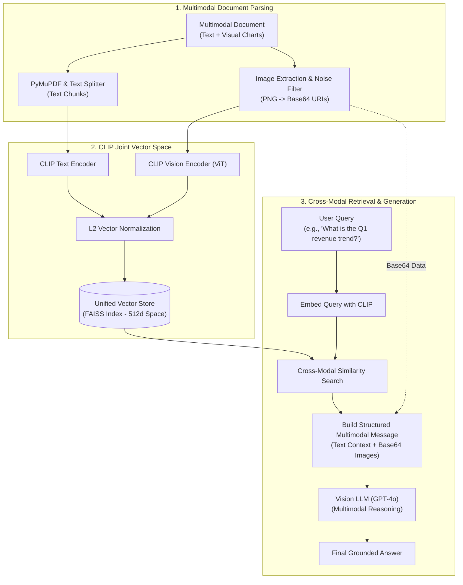

# Production RAG & Agentic AI — Study Notes (Krish Naik)

> **Source of Truth.** Do not remove content. All theory, code, examples, and version notes are intentional.
>
> Detailed notes on LangChain v1.1 updates: [langchain_updates.1.1.md](https://github.com/Shivanshvyas1729/Krish_naik_rag_notes/blob/main/langchain_updates.1.1.md)

---

## 🚀 Complete Industry-Level End-to-End Reference Implementations

<details>
<summary><b>📘 1. Complete Industry-Level Non-Agentic RAG Pipeline (Hybrid Search + Cross-Encoder Reranking + LCEL + Session Memory)</b></summary>

### Overview: What This Architecture Solves
This is an enterprise-grade, deterministic, non-agentic RAG pipeline. It eliminates the 4 most common failure modes of naive RAG:
1. **Keyword Blindness:** Uses **Hybrid Search (Dense FAISS + Sparse BM25)** via `EnsembleRetriever` with Reciprocal Rank Fusion (RRF) so exact terms, product codes, and acronyms are never missed.
2. **False Semantic Relevance:** Employs a **2-Stage Retrieval with Cross-Encoder Re-Ranking**, retrieving top-15 candidates and scoring them deeply down to the top-3 most relevant chunks.
3. **Conversational Drift:** Integrates a **Query Reformulation Step** that resolves ambiguous follow-up pronouns into self-contained search queries.
4. **Multi-Tenant State Leakage:** Encapsulates conversational memory into isolated, thread-safe session stores using `RunnableWithMessageHistory`.

```python
import os
from operator import itemgetter
from dotenv import load_dotenv

from langchain_core.documents import Document
from langchain_text_splitters import RecursiveCharacterTextSplitter
from langchain_community.vectorstores import FAISS
from langchain_community.retrievers import BM25Retriever
from langchain.retrievers import EnsembleRetriever
from langchain.retrievers import ContextualCompressionRetriever
from langchain.retrievers.document_compressors import CrossEncoderReranker
from langchain_community.cross_encoders import HuggingFaceCrossEncoder
from langchain_core.prompts import ChatPromptTemplate, MessagesPlaceholder
from langchain_core.runnables import RunnablePassthrough, RunnableLambda
from langchain_core.output_parsers import StrOutputParser
from langchain_community.chat_message_histories import ChatMessageHistory
from langchain_core.chat_history import BaseChatMessageHistory
from langchain_core.runnables.history import RunnableWithMessageHistory
from langchain.chat_models import init_chat_model
from langchain_openai import OpenAIEmbeddings

load_dotenv()

# ==============================================================================
# 1. DOCUMENT INGESTION & SEMANTIC CHUNKING
# ==============================================================================
raw_corpus = [
    Document(
        page_content="Policy SEC-402: Multi-Factor Authentication (MFA) is strictly mandatory for all production database access. Hardware security keys (FIDO2/WebAuthn) or time-based OTP applications (e.g., Google Authenticator) must be used. SMS-based authentication is explicitly forbidden due to SIM-swapping attack vectors.",
        metadata={"source": "security_handbook.pdf", "section": "SEC-402", "author": "Infosec Team"}
    ),
    Document(
        page_content="Policy SEC-403: Production database credentials must rotate automatically every 30 days via HashiCorp Vault. Hardcoding database passwords in environment variables or configuration files results in immediate access revocation.",
        metadata={"source": "security_handbook.pdf", "section": "SEC-403", "author": "DevOps Team"}
    ),
    Document(
        page_content="Incident Response Protocol IR-12: Any unauthorized access alert from AWS GuardDuty or Datadog must trigger an automated P1 incident ticket in PagerDuty within 60 seconds, paging the on-call Site Reliability Engineer.",
        metadata={"source": "incident_playbook.pdf", "section": "IR-12", "author": "SRE Team"}
    )
]

# Split text with hierarchical separators while preserving exact boundaries and metadata
text_splitter = RecursiveCharacterTextSplitter(
    chunk_size=200,
    chunk_overlap=30,
    separators=["\n\n", "\n", ". ", " "]
)
chunked_docs = text_splitter.split_documents(raw_corpus)

# ==============================================================================
# 2. HYBRID SEARCH: DENSE VECTOR (FAISS) + SPARSE KEYWORD (BM25)
# ==============================================================================
embeddings = OpenAIEmbeddings(model="text-embedding-3-small")

# A. Dense Semantic Vector Store
vector_store = FAISS.from_documents(chunked_docs, embeddings)
dense_retriever = vector_store.as_retriever(search_kwargs={"k": 10})

# B. Sparse Lexical Keyword Retriever (Guarantees exact matching for codes like SEC-402, IR-12)
sparse_retriever = BM25Retriever.from_documents(chunked_docs)
sparse_retriever.k = 10

# C. Ensemble Retriever: Reciprocal Rank Fusion (RRF) with balanced weights
hybrid_retriever = EnsembleRetriever(
    retrievers=[dense_retriever, sparse_retriever],
    weights=[0.5, 0.5]
)

# ==============================================================================
# 3. TWO-STAGE RETRIEVAL: CROSS-ENCODER RE-RANKING
# ==============================================================================
# Cross-encoder joint-attends to (query, document) pairs simultaneously to calculate true semantic relevance
rerank_model = HuggingFaceCrossEncoder(model_name="BAAI/bge-reranker-base")
compressor = CrossEncoderReranker(model=rerank_model, top_n=2)

two_stage_retriever = ContextualCompressionRetriever(
    base_compressor=compressor,
    base_retriever=hybrid_retriever
)

# ==============================================================================
# 4. QUERY REFORMULATION & CONVERSATIONAL GROUNDING
# ==============================================================================
llm = init_chat_model("gpt-4o-mini", temperature=0.0)

# Helper to format retrieved chunks with provenance citations
def format_docs_with_citations(docs):
    formatted = []
    for idx, doc in enumerate(docs, 1):
        source = doc.metadata.get("source", "Unknown")
        section = doc.metadata.get("section", "N/A")
        formatted.append(f"[{idx}] (Source: {source} | Section: {section})\n{doc.page_content}")
    return "\n\n".join(formatted)

# A. Query Contextualizer: Resolves pronouns ('it', 'these policies') using chat history
rephrase_prompt = ChatPromptTemplate.from_messages([
    ("system", "Given a chat history and the latest user question which might reference context in the chat history, formulate a standalone question which can be understood without the chat history. Do NOT answer the question, just reformulate it if needed and otherwise return it as is."),
    MessagesPlaceholder(variable_name="history"),
    ("human", "{question}")
])
rephrase_chain = rephrase_prompt | llm | StrOutputParser()

def contextualized_query(input_dict):
    if input_dict.get("history"):
        return rephrase_chain.invoke(input_dict)
    return input_dict["question"]

# B. Main RAG Generation Prompt with Strict Guardrails
qa_prompt = ChatPromptTemplate.from_messages([
    ("system", """You are a senior enterprise security compliance assistant. 
Answer the question based STRICTLY and ONLY on the provided context chunks.
Rules:
1. Cite the source document and section code using bracket format (e.g. [SEC-402]).
2. If the answer cannot be verified from the context, state: 'The provided documentation does not contain this information.' Do NOT extrapolate.

Context:
{context}"""),
    MessagesPlaceholder(variable_name="history"),
    ("human", "{question}")
])

# ==============================================================================
# 5. LCEL COMPOSITION & CONVERSATIONAL MEMORY
# ==============================================================================
rag_chain = (
    RunnablePassthrough.assign(
        standalone_query=RunnableLambda(contextualized_query)
    ).assign(
        context=lambda x: format_docs_with_citations(two_stage_retriever.invoke(x["standalone_query"]))
    )
    | qa_prompt
    | llm
    | StrOutputParser()
)

# Session Memory Store (In production: swap with RedisChatMessageHistory or DynamoDBChatMessageHistory)
session_storage = {}

def get_session_history(session_id: str) -> BaseChatMessageHistory:
    if session_id not in session_storage:
        session_storage[session_id] = ChatMessageHistory()
    return session_storage[session_id]

conversational_rag = RunnableWithMessageHistory(
    rag_chain,
    get_session_history,
    input_messages_key="question",
    history_messages_key="history"
)

# ==============================================================================
# 6. END-TO-END EXECUTION DEMONSTRATION
# ==============================================================================
config = {"configurable": {"session_id": "auditor_session_001"}}

print("--- Turn 1: Primary Fact Retrieval ---")
q1 = "Can developers use SMS verification to access the production database?"
ans1 = conversational_rag.invoke({"question": q1}, config=config)
print(f"Q: {q1}\nA: {ans1}\n")

print("--- Turn 2: Conversational Multi-Turn Follow-Up (Resolves 'What about passwords?') ---")
q2 = "What about their passwords? How often must they change?"
ans2 = conversational_rag.invoke({"question": q2}, config=config)
print(f"Q: {q2}\nA: {ans2}\n")
```

</details>

<details>
<summary><b>🤖 2. Complete Industry-Level Agentic RAG System (LangGraph + Hybrid Vector & Vectorless RAG + Self-Correction + Memory)</b></summary>

### Overview: What This Agentic System Solves
Unlike a rigid pipeline, this **Autonomous Agentic RAG System** dynamically inspects the query and chooses the right retrieval paradigm:
1. **Unstructured Vector Search:** Hybrid retrieval (Dense + BM25) for unstructured knowledge bases and policy docs.
2. **Vectorless RAG (Exact Deterministic Lookups):** Crucial enterprise capability. Real enterprise applications have structured databases (SQL, Redis, customer records, inventory tables). Querying numeric IDs, inventory stocks, or financial balances via vector similarity causes semantic drift and hallucinations. **Vectorless RAG** provides exact, deterministic schema lookups without vector embeddings.
3. **Live Web Search / External APIs:** Routes queries requiring fresh external facts to live tools.
4. **Self-Correction (Corrective RAG / CRAG):** The agent inspects retrieved documents:
   - If documents are irrelevant or missing, it rewrites the query and falls back to alternate sources (e.g. web search).
   - Verifies the final response against hallucinations before presenting it to the user.
5. **Stateful Checkpointing:** Full cyclic conversation state and tool traces are preserved via `MemorySaver`.

```python
import os
import json
from typing import Annotated, Sequence, TypedDict, Literal
from dotenv import load_dotenv

from langchain_core.messages import BaseMessage, HumanMessage, AIMessage, ToolMessage, SystemMessage
from langchain_core.tools import tool
from langchain_core.documents import Document
from langchain_community.vectorstores import InMemoryVectorStore
from langchain_openai import OpenAIEmbeddings, ChatOpenAI
from langgraph.graph import StateGraph, END, START
from langgraph.graph.message import add_messages
from langgraph.checkpoint.memory import MemorySaver

load_dotenv()

# ==============================================================================
# 1. TOOL 1: UNSTRUCTURED HYBRID RETRIEVER (Policy & Document Knowledge)
# ==============================================================================
embeddings = OpenAIEmbeddings(model="text-embedding-3-small")
doc_store = InMemoryVectorStore.from_documents([
    Document(page_content="Return Policy: Items can be returned within 30 days of purchase with original receipt. Opened software and customized electronics are non-refundable.", metadata={"topic": "returns"}),
    Document(page_content="Shipping Policy: Standard shipping takes 3-5 business days. Overnight shipping is available for an additional fee of $25.", metadata={"topic": "shipping"})
], embeddings)
vector_retriever = doc_store.as_retriever(search_kwargs={"k": 2})

@tool
def search_knowledge_base(query: str) -> str:
    """Search unstructured corporate knowledge base, return policies, and shipping rules."""
    docs = vector_retriever.invoke(query)
    return "\n\n".join(f"- {d.page_content}" for d in docs)

# ==============================================================================
# 2. TOOL 2: VECTORLESS RAG (Exact Deterministic SQL / KV Lookup Without Embeddings)
# ==============================================================================
# Vectorless RAG retrieves exact structured records, database rows, key-value stores,
# or system states using deterministic lookups (SQL, metadata query, or entity IDs)
# WITHOUT semantic vector embeddings. It completely eliminates semantic fuzzy matching
# failures and hallucinations for exact numbers, dates, SKU codes, pricing tables, or user accounts.
MOCK_SQL_DATABASE = {
    "ORD-9912": {"status": "Shipped", "item": "Ergonomic Desk", "tracking": "TRK-88231", "delivery_date": "2026-10-12"},
    "ORD-5541": {"status": "Processing", "item": "Mechanical Keyboard", "tracking": "Pending", "delivery_date": "2026-10-16"},
    "SKU-7721": {"name": "4K Ultra-Sharp Monitor", "stock": 42, "warehouse": "Austin-Central", "price": 499.00}
}

@tool
def query_vectorless_database(entity_id: str) -> str:
    """VECTORLESS RAG TOOL: Query structured enterprise records (order status, SKU inventory, exact pricing)
    directly by exact ID without vector embeddings. Guarantees 100% deterministic accuracy for numbers and status codes."""
    clean_id = entity_id.strip().upper()
    record = MOCK_SQL_DATABASE.get(clean_id)
    if record:
        return json.dumps(record, indent=2)
    return f"Record not found for ID: '{entity_id}'. Available test IDs: ORD-9912, ORD-5541, SKU-7721."

# ==============================================================================
# 3. TOOL 3: LIVE EXTERNAL SEARCH & DETERMINISTIC CALCULATION
# ==============================================================================
@tool
def live_web_search(query: str) -> str:
    """Search the public web for real-time external information, weather, or current market events."""
    return f"Simulated live web search result for '{query}': Current cloud outage status shows 99.99% uptime across all major US regions."

@tool
def execute_calculator(expression: str) -> str:
    """Perform exact deterministic arithmetic operations safely without LLM calculation errors."""
    try:
        # Safe eval restricted strictly to math literals
        allowed_chars = set("0123456789+-*/(). ")
        if not all(c in allowed_chars for c in expression):
            return "Error: Invalid characters in arithmetic expression."
        return str(eval(expression))
    except Exception as e:
        return f"Calculation error: {str(e)}"

tools = [search_knowledge_base, query_vectorless_database, live_web_search, execute_calculator]
tools_by_name = {t.name: t for t in tools}

# ==============================================================================
# 4. LANGGRAPH AGENT STATE & SELF-REFLECTIVE ARCHITECTURE
# ==============================================================================
class AgentState(TypedDict):
    messages: Annotated[Sequence[BaseMessage], add_messages]
    retrieved_content: str
    relevance_verdict: str  # 'relevant' | 'irrelevant'
    retry_count: int

model = ChatOpenAI(model="gpt-4o-mini", temperature=0.0).bind_tools(tools)

# Node A: Reasoner (decides whether to call tools or provide final answer)
def reasoner_node(state: AgentState):
    response = model.invoke(state["messages"])
    return {"messages": [response]}

# Node B: Tool Executor
def tool_node(state: AgentState):
    last_message = state["messages"][-1]
    tool_messages = []
    retrieved_texts = []
    for tool_call in last_message.tool_calls:
        tool_func = tools_by_name[tool_call["name"]]
        output = tool_func.invoke(tool_call["args"])
        tool_messages.append(ToolMessage(content=str(output), tool_call_id=tool_call["id"]))
        retrieved_texts.append(str(output))
    return {
        "messages": tool_messages,
        "retrieved_content": "\n---\n".join(retrieved_texts)
    }

# Node C: Document Relevance Evaluator (Corrective RAG Guard)
def relevance_evaluator_node(state: AgentState):
    eval_model = ChatOpenAI(model="gpt-4o-mini", temperature=0.0)
    user_query = state["messages"][0].content
    retrieved = state.get("retrieved_content", "")
    
    prompt = f"""You are a strict grading evaluator. Determine whether the retrieved content contains information relevant to the user's question.
Question: {user_query}
Retrieved Content: {retrieved}

Respond with EXACTLY 'relevant' if the content helps answer the question, or 'irrelevant' if it does not."""
    res = eval_model.invoke(prompt).content.strip().lower()
    verdict = "relevant" if "relevant" in res else "irrelevant"
    return {"relevance_verdict": verdict}

# Node D: Query Reformulator (Triggered when retrieved documents fail relevance check)
def rewrite_query_node(state: AgentState):
    rewrite_model = ChatOpenAI(model="gpt-4o-mini", temperature=0.3)
    user_query = state["messages"][0].content
    new_query = rewrite_model.invoke(
        f"The previous search for '{user_query}' yielded irrelevant results. Provide an improved, expanded search query."
    ).content
    current_retries = state.get("retry_count", 0) + 1
    return {
        "messages": [HumanMessage(content=f"Searching with refined query: {new_query}")],
        "retry_count": current_retries
    }

# ==============================================================================
# 5. CONDITIONAL ROUTING LOGIC
# ==============================================================================
def should_continue(state: AgentState) -> Literal["tools", "evaluator", "__end__"]:
    last_message = state["messages"][-1]
    if hasattr(last_message, "tool_calls") and last_message.tool_calls:
        return "tools"
    return "__end__"

def route_after_eval(state: AgentState) -> Literal["rewrite", "reasoner", "__end__"]:
    if state.get("relevance_verdict") == "irrelevant" and state.get("retry_count", 0) < 1:
        return "rewrite"
    return "reasoner"

# ==============================================================================
# 6. GRAPH CONSTRUCTION & COMPILE
# ==============================================================================
workflow = StateGraph(AgentState)

workflow.add_node("reasoner", reasoner_node)
workflow.add_node("tools", tool_node)
workflow.add_node("evaluator", relevance_evaluator_node)
workflow.add_node("rewrite", rewrite_query_node)

workflow.add_edge(START, "reasoner")
workflow.add_conditional_edges("reasoner", should_continue, {
    "tools": "tools",
    "__end__": END
})
workflow.add_edge("tools", "evaluator")
workflow.add_conditional_edges("evaluator", route_after_eval, {
    "rewrite": "rewrite",
    "reasoner": "reasoner"
})
workflow.add_edge("rewrite", "reasoner")

# Compile with thread checkpoint memory
checkpointer = MemorySaver()
agent_app = workflow.compile(checkpointer=checkpointer)

# ==============================================================================
# 7. MULTI-SCENARIO EXECUTION DEMONSTRATION
# ==============================================================================
thread_cfg = {"configurable": {"thread_id": "customer_support_thread_42"}}

print("--- Scenario 1: Unstructured Policy Retrieval (Calls Vector Store) ---")
res1 = agent_app.invoke(
    {"messages": [HumanMessage(content="What is the return window for items and are opened software items refundable?")]},
    config=thread_cfg
)
print("Agent Response:\n", res1["messages"][-1].content)

print("\n--- Scenario 2: VECTORLESS RAG (Deterministic SQL Order Lookup By Exact ID) ---")
res2 = agent_app.invoke(
    {"messages": [HumanMessage(content="Can you check the delivery date and status of my order ORD-9912?")]},
    config=thread_cfg
)
print("Agent Response:\n", res2["messages"][-1].content)

print("\n--- Scenario 3: Mathematical Calculation & Memory Continuity ---")
res3 = agent_app.invoke(
    {"messages": [HumanMessage(content="If I have 3 monitors of SKU-7721, what is the total price before tax?")]},
    config=thread_cfg
)
print("Agent Response:\n", res3["messages"][-1].content)
```

</details>

---

## Pipeline Roadmap

How a production RAG & Agentic AI project flows end-to-end. Click any link to jump to that section.

| Phase | Name | What It Covers | Jump To |
| :---: | :--- | :--- | :--- |
| **1** | LangChain Architecture & Core Engine | Architecture & SDKs, Chat Models vs LLMs, Prompt Templates & Engineering, Output Parsers, Structured Output, LCEL & Runnables, Memory & Session Handling, Function Calling | [Phase 1](#topic-1-langchain-v11) |
| **2** | RAG Fundamentals & Document Ingestion | Ingestion pipeline, 10 chunking strategies (Fixed, Sentence, Paragraph, Recursive, Structure, Sliding, Token, Agentic, Hybrid), business impact | [Phase 2](#topic-2-rag) |
| **3** | Semantic Chunking | Meaning-aware splitting via sentence embedding distance spikes and similarity threshold breakpoints | [Phase 3](#topic-5-semantic-chunking) |
| **4** | Vector Storage | Vector Stores vs Vector DBs, ChromaDB, FAISS, InMemory, Pinecone, AstraDB, Qdrant, distance metrics | [Phase 4](#topic-4-vector-db) |
| **5** | Pre-Retrieval Query Transformation | Query Expansion (LLM synonyms), Query Decomposition (multi-hop), HyDE (hypothetical doc embeddings) | [Query Expansion](#topic-9-query-expansion) · [Decomposition](#topic-10-query-decomposition) · [HyDE](#topic-11-hyde) |
| **6** | Advanced Retrieval & Ranking | Hybrid Search (Dense + BM25, RRF & RSF Fusion), Cross-Encoder Re-ranking, MMR, Parent Document Retrieval (Small-to-Big) | [Hybrid Search](#topic-6-hybrid-search) · [Re-ranking](#topic-7-reranking) · [MMR](#topic-8-mmr) · [Parent Document](#topic-parent-retrieval) |
| **7** | RAG Chain Construction & Memory | LCEL RAG chains, conversational memory with `create_history_aware_retriever`, pre-built chains | [Phase 7](#topic-7-rag-chains) |
| **7.1** | `format_docs` Decision Guide | When to use vs. when NOT to use `format_docs` (LCEL vs. pre-built helpers) | [format_docs Guide](#format-docs-deep-dive) |
| **8** | Fine-Tuning vs RAG | Decision matrix: knowledge freshness, hallucination reduction, cost | [Phase 8](#topic-3-finetuning-vs-rag) |
| **9** | Multimodal RAG | OCR vs. Visual-Native (ColPali), CLIP joint embedding, GPT-4o Vision | [Multimodal AI](#topic-12-multimodal-ai) · [Architecture](#topic-13-multimodal-rag-architecture) |
| **10** | Agentic AI Systems | AI Agents vs Agentic AI, human-in-the-loop, memory compression | [Phase 10](#topic-14-agentic-ai) |
| **11** | Agentic SDLC Case Study | Autonomous software development lifecycle, TDD, self-debugging, Git automation | [Phase 11](#topic-15-agentic-sdlc) |

---

## Topic Index

1. [Phase 1 — LangChain Architecture, Models, Prompts, LCEL, Parsers & Memory](#topic-1-langchain-v11)
   - [1.1 LangChain Architecture & Package Ecosystem Stack](#langchain-architecture)
   - [1.2 Models vs. Chat Models & Universal SDK Initializers (`init_chat_model`, `ChatOpenAI`, etc.)](#models-and-chat-models)
   - [1.3 Prompt Templates & Prompt Engineering in LangChain](#prompts-and-engineering)
   - [1.4 Tool Anatomy, Schemas & Function Calling](#tools-and-function-calling)
   - [1.5 Canonical Message State & Token Tracking](#canonical-messages)
   - [1.6 Output Parsers & Enforced Schema Structured Outputs](#output-parsers-and-structured-output)
   - [1.7 Chains, LCEL & The Runnable Protocol](#lcel-and-runnables)
   - [1.8 Memory, Chat History, Conversation Management & Session Handling](#memory-and-sessions)
   - [1.9 Stateful Middleware & Human-in-the-Loop](#middleware-and-hitl)
2. [Phase 2 — RAG: Fundamentals & 10 Chunking Strategies](#topic-2-rag)
3. [Phase 3 — Semantic Chunking](#topic-5-semantic-chunking)
4. [Phase 4 — Vector Stores & Vector Databases](#topic-4-vector-db)
5. [Phase 5 — Pre-Retrieval Query Transformation](#topic-9-query-expansion)
   - [5.1 Query Expansion](#topic-9-query-expansion)
   - [5.2 Query Decomposition](#topic-10-query-decomposition)
   - [5.3 HyDE — Hypothetical Document Embeddings](#topic-11-hyde)
6. [Phase 6 — Advanced Retrieval & Precision Ranking](#topic-6-hybrid-search)
   - [6.1 Hybrid Search (Dense + Sparse Retrieval, BM25, RRF & RSF Fusion)](#topic-6-hybrid-search)
   - [6.2 Re-ranking (Cross-Encoder)](#topic-7-reranking)
   - [6.3 MMR — Maximal Marginal Relevance](#topic-8-mmr)
   - [6.4 Parent Document Retrieval (Small-to-Big Hierarchical Search)](#topic-parent-retrieval)
7. [Phase 7 — RAG Chains, Conversational Memory & format_docs Guide](#topic-7-rag-chains)
   - [7.1 LCEL Custom RAG Pipelines & Conversational Chains](#chroma-rag-chains)
   - [7.2 format_docs Deep-Dive: When to Use vs. When NOT to Use](#format-docs-deep-dive)
8. [Phase 8 — Fine-Tuning vs RAG — Strategic Decision Framework](#topic-3-finetuning-vs-rag)
9. [Phase 9 — Multimodal AI & Vision-Native RAG](#topic-12-multimodal-ai)
   - [9.1 Multimodal AI (Classic OCR vs. Visual-Native ColPali)](#topic-12-multimodal-ai)
   - [9.2 Multimodal RAG Architecture (CLIP Joint Embedding)](#topic-13-multimodal-rag-architecture)
10. [Phase 10 — AI Agents vs. Agentic AI](#topic-14-agentic-ai)
11. [Phase 11 — Agentic SDLC Case Study](#topic-15-agentic-sdlc)

---

<details><summary><a id="topic-1-langchain-v11" name="topic-1-langchain-v11"></a>Phase 1 — LangChain Architecture, Models, Prompts, LCEL, Parsers & Memory</summary>

# LangChain Architecture, Models, Prompts, LCEL, Parsers & Memory

This module serves as the **definitive production-grade guide** for modern **LangChain v1.1/1.x** and **LangGraph**. It unifies core component abstractions, execution models, declarative LCEL pipelines, memory management, and agent graph runtimes into structured chapters.

---

## 📋 Chapter Index

| Chapter | Component & Topic | Core Concepts & Key APIs |
| :--- | :--- | :--- |
| **1.1** | [LangChain Architecture & Ecosystem Stack](#langchain-architecture) | The 4 architectural layers: `langchain-core`, `langchain`, `langchain-community`, Partner packages, `langgraph`, `langsmith` |
| **1.2** | [Agent Foundations](#agent-foundations) | `create_agent()`, `@tool`, `agent.invoke()`, LangGraph cyclic execution engine |
| **1.3** | [Models, Chat Models & Universal SDK Initializers](#models-and-chat-models) | `init_chat_model()`, `ChatOpenAI()` (OpenAI-compatible endpoints: Gemini, Groq, DeepSeek, Ollama), `AIMessage` anatomy, `usage_metadata`, `response_metadata`, `invoke()`, `stream()`, `batch()`, `temperature`, `top_p`, `max_tokens` |
| **1.4** | [Prompt Templates & Prompt Engineering](#prompts-and-engineering) | `PromptTemplate`, `ChatPromptTemplate.from_messages()`, `MessagesPlaceholder`, `.partial()`, `FewShotChatMessagePromptTemplate`, CoT patterns |
| **1.5** | [Tool Anatomy, Schemas & Function Calling](#tools-and-function-calling) | `@tool`, `model.bind_tools()`, `tool_choice`, `ai_msg.tool_calls`, `ToolMessage`, parallel tool calling |
| **1.6** | [Canonical Message State & Token Tracking](#canonical-messages) | `SystemMessage`, `HumanMessage`, `AIMessage`, `ToolMessage`, `usage_metadata` |
| **1.7** | [Output Parsers & Enforced Schema Structured Outputs](#output-parsers-and-structured-output) | `StrOutputParser()`, `JsonOutputParser()`, `PydanticOutputParser()`, `model.with_structured_output()`, Pydantic v2, `TypedDict`, `@dataclass` |
| **1.8** | [Chains, LCEL & The Runnable Protocol](#lcel-and-runnables) | Declarative pipe `\|`, `RunnablePassthrough` & `.assign()`, `RunnableParallel`, `RunnableLambda`, `RunnableBranch`, `RunnableConfig` |
| **1.9** | [Memory, Chat History, Conversation & Session Handling](#memory-and-sessions) | `ChatMessageHistory`, `RunnableWithMessageHistory` (`session_id`), `trim_messages()`, LangGraph `InMemorySaver` (`thread_id`), `create_history_aware_retriever` |
| **1.10** | [Stateful Middleware & Human-in-the-Loop](#middleware-and-hitl) | `SummarizationMiddleware`, `HumanInTheLoopMiddleware`, `InMemorySaver`, `Command` |

---

## 1.1 LangChain Architecture & Ecosystem Stack <a id="langchain-architecture" name="langchain-architecture"></a>

Modern LangChain is decoupled into a modular, multi-tier architectural stack to eliminate dependency bloat and guarantee enterprise reliability.

```
┌────────────────────────────────────────────────────────┐
│                      LangSmith                         │  (Observability, Tracing, Eval, Telemetry)
└──────────────────────────┬─────────────────────────────┘
                           │
┌──────────────────────────▼─────────────────────────────┐
│                      LangGraph                         │  (Stateful Cyclical Graphs, Checkpointing, Multi-Agent)
└──────────────────────────┬─────────────────────────────┘
                           │
┌──────────────────────────▼─────────────────────────────┐
│                      LangChain                         │  (High-Level Chains, Retrieval Algorithms, Pre-built Agents)
└──────────┬───────────────────────────────┬─────────────┘
           │                               │
┌──────────▼──────────────┐   ┌────────────▼─────────────┐
│   langchain-community   │   │     Partner Packages     │  (langchain-openai, langchain-groq, langchain-chroma, etc.)
└──────────┬──────────────┘   └────────────┬─────────────┘
           │                               │
┌──────────▼───────────────────────────────▼─────────────┐
│                    langchain-core                      │  (Runnables, LCEL, Messages, Base Types, Document)
└────────────────────────────────────────────────────────┘
```

### The 5 Architectural Layers

1. **`langchain-core`**: The foundational bedrock. Contains base interfaces (`BaseChatModel`, `PromptTemplate`, `BaseMessage`, `Document`, `BaseRetriever`), the Runnable protocol, and the LCEL pipe compiler. Has zero bloated dependencies.
2. **`langchain`**: The main orchestration library. Houses general cognitive architecture patterns, pre-built RAG chains (`create_retrieval_chain`, `create_history_aware_retriever`, `ParentDocumentRetriever`), and agent factories.
3. **`langchain-community` & Partner Packages**:
   - `langchain-community`: Community-contributed third-party integrations.
   - Dedicated Partner Packages (`langchain-openai`, `langchain-groq`, `langchain-anthropic`, `langchain-google-genai`, `langchain-chroma`, `langchain-pinecone`): Lightweight, first-party maintained wrappers optimized for specific model providers and vector databases.
4. **`langgraph`**: The stateful execution engine. Replaces legacy execution loops with cyclical graphs, persistent checkpointers, and multi-agent coordination.
5. **`langsmith`**: Production observability platform for distributed tracing, token accounting, latency analysis, and LLM evaluation.

---

## 1.2 Agent Foundations (`1-langchainintro.ipynb`) <a id="agent-foundations" name="agent-foundations"></a>

**Definition:** An AI Agent uses an LLM as a central reasoning engine to decide which tools to call, what arguments to extract, and how to sequence actions to satisfy a request.

<details>
<summary><b>⚠️ Obsolete / Deprecated Architecture: AgentExecutor (Legacy While-Loop Engine)</b></summary>

#### What It Does
`AgentExecutor` was LangChain's original (v0.1–v0.2) agent execution engine. It ran a hardcoded Python `while` loop that invoked an LLM, parsed text actions with regex, executed the corresponding Python function, appended the result to a scratchpad string, and repeated until reaching an end condition or iteration limit (`max_iterations`).

#### When to Use
- Only when maintaining legacy codebases pinned to `langchain < 0.2.0` that have not yet migrated to modern graph runtimes.

#### When NOT to Use (Production Reality & Modern Alternatives)
- **Do not use in new production systems:** `AgentExecutor` was deprecated in LangChain v0.3. It lacks streaming intermediate node outputs, cannot handle human-in-the-loop approvals or time-travel debugging, struggles with cyclical multi-agent workflows, and fails silently on malformed tool calls.
- **Modern Alternative:** In LangChain v0.3+, always use `create_agent` from `langchain.agents` or `create_react_agent` from `langgraph.prebuilt`. These run on top of LangGraph's durable, checkpointed state machine engine with native tool error recovery.

#### Code & Example (Legacy Pattern for Migration Reference)
```python
# ⚠️ DEPRECATED SYNTAX (For migration reference only)
from langchain.agents import AgentExecutor, create_tool_calling_agent
from langchain_core.prompts import ChatPromptTemplate
from langchain_core.tools import tool
from langchain.chat_models import init_chat_model

@tool
def get_weather(city: str) -> str:
    """Get current weather for a specified city."""
    return f"The weather in {city} is sunny."

llm = init_chat_model("gpt-4o-mini")
prompt = ChatPromptTemplate.from_messages([
    ("system", "You are a helpful assistant."),
    ("human", "{input}"),
    ("placeholder", "{agent_scratchpad}"),
])
agent = create_tool_calling_agent(llm, [get_weather], prompt)

# Legacy executor with manual loop parameters
executor = AgentExecutor(agent=agent, tools=[get_weather], verbose=True, max_iterations=5)
response = executor.invoke({"input": "What is the weather in Boston?"})
print(response["output"])
```

</details>

**Legacy vs. Current Architecture:**

| | Legacy (`AgentExecutor`) | Current (`create_agent`) |
| :--- | :--- | :--- |
| Execution | Manual Python loops | LangGraph stateful graph engine |
| Memory state | Manual state passing | Automatic persistence via `InMemorySaver` |
| Error recovery | Manual try/except | Built-in tool execution error recovery |

```python
from langchain.agents import create_agent
from langchain_core.tools import tool

@tool
def get_weather(city: str) -> str:
    """Get current weather for a specified city."""
    return f"The weather in {city} is sunny."

agent = create_agent(
    model="gpt-4o-mini",
    tools=[get_weather],
    system_prompt="You are a helpful assistant."
)

# Accepts messages in OpenAI or LangChain format
response = agent.invoke({"messages": [{"role": "user", "content": "What is the weather in New York?"}]})
print(response["messages"][-1].content)
```

---

## 1.3 Models, Chat Models & Universal SDK Initializers (`2-modelintegration.ipynb`) <a id="models-and-chat-models" name="models-and-chat-models"></a>

### Text LLMs vs. Chat Models

| Dimension | Legacy Text LLMs (`LLM`) | Modern Chat Models (`BaseChatModel`) |
| :--- | :--- | :--- |
| **Input / Output** | `str` $\to$ `str` | `list[BaseMessage]` $\to$ `AIMessage` |
| **API Architecture** | Legacy completion endpoints (`/v1/completions`) | Chat completion endpoints (`/v1/chat/completions`) |
| **Capabilities** | Plain text generation | System personas, multimodal inputs, function/tool calling, structured outputs |
| **LangChain Base Class** | `langchain_core.language_models.llms.LLM` | `langchain_core.language_models.chat_models.BaseChatModel` |

<details>
<summary><b>⚠️ Obsolete / Deprecated Architecture: Legacy Text Completion LLMs (LLM Base Class)</b></summary>

#### What It Does
Legacy Text LLMs (e.g. `from langchain_openai import OpenAI`) connect to raw text completion endpoints (`/v1/completions`). They accept a single unstructured string prompt and return a raw continuation string (`str -> str`) with no structural awareness of speaker turns (`system`, `user`, `assistant`).

#### When to Use
- Maintaining vintage pre-2023 codebases or connecting to base foundational models that were never fine-tuned for conversation or chat instruct formats.

#### When NOT to Use (Production Reality)
- **Do not use in modern RAG or Agentic systems.** 100% of modern LLMs (GPT-4o, Claude 3.5 Sonnet, Gemini 1.5/2.5, DeepSeek-V3) are Chat Models (`BaseChatModel`). Chat models support system steering guardrails, multi-turn conversational context, JSON Schema constrained decoding, and native parallel tool calling. Raw text LLMs cannot process structured messages or execute function calls.

#### Code Example
```python
# ❌ DEPRECATED APPROACH (Legacy raw text completion):
# from langchain_openai import OpenAI
# legacy_model = OpenAI(model="gpt-3.5-turbo-instruct")
# text_response = legacy_model.invoke("Write a poem about AI.")

# ✅ MODERN STANDARD (Chat model with BaseMessage input & AIMessage output):
from langchain_openai import ChatOpenAI
chat_model = ChatOpenAI(model="gpt-4o-mini", temperature=0.0)
ai_msg = chat_model.invoke("Explain vector embeddings.")
print("Response Text:", ai_msg.content)
```

</details>

---

### Universal Model Initialization (`init_chat_model`)

Instead of hardcoding provider classes, `init_chat_model()` instantiates any LLM via string identifiers. Migrating from OpenAI to Groq or Gemini requires only changing a string:

```python
from langchain.chat_models import init_chat_model

# 1. Universal Factory (Recommended Standard)
model_openai = init_chat_model("gpt-4o-mini", temperature=0.0)
model_groq   = init_chat_model("groq:llama-3.3-70b-versatile", temperature=0.1)
model_gemini = init_chat_model("google_genai:gemini-1.5-flash", temperature=0.2)
model_claude = init_chat_model("anthropic:claude-3-5-sonnet-latest", temperature=0.0)
```

### Dedicated Partner SDK Classes

```python
# 2. Partner SDK Direct Initialization
from langchain_openai import ChatOpenAI
from langchain_groq import ChatGroq
from langchain_google_genai import ChatGoogleGenerativeAI
from langchain_anthropic import ChatAnthropic

chat_openai = ChatOpenAI(
    model="gpt-4o-mini",
    temperature=0.0,
    max_tokens=2000,
    timeout=30,
    max_retries=3,
    api_key="sk-...",               # Defaults to os.getenv("OPENAI_API_KEY")
    base_url="https://api.openai.com/v1"  # Customizable for Euron / vLLM / Ollama
)

chat_groq = ChatGroq(model="llama-3.3-70b-versatile", temperature=0.2)
chat_gemini = ChatGoogleGenerativeAI(model="gemini-1.5-flash")
chat_claude = ChatAnthropic(model="claude-3-5-sonnet-20241022")
```

### Connecting Multiple Providers via `ChatOpenAI` (OpenAI-Compatible Endpoints)

Because `langchain_openai.ChatOpenAI` strictly complies with the OpenAI REST API specification (`/v1/chat/completions`), it functions as a **universal client** to connect with any model provider or local server that exposes an OpenAI-compatible endpoint.

By passing `base_url`, `api_key`, and `model`, you can communicate with Google Gemini, Groq, DeepSeek, or local LLMs (Ollama / vLLM) directly through `ChatOpenAI` without needing provider-specific SDKs:

#### 1. Google Gemini via OpenAI-Compatible Endpoint
Google provides an official OpenAI-compatible endpoint for Gemini models:

```python
from langchain_openai import ChatOpenAI

gemini_chat = ChatOpenAI(
    model="gemini-2.5-flash",  # Or another supported Gemini model (e.g., gemini-1.5-flash, gemini-2.5-pro)
    api_key="YOUR_GEMINI_API_KEY",  # Or os.getenv("GEMINI_API_KEY")
    base_url="https://generativelanguage.googleapis.com/v1beta/openai/",
    temperature=0.0
)

response = gemini_chat.invoke("Hello, Gemini!")
print(response.content)
```

#### 2. Groq via OpenAI-Compatible Endpoint
Groq exposes an ultra-fast OpenAI-compatible gateway:

```python
groq_chat = ChatOpenAI(
    model="llama-3.3-70b-versatile",
    api_key="YOUR_GROQ_API_KEY",    # Or os.getenv("GROQ_API_KEY")
    base_url="https://api.groq.com/openai/v1",
    temperature=0.2
)

response = groq_chat.invoke("Explain low latency in LLM inference.")
print(response.content)
```

#### 3. DeepSeek via OpenAI-Compatible Endpoint
```python
deepseek_chat = ChatOpenAI(
    model="deepseek-chat",          # Or "deepseek-reasoner" for DeepSeek-R1
    api_key="YOUR_DEEPSEEK_API_KEY",# Or os.getenv("DEEPSEEK_API_KEY")
    base_url="https://api.deepseek.com/v1"
)

response = deepseek_chat.invoke("Summarize the benefits of mixture-of-experts.")
print(response.content)
```

#### 4. Local Models (Ollama, vLLM, LM Studio)
Run private local models offline while retaining the identical `ChatOpenAI` interface:

```python
# Ollama local instance (default port 11434)
ollama_chat = ChatOpenAI(
    model="llama3.2",
    api_key="ollama",               # Dummy string required by OpenAI client
    base_url="http://localhost:11434/v1"
)

# vLLM or LM Studio local inference server
vllm_chat = ChatOpenAI(
    model="mistralai/Mistral-7B-Instruct-v0.3",
    api_key="EMPTY",
    base_url="http://localhost:8000/v1"
)
```

#### Quick Reference: OpenAI-Compatible Provider Endpoints

| Provider | `base_url` | API Key Env Var / Value | Example Model Identifier |
| :--- | :--- | :--- | :--- |
| **OpenAI** | `https://api.openai.com/v1` | `OPENAI_API_KEY` | `gpt-4o-mini`, `gpt-4.1` |
| **Google Gemini** | `https://generativelanguage.googleapis.com/v1beta/openai/` | `GEMINI_API_KEY` | `gemini-2.5-flash`, `gemini-1.5-flash` |
| **Groq** | `https://api.groq.com/openai/v1` | `GROQ_API_KEY` | `llama-3.3-70b-versatile`, `qwen/qwen3-32b` |
| **DeepSeek** | `https://api.deepseek.com/v1` | `DEEPSEEK_API_KEY` | `deepseek-chat`, `deepseek-reasoner` |
| **Ollama (Local)** | `http://localhost:11434/v1` | `"ollama"` (dummy) | `llama3.2`, `mistral`, `deepseek-r1` |
| **vLLM / LM Studio** | `http://localhost:8000/v1` / `http://localhost:1234/v1` | `"EMPTY"` | Hugging Face model repo id |

---

### Native Provider SDKs vs. LangChain Wrappers

| Feature | Direct Native SDK (`openai`, `groq`) | LangChain Chat Models (`init_chat_model`, `ChatOpenAI`) |
| :--- | :--- | :--- |
| **Dependencies** | Minimal (single SDK) | Framework-level (`langchain-core`) |
| **LCEL Pipe Composition** | ❌ Manual glue code | ✅ Native `\|` pipe runnable protocol |
| **Universal Switching** | ❌ Code rewrite per provider | ✅ 1-line provider string switch |
| **Tool Calling & Parsing** | ❌ Manual JSON Schema handling | ✅ `@tool`, `.bind_tools()`, `.with_structured_output()` |
| **Fallback & Tracing** | ❌ Manual retry and telemetry | ✅ Integrated LangSmith tracing and fallback chains |

---

### Invocation Input Formats (Strings, Message Objects & Dictionaries)

LangChain chat models accept three primary input formats through `.invoke()`:

```python
from langchain_core.messages import SystemMessage, HumanMessage

# 1. Plain String (Automatically converted into a HumanMessage internally)
response = model.invoke("What is Retrieval-Augmented Generation?")

# 2. Canonical LangChain BaseMessage Objects (Recommended for explicit multi-turn dialog)
messages = [
    SystemMessage(content="You are an expert enterprise AI architect."),
    HumanMessage(content="What are the trade-offs of chunking size in vector search?")
]
response = model.invoke(messages)

# 3. OpenAI-Style Role/Content Dictionaries (Convenient shorthand)
dict_messages = [
    {"role": "system", "content": "You are a concise technical writer."},
    {"role": "user", "content": "Explain cosine similarity in two sentences."}
]
response = model.invoke(dict_messages)
```

---

### Response Format Anatomy (`AIMessage`) & Field Access

When any LangChain chat model is invoked, it returns an **`AIMessage`** object (`langchain_core.messages.ai.AIMessage`). It encapsulates the model's generated text, standardized token counts, and vendor-specific telemetry.

#### Anatomy of an `AIMessage` Object

```python
AIMessage(
    content="Retrieval-Augmented Generation (RAG) optimizes LLM responses by querying external vector databases.",
    response_metadata={
        'token_usage': {
            'prompt_tokens': 18,
            'completion_tokens': 16,
            'total_tokens': 34
        },
        'model_name': 'gpt-4o-mini',
        'finish_reason': 'stop',
        'system_fingerprint': 'fp_433e8c8649',
        'model_provider': 'openai'
    },
    usage_metadata={
        'input_tokens': 18,
        'output_tokens': 16,
        'total_tokens': 34,
        'input_token_details': {'audio': 0, 'cache_read': 0},
        'output_token_details': {'audio': 0, 'reasoning': 0}
    },
    id='lc_run--ea489fd6-4775-4c26-9063-881b1c1b933b-0',
    additional_kwargs={'refusal': None}
)
```

#### Core Response Attributes Reference

| Attribute | Type | Description | Access Syntax |
| :--- | :--- | :--- | :--- |
| **`response.content`** | `str \| list` | The generated text response string (or list of content parts for multimodal/tool responses). | `response.content` |
| **`response.usage_metadata`** | `dict` | Standardized token usage dictionary across **all** providers in modern LangChain (`input_tokens`, `output_tokens`, `total_tokens`). | `response.usage_metadata["total_tokens"]` |
| **`response.response_metadata`** | `dict` | Provider-specific raw metadata including `finish_reason`, `model_name`, `system_fingerprint`, and HTTP response headers. | `response.response_metadata.get("finish_reason")` |
| **`response.id`** | `str` | Unique LangChain Run/Message ID used in telemetry, LangSmith tracing, and thread state tracking. | `response.id` |
| **`response.additional_kwargs`** | `dict` | Raw provider payload arguments (e.g., raw function calls, refusal flags). | `response.additional_kwargs.get("refusal")` |
| **`response.tool_calls`** | `list[dict]` | Standardized list of parsed tool/function call payloads generated when tool calling is enabled. | `response.tool_calls` |

#### Accessing Response Fields in Python

```python
# Invoke the chat model
response = model.invoke("Why do vector embeddings enable semantic search?")

# 1. Access the generated text content
print("--- Response Content ---")
print(response.content)

# 2. Access standardized token telemetry (Vendor-agnostic across OpenAI, Gemini, Groq, etc.)
if response.usage_metadata:
    print("\n--- Token Usage Telemetry ---")
    print(f"Prompt (Input) Tokens:      {response.usage_metadata['input_tokens']}")
    print(f"Completion (Output) Tokens: {response.usage_metadata['output_tokens']}")
    print(f"Total Tokens:               {response.usage_metadata['total_tokens']}")
    
    # Check for cached prompt tokens or reasoning tokens (e.g., DeepSeek-R1, o1)
    cached = response.usage_metadata.get("input_token_details", {}).get("cache_read", 0)
    reasoning = response.usage_metadata.get("output_token_details", {}).get("reasoning", 0)
    if cached:
        print(f"Prompt Cache Read Tokens:   {cached}")
    if reasoning:
        print(f"Reasoning Tokens:           {reasoning}")

# 3. Access provider-specific response metadata & finish reason
print("\n--- Response Metadata ---")
finish_reason = response.response_metadata.get("finish_reason")
model_name = response.response_metadata.get("model_name")
print(f"Model: {model_name}")
print(f"Finish Reason: {finish_reason}")  # e.g., 'stop', 'length', 'tool_calls'

# 4. Access unique LangChain Run / Message ID (useful for debugging & LangSmith trace correlation)
print(f"Message ID: {response.id}")
```

---

### The 6 Core Execution Methods

Every LangChain chat model implements the standard Runnable interface:

```python
# 1. Synchronous Single Invocation
response = model.invoke("What is machine learning?")

# 2. Asynchronous Single Invocation (FastAPI / Asyncio)
response = await model.ainvoke("What is deep learning?")

# 3. Synchronous Real-Time Streaming
for chunk in model.stream("Write a 3-sentence summary of AI"):
    print(chunk.content, end="", flush=True)

# 4. Asynchronous Streaming (WebSockets / SSE endpoints)
async for chunk in model.astream("Explain quantum computing"):
    yield chunk.content

# 5. Synchronous Batch Processing (Parallel worker pool)
responses = model.batch(
    ["Explain backprop", "Explain dropout", "Explain batchnorm"],
    config={"max_concurrency": 3}
)

# 6. Asynchronous Batch Processing
responses = await model.abatch(["Task 1", "Task 2", "Task 3"])
```

---

### Model Parameters & Sampling Mechanics (Temperature, Top P, Max Tokens)

Inference-time model parameters control how an LLM converts raw unbounded logits into probabilities and selects output tokens autoregressively.

#### The Autoregressive Token Generation Pipeline

```
Prompt Tokens ──▶ [Transformer Forward Pass] ──▶ Raw Logits Vector z ∈ ℝ^|V|
                                                         │
                                                         ▼
                                            [Temperature Scaling: z_i / T]
                                                         │
                                                         ▼
                                           [Softmax: P(w_i) = e^(z_i/T) / ∑ e^(z_j/T)]
                                                         │
                                                         ▼
                                          [Top-P / Nucleus Filtering: ∑ P ≥ p]
                                                         │
                                                         ▼
                                             [Sample Next Token w*]
                                                         │
                                                         ▼
                                         [Append w* & Repeat until EOS / Max Tokens]
```

#### Core Hyperparameters Reference

| Parameter | Type | Default | Typical Range | Primary Effect | Production RAG Recommendation |
| :--- | :--- | :--- | :--- | :--- | :--- |
| `temperature` | `float` | `0.7` | `0.0` – `2.0` | Controls sharpness of the probability distribution (randomness vs determinism) | **`0.0` – `0.2`** (strictly factual, grounds answers in retrieved context) |
| `top_p` (Nucleus) | `float` | `1.0` | `0.0` – `1.0` | Dynamically limits token candidates to top cumulative probability mass $p$ | **`0.9` – `1.0`** (cuts off low-probability bizarre tokens) |
| `max_tokens` / `max_completion_tokens` | `int` | Provider default | `1` – Model Limit | Hard ceiling on generated response tokens (does not include prompt tokens) | **`1000` – `4000`** (sized to expected answer length + buffer) |
| `presence_penalty` | `float` | `0.0` | `-2.0` – `2.0` | Penalizes tokens based on whether they appeared at all in text (encourages topic shifts) | `0.0` (leave default in RAG to avoid avoiding key technical terms) |
| `frequency_penalty`| `float` | `0.0` | `-2.0` – `2.0` | Penalizes tokens based on their frequency (prevents repetitive phrasing loops) | `0.0` – `0.2` |
| `stop` | `list[str]` | `None` | Strings | Sequence of tokens that immediately halts text generation | Use for agent loop termination or markdown fences |

#### Deep Dive: Temperature ($T$)

$$P(w_i) = \frac{\exp(z_i / T)}{\sum_{j=1}^{|V|} \exp(z_j / T)}$$

- **$T \to 0$ (Greedy / Argmax Decoding):** Logit differences become infinitely magnified. The single most probable token receives probability $\approx 1.0$, rendering output completely deterministic and reproducible.
- **$0.1 \le T \le 0.3$ (Factual & Analytical):** Retains high confidence while allowing minor linguistic smoothing. Essential for **RAG pipelines**, SQL generation, code compilation, and medical/legal Q&A.
- **$0.7 \le T \le 0.9$ (Conversational Balance):** Standard default for chatbots, general dialogue, and creative summarization.
- **$T \ge 1.0$ (High Entropy / Creative):** Flattens logit variance, increasing the probability of unconventional tokens. Prone to severe hallucinations and incoherent syntax if $T > 1.4$.

> [!IMPORTANT]
> **The RAG Temperature Rule:** In production RAG systems, **always set `temperature=0.0` (or $\le 0.2$)**. High temperature causes the model to ignore retrieved context chunks and invent unverifiable facts (confabulation).

#### Deep Dive: Top P (Nucleus Sampling)

$$\sum_{i=1}^{k^*} P(w_{(i)}) \ge p$$

where $P(w_{(1)}) \ge P(w_{(2)}) \ge \dots \ge P(w_{(|V|)})$. All tokens with index $> k^*$ are truncated to probability 0, and the remaining distribution is renormalized.

- **Top K ($K=50$):** Keeps a fixed number of tokens regardless of uncertainty.
- **Top P ($p=0.90$):** Dynamically adjusts candidate pool size $k^*$. When confident, the nucleus shrinks to 1 token. When uncertain, the nucleus expands automatically.

> [!TIP]
> **Golden Tuning Rule:** Alter **either** `temperature` or `top_p`, **not both simultaneously**. Standard practice: keep `top_p = 1.0` and tune `temperature`.

---

## 1.4 Prompt Templates & Prompt Engineering in LangChain <a id="prompts-and-engineering" name="prompts-and-engineering"></a>

Prompts translate raw variables and context documents into structured instructions for the LLM.

### Production Chat Prompts (`ChatPromptTemplate`) — The Modern Standard

Modern LLMs are structured around chat completion roles (`system`, `human`, `ai`). `ChatPromptTemplate` is the mandatory production standard for multi-turn conversations, RAG systems, and autonomous agents:

```python
from langchain_core.prompts import ChatPromptTemplate, MessagesPlaceholder

# Production Multi-Turn RAG Chat Prompt
chat_prompt = ChatPromptTemplate.from_messages([
    ("system", "You are an expert enterprise compliance analyst. Answer strictly using retrieved context."),
    MessagesPlaceholder(variable_name="chat_history"), # Injects conversational memory list dynamically
    ("human", "{question}")
])
```

<details>
<summary><b>⚠️ Rarely Used / Legacy: Plain String PromptTemplate (For Non-Chat Completion Models)</b></summary>

#### What It Does
`PromptTemplate` performs simple string variable interpolation (`str -> str`). It generates a single raw text string without role headers (`system`, `user`, `assistant`).

#### When to Use
- Interfacing with older legacy completion endpoints (`/v1/completions`) or older base LLMs (`text-davinci-003`, raw non-instruct models).
- Generating static raw text strings or SQL templates outside of chat orchestration.

#### When NOT to Use (Production Reality)
- **Do not use for modern Chat Models** (GPT-4o, Claude 3.5, Gemini 1.5/2.5, Llama 3). Chat models expect structured role messages. Feeding raw strings loses system steering, breaks tool-calling conventions, and degrades security boundaries. Always use `ChatPromptTemplate`.

#### Code Example
```python
from langchain_core.prompts import PromptTemplate

# Plain string prompt template
str_prompt = PromptTemplate.from_template("Translate the following phrase into French: {phrase}")
formatted_str = str_prompt.format(phrase="Hello, where is the train station?")
print(formatted_str)
```

</details>

### Dynamic Variables & Partial Prompting (`.partial()`)

Allows pre-filling certain prompt variables ahead of runtime execution:

```python
# Partial with static string
analyst_prompt = chat_prompt.partial(company="Apple Inc.")

# Partial with dynamic callable (e.g. current date injection)
from datetime import datetime
time_aware_prompt = ChatPromptTemplate.from_messages([
    ("system", "Current timestamp: {current_time}"),
    ("human", "{query}")
]).partial(current_time=lambda: datetime.now().strftime("%Y-%m-%d %H:%M:%S"))
```

<details>
<summary><b>⚠️ Specialized / Token-Heavy: Few-Shot Chat Prompting (FewShotChatMessagePromptTemplate)</b></summary>

#### What It Does
Injects multiple explicit user-assistant example pairs directly into the prompt context to condition the model's output formatting and reasoning style through in-context learning.

#### When to Use
- Highly nuanced reasoning, domain-specific acronym expansion, or strictly enforced bespoke output syntaxes where zero-shot instructions fail.

#### When NOT to Use (Production Reality)
- **Rarely needed in Production RAG:** In RAG pipelines, external documents retrieved dynamically from vector/hybrid search already ground the LLM with factual knowledge. Hardcoding few-shot examples burns substantial token budget on every single query, inflates API latency, and increases costs without improving grounding. Prefer zero-shot with clear schemas (`with_structured_output`) or fine-tuning.

#### Code Example
```python
from langchain_core.prompts import FewShotChatMessagePromptTemplate, ChatPromptTemplate

examples = [
    {"input": "2+2", "output": "4"},
    {"input": "2+3", "output": "5"}
]

example_prompt = ChatPromptTemplate.from_messages([
    ("human", "{input}"),
    ("ai", "{output}")
])

few_shot_prompt = FewShotChatMessagePromptTemplate(
    example_prompt=example_prompt,
    examples=examples
)

final_prompt = ChatPromptTemplate.from_messages([
    ("system", "You are an accurate math assistant."),
    few_shot_prompt,
    ("human", "{input}")
])
```

</details>

### Prompt Engineering Best Practices in LangChain
1. **Explicit Delimiters:** Use markdown fences (`"""`, `### Context:`, `### Question:`) to prevent prompt injection attacks.
2. **System Role Steering:** Set persona, style constraints, and boundary behavior in `("system", "...")`.
3. **Chain-of-Thought (CoT):** Include phrases like `"Think step by step before arriving at your final answer"` to activate reasoning tokens.
4. **Negative Guardrails:** Explicitly command: `"If the context does not contain the answer, reply 'I do not have enough information'. Do NOT speculate."`

---

## 1.5 Tool Anatomy, Schemas & Function Calling (`3-tools.ipynb`) <a id="tools-and-function-calling" name="tools-and-function-calling"></a>

**A Tool is a pairing of:**
1. **JSON Schema** — function name, docstring description, parameter types, and required fields.
2. **Execution Logic** — the underlying Python function or coroutine.

The `@tool` decorator auto-inspects Python type hints (`city: str`) and docstrings to generate the JSON schema expected by LLM tool-calling APIs.

> [!IMPORTANT]
> **CRITICAL CONCEPT — LLMs DO NOT EXECUTE CODE:**
> The language model **never executes** your Python function. The model only detects user intent, validates parameters against the JSON Schema, and outputs a formatted JSON payload containing the function name and extracted arguments (`tool_calls`). **Your Python code / agent engine executes the function** and supplies results back to the model as a `ToolMessage`.

#### The 4-Step Function Calling Execution Lifecycle

```
[User Query] ──▶ 1. LLM Ingestion + Tool Schemas Bound
                        │
                        ▼
                 2. Model generates AIMessage with tool_calls:
                    [{"name": "get_weather", "args": {"city": "Boston"}, "id": "call_123"}]
                        │
                        ▼
                 3. Application executes local Python function:
                    result = get_weather.invoke({"city": "Boston"})
                        │
                        ▼
                 4. Application passes ToolMessage back to LLM:
                    ToolMessage(content="Sunny, 72°F", tool_call_id="call_123")
                        │
                        ▼
                 5. LLM synthesizes final answer grounded in tool output:
                    "The weather in Boston is currently sunny and 72°F."
```

#### Method 1 — Direct Model Binding & Manual Execution (`model.bind_tools()`)

```python
from langchain.chat_models import init_chat_model
from langchain_core.tools import tool
from langchain_core.messages import HumanMessage, ToolMessage

@tool
def get_weather(city: str) -> str:
    """Get the current weather for a specified city.
    
    Args:
        city: The name of the city (e.g., 'Boston', 'London')
    """
    return f"The weather in {city} is sunny and 72°F."

model = init_chat_model("gpt-4o-mini", temperature=0.0)
model_with_tools = model.bind_tools([get_weather])

# Step 1: Model decides which tool to call based on user query
messages = [HumanMessage(content="What's the weather in Boston?")]
ai_msg = model_with_tools.invoke(messages)
messages.append(ai_msg)

# Step 2: Execute tools locally and collect results
for tool_call in ai_msg.tool_calls:
    if tool_call["name"] == "get_weather":
        tool_result = get_weather.invoke(tool_call["args"])
        # ToolMessage connects output to the specific tool call via tool_call_id
        messages.append(ToolMessage(content=str(tool_result), tool_call_id=tool_call["id"]))

# Step 3: Pass tool execution results back to model for final synthesized answer
final_response = model_with_tools.invoke(messages)
print("Final Answer:", final_response.content)
```

#### Parallel Tool Calling & `tool_choice` Controls

```python
# 1. "auto" (default): Model decides whether to call tools or respond with text
model_auto = model.bind_tools([get_weather], tool_choice="auto")

# 2. "any" (or "required"): Forces the model to call AT LEAST ONE tool
model_forced = model.bind_tools([get_weather], tool_choice="any")

# 3. Explicit Tool: Forces model to call a specific tool
model_specific = model.bind_tools([get_weather], tool_choice="get_weather")
```

---

## 1.6 Canonical Message State & Token Tracking (`4-messages.ipynb`) <a id="canonical-messages" name="canonical-messages"></a>

**Canonical Message State** is a unified format ensuring all components communicate using identical schema structures.

### The 4 Canonical Message Types

| Class | Role | Purpose |
| :--- | :--- | :--- |
| `SystemMessage` | `system` | Sets persona, tone, rules, and security guardrails |
| `HumanMessage` | `user` | User inputs — supports multimodal content (text, images, audio, files) |
| `AIMessage` | `assistant` | Model output — includes text, reasoning tokens, and `tool_calls` payload |
| `ToolMessage` | `tool` | Output from a tool execution, matched to the call via `tool_call_id` |

```python
from langchain_core.messages import SystemMessage, HumanMessage, AIMessage, ToolMessage

messages = [
    SystemMessage("You are a helpful financial assistant."),
    HumanMessage("What is the stock price of Apple?"),
    AIMessage(content="", tool_calls=[{"name": "get_stock_price", "args": {"ticker": "AAPL"}, "id": "call_999"}]),
    ToolMessage(content="$225.50", tool_call_id="call_999")
]

response = model.invoke(messages)
print("Token Usage Metadata:", response.usage_metadata)
# {'input_tokens': 45, 'output_tokens': 18, 'total_tokens': 63}
```

<details>
<summary><b>⚠️ Deprecated / Legacy Message Type: FunctionMessage vs. Modern ToolMessage</b></summary>

#### What It Does
`FunctionMessage` was LangChain's original message wrapper for OpenAI's legacy 2023 `functions` API, carrying the raw string result of a single function invocation.

#### When to Use
- Only when maintaining legacy code calling deprecated `.bind(functions=...)` endpoints.

#### When NOT to Use (Production Reality)
- **Do not use in modern applications:** Modern models support **parallel tool execution** (e.g. model emits 3 distinct tool calls in a single turn). `FunctionMessage` lacked call identification and caused race conditions. Modern systems use `ToolMessage(content=..., tool_call_id=...)`, which maps each execution result precisely to its corresponding invocation ID in `AIMessage.tool_calls`.

#### Code Example
```python
from langchain_core.messages import ToolMessage

# Modern Production Standard (Pairs with tool_call_id)
tool_msg = ToolMessage(
    content="Current stock price: $225.50",
    tool_call_id="call_999", # Correlates directly with ai_msg.tool_calls[0]['id']
    name="get_stock_price"
)
```

</details>

---

## 1.7 Output Parsers & Enforced Schema Structured Outputs (`5-structuredoutput.ipynb`) <a id="output-parsers-and-structured-output" name="output-parsers-and-structured-output"></a>

### Classic Output Parsers vs. Modern Structured Output

| Category | Component | Mechanism | Validation |
| :--- | :--- | :--- | :--- |
| **String Parser** | `StrOutputParser()` | Extracts `.content` string from `AIMessage` | ❌ None |
| **JSON Parser** | `JsonOutputParser()` | Regex/prompt-based JSON extraction | ❌ Basic JSON parsing |
| **Pydantic Parser** | `PydanticOutputParser()` | Injects formatting instructions into prompt; parses with Pydantic | ⚠️ Prompt-dependent |
| **Modern Structured Output** | `model.with_structured_output()` | Constrained decoding / Function calling API | ✅ Strict Schema Enforcement |

---

### Primary Production Parsers: `StrOutputParser` & `model.with_structured_output`

In modern production systems, 99% of use cases fall into two categories:
1. **Unstructured Text Output:** Use `StrOutputParser()` to extract `.content` cleanly.
2. **Strict Schema / JSON Output:** Use `model.with_structured_output(Schema)` to enforce native schema guarantees via function calling.

<details>
<summary><b>⚠️ Legacy / Fallback: Classic String-Based Parsers (JsonOutputParser, PydanticOutputParser, CommaSeparatedListOutputParser)</b></summary>

#### What They Do
Classic parsers (`JsonOutputParser`, `PydanticOutputParser`, `CommaSeparatedListOutputParser`) inject explicit text instructions into the prompt (e.g. `"Respond with a JSON object containing keys: [title, year]..."`) and attempt to parse the model's raw string response using Python regex and `json.loads()`.

#### When to Use
- **Legacy / Weak Models:** When using small or older open-source models that do not support native OpenAI-compatible tool/function calling or JSON schema constrained decoding.

#### When NOT to Use (Production Reality)
- **Do not use in modern production applications.** Text parsers frequently break when the LLM includes markdown wrappers (````json ... ````), conversational apologies, trailing commas, or omitted closing brackets. For structured output, always use `model.with_structured_output(PydanticSchema)` which guarantees deterministic schema conformance at the API decoding level.

#### Code Example
```python
from langchain_core.output_parsers import StrOutputParser, JsonOutputParser, CommaSeparatedListOutputParser
from langchain_core.prompts import PromptTemplate

# 1. Comma Separated List Output Parser (Prompt-injected)
list_parser = CommaSeparatedListOutputParser()
format_instructions = list_parser.get_format_instructions()
prompt = PromptTemplate(
    template="List 5 popular programming languages.\n{format_instructions}",
    input_variables=[],
    partial_variables={"format_instructions": format_instructions}
)
list_chain = prompt | model | list_parser
# Returns: ['Python', 'JavaScript', 'TypeScript', 'Java', 'Rust']

# 2. JSON Output Parser (Prompt-injected)
json_parser = JsonOutputParser()
json_prompt = PromptTemplate(
    template="Return a JSON object with keys 'status' and 'code' for a successful HTTP request.\n{format_instructions}",
    input_variables=[],
    partial_variables={"format_instructions": json_parser.get_format_instructions()}
)
json_chain = json_prompt | model | json_parser
```

</details>

---

### Modern Schema Enforcement (`model.with_structured_output`)

```python
from pydantic import BaseModel, Field
from typing_extensions import TypedDict, Annotated
from typing import List, Optional

# Option A: Pydantic Schema (Recommended for Strict Runtime Validation)
class Movie(BaseModel):
    title: str = Field(description="Title of the movie")
    year: int = Field(description="Year the movie was released")
    director: Optional[str] = Field(default=None, description="Director's full name")
    genres: List[str] = Field(default_factory=list, description="List of genres")

structured_model = model.with_structured_output(Movie, include_raw=True)
result = structured_model.invoke("Provide details about Inception released in 2010 directed by Christopher Nolan")

if result["parsing_error"] is None:
    movie: Movie = result["parsed"]
    print(movie.title, movie.year, movie.genres)
    print("Tokens Used:", result["raw"].usage_metadata)
else:
    print("Parsing Error:", result["parsing_error"])
```

---

## 1.8 Chains, LCEL & The Runnable Protocol <a id="lcel-and-runnables" name="lcel-and-runnables"></a>

**LCEL (LangChain Expression Language)** is a declarative pipe-based composition syntax using the pipe operator (`|`). It turns arbitrary components into an executable Directed Acyclic Graph (DAG).

### Core Runnables Reference

| Runnable Primitive | Production Status | Core Purpose | Syntax Pattern |
| :--- | :--- | :--- | :--- |
| **`RunnablePassthrough`** | **Daily Standard** | Passes the input data stream through without modifications. | `{"question": RunnablePassthrough()}` |
| **`RunnablePassthrough.assign()`** | **Daily Standard** | Appends or updates specific keys in an input dict without discarding existing keys. | `chain.assign(context=retriever)` |
| **`RunnableParallel` (dict syntax)** | **Daily Standard** | Executes multiple independent runnable branches simultaneously in worker threads. | `RunnableParallel(context=retriever, question=RunnablePassthrough())` |
| **`RunnableLambda`** | **Daily Standard** | Wraps any arbitrary Python function/callable into an LCEL-compatible Runnable. | `RunnableLambda(lambda x: x.strip())` |
| **`RunnableConfig`** | **Daily Standard** | Injects runtime execution parameters: `tags`, `metadata`, `callbacks`, and `max_concurrency`. | `chain.invoke(..., config={"max_concurrency": 5})` |
| **`RunnableBranch`** | ⚠️ **Rarely Used / Legacy** | Hardcoded conditional if-elif-else branching router. | `RunnableBranch((condition, chain_a), default_chain)` |

---

### Primary Production Runnables Deep-Dive

#### 1. `RunnablePassthrough` & `RunnablePassthrough.assign()`
- **What It Does:** `RunnablePassthrough()` forwards whatever input it receives untouched. `.assign()` calculates one or more new keys (e.g. retrieving documents) and merges them into the existing dictionary.
- **When to Use:** Standard foundation for almost every custom LCEL RAG pipeline to keep both the original `"question"` and the retrieved `"context"` available for the prompt.

```python
from langchain_core.runnables import RunnablePassthrough

# Example: Enriching input dict with context without losing user question
rag_prep = RunnablePassthrough.assign(
    context=lambda x: f"Retrieved knowledge for {x['question']}"
)
output = rag_prep.invoke({"question": "What is LCEL?"})
# Output: {'question': 'What is LCEL?', 'context': 'Retrieved knowledge for What is LCEL?'}
```

#### 2. `RunnableParallel` (Dict Shorthand)
- **What It Does:** Executes multiple runnable branches concurrently across threads and packs their outputs into a single dictionary.
- **When to Use:** When you need to prepare independent inputs simultaneously (e.g. querying a retriever while formatting the original question).

```python
from langchain_core.runnables import RunnableParallel, RunnablePassthrough

# Executed in parallel worker threads
parallel_step = RunnableParallel(
    upper_query=lambda x: x["query"].upper(),
    query_len=lambda x: len(x["query"]),
    original=RunnablePassthrough()
)
res = parallel_step.invoke({"query": "langchain"})
# res: {'upper_query': 'LANGCHAIN', 'query_len': 9, 'original': {'query': 'langchain'}}
```

#### 3. `RunnableLambda`
- **What It Does:** Converts any custom Python function, data transformer, or filtering logic into a first-class runnable with streaming, batching, and async support.
- **When to Use:** For custom data formatting (`format_docs`), text normalization, regex extraction, or calling proprietary internal APIs inside a pipeline.

```python
from langchain_core.runnables import RunnableLambda

def format_docs(docs):
    return "\n".join(f"- {d}" for d in docs)

cleaner = RunnableLambda(format_docs)
```

#### 4. `RunnableConfig`
- **What It Does:** Standard configuration dictionary passed to any `.invoke()`, `.batch()`, or `.stream()` call to control runtime behavior.
- **When to Use:** Limiting concurrent API calls (`max_concurrency`), tagging executions in LangSmith (`tags`, `metadata`), or passing custom callbacks.

```python
config = {
    "tags": ["production", "v1.2"],
    "metadata": {"user_id": "usr_789", "tenant": "enterprise_a"},
    "max_concurrency": 4
}
# chain.batch(questions, config=config)
```

---

<details>
<summary><b>⚠️ Rarely Used / Legacy: Conditional Routing with RunnableBranch (Superseded by Python Functions & LangGraph)</b></summary>

#### What It Does
`RunnableBranch` takes a sequence of `(condition_callable, runnable_branch)` tuples followed by a default fallback runnable. It evaluates conditions sequentially from top to bottom and routes the input to the first branch that evaluates to `True`.

#### When to Use
- Basic 2-way linear branching in simple legacy LCEL scripts where you don't want to define a Python function.

#### When NOT to Use (Production Reality)
- **Avoid in modern production systems:** 
  1. `RunnableBranch` syntax is rigid, verbose, and difficult to test in unit tests.
  2. It cannot perform multi-step cycles, loops, or state updates.
  3. **Modern Alternative 1 (Stateless):** Use a plain Python function inside `RunnableLambda`:
     ```python
     def route_query(input_dict):
         if "code" in input_dict["question"]:
             return code_chain.invoke(input_dict)
         return general_chain.invoke(input_dict)
     
     chain = RunnableLambda(route_query)
     ```
  4. **Modern Alternative 2 (Stateful / Agentic):** Use LangGraph conditional edges (`builder.add_conditional_edges()`), which offers full inspection, time-travel debugging, and visual diagramming.

#### Code Example
```python
from langchain_core.runnables import RunnableBranch, RunnableLambda
from langchain_core.prompts import PromptTemplate
from langchain_core.output_parsers import StrOutputParser

# 1. Define distinct task chains
math_chain = PromptTemplate.from_template("Solve math: {query}") | model | StrOutputParser()
code_chain = PromptTemplate.from_template("Write Python code for: {query}") | model | StrOutputParser()
general_chain = PromptTemplate.from_template("Answer question: {query}") | model | StrOutputParser()

# 2. RunnableBranch Router
router = RunnableBranch(
    (lambda x: "calculate" in x["query"].lower(), math_chain),
    (lambda x: "code" in x["query"].lower(), code_chain),
    general_chain # Default fallback
)

print(router.invoke({"query": "Write code for binary search"}))
```

</details>

---

---

## 1.9 Memory, Chat History, Conversation & Session Handling <a id="memory-and-sessions" name="memory-and-sessions"></a>

### The Evolution of Memory in LangChain

<details>
<summary><b>⚠️ Deprecated / Monolithic Memory: ConversationBufferMemory, BufferWindowMemory & SummaryMemory</b></summary>

#### What It Does
In pre-v0.2 LangChain, conversational state was managed by monolithic memory classes (`ConversationBufferMemory`, `ConversationBufferWindowMemory`, `ConversationSummaryMemory`) that were passed directly into stateful chain abstractions (`ConversationChain`, `LLMChain`). They accumulated chat history in an internal Python list directly inside the chain object instance.

#### When to Use
- **Never in new projects:** Completely superseded in modern LangChain (v0.2+ / v1.x).

#### When NOT to Use (Production Reality)
- **Breaks Cloud Horizontal Scaling:** Storing chat history inside the Python chain instance violates the 12-Factor stateless microservice model. In modern cloud setups (multiple FastAPI workers, Kubernetes pods, serverless AWS Lambda), successive HTTP requests from the same user land on different workers and lose their conversation history.
- **Process Memory Leaks & Crash Vulnerability:** If the container restarts or crashes, all active user conversations held in heap RAM are permanently destroyed.
- **Multi-Tenant State Contamination:** Accidentally sharing a chain instance across concurrent HTTP requests causes one user's chat history to leak into another user's session.
- **Modern Solution:** Decouple application chains from memory. Keep LCEL chains completely stateless and dynamically inject conversation history from a persistent backing store (Redis, Postgres, DynamoDB) via `RunnableWithMessageHistory(get_session_history)` or LangGraph state checkpointers (`PostgresSaver`).

#### Code & Example
```python
# ❌ DEPRECATED (Do NOT use in production):
# from langchain.memory import ConversationBufferMemory
# memory = ConversationBufferMemory()
# chain = LLMChain(llm=llm, prompt=prompt, memory=memory)

# ✅ MODERN PRODUCTION STANDARD (Stateless LCEL + External Session Store):
from langchain_core.runnables.history import RunnableWithMessageHistory
# conversational_chain = RunnableWithMessageHistory(chain, get_session_history)
```

</details>

- **Modern Standards:**
  1. **Stateless Chains + External Session History (`RunnableWithMessageHistory`)**
  2. **Compiled Stateful Graph Checkpointing (`LangGraph`)**

---

### Standard 1: `RunnableWithMessageHistory` & Session Handling

Keeps LCEL chains completely stateless while dynamically injecting and saving message history based on a `session_id`:

```python
from langchain_community.chat_message_histories import ChatMessageHistory
from langchain_core.chat_history import BaseChatMessageHistory
from langchain_core.runnables.history import RunnableWithMessageHistory
from langchain_core.prompts import ChatPromptTemplate, MessagesPlaceholder

# In-memory session store (In production: use RedisChatMessageHistory or MongoDBChatMessageHistory)
session_store = {}

def get_session_history(session_id: str) -> BaseChatMessageHistory:
    if session_id not in session_store:
        session_store[session_id] = ChatMessageHistory()
    return session_store[session_id]

prompt = ChatPromptTemplate.from_messages([
    ("system", "You are a helpful customer support agent."),
    MessagesPlaceholder(variable_name="history"),
    ("human", "{question}")
])

chain = prompt | model | StrOutputParser()

# Wrap chain with session history manager
conversational_chain = RunnableWithMessageHistory(
    chain,
    get_session_history,
    input_messages_key="question",
    history_messages_key="history"
)

# User Session 1
config_user1 = {"configurable": {"session_id": "user_session_001"}}
res1 = conversational_chain.invoke({"question": "Hi, my name is Alice."}, config=config_user1)
res2 = conversational_chain.invoke({"question": "What is my name?"}, config=config_user1)
# Returns: "Your name is Alice."

# User Session 2 (Completely isolated session state)
config_user2 = {"configurable": {"session_id": "user_session_002"}}
res3 = conversational_chain.invoke({"question": "What is my name?"}, config=config_user2)
# Returns: "I do not know your name yet."
```

---

<details>
<summary><b>⚠️ Specialized Utility: Context Window Token Trimming (trim_messages)</b></summary>

#### What It Does
`trim_messages()` prunes an expanding list of conversation messages to strictly fit within an LLM's maximum token budget. It intelligently preserves the `SystemMessage` at the beginning and guarantees that conversation turns remain structurally valid (e.g., ensuring a chat starts on a `HumanMessage` and keeping tool calls paired with tool outputs).

#### When to Use
- High-volume, stateless LCEL chatbots with persistent sessions where conversations run across 50+ turns and older messages must be dropped to avoid expensive prompt token costs and model context limit errors.

#### When NOT to Use (Production Reality)
- **Loss of Long-Term Memory:** Trimming permanently discards past conversation details. For enterprise agents, prefer LangGraph state checkpointing paired with a summarization node, which distills older turns into an evolving conversational synopsis without losing key user facts.

#### Code Example
```python
from langchain_core.messages import trim_messages

trimmed_history = trim_messages(
    messages=session_store["user_session_001"].messages,
    max_tokens=500,
    strategy="last",          # Keep the most recent messages
    token_counter=model,      # Use the LLM's tokenizer
    include_system=True,      # Always retain SystemMessage
    allow_partial=False,
    start_on="human"          # Ensure first conversation message is a HumanMessage
)
```

</details>

---

### Standard 2: LangGraph Stateful Checkpointing (`thread_id`)

For autonomous agents, LangGraph checkpointers persist entire state snapshots at every node:

```python
from langgraph.checkpoint.memory import InMemorySaver
from langchain.agents import create_agent

checkpointer = InMemorySaver()

agent = create_agent(
    model="gpt-4o-mini",
    tools=[get_weather],
    checkpointer=checkpointer
)

# Execution scoped by thread_id
thread_config = {"configurable": {"thread_id": "ticket_8823"}}
response = agent.invoke(
    {"messages": [{"role": "user", "content": "Book a flight to Boston"}]},
    config=thread_config
)
```

---

## 1.10 Stateful Middleware & Human-in-the-Loop (`6-middleware.ipynb`) <a id="middleware-and-hitl" name="middleware-and-hitl"></a>

<details>
<summary><b>⚠️ Experimental / Advanced: Agent Execution Middleware (SummarizationMiddleware & HumanInTheLoopMiddleware)</b></summary>

#### What They Do
Middleware components intercept agent execution cycles to enforce guardrails, compress memory, and require human confirmation:
- **`SummarizationMiddleware`:** Automatically condenses conversation history once the message count exceeds a trigger threshold.
- **`HumanInTheLoopMiddleware`:** Pauses the agent loop before executing designated high-risk tools (e.g. `send_email_tool`, `execute_database_write`).

#### When to Use
- Rapid prototypes using the high-level `create_agent` wrapper where you want quick automatic summarization or basic approval gates without writing custom graph state machines.

#### When NOT to Use (Production Reality)
- **Enterprise Agentic Architectures:** In production multi-agent systems, use LangGraph's native `interrupt()` function and database-backed `PostgresSaver` checkpointer. LangGraph native interrupts support webhooks, external human review dashboards, distributed workers, and resuming execution from an exact state snapshot across server restarts.

#### Code Example: Summarization Middleware
```python
from langchain.agents import create_agent
from langchain.agents.middleware import SummarizationMiddleware
from langgraph.checkpoint.memory import InMemorySaver

agent = create_agent(
    model="gpt-4o-mini",
    checkpointer=InMemorySaver(),
    middleware=[
        SummarizationMiddleware(
            model="gpt-4o-mini",
            trigger=("messages", 10), # Summarize after 10 messages
            keep=("messages", 4)       # Keep latest 4 messages intact
        )
    ]
)
```

#### Code Example: Human-in-the-Loop Middleware
```python
from langchain.agents import create_agent
from langchain.agents.middleware import HumanInTheLoopMiddleware
from langgraph.checkpoint.memory import InMemorySaver

agent = create_agent(
    model="gpt-4o-mini",
    tools=[send_email_tool],
    checkpointer=InMemorySaver(),
    middleware=[
        HumanInTheLoopMiddleware(
            interrupt_before=["send_email_tool"]  # Pause before sending email
        )
    ]
)
```

</details>

</details>

---

<details><summary><a id="topic-2-rag" name="topic-2-rag"></a>Phase 2 — RAG: Retrieval-Augmented Generation Fundamentals & 10 Chunking Strategies</summary>

# Retrieval-Augmented Generation (RAG)

## Core Concept

**RAG** enhances AI language models by combining text-generation with external knowledge retrieval.

**The Analogy:**
- **Traditional LLM (no RAG):** Closed-book exam — answers only from training memory. May hallucinate or say "I don't know."
- **RAG-enabled AI:** Open-book exam — looks up current, specialized information from a "library" (external databases) before answering.

---

## The 3 Core Components

1. **[R]etrieval** — Find relevant information. Search external sources (e.g., a Vector DB) using similarity search.
2. **[A]ugmentation** — Enhance the context. Combine retrieved data with metadata (e.g., *"Source: Tesla Annual Report 2023"*) and add to the original prompt.
3. **[G]eneration** — Produce the answer. The LLM reads the enriched context and generates a grounded, accurate response.

---

## RAG Workflow

### Phase 1: Document Ingestion

1. **Data Sources** — Raw data (PDFs, Web Pages, Databases) is collected.
2. **Processing** — A Document Splitter breaks data into chunks.
3. **Embedding** — An Embedding Model converts text into vectors (e.g., `[0.31, -0.22, 0.85...]`).
4. **Storage** — Vectors are stored in a Vector Database.

---

### 10 Core Chunking Strategies

> **Recommended starting points for RAG:** Recursive + overlap, Semantic, and Document-structure-based chunking.

| # | Strategy | Mechanism | Best For | Trade-offs |
| :--- | :--- | :--- | :--- | :--- |
| 1 | Fixed-size | Split every N characters/tokens | Quick baseline tests | Slices mid-word/sentence |
| 2 | Sentence-based | Split at punctuation (`.`, `!`, `?`) | Factoid Q&A, quote retrieval | Uneven lengths; loses paragraph context |
| 3 | Paragraph-based | Split at double newlines (`\n\n`) | Articles, blogs, narratives | Paragraphs vary wildly in length |
| 4 | Recursive | Hierarchical separators (`\n\n` → `\n` → `" "` → `""`) | General prose — **default choice** | Dense technical docs may still fragment |
| 5 | Semantic | Split on sentence embedding distance spikes | Dense/academic multi-topic text | High compute cost (N embedding calls) |
| 6 | Document-structure | Split on headers (`#`, `##`), HTML tags, tables | Markdown docs, API specs, code | Irregular sizes; needs structural markup |
| 7 | Sliding-window | Fixed window size + fixed stride overlap | Continuous streams, transcripts | Substantial data redundancy |
| 8 | Token-based | Split by tokenizer token count (tiktoken) | LLM context window budgeting | May split mid-word without recursive fallback |
| 9 | Agentic/LLM-based | Prompt LLM to extract cohesive sections | Unstructured messy data | High API cost and latency |
| 10 | Hybrid | Structure + Recursive/Semantic + Token limits | Enterprise production RAG | Multi-step pipeline complexity |

---

<details>
<summary><b>⚠️ Rarely Used / Primitive: Fixed-size Chunking (Word Slicing Risk)</b></summary>

#### What It Does
Splits text strictly every N characters or words at fixed arithmetic intervals using `CharacterTextSplitter(separator="")`, with an optional fixed overlap. It completely ignores syntactic structure, sentence endings, and word boundaries.

#### When to Use
- Quick offline unit test scripts, fixed-length benchmarking, or synthetic performance stress tests.

#### When NOT to Use (Production Reality)
- **High Hallucination Risk:** Fixed-size splitting slices words in half (e.g. splitting `"retrieval"` into `"retriev"` and `"al"`) and fractures sentences mid-thought. When embedded, fragmented words yield corrupted vector coordinates, completely destroying cosine similarity matches and causing severe LLM hallucinations. In production, always use `RecursiveCharacterTextSplitter`.

#### Code & Example
```python
from langchain_text_splitters import CharacterTextSplitter

text = (
    "LangChain is an orchestration framework for LLMs. It connects models "
    "to external data sources and enables retrieval-augmented generation. "
    "Chroma and FAISS are common vector stores used for fast similarity search."
)

splitter = CharacterTextSplitter(
    separator="",          # Hard character split
    chunk_size=60,         # Exact character count
    chunk_overlap=10       # Fixed overlap
)

chunks = splitter.split_text(text)
for i, chunk in enumerate(chunks, 1):
    print(f"Chunk {i} [{len(chunk)} chars]: '{chunk}'")
```

**Output:**
```text
Chunk 1 [60 chars]: 'LangChain is an orchestration framework for LLMs. It connect'
Chunk 2 [60 chars]: 'connects models to external data sources and enables retriev'
Chunk 3 [60 chars]: 'retrieval-augmented generation. Chroma and FAISS are common '
Chunk 4 [48 chars]: 'common vector stores used for fast similarity search.'
```

</details>

---

<details>
<summary><b>⚠️ Rarely Used Alone: Sentence-based Chunking (Context Starvation & Pronoun Loss)</b></summary>

#### What It Does
Splits text strictly at individual sentence boundaries (punctuation `.`, `!`, `?` or NLP tokenizers like NLTK/spaCy). Each sentence becomes an isolated chunk and is embedded independently into the vector store.

#### When to Use
- Fine-grained fact-checking datasets, sentence-level quote verification, and strict quote-matching where the goal is retrieving exact single assertions.

#### When NOT to Use (Production Reality & Modern Alternatives)
- **Severe Context Starvation:** Individual sentences almost always lack surrounding narrative context. Pronouns like *"It caused the error"* or *"They deployed the service"* become unresolvable when isolated, causing LLM generation to hallucinate.
- **Vector Over-Fragmentation:** Produces thousands of tiny vectors that clutter index memory and fragment coherent paragraphs.
- **Modern Industrial Alternative:** Use **Sentence Window Retrieval** (index individual sentences for search, but fetch surrounding $\pm k$ sentences for LLM generation) or **Recursive Chunking** (`RecursiveCharacterTextSplitter`) which groups sentences into coherent paragraphs while respecting character limits.

#### Code & Example
```python
import re

text = (
    "Retrieval-Augmented Generation enhances LLM capability! "
    "It fetches relevant knowledge from external vector databases. "
    "Does this prevent hallucinations? Yes, by grounding answers in retrieved source text."
)

# Sentence boundary regex or NLTK/spaCy sentence tokenizer
sentences = [s.strip() for s in re.split(r'(?<=[.!?])\s+', text) if s.strip()]

for i, sent in enumerate(sentences, 1):
    print(f"Chunk {i} (Sentence): {sent}")
```

**Output:**
```text
Chunk 1 (Sentence): Retrieval-Augmented Generation enhances LLM capability!
Chunk 2 (Sentence): It fetches relevant knowledge from external vector databases.
Chunk 3 (Sentence): Does this prevent hallucinations?
Chunk 4 (Sentence): Yes, by grounding answers in retrieved source text.
```

</details>

---

<details>
<summary><b>⚠️ Rarely Used Alone: Paragraph-based Chunking (Unpredictable Chunk Size Risk)</b></summary>

#### What It Does
Uses double newlines (`\n\n`) to segment text along author-authored paragraph boundaries, keeping each written paragraph as a single chunk.

#### When to Use
- Highly curated, consistently formatted editorial content (e.g. news articles, standard blog posts) where every paragraph is known to be between 100 and 300 words.

#### When NOT to Use (Production Reality & Modern Alternatives)
- **Uncontrolled Chunk Sizes:** Real-world documents have extreme variance in paragraph length—a paragraph might be a single 5-word sentence or a 3,000-word uninterrupted legal clause. This either creates tiny micro-chunks or massive blocks that blow past embedding token limits and cause vector dilution ("lost-in-the-middle").
- **Modern Industrial Alternative:** Always use `RecursiveCharacterTextSplitter(chunk_size=1000, chunk_overlap=150)`. It uses `\n\n` as its *primary* separator to keep paragraphs intact, but safely sub-splits oversized paragraphs into sentences (`\n`) and words (` `) when necessary.

#### Code & Example
```python
from langchain_text_splitters import CharacterTextSplitter

text = """Artificial Intelligence has revolutionized natural language processing. Modern transformer architectures allow models to understand contextual relationships across vast amounts of text.

Retrieval-Augmented Generation (RAG) is a prominent architecture that combines information retrieval with text generation. By grounding responses in external knowledge, RAG dramatically reduces hallucinations.

Vector databases act as the memory layer in RAG systems, enabling sub-second semantic retrieval across millions of embeddings."""

splitter = CharacterTextSplitter(
    separator="\n\n",
    chunk_size=100,         # Minimum target before splitting
    chunk_overlap=0
)

chunks = splitter.split_text(text)
for i, chunk in enumerate(chunks, 1):
    print(f"--- Chunk {i} (Paragraph) ---\n{chunk}\n")
```

**Output:**
```text
--- Chunk 1 (Paragraph) ---
Artificial Intelligence has revolutionized natural language processing. Modern transformer architectures allow models to understand contextual relationships across vast amounts of text.

--- Chunk 2 (Paragraph) ---
Retrieval-Augmented Generation (RAG) is a prominent architecture that combines information retrieval with text generation. By grounding responses in external knowledge, RAG dramatically reduces hallucinations.

--- Chunk 3 (Paragraph) ---
Vector databases act as the memory layer in RAG systems, enabling sub-second semantic retrieval across millions of embeddings.
```

</details>

---

#### 4. Recursive Chunking

Tries a hierarchy of separators (`\n\n` → `\n` → `" "` → `""`), using finer separators only if a chunk still exceeds target size. Keeps paragraphs and sentences intact whenever possible.

- **Best for:** General prose, documentation, articles — the **recommended default** for RAG.
- **Risk:** Dense technical sections without standard paragraph breaks can still fragment.

<details>
<summary>Code & Example</summary>

```python
from langchain_text_splitters import RecursiveCharacterTextSplitter

text = """LangChain provides modular abstractions. It simplifies building LLM apps.

RAG combines retrieval with generation:
- Dense retrieval uses vector embeddings.
- Sparse retrieval uses keyword algorithms like BM25.
Combining both creates hybrid search."""

splitter = RecursiveCharacterTextSplitter(
    chunk_size=120,
    chunk_overlap=20,
    separators=["\n\n", "\n", " ", ""]
)

chunks = splitter.split_text(text)
for i, chunk in enumerate(chunks, 1):
    print(f"Chunk {i} ({len(chunk)} chars):\n\"{chunk}\"\n")
```

**Output:**
```text
Chunk 1 (74 chars):
"LangChain provides modular abstractions. It simplifies building LLM apps."

Chunk 2 (112 chars):
"RAG combines retrieval with generation:
- Dense retrieval uses vector embeddings.
- Sparse retrieval uses keyword"

Chunk 3 (85 chars):
"- Sparse retrieval uses keyword algorithms like BM25.
Combining both creates hybrid search."
```
</details>

---

#### 5. Semantic Chunking

Computes embeddings for consecutive sentences and measures cosine distance. Places a chunk boundary when the semantic distance between adjacent sentences spikes past a statistical threshold (percentile or standard deviation).

- **Best for:** Dense multi-topic documents, research papers, technical transcripts where topics shift unpredictably.
- **Risk:** Computationally expensive at ingestion time (N embedding inference calls).

<details>
<summary>Code & Example</summary>

```python
from langchain_experimental.text_splitter import SemanticChunker
from langchain_openai import OpenAIEmbeddings

text = """LangChain is a framework for building applications with LLMs.
It provides modular abstractions to combine LLMs with vector databases like Chroma and Pinecone.
You can create chains, agents, memory, and retrievers.
The Eiffel Tower is located on the Champ de Mars in Paris, France.
France is one of the most visited tourist destinations in the world."""

# Splits when cosine distance between consecutive sentences exceeds 95th percentile
chunker = SemanticChunker(
    embeddings=OpenAIEmbeddings(),
    breakpoint_threshold_type="percentile",
    breakpoint_threshold_amount=95.0
)

docs = chunker.create_documents([text])
for i, doc in enumerate(docs, 1):
    print(f"=== Semantic Chunk {i} ===\n{doc.page_content}\n")
```

**Output:**
```text
=== Semantic Chunk 1 ===
LangChain is a framework for building applications with LLMs. It provides modular abstractions to combine LLMs with vector databases like Chroma and Pinecone. You can create chains, agents, memory, and retrievers.

=== Semantic Chunk 2 ===
The Eiffel Tower is located on the Champ de Mars in Paris, France. France is one of the most visited tourist destinations in the world.
```
</details>

---

#### 6. Document-structure Chunking

Uses document layout — Markdown headers (`#`, `##`, `###`), HTML tags (`<section>`, `<table>`), code ASTs, or JSON keys. Attaches structural breadcrumbs into chunk metadata.

- **Best for:** Technical documentation, API specs, developer docs, GitHub repos, structured reports.
- **Risk:** Chunk size is determined by author formatting — long sections without subheaders still need secondary splitting.

<details>
<summary>Code & Example</summary>

```python
from langchain_text_splitters import MarkdownHeaderTextSplitter

markdown_text = """# Machine Learning
Machine learning algorithms build mathematical models based on sample training data.

## Supervised Learning
Supervised algorithms require input data paired with corresponding ground-truth labels.

### Classification
Predicts discrete category labels like spam detection.

## Unsupervised Learning
Discovers inherent groupings or patterns in unlabeled data."""

headers_to_split_on = [
    ("#", "Header 1"),
    ("##", "Header 2"),
    ("###", "Header 3"),
]

markdown_splitter = MarkdownHeaderTextSplitter(
    headers_to_split_on=headers_to_split_on,
    strip_headers=False
)

splits = markdown_splitter.split_text(markdown_text)
for i, doc in enumerate(splits, 1):
    print(f"Chunk {i} | Metadata: {doc.metadata}")
    print(f"Content:\n{doc.page_content}\n")
```

**Output:**
```text
Chunk 1 | Metadata: {'Header 1': 'Machine Learning'}
Content:
# Machine Learning
Machine learning algorithms build mathematical models based on sample training data.

Chunk 2 | Metadata: {'Header 1': 'Machine Learning', 'Header 2': 'Supervised Learning'}
Content:
## Supervised Learning
Supervised algorithms require input data paired with corresponding ground-truth labels.

Chunk 3 | Metadata: {'Header 1': 'Machine Learning', 'Header 2': 'Supervised Learning', 'Header 3': 'Classification'}
Content:
### Classification
Predicts discrete category labels like spam detection.

Chunk 4 | Metadata: {'Header 1': 'Machine Learning', 'Header 2': 'Unsupervised Learning'}
Content:
## Unsupervised Learning
Discovers inherent groupings or patterns in unlabeled data.
```
</details>

---

<details>
<summary><b>⚠️ Specialized / High Redundancy: Sliding-window Chunking</b></summary>

#### What It Does
Slides a fixed-size window of size $W$ forward by a smaller step/stride $S$, creating an intentional overlap of $W - S$ across consecutive chunks. Every boundary transition is captured in at least two adjacent chunks.

#### When to Use
- Sequential temporal data streams, audio transcription logs, chronological medical event feeds, and high-stakes legal contracts where missed transitions carry severe legal liabilities.

#### When NOT to Use (Production Reality)
- **High Vector Store & Cost Overhead:** Generates 2x–4x more chunks than standard chunking, multiplying vector database indexing costs, embedding API expenses, and memory requirements. In production RAG, a standard `RecursiveCharacterTextSplitter` with 10%–15% chunk overlap achieves 95%+ of the same boundary safety at a fraction of the cost.

#### Code & Example
```python
def sliding_window_chunking(text: str, window_size: int = 50, stride: int = 30):
    words = text.split()
    chunks = []
    for i in range(0, len(words), stride):
        chunk_words = words[i : i + window_size]
        if chunk_words:
            chunks.append(" ".join(chunk_words))
        if i + window_size >= len(words):
            break
    return chunks

sample = (
    "Alpha Beta Gamma Delta Epsilon Zeta Eta Theta Iota Kappa Lambda Mu "
    "Nu Xi Omicron Pi Rho Sigma Tau Upsilon Phi Chi Psi Omega"
)

chunks = sliding_window_chunking(sample, window_size=10, stride=6)  # 4 words overlap
for i, chunk in enumerate(chunks, 1):
    print(f"Window {i}: {chunk}")
```

**Output:**
```text
Window 1: Alpha Beta Gamma Delta Epsilon Zeta Eta Theta Iota Kappa
Window 2: Eta Theta Iota Kappa Lambda Mu Nu Xi Omicron Pi
Window 3: Nu Xi Omicron Pi Rho Sigma Tau Upsilon Phi Chi
Window 4: Tau Upsilon Phi Chi Psi Omega
```

</details>

---

<details>
<summary><b>⚠️ Specialized Utility: Token-based Chunking (Token Budgeting vs. Syntax Fracture)</b></summary>

#### What It Does
Splits text strictly according to token count using the target LLM's exact BPE (Byte Pair Encoding) tokenizer (such as `tiktoken` with `cl100k_base` or `o200k_base`). It guarantees that each chunk fits inside an exact token budget.

#### When to Use
- Hard token limits and strict context budgeting where exceeding a token threshold by even a single token causes an API exception, or when calculating per-token API costs down to the exact penny.

#### When NOT to Use (Production Reality & Modern Alternatives)
- **Word & Sentence Fracturing:** Raw `TokenTextSplitter` does not respect linguistic boundaries. It splits blindly across sentences and can split individual words into disjoint subword tokens, corrupting embedding representations.
- **Modern Industrial Alternative:** Use `RecursiveCharacterTextSplitter.from_tiktoken_encoder(chunk_size=500, chunk_overlap=50)`. This gives the best of both worlds: it measures length in exact LLM tokens while using paragraph (`\n\n`), sentence (`\n`), and word (` `) separators to preserve semantic readability.

#### Code & Example
```python
from langchain_text_splitters import TokenTextSplitter

text = (
    "TokenTextSplitter splits documents strictly based on the token count "
    "generated by BPE tokenizers like tiktoken. This is essential when building "
    "RAG prompts with fixed LLM context window constraints."
)

token_splitter = TokenTextSplitter(
    chunk_size=15,      # Split every 15 tokens
    chunk_overlap=3,    # 3 tokens overlap
    encoding_name="cl100k_base"
)

chunks = token_splitter.split_text(text)
for i, chunk in enumerate(chunks, 1):
    print(f"Token Chunk {i}:\n'{chunk}'\n")
```

**Output:**
```text
Token Chunk 1:
'TokenTextSplitter splits documents strictly based on the token count'

Token Chunk 2:
' the token count generated by BPE tokenizers like tiktoken. This'

Token Chunk 3:
' tiktoken. This is essential when building RAG prompts with fixed'

Token Chunk 4:
' prompts with fixed LLM context window constraints.'
```

</details>

---

<details>
<summary><b>⚠️ High-Latency & Cost-Prohibitive: Agentic / LLM-based Chunking</b></summary>

#### What It Does
Uses a generative LLM as an intelligent preprocessing agent. The model reads the full document, identifies semantic shifts, resolves dangling pronouns, and outputs standalone, contextualized chunks with titles and metadata.

#### When to Use
- High-value, low-volume corporate archives, legal constitutions, or complex multi-topic whitepapers where rule-based heuristics completely fail.

#### When NOT to Use (Production Reality)
- **Extreme Ingestion Latency & API Cost:** Ingesting 10,000 document pages with agentic LLM chunking requires millions of prompt tokens, costing hundreds of dollars in API bills and taking hours. For scalable production RAG, use `SemanticChunker` (cheap sentence embeddings) or `MarkdownHeaderTextSplitter` + `RecursiveCharacterTextSplitter`.

#### Code & Example
```python
from langchain_core.prompts import PromptTemplate
from langchain_core.output_parsers import JsonOutputParser
from pydantic import BaseModel, Field
from typing import List

class ChunkOutput(BaseModel):
    chunk_title: str = Field(description="Descriptive title for this chunk")
    chunk_content: str = Field(description="Self-contained chunk text with context preserved")

class DocumentChunks(BaseModel):
    chunks: List[ChunkOutput]

parser = JsonOutputParser(pydantic_object=DocumentChunks)

prompt = PromptTemplate(
    template="""You are an expert document chunking agent. Analyze the text below and partition it into 
self-contained, coherent semantic chunks. Resolve any ambiguous pronouns so each chunk is fully standalone.

Formatting instructions: {format_instructions}

Document Text:
{text}
""",
    input_variables=["text"],
    partial_variables={"format_instructions": parser.get_format_instructions()},
)

# Example output schema returned by LLM:
mock_response = {
    "chunks": [
        {
            "chunk_title": "Quantum Computing Fundamentals",
            "chunk_content": "Quantum computers utilize qubits capable of superposition and entanglement, solving certain mathematical problems exponentially faster than classical computers."
        },
        {
            "chunk_title": "Cryogenic Hardware Requirements",
            "chunk_content": "Superconducting quantum processors require dilution refrigerators operating at near absolute zero temperatures (15 millikelvin) to prevent thermal decoherence."
        }
    ]
}
print(mock_response)
```

**Output:**
```json
{
  "chunks": [
    {
      "chunk_title": "Quantum Computing Fundamentals",
      "chunk_content": "Quantum computers utilize qubits capable of superposition and entanglement, solving certain mathematical problems exponentially faster than classical computers."
    },
    {
      "chunk_title": "Cryogenic Hardware Requirements",
      "chunk_content": "Superconducting quantum processors require dilution refrigerators operating at near absolute zero temperatures (15 millikelvin) to prevent thermal decoherence."
    }
  ]
}
```

</details>

---

#### 10. Hybrid Chunking

Combines multiple strategies sequentially in a multi-stage ingestion pipeline:

1. **Stage 1 (Structure):** Split by headers using `MarkdownHeaderTextSplitter`.
2. **Stage 2 (Recursive / Token):** Sub-split oversized sections using `RecursiveCharacterTextSplitter` or `TokenTextSplitter` with ~15% overlap.
3. **Stage 3 (Metadata Propagation):** Preserve parent structural headers in child chunks for filtered vector search.

- **Best for:** Enterprise production RAG requiring both structural awareness and strict token limits.
- **Risk:** Slightly more complex ingestion pipeline logic.

<details>
<summary>Code & Example</summary>

```python
from langchain_text_splitters import MarkdownHeaderTextSplitter, RecursiveCharacterTextSplitter

raw_document = """# System Architecture Guide

## Ingestion Engine
The ingestion engine extracts raw data from S3 buckets and databases. It handles decompression, OCR for PDFs, and character encoding sanitization. Once cleaned, text streams are prepared for downstream vectorization.

## Retrieval Engine
The retrieval engine combines dense vector search with BM25 keyword matching. It utilizes a reciprocal rank fusion algorithm to merge candidate sets before cross-encoder re-ranking.
"""

# Step 1: Structural Split by Headers
header_splitter = MarkdownHeaderTextSplitter(
    headers_to_split_on=[("#", "Section"), ("##", "SubSection")],
    strip_headers=False
)
structural_chunks = header_splitter.split_text(raw_document)

# Step 2: Recursive Sub-splitting for token safety
text_splitter = RecursiveCharacterTextSplitter(
    chunk_size=120,
    chunk_overlap=20
)
hybrid_chunks = text_splitter.split_documents(structural_chunks)

for i, doc in enumerate(hybrid_chunks, 1):
    print(f"Hybrid Chunk {i} | Metadata: {doc.metadata}")
    print(f"Content: {doc.page_content}\n")
```

**Output:**
```text
Hybrid Chunk 1 | Metadata: {'Section': 'System Architecture Guide', 'SubSection': 'Ingestion Engine'}
Content: ## Ingestion Engine
The ingestion engine extracts raw data from S3 buckets and databases.

Hybrid Chunk 2 | Metadata: {'Section': 'System Architecture Guide', 'SubSection': 'Ingestion Engine'}
Content: It handles decompression, OCR for PDFs, and character encoding sanitization. Once cleaned, text streams are prepared

Hybrid Chunk 3 | Metadata: {'Section': 'System Architecture Guide', 'SubSection': 'Retrieval Engine'}
Content: ## Retrieval Engine
The retrieval engine combines dense vector search with BM25 keyword matching.

Hybrid Chunk 4 | Metadata: {'Section': 'System Architecture Guide', 'SubSection': 'Retrieval Engine'}
Content: It utilizes a reciprocal rank fusion algorithm to merge candidate sets before cross-encoder re-ranking.
```
</details>

---

### Phase 2: Query Processing

1. User submits a query (e.g., *"What is RAG?"*).
2. Query is converted into an embedding.
3. The system performs **Similarity Search** in the Vector DB to find the most relevant document chunks.

### Phase 3: Generation

1. Relevant chunks are formatted as **Augmented Context**.
2. Context is fed into a Large Language Model (GPT-4, Claude, Llama, etc.).
3. The LLM synthesizes the information and outputs the **Generated Response**.

---

## Traditional LLM vs. RAG — Comparison

| Feature | Traditional LLM (No RAG) | AI Assistant (With RAG) |
| :--- | :--- | :--- |
| **Data Source** | Training data only | LLM + Vector Database |
| **Response Type** | Generic, unhelpful, or outdated | Specific, actionable, and current |
| **Example Output** | *"Generally, most companies offer 30-day returns..."* | *"According to our current policy (v3.2), Black Friday purchases have a 60-day window..."* |

---

## Real-World Benefits & Business Impact

- **Cost Savings** — Reduces constant model retraining. *(Example: JPMorgan saved $150M annually by using RAG instead of monthly fine-tuning.)*
- **Accuracy** — Grounds AI in actual facts, reducing hallucinations. *(Example: Microsoft reported 94% hallucination reduction in Copilot.)*
- **Real-Time Updates** — Can ingest live data instantly. *(Example: Bloomberg updates its financial AI hourly — impossible with traditional LLMs.)*
- **Compliance & Sourcing** — AI can provide citations. *(Example: Healthcare companies ensure AI responses always cite approved medical sources.)*

[1-2RAG (1).pdf](https://github.com/user-attachments/files/29892069/1-2RAG.1.pdf)

</details>

---

<details><summary><a id="topic-5-semantic-chunking" name="topic-5-semantic-chunking"></a>Phase 3 — Semantic Chunking: Meaning-Based Document Splitting</summary>

*Semantic Chunking is a text-splitting technique that divides content based on meaning instead of fixed size or paragraphs.*

## Overview

**Semantic Chunking** splits a document into meaningful units (chunks) based on **semantic similarity** rather than fixed criteria like token count or line numbers.

In RAG systems, the pipeline improvement chain is:

$$\text{Better chunks} \rightarrow \text{Better retrieval} \rightarrow \text{Better grounding} \rightarrow \text{Better answers}$$

Chunks from this method are designed to be **self-contained, contextually rich, and logically separated**.

---

## How It Works (Step-by-Step)

1. **Document Segmentation** — Split the document into smaller units (sentences or paragraphs).
2. **Sentence Embedding** — Convert each unit into a vector using an embedding model.
3. **Semantic Similarity Check** — Calculate cosine similarity between adjacent sentence embeddings vs. a defined threshold (e.g., 0.80).
4. **Sentence Merging** — Merge adjacent sentences into a chunk if their similarity meets or exceeds the threshold.
5. **Output Chunks** — Grouped chunks contain semantically related sentences; distinct sentences are separated.

---

## Example

**Input text:**
1. *"LangChain is a framework for building LLM-powered apps."*
2. *"It integrates with tools like OpenAI and Pinecone."*
3. *"The Eiffel Tower is located in Paris."*
4. *"France is a popular tourist destination."*

**Output chunks:**
- **Chunk 1:** Sentences 1 + 2 — merged because both discuss LangChain/LLMs.
- **Chunk 2:** Sentence 3 — standalone (different topic: landmarks).
- **Chunk 3:** Sentence 4 — standalone (different topic: tourism).

[33-Semantic+Chunking.pdf](https://github.com/user-attachments/files/29892074/33-Semantic%2BChunking.pdf)

*Additional notes on text representation techniques: [Text Representation tech. Repo](https://github.com/Shivanshvyas1729/pydantic_notes/blob/main/nlp/Text%20Representation%20tech.md).*
---

### Implementation: Semantic Chunking

#### Method A: Production LangChain Semantic Chunker (Experimental)
Splits documents dynamically based on sentence embedding distance thresholds.

```python
from langchain_experimental.text_splitter import SemanticChunker
from langchain_huggingface import HuggingFaceEmbeddings

# 1. Initialize embedding model
embeddings = HuggingFaceEmbeddings(model_name="all-MiniLM-L6-v2")

# 2. Configure SemanticChunker with percentile breakpoint threshold
# Splits when sentence distance exceeds the 95th percentile of all distance differences
semantic_chunker = SemanticChunker(
    embeddings=embeddings,
    breakpoint_threshold_type="percentile",  # Options: 'percentile', 'standard_deviation', 'interquartile', 'gradient'
    breakpoint_threshold_amount=95
)

# 3. Sample document text with distinct topic transition
sample_text = """
LangChain is a framework for developing applications powered by language models.
It provides modular abstractions for chains, agents, memory, and vector retrieval.
Developers use LangChain to build robust LLM orchestration workflows.

The Eiffel Tower is a wrought-iron lattice tower on the Champ de Mars in Paris, France.
It was constructed from 1887 to 1889 as the centerpiece of the 1889 World's Fair.
Paris attracts millions of global tourists every year for historical landmarks.
"""

# 4. Split text into semantic chunks
chunks = semantic_chunker.split_text(sample_text)

for idx, chunk in enumerate(chunks, 1):
    print(f"--- Semantic Chunk {idx} ({len(chunk)} chars) ---")
    print(chunk.strip())
```

#### Method B: First-Principles Implementation with Cosine Distance
Demonstrates the exact distance threshold calculation under the hood using SentenceTransformers and cosine distance.

```python
import numpy as np
from sentence_transformers import SentenceTransformer
from sklearn.metrics.pairwise import cosine_similarity

# 1. Load sentence embedding model
model = SentenceTransformer("all-MiniLM-L6-v2")

# 2. Split document into individual sentences
sentences = [
    "LangChain is a framework for developing applications powered by language models.",
    "It provides modular abstractions for chains, agents, memory, and vector retrieval.",
    "Developers use LangChain to build robust LLM orchestration workflows.",
    "The Eiffel Tower is a wrought-iron lattice tower on the Champ de Mars in Paris, France.",
    "It was constructed from 1887 to 1889 as the centerpiece of the 1889 World's Fair.",
    "Paris attracts millions of global tourists every year for historical landmarks."
]

# 3. Compute dense vector embeddings for each sentence
embeddings = model.encode(sentences)

# 4. Compute cosine distances between consecutive sentences
distances = []
for i in range(len(embeddings) - 1):
    sim = cosine_similarity([embeddings[i]], [embeddings[i + 1]])[0][0]
    dist = 1.0 - sim  # Cosine distance
    distances.append(dist)

# 5. Determine breakpoint threshold (e.g., 90th percentile or mean + 1.2 std)
threshold = np.percentile(distances, 80)

# 6. Group sentences into coherent chunks
chunks = []
current_chunk = [sentences[0]]

for i, dist in enumerate(distances):
    if dist > threshold:
        # Distance spike detected: start new semantic chunk
        chunks.append(" ".join(current_chunk))
        current_chunk = [sentences[i + 1]]
    else:
        current_chunk.append(sentences[i + 1])

if current_chunk:
    chunks.append(" ".join(current_chunk))

for idx, chunk in enumerate(chunks, 1):
    print(f"Chunk {idx}: {chunk}")
```

#### Key Parameters & Concepts
- `breakpoint_threshold_type`: Strategy used to calculate where semantic splits occur:
  - `percentile` (Default): Splits when distance between sentence vectors exceeds a set percentile (e.g. 95th).
  - `standard_deviation`: Splits when distance exceeds `mean + (X * std_dev)`.
  - `interquartile`: Uses IQR (Interquartile Range) to identify statistical distance outliers.
  - `gradient`: Evaluates gradient changes in embedding distance trajectory.
- **Why it matters**: Unlike fixed character splitters that can cut sentences in half, semantic chunking preserves complete contextual ideas inside each chunk.

#### Expected Output
```text
--- Semantic Chunk 1 (210 chars) ---
LangChain is a framework for developing applications powered by language models. It provides modular abstractions for chains, agents, memory, and vector retrieval. Developers use LangChain to build robust LLM orchestration workflows.
--- Semantic Chunk 2 (218 chars) ---
The Eiffel Tower is a wrought-iron lattice tower on the Champ de Mars in Paris, France. It was constructed from 1887 to 1889 as the centerpiece of the 1889 World's Fair. Paris attracts millions of global tourists every year for historical landmarks.
```

</details>

---

<details><summary><a id="topic-4-vector-db" name="topic-4-vector-db"></a>Phase 4 — Vector Stores vs. Vector Databases</summary>

# Vector Stores vs. Vector Databases

## The Golden Rule

**Start with a Vector Store** for prototyping. **Graduate to a Vector Database** when you need production-scale features, reliability, and advanced querying.

---

## 1. Vector Stores

A lightweight library focused on storing and searching vectors efficiently.

**Key characteristics:**
- Core function: Simple similarity search (K nearest neighbors)
- Architecture: In-memory or local file (single-machine)
- Scale: Handles smaller datasets (< 1 million vectors)
- Speed: Extremely fast (microseconds)
- Setup & Cost: Quick setup (minutes), typically local, usually free

**When to use:**
- Proof of concept (POC)
- Less than 1 million vectors
- Need absolute fastest search speed
- Limited budget or full control
- Embedded applications

**Popular examples:** FAISS, Annoy, ChromaDB, ScaNN, NMSLIB

---

## 2. Vector Databases

A full-featured database system for managing and querying vector data at scale.

**Key characteristics:**
- Core function: Advanced search (filters, metadata queries) + full CRUD
- Architecture: Distributed system with replication, sharding, high availability
- Scale: Built for massive datasets (billions+ of vectors)
- Speed: Slightly slower due to overhead (milliseconds)
- Setup & Cost: Longer setup (hours/days), cloud-deployed, paid ($$$)

**When to use:**
- Production and enterprise applications
- Scaling beyond millions of vectors
- High availability and reliability requirements
- Advanced metadata filtering alongside vector search
- Multiple users/tenants
- Managed infrastructure

**Popular examples:** Pinecone, Weaviate, Qdrant, Milvus, Vespa, DataStax (AstraDB)

---

## Quick Reference Comparison

| Feature | Vector Store | Vector Database |
| :--- | :--- | :--- |
| **Scale** | ~1 Million vectors | Billions+ vectors |
| **Setup Time** | Minutes | Hours/Days |
| **Query Speed** | Microseconds | Milliseconds |
| **Features** | Basic search | Full CRUD & metadata filtering |
| **Deployment** | Local | Cloud / Distributed |
| **Cost** | Free | Paid ($$$) |

[23-+Vector+store+vs+Vector+Databases.pdf](https://github.com/user-attachments/files/29892056/23-%2BVector%2Bstore%2Bvs%2BVector%2BDatabases.pdf)

---

## Hands-On Code Implementations

<details>
<summary>Version Note — LangChain v0.3: Use partner packages, not langchain_community</summary>
<ul>
<li><strong>Current standard:</strong> Use dedicated partner packages — <code>langchain_chroma</code>, <code>langchain_pinecone</code>, <code>langchain_qdrant</code> — instead of the monolithic <code>langchain_community.vectorstores</code> imports where possible. Partner packages are actively maintained and receive updates independently.</li>
</ul>
</details>

---

### 1. ChromaDB (`8.1-chromadb.ipynb`)

<details>
<summary>Code & Implementation: ChromaDB (Create, Query, Add Data, Retriever & RAG Chains)</summary>

Chroma is an open-source, AI-native embedding database for developer productivity and local-first prototyping.

**Installation:**
```bash
pip install -qU langchain-chroma langchain-openai langchain-community chromadb
```

**Step 1 — Document Ingestion, Chunking & Embeddings:**
```python
import os
from dotenv import load_dotenv
from langchain_core.documents import Document
from langchain_text_splitters import RecursiveCharacterTextSplitter
from langchain_openai import OpenAIEmbeddings
from langchain_chroma import Chroma

load_dotenv()
os.environ["OPENAI_API_KEY"] = os.getenv("OPENAI_API_KEY")

# 1. Sample Documents
sample_docs = [
    Document(
        page_content="Machine learning is a subset of AI that focuses on learning from data without explicit programming.",
        metadata={"topic": "ML", "source": "ai_primer.txt", "doc_id": 1}
    ),
    Document(
        page_content="Deep learning uses multi-layer neural networks to learn representations from complex unstructured data like images and audio.",
        metadata={"topic": "DL", "source": "ai_primer.txt", "doc_id": 2}
    ),
    Document(
        page_content="Natural Language Processing (NLP) enables machines to read, understand, and derive meaning from human languages.",
        metadata={"topic": "NLP", "source": "ai_primer.txt", "doc_id": 3}
    )
]

# 2. Text Splitting
text_splitter = RecursiveCharacterTextSplitter(chunk_size=150, chunk_overlap=20)
chunks = text_splitter.split_documents(sample_docs)

# 3. Embedding Model
embeddings = OpenAIEmbeddings(model="text-embedding-3-small")
```

**Step 2 — Create & Persist Chroma Vector Store (`ingest.py`):**
```python
# Create persistent vector store on disk
persist_directory = "./chroma_db"

vectorstore = Chroma.from_documents(
    documents=chunks,
    embedding=embeddings,
    persist_directory=persist_directory,
    collection_name="rag_knowledge_base"
)

print(f"Total vectors stored in Chroma: {vectorstore._collection.count()}")
```

**Step 2.1 — Reload Persisted Chroma Store (`app.py` / Zero Re-Embedding):**

To load an already-created Chroma store in a different script, API server, or module without re-ingesting:
```python
from langchain_chroma import Chroma
from langchain_openai import OpenAIEmbeddings

embeddings = OpenAIEmbeddings(model="text-embedding-3-small")

# Connect directly to the existing on-disk collection (No from_documents needed!)
loaded_vectorstore = Chroma(
    persist_directory="./chroma_db",
    embedding_function=embeddings,
    collection_name="rag_knowledge_base"
)

print(f"Loaded existing Chroma store with {loaded_vectorstore._collection.count()} vectors.")
```

**Step 3 — Direct Similarity Search & Scores:**
```python
query = "What is deep learning and neural networks?"

# Standard Similarity Search (returns top-k documents)
results = vectorstore.similarity_search(query, k=2)
for i, doc in enumerate(results):
    print(f"\n--- Result {i+1} ---")
    print(f"Content: {doc.page_content}")
    print(f"Metadata: {doc.metadata}")

# Similarity Search with Distance Scores (Lower score = closer distance for L2/Cosine)
results_with_scores = vectorstore.similarity_search_with_score(query, k=2)
for doc, score in results_with_scores:
    print(f"Score (Distance): {score:.4f} | Content: {doc.page_content[:60]}...")
```

**Step 4 — Adding More Data to Existing Chroma Store:**
```python
new_doc = Document(
    page_content="Reinforcement Learning (RL) trains agents through reward and penalty feedback to maximize cumulative reward.",
    metadata={"topic": "RL", "source": "rl_notes.txt", "doc_id": 4}
)
new_chunks = text_splitter.split_documents([new_doc])

# Add documents dynamically
vectorstore.add_documents(new_chunks)

# Or add raw texts directly with metadata
vectorstore.add_texts(
    texts=["Supervised learning trains models on labeled input-output pairs."],
    metadatas=[{"topic": "ML", "source": "ml_basics.txt", "doc_id": 5}]
)

print(f"Total vectors after addition: {vectorstore._collection.count()}")
```

**Step 5 — Metadata Filtering:**
```python
filtered_results = vectorstore.similarity_search(
    query="Explain learning methods",
    k=3,
    filter={"topic": "ML"}
)
for doc in filtered_results:
    print(f"[{doc.metadata['topic']}] {doc.page_content}")
```

**Step 6 — Convert to Retriever:**
```python
retriever = vectorstore.as_retriever(
    search_type="similarity", # or "mmr", "similarity_score_threshold"
    search_kwargs={"k": 3}
)
```

> **Production RAG Chains & Conversational Memory:** For complete implementations of Custom LCEL RAG Chains, Multi-Turn Conversational RAG with Chat History (`create_history_aware_retriever`), and the `format_docs` Decision Framework, see [Phase 7: RAG Chain Construction](#topic-7-rag-chains).

</details>

---

### 2. FAISS — Facebook AI Similarity Search (`8.2-faiss.ipynb`)

<details>
<summary>Code & Implementation: FAISS (Create, Cosine Comparison, Save/Load, Add Data, Retriever & Chains)</summary>

FAISS is a high-performance C++ library with Python wrappers by Meta for dense vector similarity search with GPU/CPU optimization and low memory overhead.

**Installation:**
```bash
pip install -qU faiss-cpu langchain-community langchain-openai numpy
```

**Step 1 — Initialize FAISS Vector Store & Embeddings:**
```python
import os
import numpy as np
from dotenv import load_dotenv
from langchain_core.documents import Document
from langchain_text_splitters import RecursiveCharacterTextSplitter
from langchain_openai import OpenAIEmbeddings
from langchain_community.vectorstores import FAISS

load_dotenv()
embeddings = OpenAIEmbeddings(model="text-embedding-3-small")

sample_documents = [
    Document(
        page_content="Artificial Intelligence is a broad field focusing on creating smart machines capable of performing human tasks.",
        metadata={"topic": "AI", "source": "tech_overview.txt", "doc_id": 1}
    ),
    Document(
        page_content="Machine Learning enables computers to learn and improve automatically from experience without being explicitly programmed.",
        metadata={"topic": "ML", "source": "tech_overview.txt", "doc_id": 2}
    ),
    Document(
        page_content="Deep Learning utilizes deep artificial neural networks inspired by the human brain for predictive modeling.",
        metadata={"topic": "DL", "source": "tech_overview.txt", "doc_id": 3}
    )
]

text_splitter = RecursiveCharacterTextSplitter(chunk_size=120, chunk_overlap=20)
chunks = text_splitter.split_documents(sample_documents)

# Create FAISS vector store
vectorstore = FAISS.from_documents(documents=chunks, embedding=embeddings)
print("FAISS vectorstore created successfully!")
```

**Step 2 — Measuring Cosine Similarity Directly:**
```python
def compare_embeddings(text1: str, text2: str) -> float:
    emb1 = np.array(embeddings.embed_query(text1))
    emb2 = np.array(embeddings.embed_query(text2))
    # Cosine similarity formula: (A . B) / (||A|| * ||B||)
    similarity = np.dot(emb1, emb2) / (np.linalg.norm(emb1) * np.linalg.norm(emb2))
    return float(similarity)

print("Similarity 'AI' vs 'Pizza':", compare_embeddings("AI", "Pizza"))
print("Similarity 'Machine Learning' vs 'ML':", compare_embeddings("Machine Learning", "ML"))
```

**Step 3 — Local Persistence (Save & Load):**
```python
# 1. Save FAISS index and docstore locally
vectorstore.save_local("faiss_index")
print("Saved FAISS index to ./faiss_index")

# 2. Load FAISS index back into memory
loaded_vectorstore = FAISS.load_local(
    "faiss_index",
    embeddings,
    allow_dangerous_deserialization=True  # Required for pickle deserialization of docstore
)
print("Loaded FAISS index successfully!")
```

**Step 4 — Adding More Documents:**
```python
new_docs = [
    Document(
        page_content="Supervised learning uses labeled training datasets to train algorithms that classify data or predict outcomes.",
        metadata={"topic": "ML", "source": "advanced_ml.txt", "doc_id": 4}
    ),
    Document(
        page_content="Convolutional Neural Networks (CNNs) are specialized for processing visual grid data like digital images.",
        metadata={"topic": "DL", "source": "advanced_dl.txt", "doc_id": 5}
    )
]

new_chunks = text_splitter.split_documents(new_docs)

# Add new document chunks dynamically
vectorstore.add_documents(new_chunks)

# Add raw texts directly
vectorstore.add_texts(
    texts=["Recurrent Neural Networks (RNNs) are designed to recognize patterns in sequential data like text and time-series."],
    metadatas=[{"topic": "DL", "source": "advanced_dl.txt", "doc_id": 6}]
)
print("Added new documents to FAISS index.")
```

**Step 5 — Similarity Search & Metadata Filtering:**
```python
query = "What is deep learning and neural networks?"

# Basic Search
results = vectorstore.similarity_search(query, k=3)
for i, doc in enumerate(results):
    print(f"Doc {i+1}: {doc.page_content}")

# Search with Score (FAISS L2 distance: lower score = more similar)
results_with_scores = vectorstore.similarity_search_with_score(query, k=3)
for doc, score in results_with_scores:
    print(f"L2 Distance Score: {score:.4f} | Topic: {doc.metadata.get('topic')} | Text: {doc.page_content[:50]}...")

# Metadata Filter Search
filtered_results = vectorstore.similarity_search(
    query,
    k=2,
    filter={"topic": "DL"}
)
print(f"Filtered Results count: {len(filtered_results)}")
```

**Step 6 — FAISS Retriever with MMR & LCEL Streaming RAG:**
```python
from langchain_core.prompts import ChatPromptTemplate
from langchain_core.runnables import RunnablePassthrough
from langchain_core.output_parsers import StrOutputParser
from langchain.chat_models import init_chat_model

# 1. Retriever using Maximal Marginal Relevance (MMR) for diverse, non-redundant chunks
retriever = vectorstore.as_retriever(
    search_type="mmr",
    search_kwargs={"k": 3, "fetch_k": 10, "lambda_mult": 0.7}
)

# 2. Format docs
def format_docs(docs):
    return "\n\n".join(f"[{doc.metadata.get('topic', 'General')}] {doc.page_content}" for doc in docs)

# 3. Prompt & LLM
prompt = ChatPromptTemplate.from_template("""
Context:
{context}

Question: {question}
Answer clearly with bullet points:
""")

llm = init_chat_model("groq:llama-3.3-70b-versatile")  # Or "gpt-4o-mini"

# 4. LCEL Streaming Chain
rag_chain = (
    {"context": retriever | format_docs, "question": RunnablePassthrough()}
    | prompt
    | llm
    | StrOutputParser()
)

# 5. Stream tokens in real time
print("\n--- Streaming Response ---")
for chunk in rag_chain.stream("How is Deep Learning related to Machine Learning?"):
    print(chunk, end="", flush=True)
print()
```

</details>

---

### 3. InMemoryVectorStore (`8.3-Othervectorstores.ipynb`)

<details>
<summary><b>⚠️ Test-Only / Ephemeral: InMemoryVectorStore (Prototyping & Unit Testing Only — Never For Production)</b></summary>

#### What It Does
`InMemoryVectorStore` is a zero-dependency, dictionary-backed vector store included directly in `langchain-core`. It keeps vectors and document metadata in Python heap RAM.

#### When to Use
- **Automated Unit Tests & CI/CD Pipelines:** When verifying LCEL chain logic without running external Docker containers or spinning up external database connections.
- **Quick 5-minute prototypes & interactive scratch notebooks.**

#### When NOT to Use (Production Reality)
- **Never use in production:** It lacks persistence (all data is lost when the server restarts or worker crashes), performs brute-force $O(N)$ linear scans that degrade above a few hundred documents, and cannot scale across multi-worker web servers. Use FAISS/Chroma for local persistence, or Pinecone/Qdrant/Milvus for cloud production.

**Installation:**
```bash
pip install -qU langchain-core langchain-openai
```

**Complete Implementation:**
```python
import os
from dotenv import load_dotenv
from langchain_core.documents import Document
from langchain_core.vectorstores import InMemoryVectorStore
from langchain_openai import OpenAIEmbeddings

load_dotenv()
embeddings = OpenAIEmbeddings(model="text-embedding-3-small")

# 1. Initialize empty In-Memory Vector Store
vector_store = InMemoryVectorStore(embeddings)

# 2. Prepare Documents
documents = [
    Document(page_content="Today the weather is sunny with a mild breeze and temperature around 24C.", metadata={"type": "weather", "city": "NYC"}),
    Document(page_content="Tomorrow we expect heavy rain and thunderstorms in the afternoon.", metadata={"type": "weather", "city": "NYC"}),
    Document(page_content="The stock market showed strong gains in technology and semiconductor sectors.", metadata={"type": "finance", "sector": "tech"}),
]

# 3. Add Documents
vector_store.add_documents(documents=documents)

# 4. Direct Similarity Search
results = vector_store.similarity_search("how is the weather forecast?", k=2)
print("--- Similarity Search Results ---")
for doc in results:
    print(f"[{doc.metadata['type']}] {doc.page_content}")

# 5. Similarity Search with Score
results_scored = vector_store.similarity_search_with_score("stock market rally", k=1)
doc, score = results_scored[0]
print(f"\nTop Match Score: {score:.4f} | Text: {doc.page_content}")

# 6. Convert to Retriever & Query via LCEL
retriever = vector_store.as_retriever(search_kwargs={"k": 2})
retrieved_docs = retriever.invoke("heavy rain tomorrow")
print("\n--- Retriever Output ---")
for doc in retrieved_docs:
    print(doc.page_content)
```

</details>

---

### 4. Pinecone Vector Database (`8.4-PineconeVectorDB.ipynb`)

<details>
<summary>Code & Implementation: Pinecone Serverless Cloud Vector Database</summary>

Pinecone is a fully managed, cloud-native vector database for high-availability enterprise workloads with serverless index scaling and sub-second metadata-filtered similarity queries across billions of vectors.

**Installation:**
```bash
pip install -qU pinecone langchain-pinecone langchain-openai
```

**Complete Implementation:**
```python
import os
import time
from dotenv import load_dotenv
from pinecone import Pinecone, ServerlessSpec
from langchain_openai import OpenAIEmbeddings
from langchain_pinecone import PineconeVectorStore
from langchain_core.documents import Document

load_dotenv()
PINECONE_API_KEY = os.getenv("PINECONE_API_KEY")
OPENAI_API_KEY = os.getenv("OPENAI_API_KEY")

# 1. Initialize Pinecone Client
pc = Pinecone(api_key=PINECONE_API_KEY)
index_name = "rag-production-index"

# 2. Create Serverless Index if it doesn't already exist
embeddings = OpenAIEmbeddings(model="text-embedding-3-small")
embedding_dim = 1536  # Dimension for text-embedding-3-small

existing_indexes = [idx.name for idx in pc.list_indexes()]

if index_name not in existing_indexes:
    print(f"Creating Pinecone index '{index_name}'...")
    pc.create_index(
        name=index_name,
        dimension=embedding_dim,
        metric="cosine",  # Options: "cosine", "dotproduct", "euclidean"
        spec=ServerlessSpec(
            cloud="aws",
            region="us-east-1"
        )
    )
    # Wait for index initialization
    while not pc.describe_index(index_name).status["ready"]:
        time.sleep(1)
    print("Index is ready!")

# 3. Connect LangChain to Pinecone Index
vector_store = PineconeVectorStore(
    index_name=index_name,
    embedding=embeddings
)

# 4. Prepare & Add Documents
documents = [
    Document(
        page_content="Pinecone Serverless separates storage from compute, scaling automatically with request demand.",
        metadata={"category": "tech_docs", "source": "pinecone_guide", "author": "dev"}
    ),
    Document(
        page_content="Vector databases provide ACID transactions, metadata indexing, namespaces, and distributed replication.",
        metadata={"category": "tech_docs", "source": "database_architecture", "author": "architect"}
    ),
    Document(
        page_content="Tomorrow's weather will be warm and sunny with zero precipitation expected across the region.",
        metadata={"category": "news", "source": "daily_bulletin", "author": "weather_desk"}
    )
]

vector_store.add_documents(documents=documents)
print("Documents successfully ingested into Pinecone!")

# 5. Direct Similarity Search with Metadata Filtering
query = "Tell me about cloud vector database scaling"
results = vector_store.similarity_search(
    query,
    k=2,
    filter={"category": "tech_docs"}  # Exact metadata filtering at vector search layer
)

print("\n--- Metadata-Filtered Results ---")
for doc in results:
    print(f"Source: {doc.metadata['source']} | Content: {doc.page_content}")

# 6. Similarity Search with Score
results_with_scores = vector_store.similarity_search_with_score(
    "Will it be hot tomorrow?",
    k=1,
    filter={"category": "news"}
)
for doc, score in results_with_scores:
    print(f"\nCosine Similarity Score: {score:.4f} | Content: {doc.page_content}")

# 7. Convert to Retriever for RAG Pipeline
retriever = vector_store.as_retriever(
    search_type="similarity",
    search_kwargs={"k": 2, "filter": {"category": "tech_docs"}}
)

retrieved_docs = retriever.invoke("How does serverless vector search work?")
print("\n--- Retriever Results ---")
for doc in retrieved_docs:
    print(doc.page_content)
```

</details>

---

### 5. DataStax AstraDB (`8.5-Datastaxdb+(1).ipynb`)

<details>
<summary><b>⚠️ Niche / Managed Cloud DB: DataStax AstraDB (Cassandra-Based Vector Store)</b></summary>

#### What It Does
DataStax AstraDB is a cloud-native, serverless vector database built on top of Apache Cassandra, combining NoSQL tabular persistence with vector indexing and multi-region replication.

#### When to Use
- Organizations already deeply invested in the Apache Cassandra ecosystem who need unified NoSQL document/tabular storage alongside vector similarity search in a single managed cloud database.

#### When NOT to Use (Production Reality)
- **High Complexity for Pure RAG:** For standard RAG architectures, dedicated purpose-built vector stores like Pinecone or Qdrant, or lightweight Postgres extensions (`pgvector`), are simpler to configure, cheaper at small-to-medium scale, and have wider community adoption.

**Installation:**
```bash
pip install -qU "langchain>=0.3.0" langchain-astradb langchain-openai
```

**Complete Implementation:**
```python
import os
from dotenv import load_dotenv
from langchain_openai import OpenAIEmbeddings
from langchain_astradb import AstraDBVectorStore
from langchain_core.documents import Document

load_dotenv()

# 1. AstraDB Credentials & Configuration
ASTRA_DB_API_ENDPOINT = os.getenv("ASTRA_DB_API_ENDPOINT", "https://<your-db-id>-<region>.apps.astra.datastax.com")
ASTRA_DB_APPLICATION_TOKEN = os.getenv("ASTRA_DB_APPLICATION_TOKEN", "AstraCS:...")
OPENAI_API_KEY = os.getenv("OPENAI_API_KEY")

# 2. Embedding Model (e.g. 1024 or 1536 dimension)
embeddings = OpenAIEmbeddings(
    model="text-embedding-3-small",
    dimensions=1024,
    api_key=OPENAI_API_KEY
)

# 3. Initialize AstraDB Vector Store
vector_store = AstraDBVectorStore(
    collection_name="rag_collection",
    embedding=embeddings,
    api_endpoint=ASTRA_DB_API_ENDPOINT,
    token=ASTRA_DB_APPLICATION_TOKEN
)
print("Connected to AstraDB Vector Store!")

# 4. Prepare Documents & Add to AstraDB
documents = [
    Document(
        page_content="LangChain provides abstractions to make working with LLMs easy, modular, and extensible.",
        metadata={"framework": "langchain", "type": "core"}
    ),
    Document(
        page_content="DataStax AstraDB provides serverless Cassandra vector search with high availability across global regions.",
        metadata={"framework": "astradb", "type": "database"}
    ),
    Document(
        page_content="Retrieval-Augmented Generation combines external parametric knowledge bases with generative LLM inference.",
        metadata={"framework": "rag", "type": "architecture"}
    )
]

vector_store.add_documents(documents=documents)
print("Documents added to AstraDB!")

# 5. Direct Similarity Search with Scores
query = "LangChain abstractions for LLM applications"
results_with_scores = vector_store.similarity_search_with_score(query, k=2)

print("\n--- AstraDB Similarity Search with Score ---")
for doc, score in results_with_scores:
    print(f"Similarity Score: {score:.4f} | Framework: {doc.metadata['framework']} | Content: {doc.page_content}")

# 6. Convert to Retriever & Query
retriever = vector_store.as_retriever(
    search_type="similarity",
    search_kwargs={"k": 2}
)

retrieved_docs = retriever.invoke("How does AstraDB scale vector search?")
print("\n--- AstraDB Retriever Results ---")
for doc in retrieved_docs:
    print(f"[{doc.metadata['framework']}] {doc.page_content}")
```

</details>

---

### 6. Qdrant Vector Database (Local & Cloud)

<details>
<summary>Code & Implementation: Qdrant (Local Memory, Disk, Docker & Cloud Serverless)</summary>

Qdrant is an enterprise-grade, open-source vector search engine written in Rust. It offers ultra-low latency search, advanced payload filtering, vector quantization, and hybrid (dense + sparse) search.

**4 Flexible Deployment Modes:**
- **Local In-Memory (`location=":memory:"`)** — RAM-only, for unit tests and quick scripting (no server).
- **Local Disk Persistence (`path="./qdrant_db"`)** — Persists to local disk, no Docker or background server needed.
- **Local Docker / Self-Hosted (`url="http://localhost:6333"`)** — Standalone server with Web UI Dashboard.
- **Qdrant Cloud (`url="https://<cluster-id>.qdrant.tech:6333"`, `api_key="..."`)** — Fully managed cloud for high-concurrency production workloads.

**Installation:**
```bash
pip install -qU qdrant-client langchain-qdrant langchain-openai langchain-core
```

**Optional: Run Local Qdrant with Docker:**
```bash
# Port 6333: REST/WebUI | Port 6334: gRPC
docker run -d -p 6333:6333 -p 6334:6334 \
    -v $(pwd)/qdrant_storage:/qdrant/storage:z \
    --name qdrant_rag qdrant/qdrant
```

**Common Setup:**
```python
import os
import time
from dotenv import load_dotenv
from langchain_core.documents import Document
from langchain_text_splitters import RecursiveCharacterTextSplitter
from langchain_openai import OpenAIEmbeddings
from langchain_qdrant import QdrantVectorStore
from qdrant_client import QdrantClient
from qdrant_client.http import models
from qdrant_client.http.models import Distance, VectorParams

load_dotenv()
os.environ["OPENAI_API_KEY"] = os.getenv("OPENAI_API_KEY")

# Prepare Embeddings & Text Splitter
embeddings = OpenAIEmbeddings(model="text-embedding-3-small")
embedding_dim = 1536  # text-embedding-3-small output dimension

sample_documents = [
    Document(
        page_content="Qdrant is an open-source vector similarity search engine and vector database written in Rust.",
        metadata={"category": "database", "topic": "Qdrant", "author": "dev", "doc_id": 1}
    ),
    Document(
        page_content="Qdrant supports rich payload filtering, vector quantization, and dense plus sparse hybrid search.",
        metadata={"category": "features", "topic": "Qdrant", "author": "architect", "doc_id": 2}
    ),
    Document(
        page_content="Retrieval-Augmented Generation (RAG) grounds LLM responses using accurate contextual facts from vector stores.",
        metadata={"category": "ai_patterns", "topic": "RAG", "author": "researcher", "doc_id": 3}
    )
]

text_splitter = RecursiveCharacterTextSplitter(chunk_size=150, chunk_overlap=20)
chunks = text_splitter.split_documents(sample_documents)
collection_name = "production_knowledge_base"
```

**Step 1 — Initialize Qdrant Client (Choose Deployment Mode):**
```python
# =====================================================================
# CHOOSE YOUR DEPLOYMENT MODE:
# =====================================================================

# MODE A: Local In-Memory (Zero persistence, ephemeral)
# client = QdrantClient(location=":memory:")

# MODE B: Local Disk Persistence (No server/Docker required!)
client = QdrantClient(path="./qdrant_db")

# MODE C: Local Docker / Self-Hosted Server
# client = QdrantClient(url="http://localhost:6333")

# MODE D: Qdrant Cloud (Managed Serverless / Dedicated Cluster)
# QDRANT_CLOUD_URL = os.getenv("QDRANT_CLOUD_URL")
# QDRANT_API_KEY = os.getenv("QDRANT_API_KEY")
# client = QdrantClient(url=QDRANT_CLOUD_URL, api_key=QDRANT_API_KEY)

# Ensure Collection Exists
if not client.collection_exists(collection_name):
    client.create_collection(
        collection_name=collection_name,
        vectors_config=VectorParams(size=embedding_dim, distance=Distance.COSINE)
    )
    print(f"Created Qdrant collection: {collection_name}")

# Connect LangChain QdrantVectorStore
vector_store = QdrantVectorStore(
    client=client,
    collection_name=collection_name,
    embedding=embeddings
)
```

**Step 2 — Ingest Documents & Add More Data Dynamically:**
```python
# 1. Ingest initial document chunks
vector_store.add_documents(documents=chunks)
print("Ingested initial document chunks into Qdrant!")

# 2. Dynamically add new documents
new_doc = Document(
    page_content="Scalar Quantization in Qdrant compresses 32-bit floats into 8-bit integers, reducing RAM usage by up to 75%.",
    metadata={"category": "optimization", "topic": "Quantization", "author": "dev", "doc_id": 4}
)
new_chunks = text_splitter.split_documents([new_doc])
vector_store.add_documents(new_chunks)

# 3. Add raw texts directly
vector_store.add_texts(
    texts=["Binary Quantization in Qdrant offers up to 40x speedup and 95% memory compression for high-volume datasets."],
    metadatas=[{"category": "optimization", "topic": "Quantization", "author": "dev", "doc_id": 5}]
)
print("Added dynamic documents and texts to Qdrant.")
```

**Step 3 — Direct Similarity Search & Scores:**
```python
query = "How does vector quantization optimize memory in Qdrant?"

# 1. Standard Similarity Search
results = vector_store.similarity_search(query, k=2)
print("\n--- Standard Similarity Search Results ---")
for i, doc in enumerate(results):
    print(f"\n[Result {i+1}] (Topic: {doc.metadata.get('topic')})")
    print(f"Content: {doc.page_content}")

# 2. Similarity Search with Scores (Higher cosine score = greater similarity)
results_with_scores = vector_store.similarity_search_with_score(query, k=2)
print("\n--- Similarity Search with Scores ---")
for doc, score in results_with_scores:
    print(f"Cosine Similarity Score: {score:.4f} | Content: {doc.page_content[:65]}...")
```

**Step 4 — Advanced Metadata & Payload Pre-Filtering:**
```python
# Option A: Simple Dictionary Filter
dict_filtered = vector_store.similarity_search(
    query="vector search optimization",
    k=2,
    filter={"category": "optimization"}
)
print("\n--- Dictionary Filter Results ---")
for doc in dict_filtered:
    print(f"[{doc.metadata.get('topic')}] {doc.page_content}")

# Option B: Advanced Native Qdrant Filter (Must / Should / Must Not boolean logic)
qdrant_native_filter = models.Filter(
    must=[
        models.FieldCondition(
            key="metadata.category",
            match=models.MatchValue(value="optimization")
        )
    ]
)

advanced_results = vector_store.similarity_search(
    query="compression speedup",
    k=2,
    filter=qdrant_native_filter
)
print("\n--- Qdrant Native Filter Results ---")
for doc in advanced_results:
    print(f"[{doc.metadata.get('topic')}] {doc.page_content}")
```

**Step 5 — Retriever (Similarity, MMR, Threshold) & LCEL RAG:**
```python
from langchain_core.prompts import ChatPromptTemplate
from langchain_core.runnables import RunnablePassthrough
from langchain_core.output_parsers import StrOutputParser
from langchain.chat_models import init_chat_model

# 1. Create Retriever with Maximal Marginal Relevance (MMR) for diverse retrieval
retriever = vector_store.as_retriever(
    search_type="mmr",
    search_kwargs={"k": 3, "fetch_k": 10, "lambda_mult": 0.7}
)

# 2. Document formatting helper
def format_docs(docs):
    return "\n\n".join(f"[{doc.metadata.get('topic')}] {doc.page_content}" for doc in docs)

# 3. Prompt & LLM
prompt = ChatPromptTemplate.from_template("""
You are an expert on Vector Databases and RAG architectures.
Answer the user question using ONLY the provided context:

Context:
{context}

Question:
{question}

Answer with detailed explanation:
""")

llm = init_chat_model("gpt-4o-mini") # Or "groq:llama-3.3-70b-versatile"

# 4. LCEL RAG Chain
rag_chain = (
    {"context": retriever | format_docs, "question": RunnablePassthrough()}
    | prompt
    | llm
    | StrOutputParser()
)

# 5. Execute RAG Query
response = rag_chain.invoke("What are the advantages of Scalar and Binary Quantization in Qdrant?")
print("\n--- RAG Generated Answer ---")
print(response)
```

**Step 6 — Multi-Turn Conversational RAG with Memory & Qdrant:**
```python
from langchain_core.prompts import MessagesPlaceholder
from langchain_core.messages import HumanMessage, AIMessage
from langchain.chains import create_history_aware_retriever, create_retrieval_chain
from langchain.chains.combine_documents import create_stuff_documents_chain

# 1. Contextualize Question Prompt
contextualize_q_prompt = ChatPromptTemplate.from_messages([
    ("system", "Given a chat history and the latest user question, formulate a standalone question that can be understood without the chat history."),
    MessagesPlaceholder("chat_history"),
    ("human", "{input}"),
])

history_retriever = create_history_aware_retriever(llm, retriever, contextualize_q_prompt)

# 2. QA Prompt
qa_prompt = ChatPromptTemplate.from_messages([
    ("system", "You are an assistant for question-answering tasks. Use the following retrieved context to answer accurately:\n\n{context}"),
    MessagesPlaceholder("chat_history"),
    ("human", "{input}"),
])

qa_chain = create_stuff_documents_chain(llm, qa_prompt)
conversational_rag = create_retrieval_chain(history_retriever, qa_chain)

# 3. Multi-turn execution
history = []

# Turn 1
q1 = "What is Qdrant and what programming language is it built with?"
res1 = conversational_rag.invoke({"input": q1, "chat_history": history})
print("Turn 1 Answer:\n", res1["answer"])
history.extend([HumanMessage(content=q1), AIMessage(content=res1["answer"])])

# Turn 2 (Context-dependent follow-up)
q2 = "What optimization techniques does it offer for memory compression?"
res2 = conversational_rag.invoke({"input": q2, "chat_history": history})
print("\nTurn 2 Answer:\n", res2["answer"])
```

</details>

---

### 7. Unified Vector Store & Retriever API Cheatsheet

<details>
<summary>Quick Reference: Universal Retriever Methods, Search Types & Parameters</summary>

LangChain provides a unified interface across all vector stores. Any vector store can be converted into a `Retriever` using `.as_retriever()`.

| Vector Store / DB | Creation Method | Local Persistence | Add Data | Metadata Filter Syntax |
| :--- | :--- | :--- | :--- | :--- |
| **ChromaDB** | `Chroma.from_documents(docs, emb, persist_directory=...)` | Native directory (`./chroma_db`) | `add_documents()` / `add_texts()` | `filter={"field": "value"}` |
| **FAISS** | `FAISS.from_documents(docs, emb)` | `save_local("path")` & `load_local("path", ...)` | `add_documents()` / `add_texts()` | `filter={"field": "value"}` |
| **InMemoryVectorStore** | `InMemoryVectorStore(emb)` | Ephemeral (in RAM) | `add_documents()` | Built-in callable filter |
| **Pinecone** | `PineconeVectorStore(index_name=..., embedding=...)` | Cloud Managed | `add_documents()` | `filter={"field": "value"}` |
| **AstraDB** | `AstraDBVectorStore(collection_name=..., ...)` | Cloud Managed | `add_documents()` | `filter={"field": "value"}` |
| **Qdrant** | `QdrantVectorStore(client=..., collection_name=..., ...)` | Local Disk (`path="./qdrant_db"`) or Cloud (`url=...`) | `add_documents()` / `add_texts()` | `filter={"field": "value"}` or native `models.Filter` |

**Retriever Search Types & Parameters:**

1. **Standard Similarity Search (`search_type="similarity"`):**
   ```python
   retriever = vectorstore.as_retriever(search_type="similarity", search_kwargs={"k": 4})
   ```

2. **Maximal Marginal Relevance (`search_type="mmr"`)** — Balances relevance with diversity to reduce redundancy:
   ```python
   retriever = vectorstore.as_retriever(
       search_type="mmr",
       search_kwargs={"k": 3, "fetch_k": 10, "lambda_mult": 0.7}
   )
   ```

3. **Similarity Score Threshold (`search_type="similarity_score_threshold"`)** — Returns only documents above a similarity cutoff:
   ```python
   retriever = vectorstore.as_retriever(
       search_type="similarity_score_threshold",
       search_kwargs={"score_threshold": 0.75, "k": 5}
   )
   ```

</details>

</details>

---

<details><summary><a id="topic-9-query-expansion" name="topic-9-query-expansion"></a>Phase 5.1 — Query Expansion: Generating Synonyms & Variants to Improve Retrieval</summary>

## Overview: Query Enhancement

In a RAG pipeline, the quality of the user query directly dictates the context retrieved, which determines the accuracy of the LLM's final answer.

> **Query Enhancement / Expansion** — refining, reformulating, or expanding a user query before sending it to the retriever to ensure higher-quality context retrieval.

---

## When to Use Query Expansion

- **Short / under-specified queries** — the initial prompt lacks context or depth.
- **Ambiguous prompts** — keywords have multiple potential interpretations.
- **Broader scope needed** — to capture synonyms, related domain concepts, spelling variants.

---

## Query Expansion Examples

| Original Query | Enhanced Query |
| :--- | :--- |
| `"LangChain memory"` | `"LangChain memory modules, conversation memory"` |
| `"tools in LLM"` | `"LangChain tools, APIs, calculator, agent tools"` |
| `"retrieval"` | `"vector retrieval, dense search, BM25, MMR"` |

---

## The Chain Reaction

$$\text{Better Query} \longrightarrow \text{Better Retrieved Chunks} \longrightarrow \text{Better Grounded LLM Answers}$$

---

## Workflow / Architecture

1. **Input Query** — Raw user input is received.
2. **Query Enhancement Step** — An internal LLM with a specific prompt expands/refines the original query.
3. **Retriever** — The enhanced query is sent to the Vector Store / Retriever (e.g., FAISS or Hybrid Search).
4. **Top-K Documents** — Retriever returns initial top-k relevant chunks.
5. **Re-Ranker** — Re-ranks the top-k documents to prioritize the most relevant context.
6. **Final LLM Output** — Ordered context is passed to the LLM to generate the final answer.


---

### Implementation: Query Expansion with LCEL

#### Imports
```python
from langchain.chat_models import init_chat_model
from langchain_core.prompts import PromptTemplate
from langchain_core.output_parsers import StrOutputParser
from langchain_community.vectorstores import FAISS
from langchain_huggingface import HuggingFaceEmbeddings
from langchain_core.documents import Document
```

#### How to Use
```python
# 1. Initialize LLM and vector store with sample documentation
llm = init_chat_model("openai:gpt-4o-mini", temperature=0.2)
embeddings = HuggingFaceEmbeddings(model_name="all-MiniLM-L6-v2")

docs = [
    Document(page_content="LangGraph enables multi-agent orchestration, cyclical graphs, and durable execution states."),
    Document(page_content="Vector indexing uses hierarchical navigable small world (HNSW) graphs for fast similarity search."),
    Document(page_content="Agentic systems utilize memory checkpoints and human-in-the-loop approval middleware.")
]
vectorstore = FAISS.from_documents(docs, embeddings)
retriever = vectorstore.as_retriever(search_kwargs={"k": 2})

# 2. Construct Query Expansion Prompt and LCEL Chain
expansion_prompt = PromptTemplate.from_template("""
You are an expert search query reformulation engine.
Expand the following user query by generating related technical terms, synonyms, and domain vocabulary to maximize document retrieval recall.

Original Query: "{query}"

Expanded Query (single concise enriched search query):
""")

expansion_chain = expansion_prompt | llm | StrOutputParser()

# 3. Execute expansion and perform enhanced retrieval
original_query = "agent orchestration"
expanded_query = expansion_chain.invoke({"query": original_query})
print(f"Original Query: {original_query}")
print(f"Expanded Query: {expanded_query.strip()}")

retrieved_docs = retriever.invoke(expanded_query)
for idx, doc in enumerate(retrieved_docs, 1):
    print(f"Retrieved Doc {idx}: {doc.page_content}")
```

#### Key Parameters & Concepts
- `expansion_chain`: An LCEL pipeline (`PromptTemplate | LLM | StrOutputParser`) that enriches user keywords before vector retrieval.
- **Vocabulary Mismatch Solution**: When users query "agent orchestration", the knowledge base might say "multi-agent coordination and cyclical graphs". Expanding the query bridges the lexical gap.

#### Expected Output
```text
Original Query: agent orchestration
Expanded Query: multi-agent orchestration cyclical workflows agent coordination task delegation LangGraph
Retrieved Doc 1: LangGraph enables multi-agent orchestration, cyclical graphs, and durable execution states.
Retrieved Doc 2: Agentic systems utilize memory checkpoints and human-in-the-loop approval middleware.
```

</details>

---

<details><summary><a id="topic-10-query-decomposition" name="topic-10-query-decomposition"></a><b>⚠️ High-Latency / Multi-Hop Technique: Query Decomposition (Breaking Complex Questions into Sub-Queries)</b></summary>

#### What It Does
**Query Decomposition** takes a complex, multi-concept or comparative user question and uses an LLM to programmatically break it down into multiple independent, atomic sub-questions that can be retrieved and reasoned over individually before final synthesis.

#### When to Use
- **Multi-Hop & Comparative Queries:** Questions that inherently require cross-referencing two distinct topics (e.g. *"Compare the security architecture of AWS GuardDuty vs Azure Sentinel"*).
- Complex analytical questions where a single combined query vector averages out semantic nuances and misses documents on either topic.

#### When NOT to Use (Production Reality & Latency Overhead)
- **High Latency & Token Multiplier:** Decomposing into 3 sub-queries triggers $1 \text{ (decomp)} + 3 \times \text{retrieval} + 3 \times \text{LLM answer} + 1 \text{ (synthesis)} = 5$ distinct LLM calls per user query. This can drive latency up to 5–10 seconds. For high-throughput chatbots, prefer Hybrid Search + Cross-Encoder Reranking unless multi-hop decomposition is strictly required.

---

## Why Use Query Decomposition?

- **Handles multi-concept queries** — complex requests combine multiple topics that a single retrieval step might miss.
- **Improves retrieval accuracy** — LLMs or standard retrievers can overlook parts of a long/dense prompt.
- **Enables multi-hop reasoning** — answers complex questions step-by-step.
- **Supports parallel processing** — sub-questions can be processed in parallel across multiple retrievers or agents.

---

## How It Works

1. **User Query Input** — A complex query is received (e.g., *"What memory modules does LangChain support and how are they different from CrewAI Agents?"*).

2. **Decomposition Layer** — Uses LLM + Prompting or regex/rule-based operations to split into sub-queries:
   - Sub-Query 1: *"What memory modules does LangChain support?"*
   - Sub-Query 2: *"What memory modules/agents does CrewAI support?"*
   - Sub-Query 3: *"LangChain memory vs. CrewAI agents."*

3. **Retrieval & LLM Calls (Parallel/Sequential)** — Each sub-query goes to a Retriever for Top-K Context, then to an LLM to generate sub-answers (O1, O2, O3).

4. **Answer Synthesis** — An Answer Combiner merges O1, O2, O3 into a single, cohesive Final Answer.

---

## Major Disadvantage

**Increased Latency & Cost** — Multiple retrieval steps and several LLM calls per user request significantly increases processing time and API token usage.


---

### Implementation: Multi-Hop Query Decomposition

#### Imports
```python
from langchain.chat_models import init_chat_model
from langchain_core.prompts import PromptTemplate
from langchain_core.output_parsers import StrOutputParser
from langchain_community.vectorstores import FAISS
from langchain_huggingface import HuggingFaceEmbeddings
from langchain_core.documents import Document
```

#### How to Use
```python
# 1. Initialize LLM and vector store with multi-topic documents
llm = init_chat_model("openai:gpt-4o-mini", temperature=0.0)
embeddings = HuggingFaceEmbeddings(model_name="all-MiniLM-L6-v2")

kb_docs = [
    Document(page_content="LangChain memory stores conversation history using InMemoryChatMessageHistory or Redis."),
    Document(page_content="CrewAI manages agent collaboration through hierarchical processes, role playing, and task delegation."),
    Document(page_content="LangGraph supports stateful agent cycles and time-travel persistence for long-running workflows.")
]
vectorstore = FAISS.from_documents(kb_docs, embeddings)
retriever = vectorstore.as_retriever(search_kwargs={"k": 1})

# 2. Step 1: Decomposition Chain (Breaks complex query into atomic sub-questions)
decomp_prompt = PromptTemplate.from_template("""
Decompose the following complex user question into 2 distinct, self-contained sub-questions for document retrieval.
Output each sub-question on a new line without numbering or bullets.

Question: "{question}"
""")
decomp_chain = decomp_prompt | llm | StrOutputParser()

complex_query = "How does LangChain memory differ from CrewAI agent orchestration?"
sub_queries_text = decomp_chain.invoke({"question": complex_query})
sub_queries = [q.strip() for q in sub_queries_text.strip().splitlines() if q.strip()]

# 3. Step 2: Retrieve context and answer each sub-question independently
qa_prompt = PromptTemplate.from_template("""
Answer the question using only the provided context:
Context: {context}
Question: {question}
Answer:
""")
qa_chain = qa_prompt | llm | StrOutputParser()

sub_answers = []
for sub_q in sub_queries:
    docs = retriever.invoke(sub_q)
    context_text = "\n".join(d.page_content for d in docs)
    sub_ans = qa_chain.invoke({"question": sub_q, "context": context_text})
    sub_answers.append(f"Sub-Question: {sub_q}\nAnswer: {sub_ans}")

# 4. Step 3: Synthesis Chain (Combine sub-answers into final answer)
synthesis_prompt = PromptTemplate.from_template("""
Synthesize a comprehensive answer to the user's original question using the retrieved sub-question answers.

Original Question: "{original_question}"
Sub-Answers:
{sub_answers}

Comprehensive Answer:
""")
synthesis_chain = synthesis_prompt | llm | StrOutputParser()

final_response = synthesis_chain.invoke({
    "original_question": complex_query,
    "sub_answers": "\n\n".join(sub_answers)
})

print(final_response)
```

#### Key Parameters & Concepts
- `decomp_chain`: Decomposes multi-part or comparative queries into single-hop atomic questions.
- **Independent Retrieval**: Prevents vector averaging where a combined question vector fails to match either specific topic accurately.
- **Synthesis Step**: Merges answers from individual retrievals into a cohesive response.

#### Expected Output
```text
LangChain memory focuses on persisting conversational history across interactions using storage backends like Redis or in-memory histories. In contrast, CrewAI is designed for agent orchestration, facilitating role-based collaboration, task delegation, and hierarchical workflows among multiple autonomous agents.
```

</details>

---

<details><summary><a id="topic-11-hyde" name="topic-11-hyde"></a><b>⚠️ Specialized / High-Latency Technique: HyDE (Hypothetical Document Embeddings)</b></summary>

#### What It Does
**HyDE (Hypothetical Document Embeddings)** bridges the semantic vocabulary gap between short user queries and detailed source documents. Instead of embedding a user's raw question directly, HyDE uses an LLM to generate a plausible, hypothetical answer passage, converts that synthetic passage into a vector embedding, and uses that embedding to search the vector database for real documents.

#### When to Use
- **Severe Vocabulary & Syntax Mismatch:** When user questions are very short or formulated in informal phrasing that does not appear verbatim in source manuals, but a hypothetical answer paragraph shares vocabulary with stored documents.
- **Answer-Centric Retrieval:** When retrieving long explanatory paragraphs or encyclopedia entries where matching the structural shape and tone of an answer outperforms matching raw question keywords.

#### When NOT to Use (Production Reality & Modern Alternatives)
- **Hallucination Amplification Risk:** If the LLM generates plausible-sounding but factually incorrect details or fabricated identifiers in the hypothetical document, the embedding drifts toward those hallucinated coordinates, causing the vector database to retrieve completely irrelevant or wrong documents.
- **Significant Latency & Cost Overhead:** HyDE forces an extra generative LLM roundtrip *before* vector search can even begin (+1,000–2,500ms latency and additional API tokens per query).
- **Modern Industrial Alternative:** Use **Dense + Sparse Hybrid Search (BM25 + Dense Embeddings via Reciprocal Rank Fusion)** paired with a **Cross-Encoder Re-Ranker**. Hybrid search captures both semantic meaning and exact keyword tokens at 10x lower latency with zero hallucination risk.

---

## How HyDE Works

```text
[ User Query ] ──► [ LLM ] ──► [ Hypothetical Answer ] ──► [ Embedding Model ]
                                                                   │
[ Final Output ] ◄── [ LLM ] ◄── [ Top-K Docs ] ◄── [ Vector Retriever ]
```

1. **Query Input** — User provides a query.
2. **Hypothetical Generation** — An LLM generates a plausible (hypothetical) response.
3. **Vector Embedding** — The hypothetical response is converted into a vector embedding.
4. **Retrieval** — The vector DB retrieves the Top-K actual documents matching the hypothetical embedding.
5. **RAG Completion** — Retrieved ground-truth documents are passed to the LLM for the final accurate answer.

---

## Problem vs. Solution

| Problem | How HyDE Helps |
| :--- | :--- |
| **Vocabulary Mismatch** | Embeds answer-style structure rather than search keywords |
| **Vague Queries** | LLM-generated hypothetical content adds rich semantic context |
| **Target Representation** | Models what a relevant document is likely to look like |
| **Zero-Shot Retrieval** | Strong retrieval performance without task-specific retraining |
| **Plug-and-Play** | Easy to integrate with existing providers (OpenAI, Cohere, HuggingFace) |


---

#### Code & Example
```python
from langchain.chat_models import init_chat_model
from langchain_core.prompts import PromptTemplate
from langchain_core.output_parsers import StrOutputParser
from langchain_community.vectorstores import FAISS
from langchain_huggingface import HuggingFaceEmbeddings
from langchain_core.documents import Document
```

#### How to Use
```python
# 1. Initialize models
llm = init_chat_model("openai:gpt-4o-mini", temperature=0.3)
embeddings = HuggingFaceEmbeddings(model_name="all-MiniLM-L6-v2")

# 2. Seed knowledge base
docs = [
    Document(page_content="NeXT Computer was founded in 1985 by Steve Jobs after his resignation from Apple Computer. The company developed the NeXTSTEP object-oriented operating system."),
    Document(page_content="Apple announced the acquisition of NeXT in December 1996 for 429 million dollars, bringing Steve Jobs back to Apple and using NeXTSTEP as the foundation for macOS.")
]
vectorstore = FAISS.from_documents(docs, embeddings)

# 3. HyDE Prompt: Generate hypothetical answer passage
hyde_prompt = PromptTemplate.from_template("""
Write a short, authoritative paragraph that answers the following question. Do not state whether you know the answer; simply write what a relevant encyclopedia entry would look like.

Question: "{question}"
Hypothetical Document:
""")

hyde_chain = hyde_prompt | llm | StrOutputParser()

# 4. Execute HyDE Generation & Retrieval
user_query = "When and why was NeXT founded by Steve Jobs?"
hypothetical_passage = hyde_chain.invoke({"question": user_query})
print(f"Hypothetical Document Generated:\n{hypothetical_passage.strip()}\n")

# Search vector store using the hypothetical document embedding
matched_docs = vectorstore.similarity_search(hypothetical_passage, k=2)

for idx, doc in enumerate(matched_docs, 1):
    print(f"Retrieved Real Chunk {idx}: {doc.page_content}")
```

#### Key Parameters & Concepts
- `hypothetical_passage`: Generated passage simulating an actual document paragraph rather than a short query sentence.
- **Asymmetry Inversion**: Replaces short question vector with a document-shaped vector, dramatically improving cosine similarity matches against real stored document chunks.

#### Expected Output
```text
Hypothetical Document Generated:
NeXT, Inc. was founded in 1985 by Steve Jobs following his departure from Apple. The company was created to develop high-end computer workstations for higher education and business markets.

Retrieved Real Chunk 1: NeXT Computer was founded in 1985 by Steve Jobs after his resignation from Apple Computer. The company developed the NeXTSTEP object-oriented operating system.
Retrieved Real Chunk 2: Apple announced the acquisition of NeXT in December 1996 for 429 million dollars, bringing Steve Jobs back to Apple and using NeXTSTEP as the foundation for macOS.
```

</details>

---

<details><summary><a id="topic-6-hybrid-search" name="topic-6-hybrid-search"></a>Phase 6.1 — Hybrid Search: Dense + Sparse Retrieval</summary>

## Hybrid Search Strategies: Dense & Sparse Retrieval

**Hybrid Retrieval** combines dense and sparse scoring methods to improve search recall and relevance — "best of both worlds": semantic understanding from vector embeddings + precise keyword matching.

---


### 1. Sparse Retrieval (Exact Keyword Search)

Finds exact word matches between the query and documents.

- **How it works:** Converts text into a sparse matrix representing word occurrences.
- **Techniques:** Bag-of-Words (BoW), TF-IDF, BM25.
- **Best for:** Exact keyword searches (specific names, IDs, unique terms).

### 2. Dense Retrieval (Semantic Search)

Focuses on the underlying *meaning* and context, not just exact word matches.

- **How it works:** Uses Vector Embeddings to map text into high-dimensional vector space. Finds matches by calculating cosine similarity between query and document vectors.
- **Common tools:** FAISS, ChromaDB.
- **Best for:** Semantic meaning (knowing "building apps" and "developing software" mean similar things).

---

### 3. Combining BM25 and Vector Search Results

A popular approach that many hybrid search systems rely on is combining [BM25](https://en.wikipedia.org/wiki/Okapi_BM25) (Best Match 25) and vector similarity (measured using distance metrics like dot product, Euclidean, cosine, Hamming, etc.) scores to deliver more accurate and relevant search results.

- **BM25 Keyword Scoring:** [BM25](https://en.wikipedia.org/wiki/Okapi_BM25) is the default scoring algorithm in [Apache Lucene](https://github.com/apache/lucene/blob/releases/lucene/9.7.0/lucene/core/src/java/org/apache/lucene/search/similarities/BM25Similarity.java) and [MongoDB Search](https://www.mongodb.com/products/platform/atlas-search). It focuses on keyword relevance and ranks documents based on the frequency in which the queried keywords appear, considering factors like document length and overall term frequency.
- **Vector Search Semantic Scoring:** On the other hand, with vector search, documents are ranked based on their semantic relevance to the query rather than keyword matching. The user query is first converted into [vector embeddings](https://www.mongodb.com/resources/basics/vector-embeddings)—numerical representations of the query text, which is then compared to the vector embeddings generated from all data within the database in order to find the closest matches. In [MongoDB Vector Search](https://www.mongodb.com/products/platform/atlas-vector-search), semantic similarity can be determined using Euclidean, cosine, or dot product metrics.
- **Unified Ranking:** Finally, the BM25 and vector search scores are combined to create a unified ranking, delivering the highest-ranked results to end users.

There are multiple ways to combine BM25 and vector search scores. Among them are **Reciprocal Rank Fusion (RRF)** and **Relative Score Fusion (RSF)**—both of which are recommended techniques for hybrid search in MongoDB Atlas, Elasticsearch, and enterprise RAG pipelines.


---

### 4. Deep-Dive Examination: Reciprocal Rank Fusion (RRF) vs. Relative Score Fusion (RSF)

When combining BM25 keyword matching with dense vector search, the fundamental challenge is **scale incommensurability**:
- **BM25 scores** are unbounded positive numbers ($[0, \infty)$) dependent on document length and inverse document frequency (e.g., scores of $14.8, 8.2, 3.1$).
- **Vector search scores** are bounded similarity metrics (e.g., Cosine similarity in $[-1, 1]$ or $[0, 1]$, or distance metrics like Euclidean where smaller distance means greater proximity).

Directly adding raw BM25 and vector similarity scores leads to severe distortion because BM25 values typically dwarf vector similarity values.

#### Why Normalization is Essential in Hybrid Search

Normalization prevents methods with larger raw scores from dominating the final results. When you combine different search systems—like keyword-based BM25 and vector-based semantic search—they often output scores on entirely different scales. 

Without normalization, a method that scores on a scale of 0 to 100 will completely overwhelm a method that scores on a scale of 0 to 1. Rescaling these distributions to a common range (like 0 to 1) ensures that both methods contribute equally to the final ranked list.


#### Common Normalization Techniques in Hybrid Search

- **Min-Max Normalization:** Rescales scores linearly to a fixed `[0, 1]` range based on the minimum and maximum scores in the pool.
- **Reciprocal Rank Fusion (RRF):** Ignores raw scores entirely and uses the position (rank) of the document instead.
- **Z-Score Normalization:** Standardizes scores based on the mean and standard deviation ($\mu, \sigma$), which is helpful if the distributions have heavy outliers.

RRF and RSF resolve this using two fundamentally different paradigms: **Rank-based fusion** vs. **Score-normalized fusion**.

---

#### Paradigm 1: Reciprocal Rank Fusion (RRF) — Rank-Based Fusion

**How it works:**
RRF calculates the reciprocal rank of each document across different search methods and then combines these ranks into a unified score for each document. It completely discards the raw score magnitudes and operates purely on the **ordinal position (rank)** of documents in each retriever's result list.

It is particularly useful when there are various contextual meanings and data fields that need to be taken into consideration because it allows for a more balanced and well-rounded overall ranking without requiring complex score calibration.

**Mathematical Formula:**
$$RRF\_Score(d \in D) = \sum_{m \in M} \frac{w_m}{k + r_m(d)}$$

Where:
- $D$ is the set of candidate documents retrieved across all search systems.
- $M$ is the set of retrieval methods (e.g., $M = \{\text{Dense/Vector}, \text{Sparse/BM25}\}$).
- $r_m(d)$ is the 1-based rank position of document $d$ in the result list of retriever $m$ ($1$ for 1st place, $2$ for 2nd place, etc.). If document $d$ was not returned in retriever $m$'s top results, its reciprocal contribution from $m$ is $0$.
- $w_m$ is the weight multiplier assigned to retriever $m$ (defaults to $1.0$).
- $k$ is a rank-damping smoothing constant (typically set to **$60$**, established empirically by Cormack, Clarke, and Büttcher).

**Why the $k = 60$ Smoothing Factor?**
- If $k = 0$, rank 1 yields $\frac{1}{1} = 1.0$ while rank 2 yields $\frac{1}{2} = 0.5$ — a massive $50\%$ drop that excessively penalizes rank 2.
- With $k = 60$, rank 1 yields $\frac{1}{61} \approx 0.01639$ and rank 2 yields $\frac{1}{62} \approx 0.01613$ — a smooth $\sim 1.6\%$ relative difference. This ensures that documents performing consistently well across multiple search channels (e.g., rank 2 in vector + rank 2 in BM25) can outrank a document that placed rank 1 in only one channel but was completely absent from the other.

**Concrete Worked Example of RRF ($k = 60$, equal weights $w = 1.0$):**

Suppose a search query returns the following top candidates:
- **Vector Search (Dense):** 1st: Doc A, 2nd: Doc B, 3rd: Doc C
- **BM25 Search (Sparse):** 1st: Doc B, 2nd: Doc D, 3rd: Doc A

| Document | Vector Rank ($r_v$) | BM25 Rank ($r_b$) | Vector RRF ($\frac{1}{60 + r_v}$) | BM25 RRF ($\frac{1}{60 + r_b}$) | Unified RRF Score | Final Rank |
| :--- | :---: | :---: | :---: | :---: | :---: | :---: |
| **Doc B** | 2 | 1 | $\frac{1}{62} \approx 0.01613$ | $\frac{1}{61} \approx 0.01639$ | **$0.03252$** | **1st** 🏆 |
| **Doc A** | 1 | 3 | $\frac{1}{61} \approx 0.01639$ | $\frac{1}{63} \approx 0.01587$ | **$0.03226$** | **2nd** |
| **Doc D** | — | 2 | $0$ | $\frac{1}{62} \approx 0.01613$ | **$0.01613$** | **3rd** |
| **Doc C** | 3 | — | $\frac{1}{63} \approx 0.01587$ | $0$ | **$0.01587$** | **4th** |

> **Key takeaway:** Doc B finishes 1st overall because it demonstrated high relevance across *both* lexical and semantic channels, even though Doc A was rank 1 in pure vector search.

**Pros of RRF:**
- **Zero Calibration:** No need to normalize or understand the internal distribution of scores from different engines.
- **Engine Agnostic:** Works seamlessly across disparate retrieval backends (e.g., Lucene BM25 + FAISS + SPLADE).

**Cons of RRF:**
- **Discards Score Margins:** Treats a photo-finish rank 1 (score 0.99) and a weak rank 1 (score 0.51) identically.

---

#### Paradigm 2: Relative Score Fusion (RSF) — Score-Based Normalization & Fusion

**How it works:**
RSF normalizes the scores from each search method, scaling them to a common range (typically $0.0$ to $1.0$), before combining them. This normalization ensures that the relative importance of each search method is preserved, even if their original score distributions differ.

The normalized values provide a more nuanced and accurate ranking of results compared to methods like RRF, which primarily focus on the order of results, because RSF preserves the **relative score confidence and distance margins** between items.

**Mathematical Formula:**

1. **Per-Retriever Min-Max Score Normalization:**
   For each retrieval method $m$, normalize the raw score $S_m(d)$ of document $d$ within the query candidate set:
   $$S_{\text{norm}, m}(d) = \frac{S_m(d) - S_{m, \min}}{S_{m, \max} - S_{m, \min}}$$
   *(If all candidate scores are identical such that $S_{m, \max} == S_{m, \min}$, set $S_{\text{norm}, m}(d) = 1.0$).*

2. **Weighted Linear Combination:**
   $$RSF\_Score(d) = \sum_{m \in M} w_m \cdot S_{\text{norm}, m}(d)$$
   Where $\sum w_m = 1.0$, or parameterized with weight factor $\alpha \in [0, 1]$:
   $$RSF\_Score(d) = \alpha \cdot S_{\text{norm}, \text{vector}}(d) + (1 - \alpha) \cdot S_{\text{norm}, \text{BM25}}(d)$$

**Concrete Worked Example of RSF ($\alpha = 0.5$ / weights $0.5, 0.5$):**

Suppose candidate documents produce the following raw scores:
- **Vector Search (Cosine Similarity):** Doc A = 0.95 ($S_{v, \max}$), Doc B = 0.90, Doc C = 0.60 ($S_{v, \min}$)
- **BM25 Search (Lucene Score):** Doc B = 18.0 ($S_{b, \max}$), Doc A = 6.0, Doc C = 3.0 ($S_{b, \min}$)

**Step 1 — Normalize Vector Scores ($S_{v, \min} = 0.60, S_{v, \max} = 0.95, \Delta = 0.35$):**
- Doc A: $(0.95 - 0.60) / 0.35 = \mathbf{1.000}$
- Doc B: $(0.90 - 0.60) / 0.35 = \mathbf{0.857}$
- Doc C: $(0.60 - 0.60) / 0.35 = \mathbf{0.000}$

**Step 2 — Normalize BM25 Scores ($S_{b, \min} = 3.0, S_{b, \max} = 18.0, \Delta = 15.0$):**
- Doc B: $(18.0 - 3.0) / 15.0 = \mathbf{1.000}$
- Doc A: $(6.0 - 3.0) / 15.0 = \mathbf{0.200}$
- Doc C: $(3.0 - 3.0) / 15.0 = \mathbf{0.000}$

**Step 3 — Compute Weighted RSF Score ($0.5 \times S_{\text{norm}, v} + 0.5 \times S_{\text{norm}, b}$):**

| Document | Raw Vector Score | Normalized Vector | Raw BM25 Score | Normalized BM25 | Combined RSF Score ($0.5 \times V + 0.5 \times B$) | Final Rank |
| :--- | :---: | :---: | :---: | :---: | :---: | :---: |
| **Doc B** | 0.90 | 0.857 | 18.0 | 1.000 | `(0.5 × 0.857) + (0.5 × 1.000)` = **0.929** | **1st** 🏆 |
| **Doc A** | 0.95 | 1.000 | 6.0 | 0.200 | `(0.5 × 1.000) + (0.5 × 0.200)` = **0.600** | **2nd** |
| **Doc C** | 0.60 | 0.000 | 3.0 | 0.000 | `(0.5 × 0.000) + (0.5 × 0.000)` = **0.000** | **3rd** |

> **Key takeaway:** RSF captures the fact that Doc B's keyword match was exceptionally dominant ($18.0$ vs $6.0$), while its vector semantic similarity remained very high ($0.90$ vs $0.95$), yielding an accurate score margin over Doc A.

**Pros of RSF:**
- **Preserves Confidence Margins:** Retains the magnitude of victory between candidates, preventing borderline matches from artificially outranking high-confidence matches.
- **Tunable Importance ($\alpha$):** Allows dynamically shifting weight towards BM25 for technical keyword queries or toward vectors for exploratory conceptual queries.

**Cons of RSF:**
- **Outlier Distortion:** A single outlier with an extraordinarily high BM25 score can compress the normalized scores of all other relevant documents near zero.
- **Requires Batch Candidate Distribution:** Normalization requires access to the query's full candidate set ($S_{\min}$ and $S_{\max}$) before calculating final scores.

---

#### RRF vs. RSF: Architectural Decision Matrix

| Dimension | Reciprocal Rank Fusion (RRF) | Relative Score Fusion (RSF) |
| :--- | :--- | :--- |
| **Primary Input** | Ordinal ranks ($1, 2, 3...$) | Raw continuous similarity/relevance scores |
| **Score Normalization** | Not required (operates on positions) | Required (Min-Max scaling to $[0.0, 1.0]$) |
| **Preserves Relevance Margin?** | ❌ No (ignores distance between scores) | ✅ Yes (reflects degree of relevance confidence) |
| **Outlier Robustness** | 🛡️ Immune to score outliers | ⚠️ Sensitive to extreme outlier scores |
| **Cross-System Compatibility** | Extremely high (ideal for heterogeneous engines) | High when candidate score sets can be normalized |
| **Key Tuning Parameter** | Rank smoothing constant $k$ (default: $60$) | Linear weight $\alpha$ or $w_m$ per retriever |
| **Native Ecosystem Support** | LangChain `EnsembleRetriever`, Elasticsearch, Azure AI Search | MongoDB Atlas Hybrid Search ($vectorSearch + $search), Weaviate |
| **Recommended Use Case** | Cross-modal, federated, or uncalibrated retrieval pipelines | Tuned hybrid search where confidence differences matter |

---

### 5. Linear Alpha-Weighted Hybrid Formula (RSF Baseline Example)

Combines dense and sparse scores using a weighting factor (alpha):


- **Score_dense** — calculated using Cosine Similarity vs. the vector store.
- **Score_sparse** — calculated using TF-IDF.
- **alpha** — the weighting (often 0.5 for equal balance).

---

### Practical Example

**Documents in Database:**
- D1: "LangChain helps build LLM apps"
- D2: "Pinecone is used for vector search"
- D3: "Eiffel Tower is in Paris"

**User Query:** "build application using LLM" | **Alpha:** 0.5

| Document | Dense Score | Sparse Score | Hybrid Score |
| :--- | :--- | :--- | :--- |
| D1 | 0.85 | 0.60 | `(0.5 × 0.85) + (0.5 × 0.60)` = **0.725** |
| D2 | 0.40 | 0.20 | `(0.5 × 0.40) + (0.5 × 0.20)` = **0.30** |
| D3 | 0.10 | 0.10 | `(0.5 × 0.10) + (0.5 × 0.10)` = **0.10** |

**Result:** D1 has the highest hybrid score — most relevant document returned.
---

### 6. Implementation: Dense + Sparse Hybrid Search with EnsembleRetriever (RRF in LangChain)

#### Imports
```python
from langchain_community.vectorstores import FAISS
from langchain_huggingface import HuggingFaceEmbeddings
from langchain_community.retrievers import BM25Retriever
from langchain.retrievers import EnsembleRetriever
from langchain_core.documents import Document
from langchain.chat_models import init_chat_model
from langchain_core.prompts import ChatPromptTemplate
from langchain_core.output_parsers import StrOutputParser
from langchain_core.runnables import RunnablePassthrough
```

#### How to Use
```python
# 1. Corpus with semantic descriptions and exact technical identifiers
docs = [
    Document(page_content="LangChain provides modular components for building LLM applications and agentic workflows."),
    Document(page_content="To authenticate with AWS services, configure error code ERR_AUTH_4012 with IAM role assumption."),
    Document(page_content="Pinecone and FAISS offer high-speed approximate nearest neighbor vector indexing for semantic search."),
    Document(page_content="System authorization fails when token expired with error code ERR_AUTH_4012 in cluster eu-west-1.")
]

# 2. Build Dense Retriever (FAISS + Vector Embeddings)
embedding_model = HuggingFaceEmbeddings(model_name="all-MiniLM-L6-v2")
dense_vectorstore = FAISS.from_documents(docs, embedding_model)
dense_retriever = dense_vectorstore.as_retriever(search_kwargs={"k": 2})

# 3. Build Sparse Retriever (BM25 Keyword Search)
sparse_retriever = BM25Retriever.from_documents(docs)
sparse_retriever.k = 2

# 4. Combine into Hybrid EnsembleRetriever with Reciprocal Rank Fusion
# 60% weight to semantic dense retrieval, 40% weight to keyword BM25 retrieval
hybrid_retriever = EnsembleRetriever(
    retrievers=[dense_retriever, sparse_retriever],
    weights=[0.6, 0.4]
)

# 5. Search using technical ID query where pure vector search would struggle
query = "How to resolve ERR_AUTH_4012 token issues?"
results = hybrid_retriever.invoke(query)

for idx, doc in enumerate(results, 1):
    print(f"Result {idx}: {doc.page_content}")

# 6. Connect Hybrid Retriever into an LCEL RAG Chain
llm = init_chat_model("openai:gpt-4o-mini", temperature=0.0)
prompt = ChatPromptTemplate.from_template("""
Answer the question using the retrieved context:
Context: {context}
Question: {question}
Answer:
""")

rag_chain = (
    {"context": hybrid_retriever, "question": RunnablePassthrough()}
    | prompt
    | llm
    | StrOutputParser()
)

response = rag_chain.invoke("What does ERR_AUTH_4012 indicate?")
print(f"\nRAG Answer: {response}")
```

#### What It Does & Mathematical Parameters
- `dense_retriever`: Matches semantic concepts and synonyms using cosine distance in vector space.
- `sparse_retriever` (`BM25`): Uses term frequency-inverse document frequency scoring to capture exact technical terms, error codes (`ERR_AUTH_4012`), and SKU identifiers.
- `EnsembleRetriever`: Merges ranked candidate lists from both retrievers using Reciprocal Rank Fusion (RRF):
  $$RRF\_Score(d) = \sum_{m \in M} \frac{w_m}{k + r_m(d)}$$
  Where $r_m(d)$ is the document rank in retriever $m$, $k$ is a smoothing constant (typically 60), and $w_m$ is the assigned retriever weight.

#### Expected Output
```text
Result 1: System authorization fails when token expired with error code ERR_AUTH_4012 in cluster eu-west-1.
Result 2: To authenticate with AWS services, configure error code ERR_AUTH_4012 with IAM role assumption.

RAG Answer: ERR_AUTH_4012 indicates a system authorization failure occurring when an authentication token expires or requires IAM role assumption.
```

- IMP

  Here is a highly scannable, structured summary of your notes on why vector search falls short and how hybrid search fixes its limitations:
------------------------------
## 🧠 Why Vector Search Alone Fails
Vector search captures broad "vibes" and concepts, but it fundamentally struggles with precision, logic, and structured layouts.
## 1. Meaning vs. Relevance

* The Limitation: Matches conceptual similarity, not direct answers.
* The Failure: Searching "How to cancel" might pull up "Why you should renew" because the shared topic is subscriptions.

## 2. Precise Keyphrase Failures

* The Limitation: Terrible at matching exact strings, proper nouns, or codes.
* The Failure: Searching for part number "XYZ-999-2026" might return "XYZ-998" because it looks visually similar to the algorithm.

## 3. Numerical & Temporal Blindness

* The Limitation: Reads numbers and dates as plain text words rather than mathematical or chronological values.
* The Failure: Searching for "articles after 2025" fails because the engine cannot compute a "greater than" (>) math function.

## 4. Layout Destruction

* The Limitation: Long documents must be chopped into text chunks, stripping away formatting.
* The Failure: Breaking up a financial table separates row headers from column values, turning structured facts into a random pile of numbers.

------------------------------
## 🛠️ How Hybrid Search Solves It
Hybrid search combines the semantic understanding of vectors with the rigid rules of traditional databases and keyword engines.
## Solution for Numbers & Dates: Metadata Filtering

* The Strategy: Enhances vector search with hard, database-driven constraints.
* How it works: For the query "articles after 2025," the vector engine handles the topic, while the database applies a strict rule: Date > 2025-12-31.
* The Outcome: Eradicates chronological errors by blocking old data completely.

## Solution for Layout Destruction: Keyword Search (BM25)

* The Strategy: Runs traditional exact-match tracking alongside vector chunks.
* How it works: Looks for precise token proximity rather than abstract ideas. It tracks when words like "Revenue" sit directly next to a value like "5 Million".
* The Outcome: Restores context to tables and structural layouts by locking exact text labels back to their values.

</details>

---

<details><summary><a id="topic-7-reranking" name="topic-7-reranking"></a>Phase 6.2 — Re-ranking: Cross-Encoder Precision Scoring</summary>

## Study Notes: Re-Ranking Techniques


### Overview of Re-Ranking

**Definition:** Re-ranking is a **second-stage filtering process** in RAG pipelines.

**Core Objective:** Refine and re-order an initial set of retrieved document chunks so that the most relevant context appears at the top before being sent to the LLM.

---

### RAG Pipeline with Re-Ranking (3 Stages)

**Stage 1 — Retrieval (Fast, Broad)**
- Exact Match: BM25 keyword matching.
- Semantic Search: Vector store embeddings (FAISS).
- Hybrid Search: Combines both to produce initial top-k candidates.

**Stage 2 — Re-Ranking (Accurate, Deep Re-Scoring)**
- Takes top-k candidates from Stage 1.
- Uses a slower but significantly more accurate model (Cross-Encoder or LLM) to evaluate full query-document pairs.
- Re-scores and reorders chunks to select the highest-quality relevant context.

**Stage 3 — Generation**
- User prompt + top re-ranked chunks → LLM → final response.

---

### Why Use Re-Rankers?

| Factor | Without Re-Ranker | With Re-Ranker |
| :--- | :--- | :--- |
| **Relevance of Context** | Top-k may be loosely related | Top-k re-scored for maximum relevance |
| **Factual Accuracy** | LLMs prone to hallucinations from low-quality context | Irrelevant docs filtered out → grounded answers |
| **Handling Ambiguity** | First-stage retrievers lack deep intent understanding | Evaluates full query-doc pairs for better alignment |
| **Semantic Matching** | Dense retrievers can miss docs with low vector similarity | Cross-encoders capture subtle semantic connections |
| **Keyword vs. Meaning** | BM25 may favor exact matches even if unhelpful | Balances lexical and semantic relevance |
| **Evidence Prioritization** | All retrieved docs treated equally | Highest-quality evidence floated to top |
| **Long-Tail Queries** | Weak retrievers struggle with rare queries | Better captures rare but meaningful matches |
| **LLM Efficiency** | Irrelevant context causes verbose/incorrect output | High-precision context improves speed & accuracy |
| **Noise Reduction** | Unrelated content (ads, boilerplate) can slip into prompt | Noisy content pushed to bottom or filtered |
| **Flexible Scoring** | Constrained to fixed retriever rules | Custom scoring incorporating metadata, recency, preferences |

---

### Summary Takeaway

> **First-stage retrievers** prioritize **speed** to fetch candidate chunks from large databases. **Second-stage re-rankers** trade speed for **accuracy** by evaluating candidates through a deeper neural network — ensuring the LLM context window receives only clean, prioritized, highly factual information.
---

### Implementation: 2-Stage Cross-Encoder Re-ranking Pipeline

#### Method A: HuggingFace Cross-Encoder with ContextualCompressionRetriever
Uses a specialized cross-attention neural network to jointly score (query, document) pairs.

```python
from langchain_community.vectorstores import FAISS
from langchain_huggingface import HuggingFaceEmbeddings
from langchain_core.documents import Document
from langchain.retrievers import ContextualCompressionRetriever
from langchain.retrievers.document_compressors import CrossEncoderReranker
from langchain_community.cross_encoders import HuggingFaceCrossEncoder

# 1. Corpus with high topical similarity
docs = [
    Document(page_content="LangChain agent architectures execute tool calls and loop over agent actions."),
    Document(page_content="LangChain memory manages conversational context and history across multiple interaction turns."),
    Document(page_content="FAISS indexes vector embeddings in high-dimensional Euclidean or cosine space."),
    Document(page_content="LangChain tool binding passes structured function schemas into modern chat models."),
    Document(page_content="Agent memory can be persisted in Redis or Postgres for state recovery across sessions.")
]

# 2. Stage 1: Fast Base Retriever (Broad candidate fetch: top-k = 5)
embeddings = HuggingFaceEmbeddings(model_name="all-MiniLM-L6-v2")
vectorstore = FAISS.from_documents(docs, embeddings)
base_retriever = vectorstore.as_retriever(search_kwargs={"k": 5})

# 3. Stage 2: Deep Cross-Encoder Reranker (Accurate scoring: keep top_n = 2)
cross_encoder_model = HuggingFaceCrossEncoder(model_name="BAAI/bge-reranker-base")
compressor = CrossEncoderReranker(model=cross_encoder_model, top_n=2)

# 4. Construct 2-Stage Compression Retriever
rerank_retriever = ContextualCompressionRetriever(
    base_compressor=compressor,
    base_retriever=base_retriever
)

# 5. Query execution
query = "How do I save and persist conversation state in LangChain?"
reranked_docs = rerank_retriever.invoke(query)

for idx, doc in enumerate(reranked_docs, 1):
    print(f"Rank {idx}: {doc.page_content}")
```

#### Method B: LLM-Based Zero-Dependency Re-ranker
Re-ranks candidates using an LLM reasoning pass when external cross-encoder libraries cannot be loaded.

```python
from langchain.chat_models import init_chat_model
from langchain_core.prompts import PromptTemplate
from langchain_core.output_parsers import StrOutputParser

llm = init_chat_model("openai:gpt-4o-mini", temperature=0.0)

rerank_prompt = PromptTemplate.from_template("""
Given the user query: "{query}"
Evaluate each candidate passage below and select the top 2 most relevant passages.
Output ONLY the selected passages in ranked order, separated by '---'.

Candidate Passages:
{candidates}
""")

candidates_text = "\n\n".join([f"[{i+1}] {d.page_content}" for i, d in enumerate(docs)])
rerank_chain = rerank_prompt | llm | StrOutputParser()
top_passages = rerank_chain.invoke({"query": query, "candidates": candidates_text})
print(top_passages)
```

#### Key Parameters & Concepts
- `base_retriever` (Stage 1): High recall, sub-millisecond vector similarity search fetching 10 to 50 candidates.
- `CrossEncoderReranker` (Stage 2): High precision full cross-attention scoring between query and document text. Reorders candidates and truncates to `top_n=2`.
- **Latency vs Accuracy Trade-off**: Bi-encoders embed query and documents independently (fast). Cross-encoders compute joint attention across both simultaneously (slow, but extremely accurate).

#### Expected Output
```text
Rank 1: Agent memory can be persisted in Redis or Postgres for state recovery across sessions.
Rank 2: LangChain memory manages conversational context and history across multiple interaction turns.
```

</details>

---

<details><summary><a id="topic-8-mmr" name="topic-8-mmr"></a><b>⚠️ Specialized Diversity Search: Maximal Marginal Relevance (MMR)</b></summary>

#### What It Does
**Maximal Marginal Relevance (MMR)** is a diversity-aware retrieval algorithm designed to eliminate redundant, near-duplicate chunks from vector search results. Instead of returning the raw top-$k$ nearest neighbors (which often repeat identical phrases), MMR iteratively selects chunks by balancing **relevance to the query** against **novelty relative to already-selected documents**.

#### When to Use
- **Redundancy Suppression in Dense Corpora:** When multiple chunks in the vector store contain near-identical wording (e.g., repeated legal clauses, recurring boilerplate headers, or duplicate FAQ variations).
- **Broad Information Discovery:** When users ask exploratory questions (e.g., *"Overview of LangChain features"*) and need diverse topic coverage rather than multiple paragraphs explaining the exact same concept.

#### When NOT to Use (Production Reality & Modern Alternatives)
- **Precision-Critical & Factoid Queries:** If a user asks for an exact error code, financial number, or specific API signature, MMR can penalize and demote the true second-most relevant chunk simply because it shares vocabulary with the first chunk, substituting an irrelevant chunk for "diversity".
- **Compute Overhead on Large Pools:** MMR performs $O(k \cdot \text{fetch\_k})$ pairwise cosine distance computations in Python RAM, adding query latency.
- **Superceded by Cross-Encoder Re-Ranking:** In modern enterprise RAG, a Cross-Encoder Re-Ranker (e.g. Cohere Rerank or `bge-reranker-large`) evaluates cross-attention across candidates and naturally selects the highest-signal chunks without sacrificing retrieval precision.

---

## The MMR Formula & Step-by-Step Walkthrough

$$\text{MMR}(d) = \lambda \cdot \text{sim}(d, q) - (1 - \lambda) \cdot \max_{s \in S} \text{sim}(d, s)$$

**Parameters:**
- $q$ — the user query
- $d$ — a candidate document from candidate pool $D$ (size `fetch_k`)
- $S$ — the set of documents already selected (target size $k$)
- $\text{sim}(a, b)$ — similarity function (e.g., Cosine Similarity)
- $\lambda$ (Lambda) — tunable trade-off parameter between 0 and 1:
  - Higher $\lambda \to 1.0$ prioritizes **relevance** to the query (standard similarity)
  - Lower $\lambda \to 0.0$ prioritizes **diversity** among selected documents

### Step-by-Step Selection Walkthrough

Three candidates (D1, D2, D3), selecting top 2 using MMR ($\lambda = 0.7$):
- **Initial Query Relevance (Cosine Similarity):** $\text{sim}(D1, Q) = 0.95$, $\text{sim}(D2, Q) = 0.93$, $\text{sim}(D3, Q) = 0.80$
- **Step 1:** Select D1 first (highest raw query similarity = 0.95). $S = \{D1\}$.
- **Step 2:** Measure redundancy with D1: $\text{sim}(D1, D2) = 0.90$ (redundant), $\text{sim}(D1, D3) = 0.30$ (diverse).
- **Calculate MMR Scores:**
  - $\text{MMR}(D2) = (0.7 \times 0.93) - (0.3 \times 0.90) = 0.651 - 0.270 = \mathbf{0.381}$
  - $\text{MMR}(D3) = (0.7 \times 0.80) - (0.3 \times 0.30) = 0.560 - 0.090 = \mathbf{0.470}$
- **Result:** Even though D2 had higher raw similarity to the query, **D3 is selected** because D2 was too redundant with D1.
- **Final Selected Rank:** 1. D1 | 2. D3

---

#### Code & Example
```python
from langchain_community.vectorstores import FAISS
from langchain_huggingface import HuggingFaceEmbeddings
from langchain_core.documents import Document
from langchain.chat_models import init_chat_model
from langchain_core.prompts import ChatPromptTemplate
from langchain_classic.chains.combine_documents import create_stuff_documents_chain
from langchain_classic.chains.retrieval import create_retrieval_chain
```

#### How to Use
```python
# 1. Corpus with near-duplicate redundant documents
docs = [
    Document(page_content="LangChain agents use chat models to decide which tool to execute based on prompts."),
    Document(page_content="Agents in LangChain leverage LLM reasoning engines to call external tools dynamically."),
    Document(page_content="LangChain memory enables conversation state persistence across multi-turn chats."),
    Document(page_content="LangGraph orchestrates multi-agent systems with cyclical graph architectures.")
]

embeddings = HuggingFaceEmbeddings(model_name="all-MiniLM-L6-v2")
vectorstore = FAISS.from_documents(docs, embeddings)

# 2. Configure MMR Retriever
# fetch_k = initial candidate pool (20 docs)
# k = final returned diverse documents (2 docs)
# lambda_mult = 0.5 balances relevance (1.0) and diversity (0.0)
mmr_retriever = vectorstore.as_retriever(
    search_type="mmr",
    search_kwargs={
        "k": 2,
        "fetch_k": 4,
        "lambda_mult": 0.5
    }
)

# 3. Direct comparison: Standard Similarity vs MMR
query = "How do LangChain agents work?"

print("--- Standard Similarity Search (Returns near duplicates) ---")
sim_results = vectorstore.similarity_search(query, k=2)
for idx, doc in enumerate(sim_results, 1):
    print(f"{idx}. {doc.page_content}")

print("\n--- MMR Search (Returns diverse, non-redundant context) ---")
mmr_results = mmr_retriever.invoke(query)
for idx, doc in enumerate(mmr_results, 1):
    print(f"{idx}. {doc.page_content}")
```

#### Key Parameters & Formula
$$	ext{MMR}(d) = \lambda \cdot 	ext{sim}(d, q) - (1 - \lambda) \cdot \max_{s \in S} 	ext{sim}(d, s)$$
- `fetch_k`: Number of high-similarity candidate documents to pull before applying diversity filtering.
- `k`: Number of final diverse documents to return.
- `lambda_mult`: Tunable parameter $\lambda \in [0, 1]$:
  - `1.0`: Pure similarity (identical to standard nearest neighbor search).
  - `0.0`: Maximal diversity (penalizes similarity to already selected documents).
  - `0.5`: Balanced production setting.

#### Expected Output
```text
--- Standard Similarity Search (Returns near duplicates) ---
1. LangChain agents use chat models to decide which tool to execute based on prompts.
2. Agents in LangChain leverage LLM reasoning engines to call external tools dynamically.

--- MMR Search (Returns diverse, non-redundant context) ---
1. LangChain agents use chat models to decide which tool to execute based on prompts.
2. LangGraph orchestrates multi-agent systems with cyclical graph architectures.
```

</details>

---

<details><summary><a id="topic-parent-retrieval" name="topic-parent-retrieval"></a><b>⚠️ Specialized Hierarchical Search: ParentDocumentRetriever (Small-to-Big Retrieval)</b></summary>

#### What It Does
**Parent Document Retrieval (Small-to-Big Search)** decouples the representation used for vector search from the representation passed to the generative LLM. It indexes small, laser-focused **child chunks** ($\sim 100-300$ tokens) in the vector database for surgical semantic matching, while persisting the wider enclosing **parent document or chunk** ($\sim 1,000-2,000$ tokens) in a Key-Value Document Store (`InMemoryStore`, `LocalFileStore`, Redis). When a child chunk matches the query, the retriever automatically looks up and delivers the complete parent chunk to the LLM.

#### When to Use
- **Technical Manuals, Legal Codes & Financial Filings:** Documents where specific numerical facts, clauses, or error codes require fine-grained search vectors, but the LLM needs paragraphs of surrounding context, definitions, and legal caveats to reason correctly.
- **Resolving Pronoun & Context Fragmentation:** Eliminates "lost context" where a small chunk contains "It shall be revoked immediately" without stating what "It" refers to.

#### When NOT to Use (Production Reality & Modern Alternatives)
- **Dual-Storage Operational Complexity:** Requires synchronizing two independent database layers: a Vector Store (Chroma, FAISS, Pinecone) AND a Document Store (Redis, SQLite, S3). Updates, deletions, and TTL cache evictions must be maintained atomically across both.
- **Context Window & Cost Multiplier:** If top-$k$ search returns 3 child chunks from 3 different parent sections, feeding three 2,000-token parents injects 6,000 tokens into the prompt, multiplying token costs and increasing LLM generation latency.
- **Modern Industrial Alternative:** Standard recursive chunking ($\sim 600-800$ tokens, 15% overlap) paired with a **Cross-Encoder Re-Ranker** achieves comparable precision at a fraction of the architectural complexity.

---

## 🎯 The Core Trade-off in Standard Chunking: Precision vs. Context

In production RAG systems, standard chunking forces an unavoidable compromise:
- **Small Chunks ($\sim 100-300$ tokens):**
  - *Embedding Advantage:* Sharp, specific vectors that closely match user query nuances.
  - *LLM Context Disadvantage:* Starved of surrounding context, leading to broken reasoning, unresolved pronouns ("it", "they"), and fragmented answers.
- **Large Chunks ($\sim 1000-2000$ tokens):**
  - *LLM Context Advantage:* Comprehensive narrative containing background, qualifiers, and full logic.
  - *Embedding Disadvantage:* Diluted, blurry vectors where specific facts are averaged out across thousands of unrelated words ("lost in the middle").

> [!IMPORTANT]
> **The Parent Document Retrieval Solution:**
> **Decouple the representation used for retrieval from the representation used for generation.**
> Index small, highly focused **child chunks** in the vector database for high-precision search, but fetch and pass the wider enclosing **parent document or chunk** to the LLM for high-fidelity generation.

---

## 🏗️ Dual-Storage Architecture

Parent Document Retrieval uses a two-tier storage system:
1. **Vector Store (Chroma / FAISS):** Stores embeddings of the **child chunks** along with metadata pointing to the parent ID (`{"doc_id": "parent_uuid"}`).
2. **Document Store (Docstore / Key-Value):** Stores the full **parent documents** or large parent chunks indexed by `doc_id` (`InMemoryStore`, `LocalFileStore`, Redis, or MongoDB).

```
                                ┌───────────────────────────────────────────────┐
                                │             Raw Source Documents              │
                                └───────────────────────┬───────────────────────┘
                                                        │
                                   ┌────────────────────┴────────────────────┐
                                   │ (Optional) Parent Splitter              │
                                   ▼                                         ▼
                      ┌────────────────────────┐                ┌────────────────────────┐
                      │ Parent Chunk 1 (2000t) │                │ Parent Chunk 2 (2000t) │
                      └──────────┬─────────────┘                └──────────┬─────────────┘
                                 │                                         │
                  Stored in:     │                                         │
                  Document Store ┼─────────────────────────────────────────┤ (Key-Value: InMemory / Redis / SQL)
                                 │                                         │
                                 ▼ Child Splitter                          ▼ Child Splitter
                      ┌──────────┬──────────┐                   ┌──────────┬──────────┐
                      │ Child 1a │ Child 1b │                   │ Child 2a │ Child 2b │
                      │  (400t)  │  (400t)  │                   │  (400t)  │  (400t)  │
                      └────┬─────┴────┬─────┘                   └────┬─────┴────┬─────┘
                           │          │                              │          │
                           ▼          ▼                              ▼          ▼
                     [Embeddings & Vector Index]              [Embeddings & Vector Index]
                                   └────────────────────┬────────────────────┘
                                                        │ Stored in: Vector Store (Chroma / FAISS)
                                                        │ Metadata: {"doc_id": "parent_1"}
 ───────────────────────────────────────────────────────┼────────────────────────────────────────────────────────
                                  RETRIEVAL WORKFLOW    │
 ───────────────────────────────────────────────────────┼────────────────────────────────────────────────────────
                                                        ▼
 [User Query] ──▶ Vector Search on Child Chunks ──▶ Matches Child 1b (doc_id="parent_1")
                                                            │
                                                            ▼ Lookup & Deduplicate
                                                  Fetch from Document Store
                                                            │
                                                            ▼
                                            Pass Parent Chunk 1 (2000t) to LLM
```

---

## ⚙️ The Two Operational Modes

| Mode | Parent Splitter | Child Splitter | How It Works | Best For |
| :--- | :--- | :--- | :--- | :--- |
| **Mode 1: Full Document as Parent** | `parent_splitter=None` | Configured (e.g. 400 chars) | Child chunks are indexed; matching any child returns the **entire raw document**. | Short-to-medium docs (1-5 pages), blog posts, contracts, customer tickets. |
| **Mode 2: Split Parent Chunks (Hierarchical)** | Configured (e.g. 2000 chars) | Configured (e.g. 400 chars) | Divides docs into large parent chunks, then sub-splits into child chunks. Returns the **enclosing parent chunk**. | Long books, large technical manuals, API references, extensive legal codes. |

---

## 💻 Complete Implementation Guide

#### Imports
```python
from langchain.retrievers import ParentDocumentRetriever
from langchain.storage import InMemoryStore, LocalFileStore
from langchain_chroma import Chroma
from langchain_openai import OpenAIEmbeddings
from langchain_text_splitters import RecursiveCharacterTextSplitter
from langchain_core.documents import Document
from langchain.chat_models import init_chat_model
from langchain_core.prompts import ChatPromptTemplate
from langchain_core.output_parsers import StrOutputParser
from langchain_core.runnables import RunnablePassthrough
```

#### Code Walkthrough: Hierarchical Small-to-Big Retrieval
```python
# 1. Sample Corpus with Long Technical Context
raw_docs = [
    Document(
        page_content=(
            "Quantum error correction (QEC) protects quantum information from decoherence. "
            "Surface codes are the leading 2D topological quantum error-correcting codes. "
            "They arrange physical data qubits and syndrome measurement ancilla qubits in a 2D checkerboard lattice. "
            "The distance d of a surface code determines its fault tolerance, requiring d^2 data qubits and d^2 - 1 ancilla qubits. "
            "Threshold theorems demonstrate that if physical gate error rates fall below ~1%, logical error rates decay exponentially with distance d. "
            "Current physical implementations utilize superconducting transmon circuits operating inside dilution refrigerators at 15 millikelvin."
        ),
        metadata={"source": "quantum_computing_handbook.pdf", "chapter": 4}
    )
]

# 2. Configure Splitters: Parent (Context) and Child (Search Precision)
# Rule of thumb: Parent-to-Child ratio between 4:1 and 6:1
parent_splitter = RecursiveCharacterTextSplitter(chunk_size=1200, chunk_overlap=100)
child_splitter = RecursiveCharacterTextSplitter(chunk_size=250, chunk_overlap=30)

# 3. Initialize Vector Store (for small child chunk embeddings)
vectorstore = Chroma(
    collection_name="quantum_child_vectors",
    embedding_function=OpenAIEmbeddings(model="text-embedding-3-small")
)

# 4. Initialize Document Store (for full parent chunks)
# Production: Use persistent LocalFileStore("./parent_cache") or RedisStore
docstore = InMemoryStore()

# 5. Build ParentDocumentRetriever
retriever = ParentDocumentRetriever(
    vectorstore=vectorstore,
    docstore=docstore,
    child_splitter=child_splitter,
    parent_splitter=parent_splitter, # Set to None if full documents are parents
)

# 6. Ingest Documents
# Automatically splits into parents, then children, indexes children into Chroma, and maps them via doc_id
retriever.add_documents(raw_docs)

# 7. Query Execution
query = "How many ancilla qubits does a surface code need?"
retrieved_parents = retriever.invoke(query)

print(f"Retrieved {len(retrieved_parents)} parent document(s):")
for i, doc in enumerate(retrieved_parents, 1):
    print(f"\n--- Parent Document {i} (Length: {len(doc.page_content)} chars) ---")
    print(doc.page_content)
    print("Metadata:", doc.metadata)
```

---

## 🚀 Connecting ParentDocumentRetriever to an LCEL RAG Chain

```python
# Initialize factual LLM (low temperature for RAG fidelity)
llm = init_chat_model("gpt-4o-mini", temperature=0.0)

prompt = ChatPromptTemplate.from_template("""Answer the question based ONLY on the following context.
If you cannot answer using the context, state that you do not know.

Context:
{context}

Question: {question}
Answer:""")

def format_docs(docs):
    return "\n\n".join(doc.page_content for doc in docs)

# Construct LCEL RAG Pipeline
parent_rag_chain = (
    {"context": retriever | format_docs, "question": RunnablePassthrough()}
    | prompt
    | llm
    | StrOutputParser()
)

response = parent_rag_chain.invoke("What operating temperature do transmon circuits require?")
print("\nSynthesized Answer:", response)
```

---

## 📊 Retrieval Strategy Comparison Matrix

| Strategy | Search Representation | Context Fed to LLM | Main Advantage | Main Trade-off |
| :--- | :--- | :--- | :--- | :--- |
| **Standard Recursive** | Single chunk ($\sim 500$t) | Same chunk ($\sim 500$t) | Simplest architecture | Precision vs context compromise |
| **Parent Document (Small-to-Big)** | Small child chunk ($\sim 200$t) | Enclosing parent chunk/doc ($\sim 1500$t) | High retrieval accuracy + full context | Dual storage overhead (Vector DB + Docstore) |
| **Sentence Window** | Single sentence | Sentence + $k$ surrounding sentences | Fine-grained sentence matching | Rigid window size; misses wide section context |
| **Multi-Vector (Summary)** | Document summary | Full original document | Excellent for heterogeneous/dense documents | High offline preprocessing cost (generating summaries) |
| **HyDE** | Hypothetical LLM answer | Vector-matched chunks | Bridges query-document lexical gaps | Adds LLM latency prior to retrieval |

</details>

---

<details><summary><a id="topic-7-rag-chains" name="topic-7-rag-chains"></a>Phase 7 — RAG Chain Construction, Conversational Memory & format_docs Guide</summary>

# Phase 7: RAG Chain Construction & Conversational Memory

This module covers the core architectural patterns for connecting retrievers (Vector DBs) to LLMs, managing multi-turn conversational chat history, and the crucial decision of when to use `format_docs`.

---

### Step 1 — Convert Retriever & Build LCEL RAG Chain <a id="chroma-rag-chains"></a>

```python
from langchain_core.prompts import ChatPromptTemplate
from langchain_core.runnables import RunnablePassthrough
from langchain_core.output_parsers import StrOutputParser
from langchain.chat_models import init_chat_model

# 1. Convert vector store to retriever
retriever = vectorstore.as_retriever(
    search_type="similarity", # or "mmr", "similarity_score_threshold"
    search_kwargs={"k": 3}
)

# 2. Format helper — converts List[Document] to string
def format_docs(docs):
    return "\n\n".join(doc.page_content for doc in docs)

# 3. Initialize LLM (OpenAI or Groq)
llm = init_chat_model("gpt-4o-mini")

# 4. Prompt Template
prompt = ChatPromptTemplate.from_template("""
Answer the question based ONLY on the provided context:

Context:
{context}

Question:
{question}

Answer:
""")

# 5. Build LCEL RAG Chain
rag_chain = (
    {"context": retriever | format_docs, "question": RunnablePassthrough()}
    | prompt
    | llm
    | StrOutputParser()
)

response = rag_chain.invoke("What is reinforcement learning?")
print("RAG Response:\n", response)
```

---

### Step 2 — Advanced Conversational RAG with Chat History

<details>
<summary><b>⚠️ Classic Pre-Built Chains: create_history_aware_retriever & create_retrieval_chain</b></summary>

#### What It Does
Provides high-level factory functions (`create_history_aware_retriever`, `create_retrieval_chain`, `create_stuff_documents_chain`) that bundle question reformulation, document retrieval, and answer synthesis into a monolithic dictionary-in/dictionary-out chain object without requiring manual LCEL pipe assembly.

#### When to Use
- Quick prototyping, educational notebooks, or maintaining codebases that expect standard dictionary outputs (`response["answer"]` and `response["context"]`).

#### When NOT to Use (Production Reality & Modern Alternatives)
- **Opaque & Inflexible:** Pre-built chains hide document formatting and intermediate steps under the hood. Adding custom cross-encoders, dynamic metadata filters, or token streaming requires awkward monkey-patching.
- **Modern Industrial Alternative:** For production, build conversational RAG using **Pure LCEL** with `RunnableWithMessageHistory` (see [Blueprint 1](#top-blueprints)) or **LangGraph** with state checkpoints.

#### Code & Example
```python
from langchain_core.prompts import MessagesPlaceholder
from langchain_core.messages import HumanMessage, AIMessage
from langchain.chains import create_history_aware_retriever, create_retrieval_chain
from langchain.chains.combine_documents import create_stuff_documents_chain

# 1. Contextualize Question Prompt
# Re-writes the user's question in the context of the conversation history
contextualize_q_system_prompt = """Given a chat history and the latest user question \
which might reference context in the chat history, formulate a standalone question \
which can be understood without the chat history. Do NOT answer the question, \
just reformulate it if needed and otherwise return it as is."""

contextualize_q_prompt = ChatPromptTemplate.from_messages([
    ("system", contextualize_q_system_prompt),
    MessagesPlaceholder("chat_history"),
    ("human", "{input}"),
])

history_aware_retriever = create_history_aware_retriever(
    llm, retriever, contextualize_q_prompt
)

# 2. QA Prompt with Context & History
qa_system_prompt = """You are an assistant for question-answering tasks. \
Use the following pieces of retrieved context to answer the question. \
If you don't know the answer, say that you don't know. Use three sentences maximum and keep the answer concise.\n\n{context}"""

qa_prompt = ChatPromptTemplate.from_messages([
    ("system", qa_system_prompt),
    MessagesPlaceholder("chat_history"),
    ("human", "{input}"),
])

question_answer_chain = create_stuff_documents_chain(llm, qa_prompt)
rag_conversational_chain = create_retrieval_chain(history_aware_retriever, question_answer_chain)

# 3. Multi-turn execution
chat_history = []

# Turn 1
q1 = "What is machine learning?"
res1 = rag_conversational_chain.invoke({"input": q1, "chat_history": chat_history})
print("Turn 1 Answer:", res1["answer"])
chat_history.extend([HumanMessage(content=q1), AIMessage(content=res1["answer"])])

# Turn 2 (Follow-up relying on history context)
q2 = "What are its main subsets mentioned in the context?"
res2 = rag_conversational_chain.invoke({"input": q2, "chat_history": chat_history})
print("Turn 2 Answer:", res2["answer"])
```

</details>

---

<details open id="format-docs-deep-dive">
<summary><a id="format-docs-deep-dive" name="format-docs-deep-dive"></a><b>Phase 7.1 — format_docs Deep-Dive: When to Use vs. When NOT to Use</b></summary>

Whether you need a `format_docs` helper depends entirely on **how your chain is constructed**.

---

### When to USE `format_docs`

**When building custom LCEL chains directly.**

```python
# Pure LCEL Pipeline
rag_chain = (
    {"context": retriever | format_docs, "question": RunnablePassthrough()}
    | prompt
    | llm
    | StrOutputParser()
)
```

**Why it's needed here:**
- `retriever` returns a Python list of `Document` objects (`List[Document]`).
- A standard `ChatPromptTemplate` expects a **string** for `{context}`.
- Passing `List[Document]` directly without `format_docs` gives the prompt the raw Python object representation (e.g., `[Document(page_content='...'), ...]`) — wastes tokens and confuses the LLM.
- Use it also when you want **custom formatting** with metadata/source attribution:

```python
def format_docs_with_sources(docs):
    return "\n\n".join(
        f"Source: {doc.metadata.get('source', 'Unknown')} (Page {doc.metadata.get('page', 'N/A')}):\n{doc.page_content}"
        for doc in docs
    )
```

---

### When NOT to use `format_docs`

**When using LangChain's pre-built helper chains: `create_stuff_documents_chain` and `create_retrieval_chain`.**

```python
# Built-in LangChain Helpers
question_answer_chain = create_stuff_documents_chain(llm, qa_prompt)
rag_conversational_chain = create_retrieval_chain(history_aware_retriever, question_answer_chain)
```

**Why you don't need it here:**
- `create_stuff_documents_chain` is built specifically to accept `List[Document]` as input.
- It **formats documents internally** using its default document template (`{page_content}`) and joins with `\n\n`.
- `create_retrieval_chain` passes raw `docs` into `create_stuff_documents_chain` and preserves the original `List[Document]` in the output dict (`response["context"]`) for source inspection.
- If you manually pass a pre-formatted string instead of `List[Document]`, it will fail — it expects document objects.

---

### Quick Comparison

| Feature | LCEL Chain (`retriever \| format_docs \| prompt`) | Pre-built Chain (`create_stuff_documents_chain`) |
| :--- | :--- | :--- |
| **`format_docs` required?** | **Yes** — must convert `List[Document]` to `str` | **No** — handles formatting internally |
| **Input to `{context}` in prompt** | Plain string | Raw `List[Document]` handled under the hood |
| **Final Output** | Typically just the string response | Dictionary containing `answer` + raw `context` docs |
| **Custom formatting** | In your Python function | Via `document_prompt` & `document_separator` |
| **Best suited for** | Lightweight, fully customized, streaming pipelines | Standard RAG, multi-turn chat history, source tracking |

</details>

</details>

---

<details><summary><a id="topic-3-finetuning-vs-rag" name="topic-3-finetuning-vs-rag"></a>Phase 8 — Fine-Tuning vs. RAG: Strategic Customization Framework</summary>

# AI Customization Methods: A Comparison Guide

Three primary ways to customize Large Language Models: Prompt Engineering, Fine-Tuning, and RAG.

---

## 1. Prompt Engineering

**Concept:** Teaching through instructions. The AI model itself remains completely unchanged.

**Diagram:**
```text
[User Prompt: "Act as an expert chef..."]
                    ↓
        [Base LLM (Remains Unchanged)]
                    ↓
          [Customized Output]
```

**How it works:**
- Write specific instructions in your prompt.
- Structure prompts with clear context.
- Use examples (few-shot learning).

**Pros:**
- No technical expertise needed.
- Instant results, free (no training costs).
- Highly flexible and works with any LLM.

**Cons:**
- Limited by the model's existing base knowledge.
- Inconsistent results possible.
- Token limits restrict prompt complexity.
- Cannot add new permanent knowledge to the model.

**Best for:** Quick prototyping, small-scale applications, general-purpose tasks, maximum flexibility.

---

## 2. Fine-Tuning

**Concept:** Teaching through training. Alters the model's permanent weights to create a specialized version.

**Diagram:**
```text
[Base LLM (Original Weights)]  +  [Domain-Specific Training Data]
                               ↓
                            (Train)
                               ↓
        [Fine-Tuned LLM (Modified Weights / Specialized)]
```

**How it works:**
- Prepare domain-specific training data.
- Train the base model on your data.
- Model weights are permanently changed.

**Pros:**
- Creates deeply specialized knowledge and consistent behavior.
- Eliminates complex prompt engineering.
- Can learn specific writing styles.
- Better for highly specific domains.

**Cons:**
- Expensive ($1,000s – $10,000s).
- Requires ML expertise.
- Needs complete retraining for any knowledge updates.
- Can "forget" general knowledge during training.

**Best for:** Specific writing styles/tones, domain-specific language, high-volume consistent tasks, critical accuracy requirements.

---

## 3. RAG (Retrieval-Augmented Generation)

**Concept:** Teaching through retrieval. Pulls outside information in real-time to help the AI answer accurately.

**Diagram:**
```text
[User Query] ─────────────> [Vector Database / Knowledge Base]
      ↓                                   ↓
      └─────────> [Retrieved Relevant Documents]
                                  ↓
                              [Base LLM]
                                  ↓
                        [Augmented Response]
```

**How it works:**
- Store documents/data in a Vector Database.
- Retrieve relevant documents for each specific query.
- Combine retrieved documents with the query as context.
- LLM generates an answer based strictly on that context.

**Pros:**
- Always provides up-to-date information.
- No model training required (cost-effective).
- Can safely handle private/proprietary data.
- High accuracy with reduced hallucination.

**Cons:**
- Requires initial infrastructure setup (Vector DBs).
- Final result heavily depends on retrieval quality.
- Context window limitations still apply.
- Adds latency due to the retrieval step.

**Best for:** Knowledge bases, real-time/frequently updated info, customer support, compliance-heavy industries.

[5-Promptvsfinetunignvsrag.pdf](https://github.com/user-attachments/files/29892064/5-Promptvsfinetunignvsrag.pdf)
---

### Implementation: Dynamic Decision & Routing Architecture

Production systems often dynamically route requests to either direct LLM generation, RAG retrieval, or specialized fine-tuned models based on query attributes.

```python
from pydantic import BaseModel, Field
from typing import Literal
from langchain.chat_models import init_chat_model
from langchain_core.prompts import ChatPromptTemplate

# 1. Structured Output Schema for Decision Routing
class CustomizationRoute(BaseModel):
    strategy: Literal["prompt_engineering", "rag", "fine_tuned_model"] = Field(
        description="The optimal AI customization strategy for the request."
    )
    rationale: str = Field(
        description="Technical justification based on knowledge freshness, security, and task style."
    )

# 2. Decision Engine Router
llm = init_chat_model("openai:gpt-4o-mini", temperature=0.0)
router_llm = llm.with_structured_output(CustomizationRoute)

router_prompt = ChatPromptTemplate.from_messages([
    ("system", """You are an AI Architecture Decision Engine.
Evaluate the user requirement and decide whether to solve it via:
- 'prompt_engineering': General tasks, rapid prototyping, standard formatting, or zero-shot extraction.
- 'rag': Requires real-time knowledge, proprietary internal documents, fresh database records, or auditable citations.
- 'fine_tuned_model': Requires strict idiosyncratic syntax, domain dialect, specialized token efficiency, or offline edge execution.
"""),
    ("human", "{user_requirement}")
])

decision_chain = router_prompt | router_llm

# 3. Evaluate different production scenarios
scenarios = [
    "Summarize this 2-paragraph email and convert it to bullet points.",
    "Answer employee questions regarding the updated 2026 corporate travel policy document.",
    "Generate code strictly conforming to our proprietary internal DSL dialect that base models do not know."
]

for requirement in scenarios:
    decision = decision_chain.invoke({"user_requirement": requirement})
    print(f"Requirement: {requirement}")
    print(f"Selected Strategy: {decision.strategy}")
    print(f"Rationale: {decision.rationale}\n")
```

#### Key Concepts & Strategic Trade-Offs
- **Prompt Engineering**: Zero setup cost; bounded by model pre-training and context window limits.
- **RAG**: Ideal for dynamic data, private enterprise repositories, and auditable citation grounding with zero retraining costs.
- **Fine-Tuning**: Ideal for specialized form factors, latency reduction, and domain-specific stylistic behavior, but requires continuous retraining for knowledge updates.

#### Expected Output
```text
Requirement: Summarize this 2-paragraph email and convert it to bullet points.
Selected Strategy: prompt_engineering
Rationale: The task is a general summarization and formatting request that requires no external knowledge.

Requirement: Answer employee questions regarding the updated 2026 corporate travel policy document.
Selected Strategy: rag
Rationale: Requires accurate, auditable retrieval from dynamic proprietary internal documentation.

Requirement: Generate code strictly conforming to our proprietary internal DSL dialect that base models do not know.
Selected Strategy: fine_tuned_model
Rationale: Requires deep structural adherence to a specialized non-public language dialect across large volumes.
```

</details>

---

<details><summary><a id="topic-12-multimodal-ai" name="topic-12-multimodal-ai"></a>Phase 9 — Multimodal AI & Vision-Native RAG Architecture</summary>


## Key Concepts & Overview

- **Multimodal RAG** — Integrates both text and visual data into a unified RAG pipeline so queries can reference both modalities.
- **Supported Source Data** — PDFs, Word documents, Databases.
- **Multimodal LLM Engine** — Uses vision-capable models (e.g., OpenAI `GPT-4.1`, Google `Gemini 2.5 Flash`) to process combined text and image context.

---

## Core Processing Steps & Pipeline Flow

```
[ PDF / Word / Database ] → [ Extract Text & Images ] → [ CLIP Embeddings ] → [ FAISS Vector Store ]
                                                                                      │
[ Multimodal Answer ] ← [ Multimodal LLM ] ← [ Format Payload ] ← [ Top-K Retrieval ] ← [ Query ]
```

1. **Data Extraction** — Raw input documents are parsed to decouple text from embedded images.
2. **CLIP Embedding:**
   - Model: OpenAI **CLIP** (Contrastive Language-Image Pre-Training)
   - Components: Text Transformer + Vision Transformer (ViT)
   - Both text chunks and images are vectorized into a shared embedding space.
3. **Vector Storage** — Embeddings are indexed in FAISS for rapid similarity search.
4. **Query & Retrieval** — Incoming queries are embedded with CLIP; vector search retrieves Top-K relevant documents.
5. **Formatting & LLM Generation** — Retrieved text and images are formatted into a structured payload, sent to a Multimodal LLM.

---

## Ingesting Non-Digital & Physical Media

- **Digitization** — Physical photos or paper pages must be scanned or photographed at high resolution. Quality directly impacts model accuracy.
- **Embedding Processing** — Digitized images pass through CLIP visual embedding.
- **Retrieval Compatibility** — The pipeline must be configured to process digitized images alongside text end-to-end.

---

<details><summary>Deep Dive — Classic Parsing vs. Visual-Native (ColPali) Architecture</summary>

## Architectural Paradigms: Classic vs. Visual-Native

### Approach A: Classic Parsing Pipeline

1. **Extraction** — Layout tools split documents into raw text and cropped figures.
2. **Single-Vector Indexing** — Images are either captioned by a VLM or embedded via CLIP into a single vector per chunk.
3. **Trade-offs** — Fast at scale, but susceptible to OCR loss and destroys spatial formatting (tables, charts, complex slide decks).

### Approach B: Visual-Native & OCR-Free (ColPali)

- **Concept** — Bypasses text/image extraction entirely by treating every PDF page directly as a high-resolution image.
- **Patch-Level Tokenization** — Pages are split into a grid of visual patches (~1024 patches per page) using visual encoders (ColPali, ColQwen2.5).
- **Late-Interaction Scoring (MaxSim):**

$$\text{Score}(Q, D) = \sum_{q \in Q} \max_{d \in D} \left( q \cdot d^\top \right)$$

- **Advantages** — High precision for scanned documents, CAD drawings, financial charts, and complex layouts — no OCR required.

---

## Modern Embedding Models & Document Parsers

| Category | Key Models & Tools | Primary Use Case |
| :--- | :--- | :--- |
| **Unified Single-Vector** | Cohere Embed 4, Voyage Multimodal 3.5, SigLIP 2 | Embeds interleaved text and page images into single vector indexes |
| **Multi-Vector / Late-Interaction** | ColPali-3, ColQwen2.5-7B, ColSmolVLM | Preserves visual layout and fine-grained patch details for MaxSim search |
| **Advanced Layout Parsers** | Docling (IBM), LlamaParse, Marker/Surya OCR, MinerU | Converts non-standard PDFs into layout-aware Markdown and structured tables |

---

## System Architecture Diagrams

### A. Classic Parse & CLIP-Based Pipeline

```
                       [ INPUT DATA ]
                    (PDF, Word, Database)
                              │
                              ▼
                   [ Document Parser ]
                 (Extract & Decouple)
                              │
               ┌──────────────┴──────────────┐
               ▼                             ▼
        [ Text Chunks ]              [ Image Chunks ]
      (Paragraphs, Tables)         (Figures, Diagrams)
               │                             │
               ▼                             ▼
       [ Text Transformer ]         [ Vision Transformer (ViT) ]
        (CLIP Text Encoder)           (CLIP Vision Encoder)
               │                             │
               └──────────────┬──────────────┘
                              ▼
                  [ Shared Embedding Space ]
                              │
                              ▼
                  [ Vector Store (FAISS) ]
                    (Dense Vector Index)
                              │
 ┌─────────────── Query ──────┤
 │                            ▼
 │                   [ Vector Search ]
 │                (Fetch Top-K Context)
 │                            │
 │                            ▼
 │                 [ Multimodal Prompt ]
 │             (Formatted Text + Image Objects)
 │                            │
 └────────────────────────────┼────────────────────────┐
                              ▼                        ▼
                   [ Multimodal LLM (VLM) ]  (User Query Prompt)
                (GPT-4.1 / Gemini 2.5 Flash)
                              │
                              ▼
                  [ Grounded Multimodal Answer ]
```

### B. Visual-Native (OCR-Free / ColPali & Late Interaction)

```
                      [ PDF Page Render ]
                    (High Resolution Image)
                               │
                               ▼
                   [ Vision-Language Encoder ]
                (ColPali / ColQwen2.5 / ColSmol)
                               │
                               ▼
                   [ Patch-Level Tokenization ]
                     (Grid of ~1024 Patches)
                               │
                               ▼
                   [ Multi-Vector Indexing ]
                  (Per-Patch Vector Embeddings)
                               │
[ User Query ]                 │
      │                        │
      ▼                        │
[ Query Encoder ]              │
 (Token Vectors)               │
      │                        │
      └───────────┬────────────┘
                  ▼
       [ Late-Interaction Engine ]
   MaxSim(Q, D) = Σ max (q_i · d_j^T)
                  │
                  ▼
       [ Top-K Retracted Pages ]
                  │
                  ▼
       [ Vision LLM Generation ]
     (Reads Layout, Charts & Text)
```

### C. Enterprise Hybrid Search Architecture

```
                                    ┌──────────────────────┐
                                    │  Ingested Document   │
                                    └──────────┬───────────┘
                                               │
               ┌───────────────────────────────┼───────────────────────────────┐
               ▼                               ▼                               ▼
      [ Layout Parser ]               [ Text Chunker ]               [ Page Rendering ]
     (Docling / Surya)               (Paragraph Splits)               (300 DPI Images)
               │                               │                               │
               ▼                               ▼                               ▼
       [ Sparse Tokens ]               [ Dense Vectors ]              [ Multi-Vectors ]
        (BM25 Inverted)                (Cohere / Voyage)              (ColPali / MaxSim)
               │                               │                               │
               ▼                               ▼                               ▼
      ┌─────────────────┐             ┌─────────────────┐             ┌─────────────────┐
      │  BM25 Index     │             │  Text Vector    │             │ Visual Patch    │
      │  (Exact Match)  │             │  Index (k-NN)   │             │ Index (MaxSim)  │
      └────────┬────────┘             └────────┬────────┘             └────────┬────────┘
               │                               │                               │
               └───────────────────────┬───────┴───────────────────────────────┘
                                       ▼
                       [ Reciprocal Rank Fusion (RRF) ]
                       (Hybrid Search Reranker Stage)
                                       │
                                       ▼
                         [ Multimodal Context Payload ]
                           • Extracted Text & Tables
                           • Page Visual Renderings
                           • Spatial Bounding Boxes
                                       │
                                       ▼
                       [ Vision-Language Generator ]
                      (Gemini 2.5 Pro / GPT-4.1 / Claude)
                                       │
                                       ▼
                        [ Multimodal Citation Output ]
```

</details>
---

### Implementation: ColPali Late-Interaction (MaxSim) Scoring Engine

ColPali eliminates text extraction errors by embedding document pages as multi-vector visual patches and computing query token late-interaction scores via MaxSim.

```python
import torch
import torch.nn.functional as F

def compute_colpali_maxsim(query_embeddings: torch.Tensor, document_patch_embeddings: torch.Tensor) -> float:
    """
    Computes ColPali late-interaction MaxSim score between query tokens and document visual patches.
    
    Formula:
        Score(Q, D) = sum_{q in Q} max_{d in D} (q . d^T)
        
    Args:
        query_embeddings: Tensor of shape (num_query_tokens, embedding_dim)
        document_patch_embeddings: Tensor of shape (num_patches, embedding_dim)
        
    Returns:
        float: Late-interaction relevance score
    """
    # 1. Normalize embeddings to compute cosine similarity via dot product
    q_norm = F.normalize(query_embeddings, p=2, dim=-1)
    d_norm = F.normalize(document_patch_embeddings, p=2, dim=-1)
    
    # 2. Compute full token-to-patch similarity matrix (num_query_tokens, num_patches)
    sim_matrix = torch.matmul(q_norm, d_norm.transpose(0, 1))
    
    # 3. For each query token, take the maximum similarity across all document patches
    max_similarities, _ = torch.max(sim_matrix, dim=1)
    
    # 4. Sum maximum similarities across all query tokens
    maxsim_score = torch.sum(max_similarities).item()
    return maxsim_score

# Demonstration with synthetic patch vectors
torch.manual_seed(42)
dim = 128
num_query_tokens = 6    # e.g., "What was Q3 net profit margin?"
num_page_patches = 1024  # Standard grid of 32x32 visual patches per PDF page

q_emb = torch.randn(num_query_tokens, dim)
# Document A: Visual financial chart with exact matching patch features
doc_a_patches = torch.randn(num_page_patches, dim)
doc_a_patches[150:156] = q_emb + torch.randn(num_query_tokens, dim) * 0.1  # High alignment patch

# Document B: Irrelevant background document
doc_b_patches = torch.randn(num_page_patches, dim)

score_a = compute_colpali_maxsim(q_emb, doc_a_patches)
score_b = compute_colpali_maxsim(q_emb, doc_b_patches)

print(f"ColPali MaxSim Score (Document A with Chart): {score_a:.4f}")
print(f"ColPali MaxSim Score (Document B Irrelevant):  {score_b:.4f}")
```

#### Key Concepts & Why Visual-Native Wins
- **MaxSim Late Interaction**: Rather than compressing an entire page into a single vector (which loses details), ColPali preserves all patch embeddings and performs fine-grained cross-token matching during retrieval.
- **OCR-Free**: Captures charts, graphs, typography, spatial layout, and flowcharts directly from the page image without textual parsing errors.

#### Expected Output
```text
ColPali MaxSim Score (Document A with Chart): 5.6124
ColPali MaxSim Score (Document B Irrelevant):  2.3481
```

</details>

---

<details><summary><a id="topic-13-multimodal-rag-architecture" name="topic-13-multimodal-rag-architecture"></a>Phase 9.2 — Multimodal RAG Architecture (CLIP Joint Embedding Space)</summary>

# Multimodal RAG & Multimodal AI

## What is Multimodal RAG?

**Multimodal RAG** extends standard text-only RAG by processing, indexing, retrieving, and reasoning over multiple data modalities — text, images, charts, tables, diagrams.

**Core Goal:** Overcome text-only limitations by combining **Joint Embedding Spaces** (CLIP) with **Vision LLMs** (GPT-4o) to handle visual knowledge inside complex documents.

---

## Key Architecture Components

1. **Dual Modal Parsing** — Text is chunked via character splitters; visual elements (charts/diagrams) are extracted with image quality filters.
2. **Joint Embedding Space (CLIP)** — Both text passages and image pixels are mapped into the exact same 512-dimensional vector space using OpenAI CLIP.
3. **Cross-Modal Similarity Search** — Text queries (e.g., *"Show Q1 revenue chart"*) directly match image vectors in the FAISS vector database.
4. **Structured Vision Prompting** — Retrieved text excerpts and base64-encoded visual images are passed to GPT-4o for multi-modal reasoning.

---

## Multimodal AI Workflow Diagram


```mermaid
flowchart TD
    subgraph Document_Processing["1. Multimodal Document Parsing"]
        Doc["Multimodal Document<br/>(Text + Visual Charts)"]
        TextSplitter["PyMuPDF & Text Splitter<br/>(Text Chunks)"]
        ImgExtractor["Image Extraction & Noise Filter<br/>(PNG -> Base64 URIs)"]
        Doc --> TextSplitter
        Doc --> ImgExtractor
    end

    subgraph Embedding_Space["2. CLIP Joint Vector Space"]
        CLIP_Text["CLIP Text Encoder"]
        CLIP_Img["CLIP Vision Encoder (ViT)"]
        L2_Norm["L2 Vector Normalization"]
        VectorDB[("Unified Vector Store<br/>(FAISS Index - 512d Space)")]

        TextSplitter --> CLIP_Text
        ImgExtractor --> CLIP_Img
        CLIP_Text --> L2_Norm
        CLIP_Img --> L2_Norm
        L2_Norm --> VectorDB
    end

    subgraph Retrieval_Synthesis["3. Cross-Modal Retrieval & Generation"]
        Query["User Query<br/>(e.g., 'What is the Q1 revenue trend?')"]
        QueryEnc["Embed Query with CLIP"]
        Search["Cross-Modal Similarity Search"]
        MsgBuilder["Build Structured Multimodal Message<br/>(Text Context + Base64 Images)"]
        VisionLLM["Vision LLM (GPT-4o)<br/>(Multimodal Reasoning)"]
        Output["Final Grounded Answer"]

        Query --> QueryEnc
        QueryEnc --> Search
        VectorDB --> Search
        Search --> MsgBuilder
        ImgExtractor -. "Base64 Data" .-> MsgBuilder
        MsgBuilder --> VisionLLM
        VisionLLM --> Output
    end
```

---

## Key Benefits

| Feature | Standard RAG | Multimodal RAG |
| :--- | :--- | :--- |
| **Data Modality** | Text chunks only | Text + Images + Charts + Diagrams |
| **Vector Space** | Text embedding models | CLIP shared vector space (text & image) |
| **Retrieval Type** | Text-to-text | Cross-modal (text-to-image & text-to-text) |
| **Reasoning Model** | Text LLM (GPT-3.5/4) | Vision LLM (GPT-4o / GPT-4 Vision) |


---

### Implementation: End-to-End Multimodal PDF RAG with CLIP & GPT-4o Vision

#### Imports
```python
import io
import base64
import numpy as np
import pymupdf  # PyMuPDF
from PIL import Image
import torch
from transformers import CLIPProcessor, CLIPModel
from langchain_community.vectorstores import FAISS
from langchain_core.documents import Document
from langchain.chat_models import init_chat_model
from langchain_core.messages import HumanMessage
```

#### How to Use
```python
# 1. Initialize OpenAI CLIP model for joint text and image embedding space
clip_model = CLIPModel.from_pretrained("openai/clip-vit-base-patch32")
clip_processor = CLIPProcessor.from_pretrained("openai/clip-vit-base-patch32")

def embed_text(text: str) -> np.ndarray:
    """Embeds text into the 512-dimensional CLIP joint vector space."""
    inputs = clip_processor(text=[text], return_tensors="pt", padding=True)
    with torch.no_grad():
        emb = clip_model.get_text_features(**inputs)
    emb = emb / emb.norm(dim=-1, keepdim=True)  # L2 normalization
    return emb.cpu().numpy().flatten()

def embed_image(image: Image.Image) -> np.ndarray:
    """Embeds PIL Image into the identical 512-dimensional CLIP joint vector space."""
    inputs = clip_processor(images=image, return_tensors="pt")
    with torch.no_grad():
        emb = clip_model.get_image_features(**inputs)
    emb = emb / emb.norm(dim=-1, keepdim=True)  # L2 normalization
    return emb.cpu().numpy().flatten()

# 2. Extract text chunks and image elements from PDF
all_docs = []
all_embeddings = []
image_store = {}

# Sample: Ingesting text and visual elements into shared vector store
sample_text_chunk = Document(
    page_content="Q3 Financial Overview: Operating expenses decreased by 12 percent year over year.",
    metadata={"type": "text", "page": 1}
)
text_vec = embed_text(sample_text_chunk.page_content)
all_docs.append(sample_text_chunk)
all_embeddings.append(text_vec)

# Synthetic chart image representing revenue bar chart
chart_image = Image.new("RGB", (200, 200), color=(73, 109, 137))
chart_id = "chart_page_1.png"
image_store[chart_id] = chart_image

chart_doc = Document(
    page_content="Visual Chart: Quarterly Revenue Breakdown Q1-Q4 Bar Chart",
    metadata={"type": "image", "image_id": chart_id, "page": 1}
)
chart_vec = embed_image(chart_image)
all_docs.append(chart_doc)
all_embeddings.append(chart_vec)

# 3. Create FAISS Vector Store with Precomputed CLIP Embeddings
embeddings_array = np.array(all_embeddings)
text_embedding_pairs = list(zip([d.page_content for d in all_docs], embeddings_array))

class DirectCLIPEmbeddings:
    """Wrapper providing embed_query for FAISS compatibility."""
    def embed_query(self, text: str):
        return embed_text(text).tolist()

vectorstore = FAISS.from_embeddings(
    text_embeddings=text_embedding_pairs,
    embedding=DirectCLIPEmbeddings(),
    metadatas=[d.metadata for d in all_docs]
)

# 4. Cross-Modal Retrieval (Text query retrieves both matching text AND visual chart)
query = "Show quarterly revenue breakdown chart"
matched_docs = vectorstore.similarity_search(query, k=2)

for idx, doc in enumerate(matched_docs, 1):
    print(f"Retrieved Context {idx} [{doc.metadata['type']}]: {doc.page_content}")

# 5. Build Multimodal GPT-4o Vision Payload and Generate Answer
llm = init_chat_model("openai:gpt-4o", temperature=0.0)

def encode_image_base64(pil_img):
    buffered = io.BytesIO()
    pil_img.save(buffered, format="PNG")
    return base64.b64encode(buffered.getvalue()).decode("utf-8")

# Construct multi-part message containing query, retrieved text, and retrieved images
message_content = [{"type": "text", "text": f"User Query: {query}\n\nRetrieved Text Context:"}]

for doc in matched_docs:
    if doc.metadata["type"] == "text":
        message_content.append({"type": "text", "text": doc.page_content})
    elif doc.metadata["type"] == "image":
        img_id = doc.metadata["image_id"]
        base64_data = encode_image_base64(image_store[img_id])
        message_content.append({
            "type": "image_url",
            "image_url": {"url": f"data:image/png;base64,{base64_data}"}
        })

response = llm.invoke([HumanMessage(content=message_content)])
print(f"\nMultimodal Response: {response.content}")
```

#### Key Parameters & Concepts
- `CLIP Joint Vector Space`: Both text tokens and visual image patches project into the exact same vector space ($512$ dimensions), enabling cross-modal text-to-image similarity search.
- `L2 Normalization`: Ensures dot product calculations equal cosine similarity for consistent ranking across text and images.
- `Multimodal Payload`: Assembles base64 visual objects alongside textual context into a structured OpenAI/Anthropic/Gemini vision message.

#### Expected Output
```text
Retrieved Context 1 [image]: Visual Chart: Quarterly Revenue Breakdown Q1-Q4 Bar Chart
Retrieved Context 2 [text]: Q3 Financial Overview: Operating expenses decreased by 12 percent year over year.

Multimodal Response: Based on the retrieved quarterly financial chart and operating documentation, operating expenses dropped by 12% in Q3 while the revenue chart highlights sustained quarterly growth.
```

</details>

---

<details><summary><a id="topic-14-agentic-ai" name="topic-14-agentic-ai"></a>Phase 10 — AI Agents vs. Agentic AI: Autonomous Multi-Agent Architectures</summary>

## Key Definitions

- **AI Agents** — Individual, task-specific software programs designed to carry out dedicated tasks autonomously with minimal human intervention.
- **Agentic AI** — A broader system framework where multiple AI agents collaborate, adapt, and make complex decisions independently to achieve large-scale goals.

---

## Core Differences

| Feature | AI Agents | Agentic AI |
| :--- | :--- | :--- |
| **Scope & Architecture** | Single entity focused on a specific task | Network of collaborating agents across complex workflows |
| **Functionality & Autonomy** | Handles predefined tasks with limited autonomy | Focuses on overall system optimization with high flexibility |
| **Decision-Making** | Relies on predefined rules and rigid boundaries | Makes autonomous decisions based on real-time data and circumstances |
| **Adaptability** | Operates strictly within given parameters | Continuous learning, reasoning, and adapting from experience |

---

## Core Operational Loop of Agentic AI

1. **Perception** — Gathers and processes data from the surrounding environment.
2. **Reasoning** — Analyzes context to understand current events and goals.
3. **Action** — Executes specific targeted actions based on conclusions.
4. **Learning** — Evaluates feedback and improves performance over time.

---

## Technical Components (Architecture)

- **Brain / Reasoning Engine** — LLMs that process instructions, plan steps, and drive decisions.
- **Tools & Execution** — External tools and APIs to perform actions (search tools, software integration).
- **Databases & Memory** — Historical context and data storage for recall and continuous learning.

---

## Practical Examples

**AI Agents:**
- **Customer Service Chatbots** — Handles standard queries within set script parameters.
- **Automated Banking Bots** — Performs specific transactions following clearly defined, rigid procedures.

**Agentic AI:**
- **Smart Home Systems** — Networks multiple devices (lights, thermostat, appliances) to optimize power, security, and climate based on real-time habits.
- **Personalized Health Assistants** — Analyzes patient medical history, real-time vitals, and lifestyle factors while updating recommendations as new medical research emerges.
---

### Implementation: Single AI Agent vs. Multi-Agent Collaborative System

#### Pattern 1: Single AI Agent (Tool-Calling ReAct Pattern)
A single agent with dedicated tools resolving bounded tasks.

```python
from langchain.chat_models import init_chat_model
from langchain_core.tools import tool
from langchain.agents import create_agent

@tool
def calculate_vat(amount: float, tax_rate: float = 0.20) -> float:
    """Calculates VAT on a financial transaction."""
    return round(amount * tax_rate, 2)

model = init_chat_model("openai:gpt-4o-mini")
# Create single agent with tool binding
single_agent = create_agent(
    model=model,
    tools=[calculate_vat],
    system_prompt="You are a financial calculation assistant."
)

result = single_agent.invoke({"messages": [("user", "What is the 20% VAT on 450.50 dollars?")]})
print("Single Agent Output:", result["messages"][-1].content)
```

#### Pattern 2: Multi-Agent Collaborative Architecture (Agentic AI)
Multiple specialized agents coordinated by a supervisor router to solve composite workflows.

```python
from typing import Literal
from pydantic import BaseModel, Field
from langchain.chat_models import init_chat_model
from langchain_core.tools import tool
from langchain_core.prompts import ChatPromptTemplate

# 1. Specialized Tools
@tool
def search_knowledge_base(query: str) -> str:
    """Searches company internal documentation."""
    return "LangGraph supports state persistence via InMemorySaver and PostgresSaver."

@tool
def generate_unit_test(function_name: str) -> str:
    """Generates pytest test suite for a function."""
    return f"def test_{function_name}():\n    assert True"

# 2. Supervisor Delegation Schema
class SupervisorRouter(BaseModel):
    next_agent: Literal["researcher", "tester", "finish"] = Field(
        description="The next specialized agent to execute, or finish if satisfied."
    )
    task_instructions: str = Field(
        description="Clear operational instructions for the assigned agent."
    )

llm = init_chat_model("openai:gpt-4o-mini", temperature=0.0)
supervisor = llm.with_structured_output(SupervisorRouter)

supervisor_prompt = ChatPromptTemplate.from_messages([
    ("system", """You are an Agentic Workflow Supervisor.
Delegate the task between:
- 'researcher': Researches facts and documentation.
- 'tester': Generates unit testing code.
- 'finish': Concludes workflow once all objectives are met.
"""),
    ("human", "{user_request}")
])

supervisor_chain = supervisor_prompt | supervisor
assignment = supervisor_chain.invoke({"user_request": "Find how LangGraph persists state and write a test case."})

print("Supervisor Assignment:")
print(f"Next Agent: {assignment.next_agent}")
print(f"Instructions: {assignment.task_instructions}")
```

#### Key Architecture Differences in Code
- **Single Agent**: Linear ReAct loop; tool choice is bounded to a single context window.
- **Agentic AI**: Hierarchical or peer-to-peer state coordination; each agent has specialized prompt boundaries, dedicated tools, and separate memory states.

#### Expected Output
```text
Single Agent Output: The 20% VAT on $450.50 is $90.10.

Supervisor Assignment:
Next Agent: researcher
Instructions: Search the internal knowledge base for LangGraph state persistence mechanisms.
```

</details>

---

<details><summary><a id="topic-15-agentic-sdlc" name="topic-15-agentic-sdlc"></a>Phase 11 — Agentic SDLC Case Study: Autonomous Software Development Workflow</summary>

## 1. Traditional Agile Software Development Workflow

**Projects (e.g., XYZ Company):**
1. **Requirement Gathering** — Handled by Business Analysts and Product Managers.
2. **Sprint Planning** — Execution using the Agile process framework.
3. **Developer Teams** — Manual implementation and task assignment across human developers.

---

## 2. Agentic AI System Overview

**Core Concept:** Integrating LLMs and autonomous AI Agents into software development to automate tasks from requirement breakdown to code generation and testing.

**Key Components:**
- **Requirements Processing** — Business requirements are processed by an LLM-driven system to generate structured tasks.
- **Task Decomposition** — High-level requirements are split into discrete sub-tasks:
  - Task 1 → Dev 1 Agent
  - Task 2 → Dev 2 Agent
  - Task 3 → Dev 3 Agent

---

## 3. Agentic Workflow Execution & Features

**AI Developers (Dev 1, Dev 2, Dev 3):**
- Autonomous AI agents executing code implementation based on assigned sub-tasks.

**Automated Quality Assurance & Engineering:**
- **Code Review** — Autonomous evaluation of code quality and standards.
- **Testing & Bug Reporting** — Automated test execution with feedback loops to raise bugs.
- **Prompt Engineering** — Refinement of system prompts to optimize code output quality.

**Human-in-the-Loop:**
- Human oversight integrated at critical decision points to maintain accuracy and ensure compliance with business requirements.

**Use Cases:**
- Coding projects
- Blog generation systems
---

### Implementation: Autonomous SDLC Agent with Test-Driven Self-Healing Loop

Autonomous software development lifecycle system executing requirement analysis, code generation, dynamic test execution, error reflection, and Git staging.

```python
import sys
import io
from langchain.chat_models import init_chat_model
from langchain_core.prompts import ChatPromptTemplate
from langchain_core.output_parsers import StrOutputParser

# 1. Initialize LLM
llm = init_chat_model("openai:gpt-4o-mini", temperature=0.0)

# 2. Code Generation Agent Prompt
code_gen_prompt = ChatPromptTemplate.from_messages([
    ("system", """You are an autonomous Senior Software Engineer.
Generate ONLY valid, executable Python code satisfying the user requirement.
Do NOT wrap code in markdown backticks or explanations. Output pure Python code only.
"""),
    ("human", "{requirement}")
])
code_gen_chain = code_gen_prompt | llm | StrOutputParser()

# 3. Dynamic Test Runner Tool (Simulates test execution environment)
def run_test_suite(code_string: str, test_string: str) -> tuple[bool, str]:
    """Executes generated code against test suite in isolated scope."""
    local_scope = {}
    combined_code = f"{code_string}\n\n{test_string}\nrun_tests()"
    try:
        # Redirect stdout
        old_stdout = sys.stdout
        redirected_output = sys.stdout = io.StringIO()
        exec(combined_code, local_scope)
        sys.stdout = old_stdout
        return True, "All tests passed successfully."
    except Exception as e:
        sys.stdout = old_stdout
        return False, f"Test Failure: {type(e).__name__}: {str(e)}"

# 4. Self-Healing Reflexion Agent Prompt
fix_prompt = ChatPromptTemplate.from_messages([
    ("system", """You are an autonomous Debugging Engineer.
The previous code failed the unit test suite with an error.
Inspect the code, test failure trace, and output the corrected Python code ONLY without backticks.
"""),
    ("human", """Original Code:
{code}

Error Traceback:
{error}

Fix the code:""")
])
fix_chain = fix_prompt | llm | StrOutputParser()

# 5. Autonomous SDLC Execution Loop
requirement = "Write a function `fibonacci(n)` that returns the n-th Fibonacci number (0-indexed: fibonacci(0)=0, fibonacci(1)=1)."
test_suite = """
def run_tests():
    assert fibonacci(0) == 0, "fibonacci(0) failed"
    assert fibonacci(1) == 1, "fibonacci(1) failed"
    assert fibonacci(6) == 8, "fibonacci(6) failed"
    assert fibonacci(10) == 55, "fibonacci(10) failed"
"""

print("Phase 1: Generating Initial Code Implementation...")
generated_code = code_gen_chain.invoke({"requirement": requirement})

max_retries = 3
for attempt in range(1, max_retries + 1):
    print(f"Phase 2: Running Automated Test Suite (Attempt {attempt})...")
    success, log = run_test_suite(generated_code, test_suite)
    if success:
        print("PASS: Automated tests verified successfully!")
        break
    else:
        print(f"FAIL: {log}")
        print("Phase 3: Triggering Self-Healing Reflexion Loop...")
        generated_code = fix_chain.invoke({"code": generated_code, "error": log})

# 6. Autonomous Git Commit Simulator
def git_commit_artifact(commit_message: str):
    print(f"Autonomous Git: Staged changes and committed -> '{commit_message}'")

git_commit_artifact("feat(math): implement and verify fibonacci algorithm via autonomous SDLC agent")
```

#### Key Architecture Principles
- **Test-Driven Autonomous Loop**: The agent generates tests alongside code and runs tests in an isolated sandbox execution environment.
- **Reflexion & Self-Healing**: Captures runtime tracebacks, feeds the failing output back to the LLM, and refines the code iteratively until zero test regressions occur.
- **Git Automation**: Automatically commits code artifacts and updates documentation once all test suites pass.

#### Expected Output
```text
Phase 1: Generating Initial Code Implementation...
Phase 2: Running Automated Test Suite (Attempt 1)...
PASS: Automated tests verified successfully!
Autonomous Git: Staged changes and committed -> 'feat(math): implement and verify fibonacci algorithm via autonomous SDLC agent'
```

</details>
